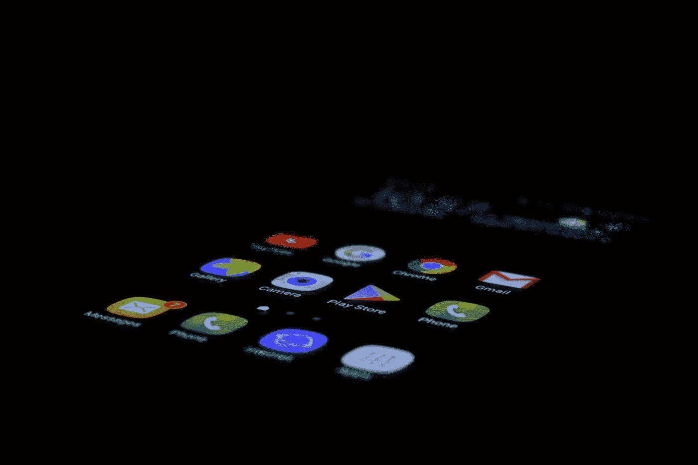

# Android:位置追踪服务

> 原文：<https://medium.com/hackernoon/android-location-tracking-with-a-service-80940218f561>



Photo by [Pathum Danthanarayana](https://unsplash.com/@pathum_danthanarayana?utm_source=medium&utm_medium=referral) on [Unsplash](https://unsplash.com?utm_source=medium&utm_medium=referral)

我心中有一个目标:我需要一个 GPS 跟踪应用程序，它可以取代我的手持 GPS 设备作为位置跟踪器，并自动将轨迹(或部分轨迹)加载到我想要的位置，供其他人查看。

# 背景

有一段时间，我使用我的 GeoApe 门户网站与其他人分享我的 GPS 轨迹。我曾经四处旅行，用手持 GPS 追踪我的路线，然后我会上传路线给别人看。这在 10 年前非常有用。今天，我主要使用手机导航，携带 GPS 只是为了跟踪似乎不太合理。我也想在网上分享我的路线。

因此，我决定编写我的第一个 Android 应用程序，它具有以下功能:

1.  该应用程序使用设备的 GPS，每 0.7 秒获取我的位置；
2.  每分钟收集一次数据并上传到我的网络服务(或者如果没有互联网连接，则缓冲数据并在网络连接可以建立时发送)；
3.  由于我将使用另一个导航应用程序，我的跟踪器必须能够在后台运行。

# 教程和示例

有很多很好的例子。不幸的是，他们没有帮助我完成我的“功能需求”的第三点。大多数示例在导航到桌面或打开“概述”屏幕时停止。我查看了后台服务，使用了 pendingIntents，创建了自定义的 locationListeners 等等，但是似乎都没有用。

# 问题的根源

Android 开发者网站有一篇名为“[后台位置限制](https://developer.android.com/about/versions/oreo/background-location-limits)”的文章，揭示了这种行为的原因:“为了降低功耗，Android 8.0 (API level 26)限制了后台应用程序检索用户当前位置的频率。应用程序每小时只能接收几次位置更新**。或者换句话说:如果你像我一样需要频繁的位置更新，就不要使用后台服务进行位置服务！**

# **解决办法**

**然而，这并不意味着没有解决方案:像谷歌地图等应用程序仍然在后台使用你的位置，所以必须有一个解决方案。同一个页面给你一些提示:**

> **如果满足以下任一条件，应用程序将被视为处于前台:
> *它有一个可见的活动，无论该活动是开始还是暂停。它有一个前台服务。
> *另一个前台应用连接到应用/../**

**所以作为解决方案:**创建一个前台服务**！**

**有人说可以将服务绑定为前台服务，如下所示:**

```
final Intent intent = new Intent(this.getApplication(), BackgroundService.class);
 this.getApplication().**startForegroundService**(intent);
 this.getApplication().bindService(intent, serviceConnection, Context.BIND_AUTO_CREATE);
```

**因为某些原因，这没用。所以我采取了不同的方法。我创建了一个通知生成器**

```
private Notification getNotification() {
  NotificationChannel channel = new NotificationChannel(
    “channel_01”,
    “My Channel”, 
    NotificationManager.IMPORTANCE_DEFAULT
  ); NotificationManager notificationManager = getSystemService(NotificationManager.class);
 notificationManager.createNotificationChannel(channel); Notification.Builder builder = new Notification.Builder(getApplicationContext(), “channel_01”); return builder.build();
}
```

**并将以下内容添加到我的服务的 onCreate()方法中:**

```
[@Override](http://twitter.com/Override)
public void onCreate() {
  startForeground(12345678, getNotification());
}
```

**然后*瞧*:应用程序根据需要工作。即使将应用程序发送到后台很长一段时间，它仍然会获取坐标并能够处理它们。**

**完整的 PoC 应用程序可在[这里](https://bitbucket.org/tiitha/backgroundserviceexample/src/master/)找到。
**NB！**要知道，Android 8.0 之前不需要通知通道( *API level 26* )。**