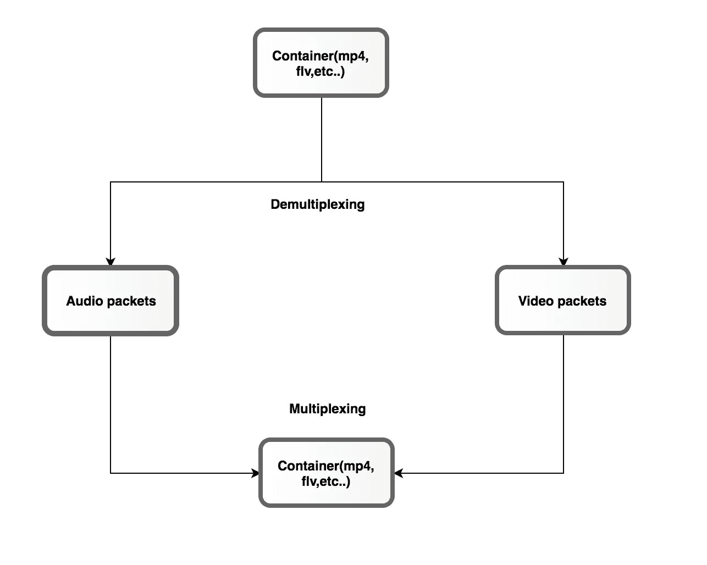
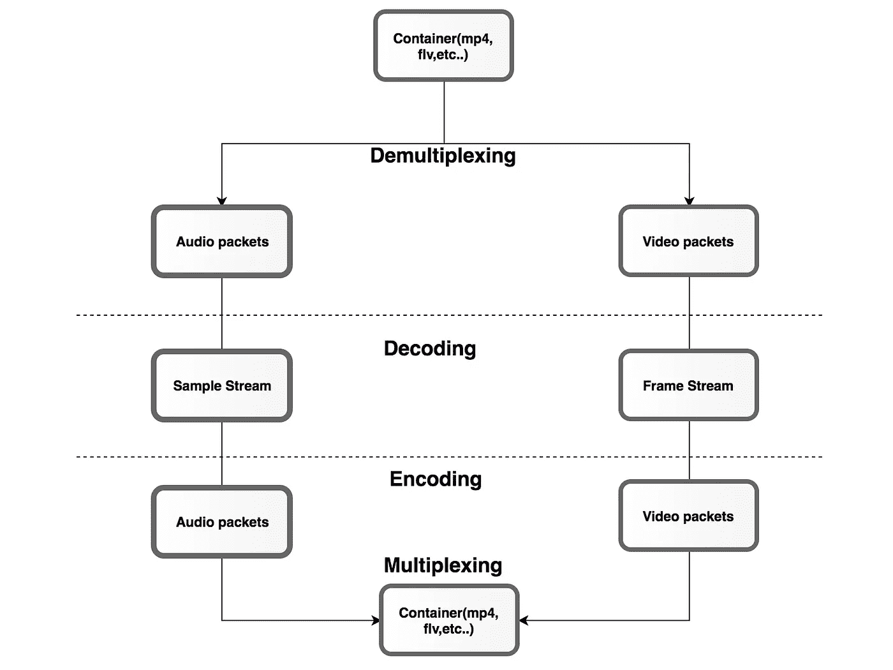
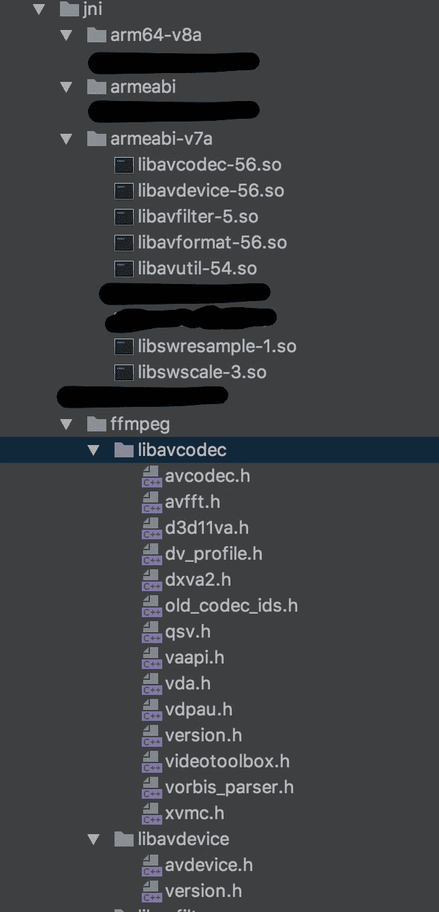

# 我在 Android 上使用 FFmpeg 的体验

> 原文：<https://medium.com/hackernoon/android-ndk-my-experience-with-ffmpeg-93dd7e4b9269>

Android SDK 为开发人员每天使用的大多数常见工作提供了 API，如`direct share`、`app linking`、`fingerprint authentication`等等。有时，我们可能需要处理低级功能，这些功能大多以 [C/C++库](https://ffmpeg.org/)的形式提供。有了 [Android](https://hackernoon.com/tagged/android) NDK，我们可以通过创建一个 C/C++包装器来使用这些预建的库，并使用 JNI 从 Kotlin/Java 调用本地代码。

通过这篇文章，我将解释

*   如何将预构建的库与 Android 应用程序(如 FFmpeg)集成
*   围绕预构建的库创建一个包装器，用于您的 android 应用程序。

关于 NDK 基础知识和本地代码回调的信息，你可以看看我以前的文章:

1.  [*安卓 NDK:使用科特林第 1 集——概念*](/fueled-android/using-android-ndk-with-kotlin-episode-1-the-concepts-bbffd69d2ea6)
2.  [*安卓 NDK:使用科特林第二集——回调(科特林到 cpp)*](/fueled-engineering/understanding-android-ndk-with-kotlin-episode-2-callbacks-kotlin-to-cpp-e67a87d6d8c9)
3.  [*安卓 NDK:使用科特林第三集——回调继续。*](/@iamnitishbhatt/understanding-android-ndk-with-kotlin-episode-3-callbacks-continued-bbeacf884848)

# 将 FFmpeg 与 Android 应用集成

其中一个项目要求使用 FFmpeg 进行视频处理。作为使用 FFmpeg 的新手，我遇到了处理视频所需的重新复用、代码转换、速率转换和大小转换过程。

# 热木兴

重新 muxing 是一个无损过程，用于更改给定文件的容器格式(例如，从 mp4 到 avi，反之亦然)。

Remuxing

# 转码

[转码](https://hackernoon.com/tagged/transcoding)是将文件从一种编码格式转换为另一种编码格式的过程，以便可以在不同的播放设备上观看内容。

Transcoding

# **翻译**

速率转换是将视频文件和音频文件转换为降低的比特率，同时仍保持原始媒体格式的过程。

# **转运**

改变大小指的是改变视频的图片大小，如果输出分辨率不同于媒体的分辨率，这是很有用的。

> 根据要求，可以选择重新复用或代码转换。
> 
> 例如:
> 
> 将一种格式转换成另一种格式— **重新复用**
> 
> 要裁剪视频或播放实时流— **转码**
> 
> 降低比特率— **速率转换**
> 
> 要更改分辨率— **改变尺寸**
> 
> 通常这些方法结合使用以获得期望的结果

# 为 Android 编译 FFmpeg

接下来是重要的部分，即编译 FFmpeg 源代码，为 android 生成库([交叉编译](https://en.wikipedia.org/wiki/Cross_compiler))。从事过一些硬件相关的项目对我帮助很大，因为这些术语对我来说不再陌生了😛。下面是我用来生成库的一些教程。

*   [为 android 编译 FFmpeg。](https://yesimroy.gitbooks.io/android-note/content/compile_ffmpeg_for_android.html)
*   [为 android 编译 X264。](https://yesimroy.gitbooks.io/android-note/content/compile_x264_for_android.html)

这些教程将帮助你跨越交叉编译的障碍。

编译后，您将拥有如下所示的 [ABIs](https://developer.android.com/ndk/guides/abis.html) :

# FFmpeg 库

C/C++中有两种[库](https://stackoverflow.com/questions/2649334/difference-between-static-and-shared-libraries)

*   共享:共享库是`.so`文件。与该库相关的所有代码都在这个文件中，并且在运行时被使用它的程序引用。

> 使用共享库的程序只引用它在共享库中使用的代码。

*   静态:静态库是。a 文件。所有与库相关的代码都在这个文件中，它在编译时直接链接到程序中。

> 使用静态库的程序从静态库中复制它所使用的代码，并使其成为程序的一部分。

FFmpeg 包含一组可用于不同操作的共享库:

*   `[libavcodec](https://www.ffmpeg.org/libavcodec.html)`:提供通用编码/解码框架，包含多个用于音频、视频和字幕流的解码器和编码器，以及几个比特流过滤器。
*   `[libavutil](https://www.ffmpeg.org/libavutil.html)`:是一个帮助便携式多媒体编程的实用程序库。
*   `[libavformat](https://www.ffmpeg.org/libavformat.html)`:为音频、视频和字幕流的复用和解复用(复用和解复用)提供通用框架。
*   `[libavdevice](https://www.ffmpeg.org/libavdevice.html)`:提供一个通用框架，用于从许多常见的多媒体输入/输出设备中抓取和渲染，并支持多种输入和输出设备，包括 Video4Linux2、VfW、DShow 和 ALSA。
*   `[libavfilter](https://www.ffmpeg.org/libavfilter.html)`:提供一个通用的音频/视频过滤框架，包含几个过滤器、源和接收器。
*   `[libavresample](https://www.ffmpeg.org/doxygen/2.5/group__lavr.html)`:是一个处理音频重采样、样本格式转换和混音的库。
*   `[libswscale](https://www.ffmpeg.org/libswscale.html)`:该库执行高度优化的图像缩放、色彩空间和像素格式转换操作。
*   `[libswresample](https://www.ffmpeg.org/libswresample.html)`:这个库执行高度优化的音频重采样、重混音和样本格式转换操作。
*   `libpostproc`:是用于转码的后处理库。

> 根据项目需求，用户可以选择需要集成到项目中的库。

# 将编译后的库添加到项目中

根据需要，您可以将库包含在 JNI 文件夹下，如下所示:

Adding Shared Libs and header files to project

Adding the path of shared libs and abifilters in the Gradle file

将此添加到 CMakeLists.txt 文件中

Importing required libraries

Linking pre-built libraries

# 创建使用库的包装器

由于我们已经将 FFmpeg 库添加到项目中，并使用`target_link_libraries`将`JNIFunctions.cpp`链接到 FFmpeg 库，我们现在可以通过在* `.h`中包含头文件来使用库中可用的函数。

Include the header files required in the project

以下是从 RTSP 馈送中获取 SPS(序列参数集)帧的函数之一:

# 结论

FFmpeg 是一个非常棒的用于 A/V 处理的库。我们可以执行解复用、显示矩阵旋转、视频裁剪、合并音频和视频流等。有很多[开源](https://trac.ffmpeg.org/wiki/Projects)项目使用 FFmpeg 库。请务必阅读它们以获取更多信息。

# 如果你喜欢这篇文章，点击👏。特别感谢我的朋友兼同事 [Arun Sasidharan](https://medium.com/u/40499e50fc3b?source=post_page-----93dd7e4b9269--------------------------------) 催我写这篇文章。

抓我这里:
*推特:*[*@ iamnitishbhatt*](https://twitter.com/initishbhatt) *领英:*[*https://www.linkedin.com/in/iamnitishbhatt/*](https://www.linkedin.com/in/iamnitishbhatt/) **Github:*[https://github.com/initishbhatt](https://github.com/initishbhatt)*