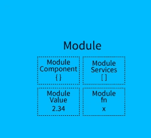

# 角形镖形建筑

> 原文：<https://medium.com/hackernoon/angular-dart-architecture-4bf1f4265c5e>

很高兴看到 2018 年即将结束，而角镖正在舞蹈进入 2019 年。


A little of no red and yes blue.

这将是我今年的最后一件作品，它是关于棱角分明的飞镖建筑，仅此而已。

是的，angular dart 是一个用 HTML 和 dart 构建客户端应用的框架。

构建客户端应用程序需要理解 angular 本身的架构，这似乎是您在开始构建之前应该了解的内容。

角镖结构由 8 个构件组成，它们是:

**模块**

**组件**

**模板**

**元数据**

**数据绑定**

**指令**

**服务**

**依赖注入**

所有这些都将被深入研究，但这里的剧透是，依赖注入不在测试主题之列，但我将提供资源让您理解依赖注入，并快速总结什么是依赖注入。

事不宜迟，让我们相应地研究一下这些构建模块。

**模块**



*模块是一组独立的单元，可以用来构造更复杂的结构——****字典*** *。*

在 angular dart 中，模块是一种对组件、指令和服务进行分组的机制，这些组件、指令和服务可以与其他模块相结合来创建应用程序。

更好地理解模块；让我们假设用在类“A”中创建的方法创建一个类，该类可以与另一个类(类 A)中的其他模块交互。类似地，一个模块也可以导出组件、服务、管道等。

angular dart 中的模块是指 dart 包或库，例如 angular router 包。每个 angular 应用程序至少有一个模块，也称为根模块。在一个显示“Hello word”的小应用程序中，我们可能只有一个模块，但在一个具有多种功能的大应用程序中，需要多个模块。

根模块定义根组件，默认情况下，angular 应用程序中的根组件是 AppComponent。

**组件**


*一个组件只是整个程序的一部分—* ***字典***

应用程序由多个功能组成，但我们不会在根组件中编写所有功能的逻辑，而是将每个功能分成不同的组件，这使得我们的代码易于阅读、访问和更改。

> 在组件中，我们在组件类中定义它的逻辑

当用户在应用中移动时，Angular 创建、更新和销毁组件。

组件必须在模块(类)中，以便在导出时可用于其他组件。

**模板**


*模板用于定义一个组件的视图—* ***定义。***

模板通常用 HTML 编写，用 CSS 样式化，CSS 也包含角元素或属性。

模板使用 HTML 元素，如

、

。它还包括模板语法，例如 ***ngFor** 、 **values** 和双花括号( **{values}** )，用于将表达式绑定到元素的插值。

**元数据**


*这是一组描述和给出其他数据信息的数据—* ***定义***

元数据是处理名为 *name* Component 的组件类的一种方式，例如 AppComponent，HackersComponent。

angular 中的元数据是用来处理一个类的，我们通常有一个组件类来负责某个操作，但是在 angular 被告知它的存在之前，它只是一个类，还不是一个组件。

为了将一个组件定义为 angular 应用程序中的一个组件，我们使用了类中的元数据。为此，我们使用注释。

一个元数据允许 angular 批准一个组件类不仅仅是一个类，而是一个组件，我们声明了 **@Component** 注释

组件注释接受参数，即 angular 创建和呈现组件类及其视图(模板)所需的信息。

以下是组件接受的一些参数:

**选择器**:CSS 选择器告诉 angular 创建并插入一个组件实例，在父 html 中找到标签。

**模板 URL** :这是组件的 html 模板的相对地址

**指令**:模板需要的指令或组件列表

**提供者**:组件所需服务的依赖注入提供者列表

angular 应用程序需要元数据才能知道要做什么。

**数据绑定**

数据绑定对于向我们的应用程序发送数据和从我们的应用程序模板接收数据非常有用。在我们的应用程序中发送和接收数据有以下不同形式:

**从组件发送数据到 DOM，我们使用插值，例如**

**属性绑定**

将值从组件传递到指定的属性，该属性是一个简单的 HTML 属性，例如

属性绑定的语法是:

```
**[property] = “value”**
```

**事件绑定**

事件绑定用于将数据从 DOM 发送到组件

```
**(event)=”function”**
```

当一个事件发生时，例如点击或改变事件，它调用处理组件内事件的方法。

**双向数据绑定**

```
**[(ngModel)]=”value”**
```

这允许数据从组件流向 DOM，以及从 DOM 流向组件

数据绑定充当组件、模板以及父组件和子组件之间的通信通道。

**指令**

指令是一个函数，只要 angular 编译器找到它就会执行。每个指令都有一个名字，有些是 angular 预定义的，例如 ***ngIf**

指令是一个带有**@指令**注释的类。有三种类型的指令:

1.组件指令:组件就像带有模板的指令，它们使用指令 API，给我们一种更清晰的方式来定义它们。

2.**结构指令:**用于通过添加、删除和替换 DOM 中的元素来改变布局，例如 ***ngFor** 。

3.**属性指令:**这改变了现有元素的外观和行为，例如 **ngModel** 指令。

**服务**

服务是为特定目的而定义的，它做特定的事情并且做得很好，服务的例子有:

-日志服务

-数据服务

-消息总线

-税收计算

-应用程序配置

示例:记录器服务

> 尽量让你的组件类远离显式任务，比如从服务器获取数据、验证用户输入或登录到控制台，相反，你的组件唯一的功能应该是与视图和应用程序逻辑交互。

**依赖注入**

如果您的应用程序中使用了服务，我们的组件需要服务才能运行。我们可以将服务注入到组件中，让组件访问该服务类。

Angular 使用依赖注入为新组件提供它们所拥有的服务，它还通过查看组件构造函数来知道组件需要哪种服务。

你可以从 [dart docs](https://webdev.dartlang.org/angular/guide/architecture#dependency-injection) 和我的一篇[文章中读到更多关于依赖注入的内容。](/@bethetechnology/dependency-injection-in-angular-dart-37b3d8c016c9)

2018 年角镖课程到此结束。

祝你新年快乐，2018 年如果你正在看这个，提前祝你新年快乐。