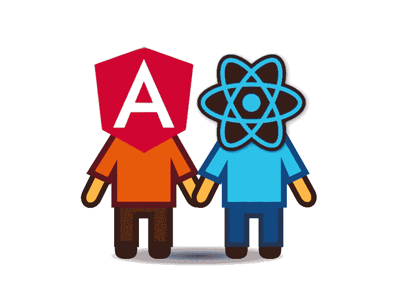

# Angular & React:为什么你应该两者都学？

> 原文：<https://medium.com/hackernoon/angular-react-why-learn-both-c56131eb9a20>

这场战斗正受到开发商方面荒谬的关注。我想消除战线，给你们带来一些关于为什么我们需要探索框架或技术之外的世界的想法。

# 理解概念

网络发展到我们现在看到的状态有很多原因。让我们列举一些为什么 **SPA** (单页应用)出现在现代 web 开发舞台上的要点:

*   [Ajax](https://en.wikipedia.org/wiki/Ajax_(programming)) 登场，为我们带来了**隐形**客户端服务器通信
*   RAM 变得更便宜，所以有机会在客户端计算逻辑
*   总体而言，手机成为最常用的设备
*   应用程序的复杂性急剧增加。有不同的概念，如“瘦服务器架构”来平衡服务器/客户机之间的逻辑。

我不打算深入研究，但如果你研究 SPA 的先决条件，你会发现现代 web 开发中更有意义。一些工具和模式会以新的方式出现在你面前！

> 如果你想定义未来，就研究过去。
> 
> ― **孔子**

# 共享功能和前提条件

## 安古拉吉斯

最初的想法是构建稳定的静态 HTML 页面，然后添加动态行为。因此，如果我们考虑一下 2009 年的情况，那就很有道理了，当时 80%的网站都是由大量的表单组成的。此外，这种方法有助于分离开发人员的角色。

## **有角度的**

(我说的有角度是指有角度的 2+版本)

**Angular** 是由跨越不同框架的一大堆聪明的想法创造出来的。用**类型脚本**作为主要语言 **Angular** 获得了严格类型语言的所有优势。 **Angular-cli** 灵感来自 **Ember-cli。组件方法已经出现，我们可以看到在任何现代框架中使用的好处。**

Angular 通过灵活的**配置和第三方库(如[**【NGRX】**](https://github.com/ngrx)**)获得了更多选项来管理应用中的数据流。**这很大程度上源于 [**Redux 状态管理**](https://redux.js.org/) 库被 [React](https://hackernoon.com/tagged/react) 社区广泛使用。**

## **反应**

**在构建 web 应用程序时，React 也受到社区经验的强烈影响。他们选择了组件可重用性的明智策略。和**分隔开** **呈现/逻辑**组件。凭借独特的渲染技术和**阴影 DOM** React 是跨框架渲染性能的整体赢家。 [**流程**](https://flow.org/) 可能也是脸书决定采用**排版**的一种方式，为**反应**的生态系统带来好处。**

> **总的来说，我们可以看到现代框架在多大程度上采用了共享知识来满足他们改善整体体验的需求。**

# **欣赏强势部分**

**尝试用不同的框架实现同一件事情，可以获得很多好处。一些架构模式可以从一个应用程序共享到另一个应用程序。**

**示例:**

*   **当我需要将 **NGRX** 库应用到我的 **Angular** 应用时，我个人使用 **React + Redux** 的经验给了我完美的感觉。**
*   **[**React 无状态组件**](https://hackernoon.com/react-stateless-functional-components-nine-wins-you-might-have-overlooked-997b0d933dbc)**——**是一个很好的例子，说明了如何为任何框架保持视图组件的整洁，只要它有这样的方法。**
*   **我发现使用**Angular**+**TypeScript、**有很多好处，所以现在我也将它用于 **Node.js** 甚至 **React** 应用程序。**
*   ****Angular** 有很多内置模式，有助于使用 [**守卫**](https://codecraft.tv/courses/angular/routing/router-guards/) 、 [**路由解析器**](https://hackernoon.com/angular-ngrx-resolving-route-data-53f88e0b8a5d) 、 [**拦截器**](https://blog.angularindepth.com/insiders-guide-into-interceptors-and-httpclient-mechanics-in-angular-103fbdb397bf?gi=8566f4e3d247) 开发大型应用。一旦您尝试了它们，您就可以知道如何在不那么固执己见的框架中实现这些东西。**

# **选择的自由**

*   ****如果你只熟悉 **SQL** ，你不可能挑选出**最好的数据库结构**
*   **如果你只熟悉 **Java** 的话，你不可能为项目挑选出最好的后端[编程](https://hackernoon.com/tagged/programming)语言。**
*   ****你不可能在**反应&角度**之间挑出**如果你只知道其中一个！**

> **你不能选择，因为如果你从未尝试过另一种方法，你就别无选择。**
> 
> **通过学习替代方案，给自己选择的自由！**

# **享受学习！**

**它只是拓展你的思维。如果你已经是一个**的大师，那么就反应**或**的角度**不要把自己锁在单一技术的边界里。**

**把自己从舒适区拉出来，学习新的**框架**、**语言**、**技术**！在每天都在变化的技术世界里做一个多面手，你会得到每个社区的真正价值。**

> **如果你想直接从马嘴中得到信息，请关注我的 [**推特**](https://twitter.com/Kobvel) 和 [**中的**](/@kobvel) 账号！**