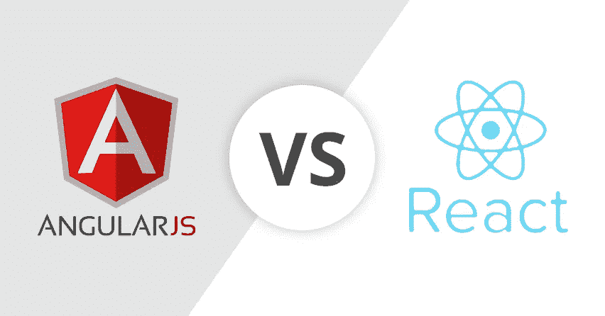
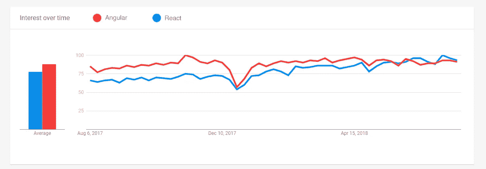

# 2018 年角度 VS 反应

> 原文：<https://medium.com/hackernoon/angular-vs-react-in-2018-7cf7a87c88d1>

大约一年前，我们已经比较了反应和角度。从那时起，我们的审查需要更新一点。基于我们自己使用这两种技术的经验，我们准备了一份与 2018 年相关的新评估。我们的技术总监/团队领导等将介绍和解释工作中的差异。这是六张卡。

# 生态系统

Angular 提供现成的生态系统。在 React 的情况下，你必须独立工作。Angular 对于重新学习另一个专业的团队来说是一个很好的选择。此外，由于 ready 生态系统，支持成本更低。反过来，React 主要提供创新的想法。React 是潮流的引领者，Angular 紧随其后。

# 应用

Angular 更适合企业应用。React 是富用户 App 更好的选择。

# 支持

Angular 由 Google 开发和支持。脸书负责反应。根据我们的经验判断，我们可以自信地说，这两种选择都很好。

# 编程；编排

Angular 属于面向对象编程(OOP)的范畴，React 属于函数式。这允许接收更多的控制和更好的性能。测试 React 更容易，这对于小公司来说是一个优势，同时也不会成为大公司的限制。

# 翻译

React 的渲染性能更高。

# 谷歌趋势

# 结论

总而言之，我们更喜欢使用 React。但是在开发企业应用的情况下，我们推荐 Angular。

[作者安东·沙列尼科夫](https://www.linkedin.com/in/anton-shaleynikov-45812a1/)

阅读更多信息:

 [## 黑客正午

### 阅读关于黑客中午反应的文章。黑客如何开始他们的下午？

hackernoon.com](https://hackernoon.com/tagged/react)  [## 角黑客正午

### 阅读黑客中午关于 Angular 的文章。黑客如何开始他们的下午？

hackernoon.com](https://hackernoon.com/tagged/angular)