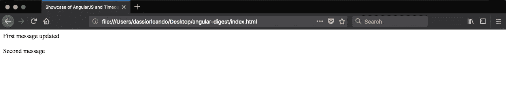

# 为什么用 AngularJs 的全局对象而不是 native？

> 原文：<https://medium.com/hackernoon/angularjss-global-objects-instead-of-native-c360f014f96b>


> 关于 [AngularJs](https://hackernoon.com/tagged/angularjs) 包装的更多信息。本文原帖[此处](http://www.dassiorleando.xyz/angularjs-global-objects-instead-native)。完整的源代码可以在 GitHub 的[上找到。](https://github.com/dassiorleando/angular-timeout-digest)

# 概观

AngularJs 是广泛使用的开源前端框架之一，因为它具有良好的架构、可扩展性、许多有趣的特性以及庞大的社区。

在这篇短文中，我们将通过一个简单的例子来展示为什么有时使用 AngularJS 内置的全局对象和服务比使用本地对象和服务更好。

# 为什么使用有棱角的包装？

AngularJs 应用程序受益于一些强大的功能，而不是仅仅使用前端架构所必需的功能。作为 AngularJs 爱好者，我强烈建议也利用其他全局对象和服务。

要举例说明的案例是著名的 [javascript](https://hackernoon.com/tagged/javascript) window 对象的 **setTimeout** 函数，该函数在 AngularJs 世界中有其对应的 **$timeout** 服务。

简而言之，AngularJs 包装器和服务已经与 AngularJs 应用程序同步，因此无需任何技巧即可使用。

# 超时情况

**setTimeout** 是 window 对象的一部分，有助于在以毫秒为单位的特定延迟后执行一次函数或计算一次表达式。

让我们设置一个带有控制器的基本 AngularJS 应用程序:

在本例中，2 秒钟后第**条消息**将被更新，但第**条消息**不会更新，如下页所示:



# 设置超时:

这里用两个参数调用，我们想要调用的函数和它发生的延迟。

当我们在 AngularJs 应用程序中使用它时，我们还需要将最终的范围更改应用到 angular digest，因为默认超时运行在 AngularJs 生命周期之外，这也意味着我们的双向绑定不会呈现更新。

这就是为什么这里需要通过调用 **$rootScope 来刷新 AngularJs 范围。$apply()** 或 **$rootScope。$applyAsync()** 。

**$apply** 和 **$applyAsync** 的作用相同，但第二个有延迟差异。

# $timeout:

与前面的语法几乎相同，但是这里有更多的参数可以传递给它的调用。

例如，我们也可以决定在生命周期之外调用它:

```
$timeout(**function**() { $scope.firstMessage = 'First message updated'; alert($scope.firstMessage);}, 2000, **false**);
```

在这里，我们看到可以向该服务添加一个参数，这是一个布尔值，表示我们希望**应用**在 2 秒钟后跟随我们的函数调用。

**简单来说，用 false 作为第三个参数调用它将调用我们在 AngularJS 框架之外的函数。**

**注意**:默认情况下，第三个参数为真。

文档里写的很清楚[这里](https://docs.angularjs.org/api/ng/service/$timeout)。

# 其他包装器和实用程序函数

对于相应的 Javascript 对象，还有一些其他的角度包装器服务，使用起来可能会很有趣，而不是本地的，有时是因为简单性/语法，或者是因为上面描述的效果。

# 功能

让我们看另一个例子，这里的目的是知道一个变量是否还没有被声明或者是否有未定义的值**。**

**在这里我更有信心使用填充:**

```
**if**(angular.isDefined(variable)) {}
```

**而不是:**

```
**if**(**typeof** variable != 'undefined') {}
```

**其他可能对你有好处的:**

*   ****angular.isDate** :了解变量是否为日期**
*   ****angular.isArray** :判断是否是数组**
*   ****angular.copy** :深度复制一个对象**
*   ****angular.isObject** :测试对象类型**
*   ****angular.toJson** :将一个对象序列化成 Json**
*   ****angular.fromJson** :将一个 Json 字符串反序列化为一个对象**

**其他的在这里列出[。](https://docs.angularjs.org/api/ng/function)**

# **服务**

**一些 AngularJs 服务:**

*   ****$document** :浏览器窗口. document 对象的包装器**
*   ****$ interval**for window . setinterval，setTimeout 的重复版本**
*   ****$http** 使用 XMLHttpRequest 对象或通过 JSONP 进行远程 http 调用**
*   ****$log** 用于登录浏览器控制台**

**更多服务可在[文档](https://docs.angularjs.org/api/ng/service)中找到。**

# **结论**

**首先，在本文中，我们已经看到了为什么有时使用 AngularJs 包装器比使用本机实现更好，同时强调了超时的情况。**

**GitHub 上的[提供了完整的源代码。](https://github.com/dassiorleando/angular-timeout-digest)**

## **感谢你阅读这篇文章，如果你喜欢，请推荐并分享。
在[脸书](https://www.facebook.com/dassiorleando)、[推特](https://twitter.com/sajouguetdassi)、 [LinkedIn](https://www.linkedin.com/in/dassi-orleando-257b04ab/) 上关注我，并访问我的[博客](http://www.dassiorleando.xyz/)。**

****干杯！****