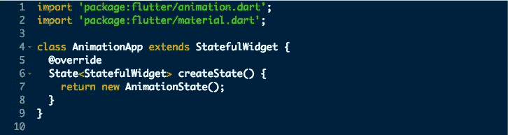
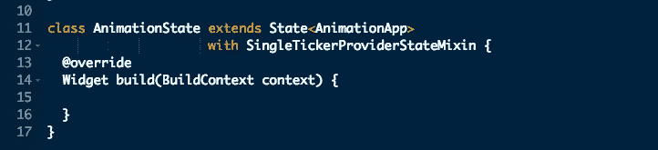
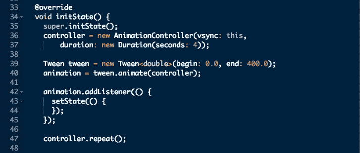
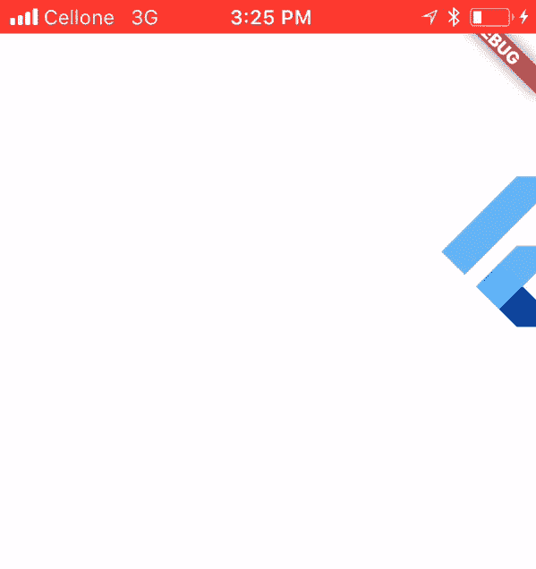

# 在 Flutter 中制作部件动画

> 原文：<https://medium.com/hackernoon/animating-widgets-in-flutter-413882881e98>

Flutter 是谷歌的移动应用 SDK，用于在创纪录的时间内在 iOS 和 Android 上制作高质量的原生界面。Flutter 的动画支持可以轻松实现多种动画类型。这篇文章描述了如何在 Flutter 中制作窗口小部件的动画。

## 动画类型

*   **补间动画**

在补间动画中，我们必须定义动画的开始点和结束点、时间轴以及定义过渡时间和速度的曲线。框架计算从起点到终点的中间值。

*   **基于物理的动画**

在基于物理的动画中，运动类似于真实世界的行为。当我们从地面以一个角度投掷一个球时，它将跟随抛射体运动。所有的计算，如飞行时间和旅行距离，都将根据物理定律来计算。

## 为动画准备课程

我们创建一个小部件，并以一定的时间间隔重复更新其状态，以使其具有动画效果。

为了创建一个小部件，我们编写一个类来扩展`StatefulWidget`类并覆盖它的`createState()`方法。这个方法返回一个`State`实例。



与我们的有状态小部件相关联的状态对象必须扩展`State`类，并且还使用一个名为`SingleTickerProviderStateMixin`的 mixin。我们覆盖了 build 方法，在该方法中我们创建了将要制作动画的小部件对象。



## 创建补间动画

在补间动画中，我们需要提供两个不同的值:开始值和结束值。然后，Flutter 将自动生成一组中间值。我们将这些中间值应用于小部件的任何属性，以使其具有动画效果。

让我们创建一个简单的补间动画，将一个小部件从屏幕的左边缘移动到屏幕的右边缘。为此，我们必须激活小部件的`left`属性。所有中间值都分配给小部件的`left`属性。

为了创建和控制动画，我们需要一个*动画*对象和一个*动画控制器*对象。

```
Animation<double> **animation**;
AnimationController **controller**;
```

在我们类的 *initState* 方法中，我们创建了*动画控制器*。它期望一个`TickerProvider`对象作为它的输入之一。由于我们的类正在使用`SingleTickerProviderStateMixi` mixin，我们可以将*这个*传递给它。另一个参数是*持续时间*属性来指定动画的持续时间。

```
**controller** = **new** AnimationController(vsync: **this**,
    duration: **new** Duration(seconds: 5));
```

创建一个`Tween`对象，指定动画的开始和结束值。

```
Tween tween = **new** Tween<double>(begin: 0.0, end: 400.0);
```

使用补间对象创建动画对象。

```
**animation** = tween.animate(**controller**);
```

animation 对象为跑马灯的每一次跳动生成一个动画事件。为了处理事件，我们使用 addListener()方法。在事件处理程序中调用 setState()方法来更新小部件的状态并重新绘制它。

```
**animation**.addListener(() {
  setState(() {
  });
});
```

为了启动动画，我们调用动画控制器的 forward()方法。如果我们想让动画重复播放，我们可以调用 repeat()方法。

```
controller.repeat();
```

动画现在准备好了。我们可以将它应用于任何小部件。



## 将动画应用到小部件

现在我们创建一个小部件，并将动画值应用于它一个属性。

```
child: **new** Stack(
    children: <Widget>[
      **new** Positioned(
          child: FlutterLogo(),
          height: 100.0,
          width: 100.0,
          left: **animation**.**value**,
          top: 100.0  
      )
    ])
```

在这里，我们已经将动画值分配给小部件的左侧属性。

## 动画效果

将此 widget 添加到应用程序的任何屏幕中。这是它的样子:



Flutter Animation

## 完全码

```
**import 'package:flutter/animation.dart'**;
**import 'package:flutter/material.dart'**;**class** AnimationApp **extends** StatefulWidget {
  @override
  State<StatefulWidget> createState() {
    **return new** AnimationState();
  }
}**class** AnimationState **extends** State<AnimationApp> **with** SingleTickerProviderStateMixin {Animation<double> **animation**;
  AnimationController **controller**;@override
  Widget build(BuildContext context) {
    **return new** Container(
        color: Colors.*white*,
        child: **new** Stack(
            children: <Widget>[
              **new** Positioned(
                  child: FlutterLogo(),
                  height: 100.0,
                  width: 100.0,
                  left: **animation**.**value**,
                  top: 100.0
              )
            ])
    );
  }@override
  **void** initState() {
    **super**.initState();
    **controller** = **new** AnimationController(vsync: **this**,
        duration: **new** Duration(seconds: 4));Tween tween = **new** Tween<double>(begin: 0.0, end: 400.0);
    **animation** = tween.animate(**controller**);**animation**.addListener(() {
      setState(() {
      });
    });**controller**.repeat();}
}
```

*感谢阅读。如果你喜欢这篇文章，请随意点击那个按钮👏帮助其他人找到它。*

*本文是移动技术相关系列文章的一部分。如果您正在寻找一个移动应用程序开发团队，请联系我们:*[*【info@47billion.com*](mailto:info@47billion.com)*。*