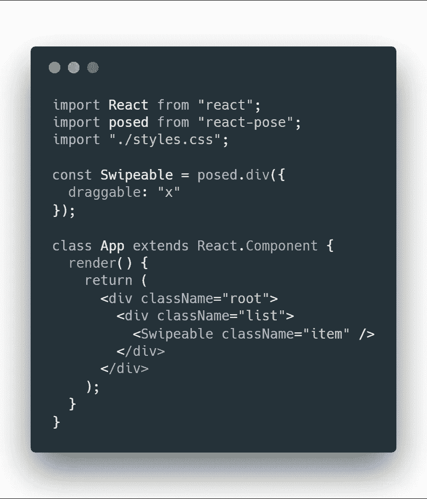
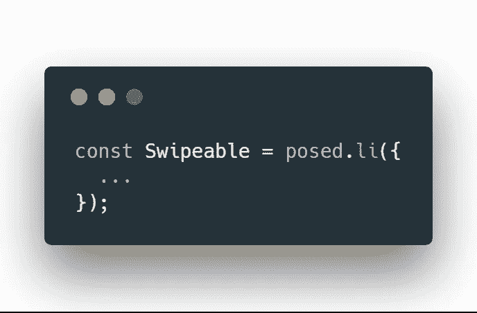
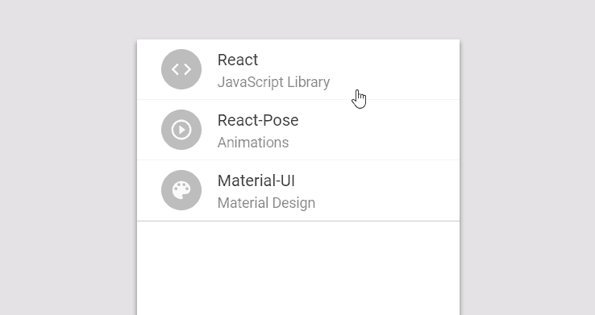

# React 中的动画速度为 60fps！反应式简介

> 原文：<https://medium.com/hackernoon/animations-in-react-at-60fps-an-introduction-to-react-pose-6db5a1c1e0ae>

PopMotion/Pose 是一个简单的 React、React Native、Vue 甚至 vanilla JavaScript 的动画库。在本文中，我将通过 React 中的一个简单的实际例子来教您许多关于 react-pose 的知识。你可以在他们的[官方文件](https://popmotion.io/pose/)中找到更多信息。

# CSS 的问题是

CSS 对于简单的 UI 动画，状态到状态的转换，甚至是组件入口动画来说都是很棒的。然而，当涉及到更多的交互式动画，弹簧效果，或者列表插入/删除/重新排序转换时，CSS 就有所欠缺。这就是第三方动画库的用武之地。有很多很棒的，比如 *React-Spring* ***，*** *但是 react-pose* 更具声明性&将逻辑从主渲染树中取出，改善了整体开发者体验*。*

# 构建可刷卡列表

我决定选择一个实际的例子，我们都可以在我们的材料设计应用程序中使用。在官方的材料设计网站上，我们可以找到这个手势概念:

这就是我们要做的。如果你已经想看最后的结果， [*看这里的演示*](https://codesandbox.io/s/l9qjm1op6z) 。首先，我们需要定义一个列表项。

React-posed 允许我们通过设置`draggable`属性使其易于滑动。在这种情况下，我只想允许在 x 轴上拖动:

现在，让我们添加一些 css 并看看它的运行情况(最终的 CSS 代码在这里[提供](https://codesandbox.io/s/l9qjm1op6z?module=%2Fsrc%2Fstyles.css)):

现在，我将在我们的可拖动覆盖图下面添加一个元素，当我们向左/向右滑动时，它将出现在那里:

我还想防止用户从左向右拖动:

现在，我要用一个实际的材料设计列表项来替换这个难看的条:

你可能注意到了，当我们放开这个项目时，它不会向左滑动并消失，这是我接下来要做的。幸运的是，react-pose 有一个很棒的声明性转换 API:

如您所见，react-posed 使用一个名为`triggerDistance`的变量(在本例中设置为 60)来确定用户是否已经滑动了足够的距离来执行滑动，如果没有，它将返回。

现在，如果用户滑过`triggerDistance`，我需要改变后面元素的颜色。与原始动画不同，我不打算使用波纹动画，以使本文专注于反应动画，而不是实现材质设计波纹。我要建立一个颜色混合动画。

为了在 react-pose 中做到这一点，我需要创建一个新的`posed`元素，当用户滑动时，它将从灰色渐变到紫色:

`passive`表示过渡将基于组件的拖动值。管道用于选择颜色将如何褪色。我不会讲太多细节，但是你可以在这里阅读更多关于管道的内容。

然而，因为这些组件无法相互交互，我们需要存储指示用户拖动了多少项的`x`的值，并将其传递给`SwipeableForeground`组件。在`react-pose`中，我们可以很容易地用他们叫做`value`的反应数据类型做到这一点。

为了检测`App`类中的滑动，我可以使用当用户放开`Swipeable`组件时触发的`onDragEnd`事件。我还必须设置一个超时，以便在转换完全完成时触发事件:

现在，让我们向列表中添加更多项目，并确保每个项目都有自己的项目:

现在我需要让被偷的东西消失:

最后，我们可以使用`PoseGroup`来制作元素消失的动画，只需将`Slideable`列表包装在`PoseGroup`组件中，并使`Slideable`成为`posed.li`:

最后，我只想在删除每个项目后将弹性动画更改为简单的“ease ”,使其更像我试图复制的动画:

这是最后的结果:

就这样，我们做到了！

> 如果你想看到更多这种类型的内容，给这篇文章鼓掌，或者两次，或者 50 次👏。我会很快发布更多类似的 react 教程🎉。