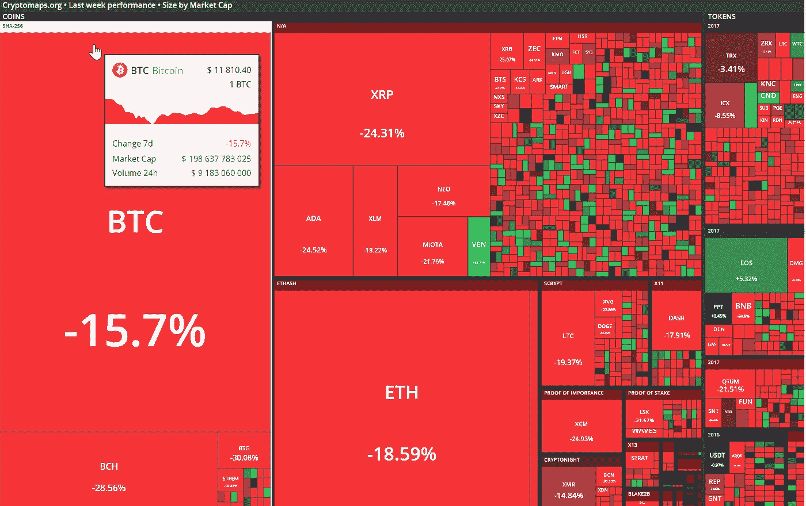

# 宣布阿尔特。资本周刊:密码发生了什么变化—2018 年 1 月

> 原文：<https://medium.com/hackernoon/announcing-alte-capital-weekly-what-changed-january-2018-53ec2b5d6d3>

来自 Alte.Capital 的新年快乐。作为新一年的开始，我们很高兴地宣布**我们开始发送每周一次的“变化”信件。**

我们奉献这个来分享我们上周在《密码世界》中看到的最重要的东西。每周一早上享受它，我们欢迎您的反馈。

## 此外，敬请关注 2018 年即将推出的与加密交易社区共享交易工具相关的计划！

## 谢谢大家！

# 每周变化 2018 年 1 月 15 日至 22 日

## 全周主要驱动因素:

对于长期持有人来说，这是非常艰难的一周。尤其是对 ETH 的早期投资者来说。投资组合中的资金总量在这次下跌中远远高于之前的下跌。与 2017 年 7 月相比，绝对值下降幅度更大。另一个原因是，价格越低，越多人不得不出售以支付 2017 年的税收。

密码交易所应接不暇。受欢迎的密码交易所币安最近透露，他们在一天内增加了 25 万新用户。北海巨妖每天都有 50，000 个新帐户加入，他们每天都有惊人的 10，000 个新支持票证。幸运的是，注册新账户的问题似乎在上周得到了解决。又可以在币安、Bitfinex 和 CEX.io 上开户了

## 价格行为

周一和周二(1 月 15 日至 16 日)，我们看到了 1300 亿美元的下降，这意味着资本总额为 5830 亿美元。

15–22 January week change

自周三以来，改变的时刻已经到来。比特币和其他货币从损失中部分恢复，并以 15-20%的跌幅结束一周，市值约为 5745.46 亿美元。

**Swisscoin 垃圾邮件泵和转储活动**

世界上最大的垃圾邮件僵尸网络 Necurs 现在发送数百万条关于瑞士硬币的信息。垃圾邮件发送者以低价提前购买，并在垃圾邮件活动提高价格时出售。

**电报 ICO**

加密信息服务 Telegram 将发行硬币的目标提高到 20 亿美元。Telegram 可能会在本月私募中筹集 8.5 亿美元，并在 3 月份的公开募股中筹集 11.5 亿美元。Telegram 预计其“克”代币将于 2019 年 1 月上市，或最迟于 2019 年底上市。这将是第一个甚至没有发布白皮书的公开 ICO(在撰写本文时)。在我们看来，Telegram 团队还没有开始研究技术，可能会尝试复制粘贴区块链其他项目的技术和想法。

日本最大的银行正在开放自己的股票市场

日本最大银行、全球第四大银行三菱 ufj 金融集团正计划推出自己的稳定货币，与日元 1:1 挂钩。

**中国计划加强对加密货币交易的制裁**

中国当局似乎无法阻止其公民进行加密货币交易。因此，他们计划扩大对国家密码贸易(包括场外交易)的制裁。有人猜测，互联网警察将封锁当地和国际加密货币交易网站。

**Bitconnect 关闭**

在德克萨斯州监管机构发出警告后，Bitconnect 庞氏骗局被关闭。本周初，比特币价格暴跌 87%，但周四上涨了 300%。

**韩国政府必须接受关于加密货币的请愿书**

一份关于监管加密货币的请愿书于 12 月 28 日提交给韩国总统办公室，获得了最少的签名。这将迫使政府对此做出正式回应。请愿书要求政府放弃拟议中的交易法规，因为这将破坏数字货币带来的“美好梦想”。一些拟议的法规包括禁止匿名虚拟交易账户，禁止未成年投资者和外国人投资韩国市场上的比特币和其他加密货币，甚至彻底禁止加密货币交易。

> 我们的下一部《**变了什么》**将于 2018 年 1 月 29 日上映。在此之前，我们期待您的回复。

## 与 Alte 连接。资本

请访问我们的[网站](http://www.alte.capital)，在[推特](https://twitter.com/Alte_Capital)和[脸书](https://facebook.com/Alte.Capital)上关注我们。