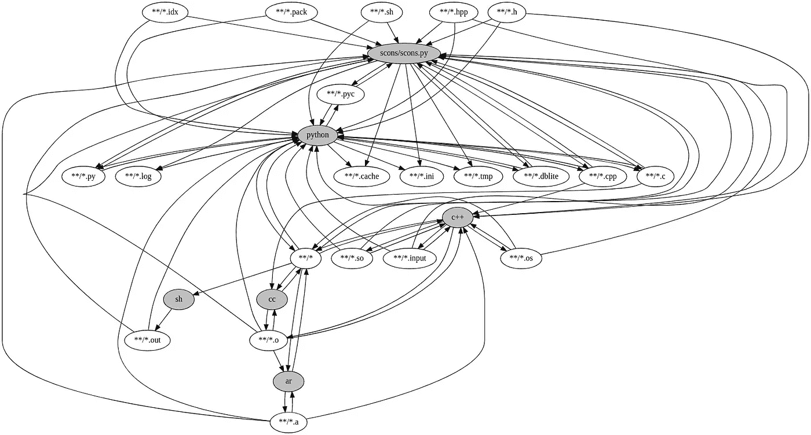
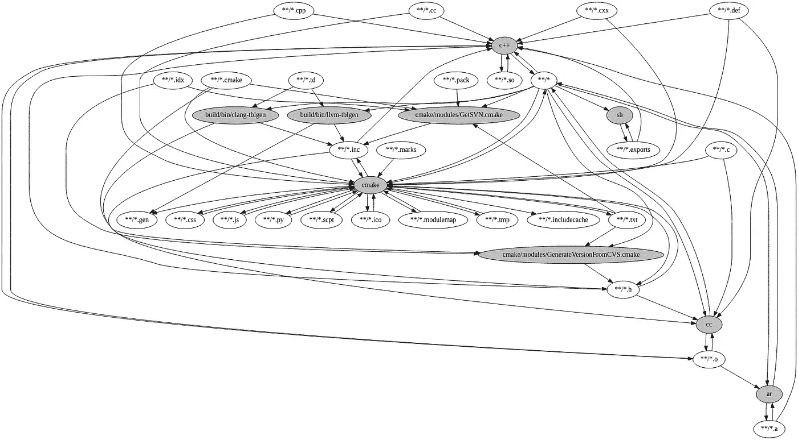
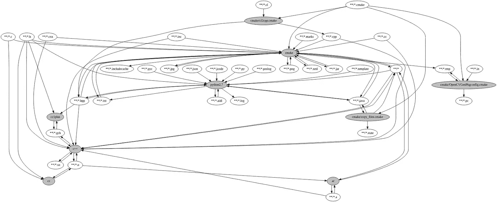

# 宣布 C++的 BuildInfer

> 原文：<https://medium.com/hackernoon/announcing-buildinfer-for-c-3dfa3eb15feb>

## 分析、可视化和在构建系统之间迁移

> 你的 C++构建是缓慢的还是难以理解的？我们目前正在寻找更多的案例研究。如果您对改进基于 Linux 的构建(商业或开源)感兴趣，请[联系](mailto:hello@buckaroo.pm)！
> 
> https://buildinfer.loopperfect.com/

由于使用了各种各样的构建系统，C++社区变得支离破碎。这种分散使得难以:

*   了解第三方库是如何工作的
*   将两个库集成在一起
*   跨库优化(例如 LTO)
*   为 C++源代码构建工具(头文件在哪里？)
*   实现人工缓存
*   确定构建过程中的哪些步骤会减慢您的速度

对于 C++社区来说，这意味着:

*   浪费时间将项目粘在一起
*   浪费时间等待缓慢的构建
*   浪费时间重写已经存在但难以集成的代码

## **如果我们能够提取任何 C++项目的可读构建描述，而不管使用的是什么构建系统，这不是很好吗？**

# 宣布 BuildInfer

通过记录系统级的构建过程，我们可以推断出项目结构的高级信息。由于 BuildInfer 在这个底层记录，我们的技术适用于任何 C++构建系统。

一旦我们有了一个高层次的构建描述，我们就可以将复杂的构建系统可视化、转换甚至移植到更强大的构建系统，比如 [Buck](https://buckbuild.com/) 和 Bazel。

# 初步调查结果

我们已经成功地将以下项目移植到 [Buck](https://buckbuild.com/) :

*   [Mapnik](https://mapnik.org/)
*   [LLVM](https://llvm.org/)
*   [OpenCV](https://opencv.org/)

此外，我们发现这些项目都没有附带一个可重现的构建系统！通过将它们移植到 Buck，我们可以保证这一点。

可重现的构建对于安全性、缓存性能和调试至关重要。有关更多信息，请参见:

*   [https://reproducible-builds.org/](https://reproducible-builds.org/)
*   [https://martinfowler.com/bliki/ReproducibleBuild.html](https://martinfowler.com/bliki/ReproducibleBuild.html)

## Mapnik

> Mapnik 是一个开源的地图绘制工具包，用于基于桌面和服务器的地图渲染，用 C++编写。

*   将 Mapnik 从 SCons 移植到 Buck 将构建时间从 *30 分钟*减少到 *6 分钟*。
*   我们估计启用预编译头文件将进一步缩短 10%的构建时间。
*   Mapnik 不使用版本脚本，需要`-fvisibility=inline`和共享版本来防止符号冲突。使用 BuildInfer 的输出，我们发现核心问题是这个[头文件](https://github.com/mapnik/mapnik/compare/master...nikhedonia:fix/nonstatic-definition?expand=1)中的非静态定义。
*   我们生成了一个图表，显示了各个文件组和可执行文件之间的交互:

View the [full SVG image on GitHub](https://gist.github.com/nikhedonia/143746a8cde43d8c991626f385d2702a#file-mapnik-minimal-svg)

该图告诉我们以下信息:

*   Mapnik 不使用版本脚本
*   一些目标文件有一个`*.os`扩展名
*   几个翻译单位都是由`scons/scons.py`生成的

## LLVM & Clang

> LLVM 编译器基础设施项目是一个“模块化和可重用的编译器和工具链技术的集合”，用于开发编译器前端和后端。

*   默认情况下，LLVM 强制实施一种“超级项目”结构，迫使您以一种特定的方式来布局项目。使用 BuildInfer，LLVM 可以被重构为许多小模块。
*   类似的直线构建时间，但大量改进的增量构建。
*   我们可以缓存 LLVM Tablegen 工件——这对于 [CCache](https://ccache.samba.org/) 是不可能的。
*   我们估计使用预编译头文件可以将直线构建时间提高 20%。使用 BuildInfer 提取的信息实现起来要容易得多。

我们还在依赖图的上下文中对构建时间进行了简单的分析。这些表格显示了在 LLVM 中更改各种文件的估计成本，方法是合计构建每个文件及其所有依赖项所花费的时间。

这些文件是增量构建的“热点”,可能是重构的良好候选。

*请注意，这些数字是假设单线程构建的；一个真正的构建需要这些时间的一些比例因子。*

**10 Most Impactful Headers**

**10 Most Impactful Translation-units**

标题`llvm-config.h`特别有意思。它定义了在整个项目中引用的一些常量:

所以每次版本字符串或默认目标改变时，LLVM 都会引发一个`15,264 second`构建！这些值有可能被重构为一个翻译单元:

我们还生成了一个图表，显示各个文件组和可执行文件的交互:

View the [full SVG image on GitHub](https://gist.github.com/nikhedonia/143746a8cde43d8c991626f385d2702a#file-llvm-minimal-svg)

图表向我们展示了:

*   版本脚本通过 Bash 生成，称为`*.export`
*   `*.td`文件被`tblgen`用来生成`*.inc`头文件。
*   Clang 和 LLVM 各有各的`tblgen`(怎么区别？)
*   很多文件都是由 CMake 直接生成的。

## OpenCV

> OpenCV 是一个主要针对实时计算机视觉的编程函数库。

*   OpenCV 实际上可以拆分成多个独立的模块。
*   BuildInfer 发现其中一个模块依赖于另一个模块的实现细节，所以我们提交了一个补丁。
*   使用 Buck，OpenCV 的增量编译时间可以通过在完整编译完成后禁用预编译头文件来改进。

我们还生成了一个图表，显示各个文件组和可执行文件的交互:

View the [full SVG image on GitHub](https://gist.github.com/nikhedonia/143746a8cde43d8c991626f385d2702a#file-opencv-minimal-svg)

*   `*.cl`文件被`cl2cpp.cmake`用来生成`*.cpp`文件
*   由`OpenCVGenPkgconfig.cmake`产生一个`pkg-config`
*   使用预编译头文件`*.gch`，不生成头文件入口点。
*   OpenCV 的构建系统用的是 Prolog！

# 好奇吗？

你的 C++构建是缓慢的还是难以理解的？我们目前正在寻找更多的案例研究。如果您对改进基于 Linux 的构建(商业或开源)感兴趣，请[联系](mailto:hello@buckaroo.pm)！

# 您可能也对…感兴趣

 [## 使用降压构建的 7 个理由

### Buck 是一个跨平台、跨语言构建系统，在脸书为大规模编译而设计。所有牛仔…

hackernoon.com](https://hackernoon.com/7-reasons-to-use-buck-build-5b44d7413585)