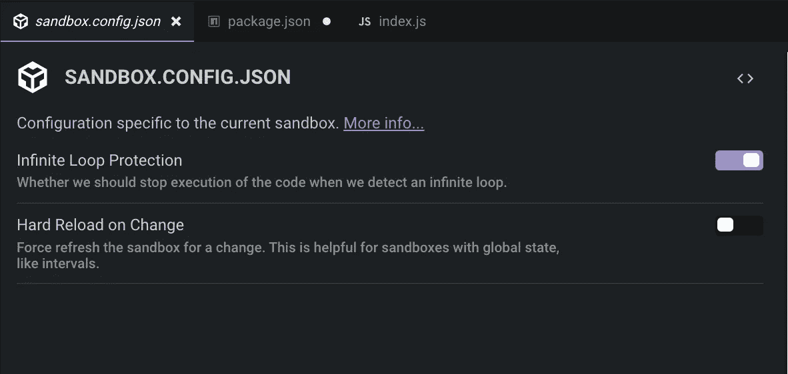
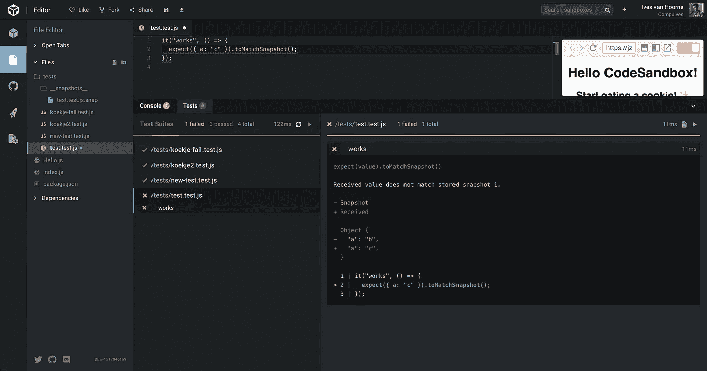
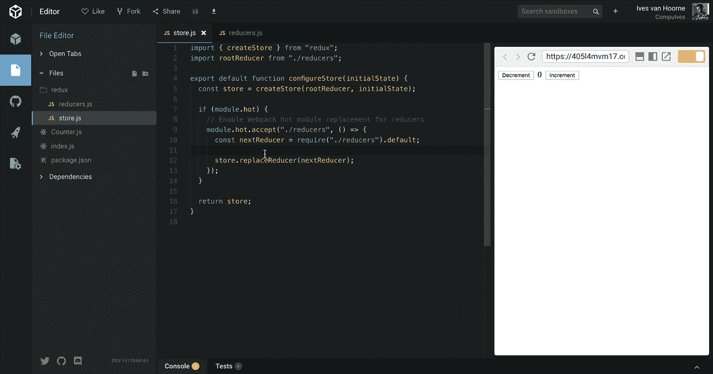

# 宣布 CodeSandbox 2.5

> 原文：<https://medium.com/hackernoon/announcing-codesandbox-2-5-be767d15ffd>

现在是二月，是时候对 CodeSandbox 进行一次大的更新了！在过去的一个月里，我们一直很安静，但我们没有坐以待毙。这次更新包含了新的特性，我相信这是迄今为止最大的一次更新。最好的部分是许多贡献者帮助了这次更新！

我们有超过 20 个新功能，一个重新设计和重写来展示，所以我们最好开始吧！

# 新编辑器设计

随着时间的推移，我们的 UI 变得越来越杂乱。我们因为功能丰富而失去了简单性，并且经常很难导航和找到正确的按钮。我们绝对不希望这样，并以此为借口进行一次精神旅行，重新设计编辑器👨‍🎨。再次，就像主页一样，我们得到了[配置就是程序太笨，无法确定用户想要什么](https://medium.com/u/adcea7654c49#design-configurability)。通常不需要配置就可以满足 90%的用户偏好。

但是，还有另外的 10%，CodeSandbox 作为一个应用就是一个很好的例子。这就是为什么我们引入了对配置文件的官方支持。根据模板的不同，您可以配置沙箱的几个方面。我们目前支持的配置有:`package.json`、`.prettierrc`、`.babelrc`、`sandbox.config.json`和`.angular-cli.json`。

## 真理的单一来源

我们之前保存了依赖项、标题等。在我们的数据库里。当你从 GitHub 导入一个沙盒时，我们会从文件中获取每个相关的字段，并手动保存在我们的数据库中。这就产生了摩擦:当您添加一个依赖项时，我们需要手动更新数据库**和**更新`package.json`。

从这次更新开始，我们让文件成为几乎所有数据的真实来源，这意味着沙盒数据是从编辑器中的`package.json`和其他相关配置文件解析而来的。我们追溯添加这个；当你打开一个沙箱时，如果它不存在，我们会自动生成一个`package.json`。

The dependencies update live as you update package.json

## 配置用户界面

我们认为 UI 比代码更直观。这就是为什么我们的目标是将所有配置文件接口化(如果这是一个词的话)。我们展示了一个 UI，您可以使用它来为配置文件生成代码。如果你想要更多的控制，我们仍然允许你切换到代码😉。我们还没有针对所有配置的 UI，但是我们显示了针对这些配置的自定义自动完成功能。

Use a UI to configure your files

## 巴别塔插件支持

一个非常受欢迎的特性是自定义巴别塔插件支持，不仅是官方的，还有社区插件。我们现在允许在`Preact`模板中配置`.babelrc`，并将很快在`Vue`和我们即将推出的`Custom`沙盒中启用。除此之外，我们还支持`fs`接口。这对`[babel-plugin-preval](https://github.com/kentcdodds/babel-plugin-preval)`这样的巴别塔插件特别有用。去试试吧！

Live in action! It’s still a bit rough, sometimes you need to hard reload to see changes.

像使用`fs`的`babel-plugin-macros`这样的高级巴别塔插件目前正在测试中。我们将在未来几周简化巴别塔插件支持，提供自定义用户界面来搜索插件，以及创建和选择预设的能力。

## 沙盒配置

您现在可以使用`sandbox.config.json`配置您的沙箱。你可以在这里找到更多关于`sandbox.config.json` [的文档](https://codesandbox.io/docs/configuration#sandbox-configuration)。

Configuration options

# 角度样板

官方的角度支持从第一天起就经常被要求。我们现在正式支持角度模板，包括随之而来的相应的`angular-cli.json`文件！

在这里试一试:

[或者在新编辑器中打开！](https://codesandbox.io/s/angular)

# 原生 Jest 支持

我们现在有了笑话支持，这主要归功于[高塔姆·阿罗拉](https://twitter.com/gautam)！高塔姆为 Jest integration 开了一个[问题](https://github.com/CompuIves/codesandbox-client/issues/364)大约两个月，大约一个月后，他开了一个 PR，其版本已经可以运行 redux 示例的所有测试。

在过去的一周里，我一直在为 Jest 开发一个符合我们重新设计的原生 UI，我真的为它的结果感到骄傲。我从 [majestic](https://github.com/Raathigesh/majestic) 和[故事书](https://storybook.js.org)中获得灵感。让我们看看它是什么样子的。

You can find tests next to the console, this is a view with some errors

如您所见，测试文件位于左侧导航器中。当您选择一个测试文件时，您将获得该文件的详细信息，包括状态和最终的错误。

This is how you can interact with the tests

我们自动观看所有测试文件。如果您更改了一个文件，我们将直接或间接地重新运行需要该文件的测试。我们也支持快照测试，尽管我们仍在研究保存新快照的可能性。

Snapshot reading working!

我真的为与 Jest 的集成感到自豪，这是唯一可能的，因为 Jest 团队做了一件**令人难以置信的**工作，通过[在单独的包中发布他们所有的功能](https://facebook.github.io/jest/docs/en/jest-platform.html)。我们只是挑选了让 Jest 在 CodeSandbox 中工作所需的包！Redux TodoMVC 示例是一个很好的支持 Jest 的沙盒。

注意，这不是完全的本地 Jest，我们还不支持使用`__mocks__`目录和 Jest 配置写快照、手动模拟。不过我们很快会添加这个。

# CodeSandbox Bundler 升级

我对 CodeSandbox 的 bundler 做了一些升级，最显著的改进是缓存和一个官方的 HMR API。

## 编译器缓存

在每一次成功的捆绑之后，我们在 IndexedDB 中缓存所有相关的传输和文件。当你刷新沙箱的时候，你只需要评估所有的文件，而不是进行编译等。这导致了非常快的初始加载时间，正如你在这张 GIF 中看到的。

Near instant reloading!

## 热模块重装 API

我们现在也有官方的 HMR 支持(终于！).您可以像在 Webpack 中一样使用`module.hot` API，例如，当您想要在运行之间保留状态时，这很有用。我们还在我们的 Vue 加载器中添加了对 HMR API 的官方支持，这意味着 Vue 开箱即可获得正确的 HMR！

Using HMR together with Redux to hot reload its state

Vue Example: edit the template or the styles and see that the state doesn’t change

# 您可能错过的更新

我们最近进行了许多更新。以下是 12 月份发生的一些变化的简要回顾:

## 禅宗模式

禅模式隐藏了所有令人分心的元素，因此它非常适合演示和课程视频。您可以在首选项中或通过按键绑定来启用它。

Zen Mode enabled

## 按键绑定支持

您现在可以在 CodeSandbox 中为操作设置自定义键绑定了！

## 快速行动

可以使用(CMD/CTRL)-Shift-P 激活快速操作，并将其显示为弹出窗口:

Just type and select!

它可以让你快速激活动作，而无需触摸鼠标或记住一个键绑定。

## CodeSandbox 文档

为了回答问题或解释 CodeSandbox 概念，我们现在有一个官方文档:

 [## 文档— CodeSandbox

### 欢迎来到 CodeSandbox！本文档为您提供了一种学习什么是 CodeSandbox、如何使用它以及什么…

codesandbox.io](https://codesandbox.io/docs) 

你可以在 Twitter 上关注 CodeSandbox 或 me 来了解最新的变化。我们还在这里保留了一个变更日志:[https://codesandbox.io/changelog.](https://codesandbox.io/changelog.)

 [## code sandbox(@ codesandboxapp)| Twitter

### CodeSandbox 的最新推文(@codesandboxapp)。CodeSandbox 的你好！为网络量身定制的在线编辑器…

twitter.com](https://twitter.com/codesandboxapp)  [## 艾夫斯·范·霍恩(@CompuIves) |推特

### 艾夫斯·范·霍恩的最新推文(@CompuIves)。https://t.co/o00zRDhu57,软件开发商的创始人在…

twitter.com](https://twitter.com/CompuIves) 

# 下一步是什么

哦，这是一个很大的变化列表…接下来的一周，我将主要集中在我在 [Vue Amsterdam](http://www.vuejs.amsterdam) 的演讲上，并修复任何可能出现的 bug。然而，我们在接下来的时间里确实有一些令人兴奋的计划！

## 自定义模板

我们现在支持很多 transpilers，但是没有模板支持所有的 transpilers。我们已经看到，用户希望尝试不同的东西，如 babel 插件，但不想将他们的沙箱绑定到与他们的项目无关的模板上。这就是为什么我们将在不久的将来实现一个叫做自定义模板的东西。我已经对这个特性做了一些工作，并想在 2.5 中发布，但是时间不够了。底线是，它应该很快完成😃。

## 托管迁移

自从我们开始以来，我们已经成长了许多。我们希望有更多的可扩展性，所以我们将把我们的主机转移到 Kubernetes。

我们还开始了一个大项目，将于今年 2 月开始，并将持续 3 个月。我还不能给出那个项目的任何细节，只是说这是一个令人兴奋的变化。

# 谢谢

这次更新得到了 CodeSandbox 贡献者的大力支持。我真的很感谢其他人所做的工作，我要特别感谢[波格丹一世·卢卡](https://medium.com/u/248b5f4c4dad?source=post_page-----be767d15ffd--------------------------------)、[克里斯蒂安·阿尔佛尼](https://medium.com/u/d4ec01100893?source=post_page-----be767d15ffd--------------------------------)、[丹尼·鲁希蒂](https://medium.com/u/adcea7654c49?source=post_page-----be767d15ffd--------------------------------)和高塔姆·阿罗拉在这次更新中的工作和支持。

Thanks to this list of contributors!

## 想参与进来吗？

我们 90%(很快 100%)开源！我们张开双臂欢迎任何帮助。如果你有兴趣帮忙，我建议你查看我们网站的回购:

 [## 强制/代码沙盒-客户端

### code sandbox-client——专为 web 应用程序开发定制的在线代码编辑器🏖️

github.com](https://github.com/CompuIves/codesandbox-client) 

如果你想聊天，我们这里有一个活跃的 Discord 服务器:

 [## 不和谐——为游戏玩家提供免费的语音和文本聊天

### 使用现代语音和文字聊天应用程序加快游戏进度。清晰的声音，多服务器和渠道支持，移动…

不和谐. gg](https://discord.gg/KE3TbEZ) 

另外，如果你想在经济上支持 CodeSandbox，你可以成为 CodeSandbox 的赞助人！