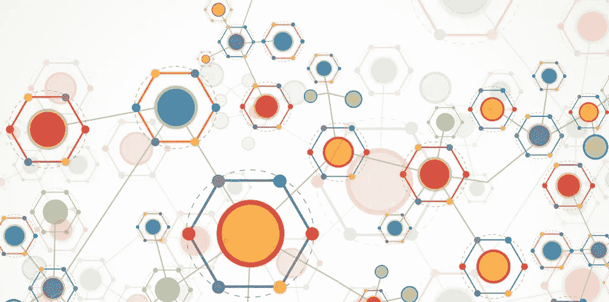

# 宣布 Cryptopal，这是一个总部位于区块链的平台，它重塑了人与品牌的联系方式

> 原文：<https://medium.com/hackernoon/announcing-cryptopal-a-blockchain-based-platform-that-reinvents-how-people-and-brands-connect-d725c43038c7>

今天，我们宣布了一个新的基于区块链的平台，直接连接人和品牌，省去了营销中间人，使用 ERC20 的效用令牌。

Cryptopal 令牌的引入允许向消费者提供关于产品、服务和活动的高度有针对性的推荐，而不依赖于广告。它降低了消费者的价格，提高了品牌的营销绩效，并保护了用户的隐私。

**数字营销被打破**

数字营销是现代经济中的一个重要行业。品牌依靠数字营销来获得新客户和推动增长。人们依靠营销来发现能改善他们生活的新产品、服务和活动。

但是今天的数字营销被几个巨大的中间商所控制，他们的利益经常与消费者和品牌的利益不一致。

仅前两大广告网络[就控制了超过 60%的行业](http://fortune.com/2017/07/28/google-facebook-digital-advertising/)。广告网络是新经济的守门人。他们控制着消费者和品牌的联系方式。这使得他们能够从用户那里获取大量数据，并从品牌中获取大量价值，从而损害用户隐私和整体经济效率。

广告网络使用跨设备跟踪，在未经人们明确同意的情况下捕捉他们的个人数据，通过展示大多数人不想看到的广告来赚钱，并保留所有利润。

而品牌则不得不通过竞价战来连接用户。他们通常将收入的 20%到 35%支付给广告网络，这比大多数公司分配给自己员工的都多。这种更高的成本最终转移到了消费者身上，他们最终支付了更高的价格，此外还体验到了不断减少的隐私。

不一定要这样。我们提出了一种新的、去中心化的、无广告的系统，以一种对双方都有利的方式，将人和品牌直接联系起来。

**介绍 Cryptopal**

基本原理很简单:人们不想看到广告，不想被第三方跟踪。很烦人，很有侵犯性，很冒险。但是他们确实想发现能改善他们生活的相关产品、服务和活动。当人们考虑购买时，优惠价格是一种强烈的购买动机。

另一方面，品牌需要增加喜欢他们产品的用户群，并最小化购买成本。

Cryptopal 利用区块链技术和去中心化人工智能的进步，直接连接人和品牌，切断广告网络和其他营销中间人。

在这个以区块链为基地的新生态系统中，人们自愿提供关于他们在线活动的大量数据，以一种不可信的方式保护他们的隐私。作为交换，他们得到超级相关的推荐和首选价格。

用户数据在设备上进行处理，以将用户与高度相关的产品、服务和活动相匹配。广泛的数据意味着更好的推荐。Cryptopal 就像一个非常了解你的朋友，了解每一个产品、服务和活动，并给你最好的建议。不需要中间人。

当用户购买 Cryptopal 推荐的产品时，他们可以获得该品牌提供的优惠价格，即大幅折扣。折扣由 Cryptopal 令牌表示，当用户进行购买时，从品牌转移到用户。

从品牌的角度来看，Cryptopal 允许他们直接与高目标用户匹配，无需任何成本，无需依赖广告网络。

因此，品牌可以通过提供优惠价格来激励用户购买，而不是向广告网络付费，以匹配可能会或可能不会转换的用户。

这为品牌带来了更多的销售(因为用户被激励去购买)，更高的投资回报率(品牌省去了营销中间商)，以及更有价值的新客户(广泛的用户数据意味着更好的匹配)。

这是一个对品牌和用户都更加公平的系统。

对用户的好处:

*   发现极其相关的产品、服务和活动
*   获得推荐产品和服务的优惠价格
*   保持他们数据的私密性

品牌优势:

*   免费与高目标用户匹配
*   通过激励用户购买来增加收入(而不是向广告网络付费来建立联系)
*   通过减少中间商降低营销成本(根据我们的预测，平均品牌投资回报率+87%)
*   只有当用户购买时才会产生费用(而不是为 91%的情况下不会转化的广告付费)

这个新的分散系统释放了目前由广告网络获取的价值。它提高了经济效率。它提高了推荐的准确性。它允许用户从他们自己的数据中获益，而不损害他们的隐私。它还允许品牌通过激励目标用户进行购买来增加收入，而不是向广告网络付费来与他们联系。

**本地机器学习和私人用户数据**

Cryptopal 浏览器是系统的关键组成部分。当人们选择加入时，他们的在线活动会在浏览器中被秘密监控。相应的数据在浏览器中被存储、匿名和加密。

用户数据比第三方可以暗中收集的数据更精细，因为用户自愿授权访问他们的数据。数据包括他们访问的网站、他们购买的产品、详细的社交媒体资料、他们参与的社交媒体内容、人口统计信息、订阅、实时位置等。

然后，本地机器学习算法在设备上运行，为用户匹配最相关的产品、服务和活动。没有信号出来保护用户的隐私。

品牌还可以使用 Cryptopal 的零知识协议来主动激励符合特定标准的用户。Blue 围裙等品牌可以使用 Cryptopal 来激励千禧一代男性，他们经常在健康食品连锁店吃饭，在 Instagram 上关注美食影响者，在网上购买食品杂货，尚未订阅食品配送服务，但在过去 48 小时内一直在搜索健康食谱。

当用户购买 Cryptopal 推荐的产品或服务时，购买行为被浏览器记录下来，代币从品牌转移到用户的钱包中。用户的钱包与 Cryptopal 浏览器集成在一起。

**密码令牌**

代币的价值来源于它的实用性:品牌需要代币来激励用户购买。对代币的需求随着系统的增长而增长:越多的用户和品牌加入系统，越多的品牌需要代币来激励用户进行购买，代币的需求增长越多，其价值增加越多。

在最基本的例子中:

1.  向用户推荐产品
2.  用户通过系统购买产品
3.  用户以代币的形式获得折扣，从品牌转移到他/她的钱包
4.  用户将代币兑换成法定货币、ETH 等。
5.  布兰德在交易所购买新代币，以提供折扣并激励用户购买
6.  重复

代币交换将在今年分阶段推出。令牌的其他使用案例将在即将发布的帖子中描述，允许用户和品牌通过将令牌保留在 Cryptopal 生态系统中来增加其令牌的使用价值，从而创造额外的网络效应。

这只是开始。敬请关注 Cryptopal 的更多信息，以及我们如何重塑人们和品牌的联系方式。未来的帖子将描述我们的详细路线图、项目的关键方面、合作伙伴品牌等等。我们总是乐于交谈，我们喜欢人们说“嗨”——不要犹豫，给我们发个短信吧！

## 加入我们的社区

*   [**订阅 Cryptopal 的简讯**](https://meetcryptopal.com)
*   [加入松弛的 Cryptopal](https://cryptopal.typeform.com/to/NF0hSM)
*   [在电报上加入 Cryptopal](https://t.me/meetcryptopal)