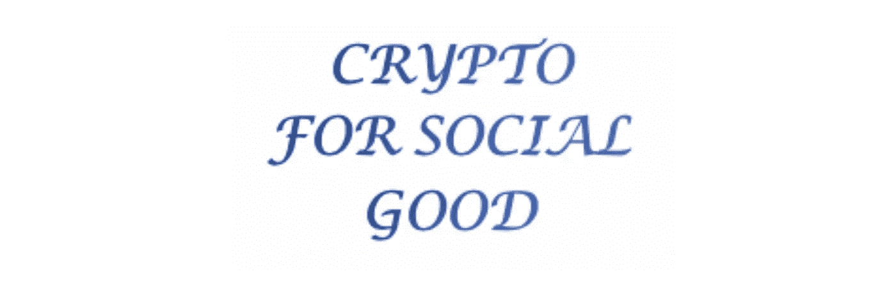

# 为社会公益宣布密码星期二&六个新的密码星期一

> 原文：<https://medium.com/hackernoon/announcing-cryptotuesdays-for-social-good-new-cryptomondays-7948c516eda3>

我们很高兴地宣布，3 月 5 日在纽约市举办的[公益加密星期二](https://goo.gl/UvHjAu)开始了。CryptoTuesdays 是一个每月一次的聚会，专注于[加密](https://hackernoon.com/tagged/crypto) [技术](https://hackernoon.com/tagged/technology)(即区块链、加密货币、智能合约……)将带来的所有令人惊叹的积极社会影响。每次聚会都将有一个演讲者或小组讨论社会公益加密的一个特定领域。形式是 30 分钟的演讲/ Q & A，然后是大量的时间与其他热衷于社会公益的人交流。我们的第一个活动将是与 IndieGoGo(一家准备成为 Crypto 玩家的公司)的 Crypto 主管 Evan Cohen 进行炉边谈话。感谢 [Knotel](https://goo.gl/XTunS7) 的主持。加入/RSVP CryptoTuesdays For Social Good[点击此处](https://goo.gl/UvHjAu)

我们很高兴地宣布将从 3 月 5 日开始推出六个新的加密星期一，包括:

[**多伦多**](https://meet.meetup.com/wf/click?upn=pEEcc35imY7Cq0tG1vyTt3miACH3kxpXb8TgLtvZl9cWYfJ3vRpVeO82zBGdftzDgVcbjbzoy3EujiWSmYdPFL0AtXTfLaaE2IEt-2BynYb6w-3D_pn6m7UoZg-2FvUWOd5TtCxjLz4knQT-2FRmX59ZdJmm6YKgt77l2ZIXP3-2Bu-2FrGravQtV4I1e3QHO6lr5sS92lcXC0xZxhUiocTWZ9qAVKAvaj0-2F-2Bk5t7GvtlHy-2FVjuTT-2Bw-2BKYd8mtthZQJjxbh8x8WrKTPOC26xAkiI2bm1tOdpdIgESVo-2ByO-2FHUVWHAt6B1jweC1MXH9Hf0yoV-2FSQdtiUa1DQ-3D-3D)

[**芝加哥**](https://meet.meetup.com/wf/click?upn=pEEcc35imY7Cq0tG1vyTt3miACH3kxpXb8TgLtvZl9f3WvfnpuTw8TCZxUeJFTHcLxuprUL8YwG7rJgRs-2Fs-2F-2FOAV0NiN5pQjvTPzjVNHIVU-3D_pn6m7UoZg-2FvUWOd5TtCxjLz4knQT-2FRmX59ZdJmm6YKgt77l2ZIXP3-2Bu-2FrGravQtV8xBlClyuHkoCKyLAigvONdJMgXFMk19XmktbmlptE-2BNPVan9ZcTxps1f7KxcO9NJ8nblFQ-2B37lhiS-2Fp5EEXdSwT4hTAxjAi3cuvfw7EOUkt2vkatWSX83y8YMuoqG7YiV-2F-2BYDEQaFyfZSORiGiz0qg-3D-3D)

[**丹佛**](https://meet.meetup.com/wf/click?upn=pEEcc35imY7Cq0tG1vyTt-2FfH78ByS2gkGngEP9PHfkwBPXixHzFDl4xRdJ01mJY7gcFaumJwCPBZlffQudWG-2BGexU3nvcZHKYiRKvpy-2FDaE-3D_pn6m7UoZg-2FvUWOd5TtCxjLz4knQT-2FRmX59ZdJmm6YKgt77l2ZIXP3-2Bu-2FrGravQtVgdVeaa-2FOPj-2BoQhfPtWZIXLZ5xvLn7JtXok7Yk-2FS0ltW1G-2FhjQfRcmzUjhfZJkMlTyiQCdE3LRo0uA-2FuQqU-2BdkdPOOBci-2BUGU3flWhe-2F04ROnfM9OhJsdMKXW9Zfu4ii9-2BpqhGwG7NEytuW3LWnfVPQ-3D-3D)

**[**圣迭哥**](https://meet.meetup.com/wf/click?upn=pEEcc35imY7Cq0tG1vyTt3miACH3kxpXb8TgLtvZl9dPA8cuOKKa4EhADjgNlXqA-2FDXgbtnBXW4d5JJoOqkwfXjgFrv9qLzLEPvBuUK9drY-3D_pn6m7UoZg-2FvUWOd5TtCxjLz4knQT-2FRmX59ZdJmm6YKgt77l2ZIXP3-2Bu-2FrGravQtV04fgtmf5xGXRRIUSk-2F5-2B8txFxIHNkGj1MjiacQe53L-2BMsLwNeBV937tC3BzvsN0xWbU5epekyw8EEtINeWTeSSNJdz9fiNVCeFoFlcktBF-2B6Zfl5FY0JYXWZkUSaVnHGBFZG2uVXfDKPFkDumDnZPg-3D-3D)**

**[**孟买**](https://meet.meetup.com/wf/click?upn=pEEcc35imY7Cq0tG1vyTt3miACH3kxpXb8TgLtvZl9dPA8cuOKKa4EhADjgNlXqA-2FDXgbtnBXW4d5JJoOqkwfXjgFrv9qLzLEPvBuUK9drY-3D_pn6m7UoZg-2FvUWOd5TtCxjLz4knQT-2FRmX59ZdJmm6YKgt77l2ZIXP3-2Bu-2FrGravQtVl7IS4RkqRJ8Pxbuz-2BvOe8WpFVBc48XTblbVFYlDjbYZsdDaerC4YqbJ97UecIcTi-2F9XOmjHoepZbm3oGRN2itpO8ase368-2B67-2FEszLfHnGxuQ8luWLkD4oLNBth6YEifRlnlFSHweFSLDlLJIeqYPQ-3D-3D)**

**[**神秘星期一休斯顿**](https://meet.meetup.com/wf/click?upn=pEEcc35imY7Cq0tG1vyTt3miACH3kxpXb8TgLtvZl9fTrFxiv3W2OI9R4n5Qae8bJNH99oq9TlO-2FyUbzERtg8RB4N2fWrZl3LWI93SsOWJc-3D_pn6m7UoZg-2FvUWOd5TtCxjLz4knQT-2FRmX59ZdJmm6YKgt77l2ZIXP3-2Bu-2FrGravQtVNEdd8IPh7ZW74BhDrwD7Dre6M9K1yCQwnVbOoUUEZiAzq5iXuiN-2FQ32-2FxemBYKOe8F9kYJh0qkc6CWfP2WBvjobdEwtDBmow4KQU-2FDFlGot5jgUG-2F-2BoEz3dYvNFESZh0BDDWSwGvwaQxuiTVCIJcsA-3D-3D)**

**此外，将于 3 月 5 日发生的其他神秘星期一包括:**

**[**纽约市**](https://goo.gl/Gaj4YF)**

**[**洛矶**](https://meet.meetup.com/wf/click?upn=pEEcc35imY7Cq0tG1vyTt3miACH3kxpXb8TgLtvZl9f0PcpIxUok-2BUwLhPWTJU2AeY-2BQbeg-2FABSJCD4SD63YF0KbxSH7kkr-2B5-2Fs4xxbOZ5s-3D_pn6m7UoZg-2FvUWOd5TtCxjLz4knQT-2FRmX59ZdJmm6YKgt77l2ZIXP3-2Bu-2FrGravQtVpxn9MxZfXErK3cdyYp0v-2Fw42PZ5oiZDLUBX0yx5dl1fncAASRq1a6SZ0VMxXILIL94s2hKY8VEzgzYUVQ-2FmGmfSR48Szu5dtTacZKu-2FtyrFP2tjZe-2FxaalnlazRJXUdmWau1KoyKY2qtd-2F839ggxow-3D-3D)**

**[**圣弗朗西斯科**](https://meet.meetup.com/wf/click?upn=pEEcc35imY7Cq0tG1vyTt3miACH3kxpXb8TgLtvZl9dPA8cuOKKa4EhADjgNlXqADh9YTrWYHcLXBtpPdevs4erBV5bWi9LEtyr-2BjGiRQRM-3D_pn6m7UoZg-2FvUWOd5TtCxjLz4knQT-2FRmX59ZdJmm6YKgt77l2ZIXP3-2Bu-2FrGravQtV7rvA97kLK0NtQoqwlwjkOnVehC-2BigTbormivhxq2UOe90YtFdY9KZ8iokPwIEyiJjVqPsj5AFS8O51lQSq0OKr0aE5KhfsQzV8ysEZhXmv-2BITR0XRZYByGkF0CQjpL5F1mAlLptW3dSs6va7Rw4FBA-3D-3D)**

**[格林威治 ](https://meet.meetup.com/wf/click?upn=pEEcc35imY7Cq0tG1vyTt3miACH3kxpXb8TgLtvZl9fccqg0Bb4o6qp9jwo66P1yhjU8J-2BFuTtQYH5CR23oD4fN60Dzgzc2iIbrYiGyJdN4-3D_pn6m7UoZg-2FvUWOd5TtCxjLz4knQT-2FRmX59ZdJmm6YKgt77l2ZIXP3-2Bu-2FrGravQtVb7EMbQvh1lPD4SFnV2EZ-2BpAxI9kArffD3b4KrpDjLqfDpCJdHpTFcvCLkSMP4u8HpoEsu4F4D0wWuDoVBopl7sXQ3-2FLzD91vKbScvEJhV-2B4UjBNeM6RzrAgMEqJhFSgttV-2FbGLPDevSBYzRGus4sOw-3D-3D)**

**如果你想在你的城市开始一个加密星期一，请发邮件到 CryptoMondays@CryptoOracle.io 给我们。我们之前在这里写了关于神秘星期一[的任务，并且在这里](https://goo.gl/z9vR1q)给出了一个之前的更新[。](/crypto-oracle/crypto-mondays-update-1-nyc-jan-15-l-a-jan-29-video-charities-press-45d4530ed9d6)**

***如果你喜欢你所读的内容，* ***请在下面“鼓掌”，这样其他人也会看到(最多允许 50 次鼓掌！).*****