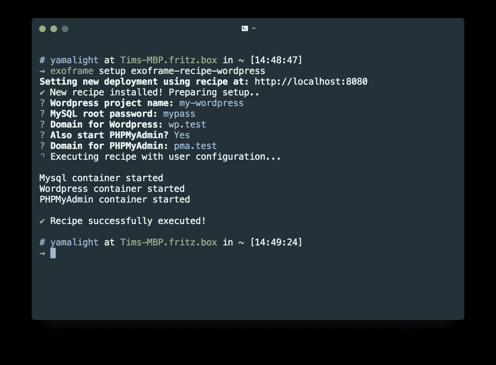
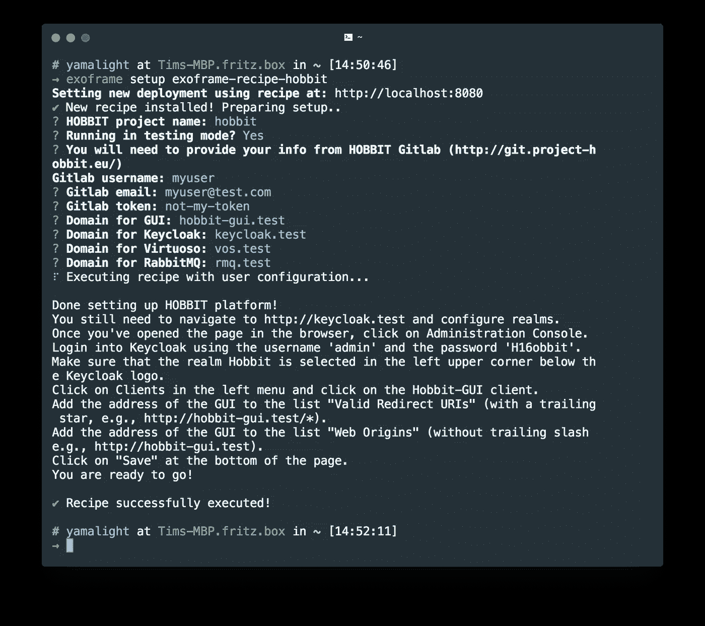

# 宣布推出 Exoframe 3.0 —简单复杂的部署和 Docker 群体支持

> 原文：<https://medium.com/hackernoon/announcing-exoframe-3-0-easy-complex-deployments-docker-swarm-support-c8ab6f4e05b2>

> Exoframe 是一个自托管工具，允许使用 Docker 进行简单的单命令部署。
> 如果你不熟悉它——你可以在关于初始发布的[文章和](https://hackernoon.com/announcing-exoframe-1-0-simple-docker-deployment-tool-59bde252139d)[项目库](https://github.com/exoframejs/exoframe)中找到更多信息。

我很高兴地宣布 [Exoframe](https://github.com/exoframejs/exoframe) 3.0 的发布！这个版本的两大亮点是复杂的部署方案和 Docker 集群支持。

# 部署方案

docker 允许使用 docker-compose 文件部署复杂的系统，但是它们受到 Docker 约束的限制——您不能等待服务变得可用，不能执行 post-init 脚本，可能很难准备配置，等等。
当然，有些事情是有解决方法的——有些[在官方 Docker 文档中提到过，有些](https://docs.docker.com/compose/startup-order/)[在 github 问题](https://github.com/docker/compose/issues/1809)中讨论过。

Exoframe 旨在通过“食谱”功能解决这些问题。它提供了一种运行第三方复杂部署方案(本质上是直接访问 Docker 守护进程的 javascript 代码)的方式。那些方法提供了一种在一个命令中部署复杂项目的快速简单的方法。

食谱工作方式非常简单:

1.  开发人员[编写了一个外框架配方](https://github.com/exoframejs/exoframe/blob/master/docs/RecipesGuide.md)并将其发布在 npm 上
2.  用户在服务器和本地安装和配置 Exoframe
3.  用户使用`exoframe setup recipe-name`执行配方，其中*配方名称*是来自 npm 的包名称
4.  Exoframe 从 npm 中提取配方，并向用户呈现一组开发人员定义的问题(见下面的截图)
5.  一旦用户回答了问题，Exoframe 服务器就执行配方代码，并以所需的方式设置系统

Example wordpress recipe execution

作为一个示例配方，您可以通过简单地执行`exoframe setup exoframe-recipe-mysql`和回答一组简单的问题(上面的截图)来部署由 MariaDB 支持的 Wordpress 和 PHPMyAdmin。

如果这看起来不令人信服——我不怪你，这种部署非常简单，可以用一个 docker-compose.yml :)
这里有一个稍微复杂一点的例子——[霍比特人平台](https://github.com/hobbit-project/platform)。你可以在这里找到它的设置指南[——正如你所看到的，它并不简单，它不仅仅是运行`docker-compose up`。这是使用](https://github.com/hobbit-project/platform#hobbit-platform)[外架配方](https://github.com/hobbit-project/exoframe-recipe-hobbit)时的设置:

Example HOBBIT project recipe execution

看起来很刺激？试试看！别忘了分享你做的所有美味食谱！

# 码头工人群体支援

3.0 中一个稍微小一点的新特性(但是社区经常要求的)是 Docker 群体支持。
Exoframe 现在可以在 Swarm 环境中工作，并允许您将您的服务部署到 Swarm，就像您将它们部署到一个 Docker 服务器一样。注意，如果你使用定制的部署模板——它们必须被更新以支持 Swarm。
该支持还扩展到上述设置方法。当然，菜谱确实需要支持 Swarm 本身才能正常工作。

我很想听到你对这个新版本的反馈。请随意将它发送到 GitHub 或 Twitter！