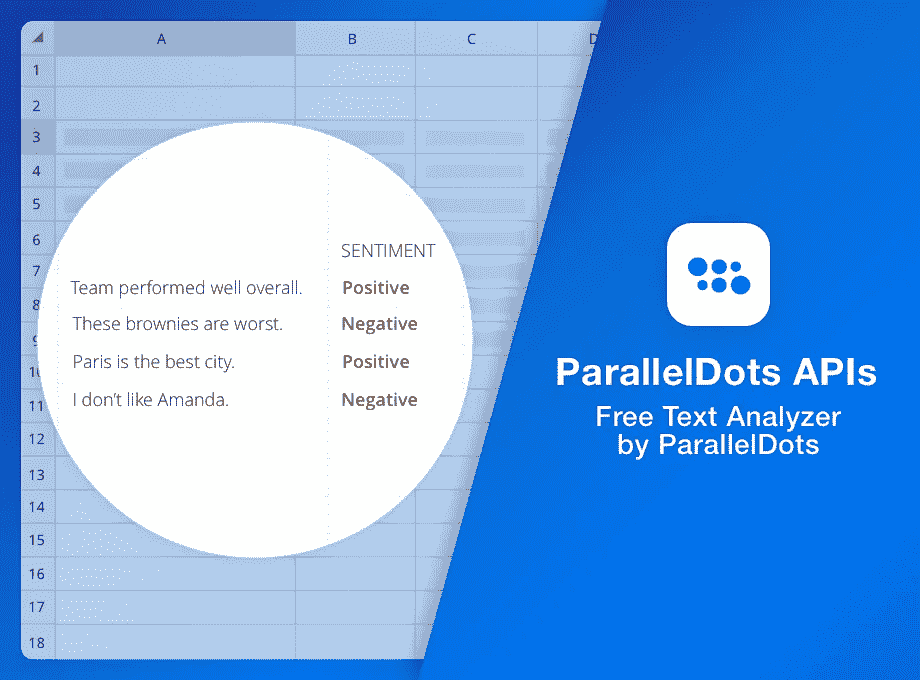
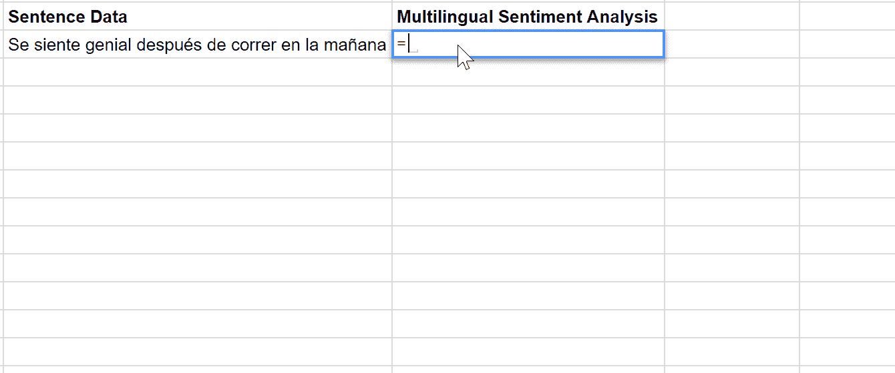
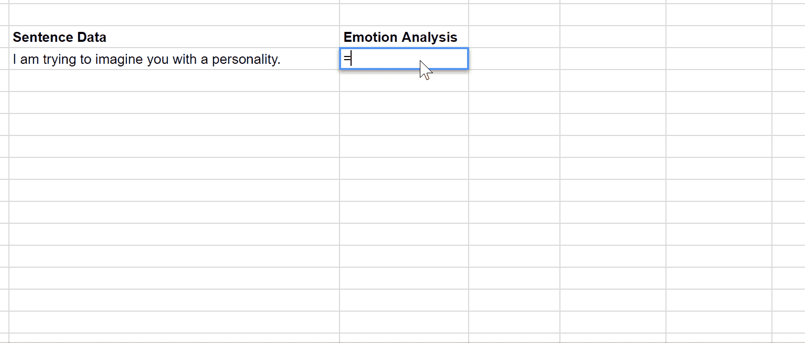
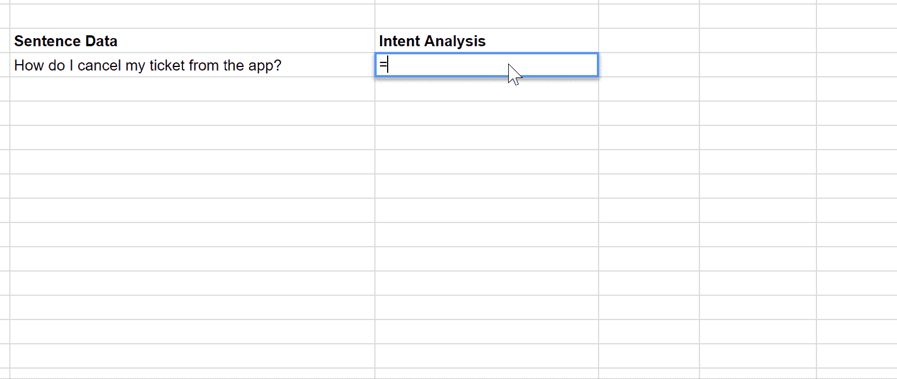
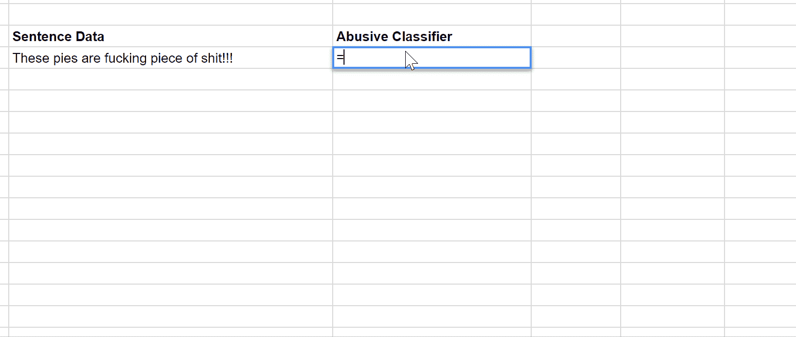

# 宣布 Google Sheets 为 ParallelDots APIs 添加插件

> 原文：<https://medium.com/hackernoon/announcing-google-sheets-add-on-for-paralleldots-apis-fb1659e6e4b8>

去年 12 月，我们发布了 ParallelDots Excel 插件，它无需编写一行代码就能提供最先进的文本分析功能。因为我们的主要目标是面向业务分析师，所以我们推出了适用于 Windows 操作系统的 Excel 插件。从那时起，我们的 Excel 插件已经被下载了 10，000 多次，并被用于处理超过 500 万个不同行业的文本文档，如金融、市场研究、教育和消费零售。

随着我们的 Excel 插件越来越受欢迎，我们也收到了许多关于 Mac 等其他操作系统上类似解决方案的查询。经过几次讨论，我们决定建立一个 Google Sheets 插件，使我们的服务跨平台，并向我们将人工智能带到用户指尖的目标迈进了一步。

今天，我们很高兴地宣布推出我们的 Google Sheets 插件，其工作方式与我们的 Excel 插件相同。该插件可用于在大型文本语料库上运行文本分析，并从中发现见解(如来自社交媒体活动的用户生成内容、收入电话会议记录、开放式用户反馈等)。).点击[此处](https://www.paralleldots.com/google-sheet-add-on)将插件安装到您的 Google Sheets 中。

请阅读我们的[以前的博客](https://blog.paralleldots.com/product/use-cases-excel-add-text-analysis/)来了解更多关于插件的真实使用案例。

# Google Sheets 附加组件入门

首先，从您在 xlsx(或 CSV 格式)中使用的任何 BI 工具中导入您的数据，并安装我们的附加组件，用情绪和情感来注释数据，找到突出的关键词或将它们归类到 IAB 分类法中。

在本帖中，我们将展示如何使用我们的 Google Sheets 插件快速分析大量文本文档，并做出强有力的、有数据支持的决策。

# 安装和使用附加软件

在开始使用 Google Sheets 插件之前，你需要注册一个免费的 ParallelDots AI APIs 帐户。在我们网站上填写表格并验证您的电子邮件后，您可以通过 google sheets 直接登录您的帐户。请将帐户凭证存放在安全的位置，因为未经授权访问您的帐户将导致您的配额提前用完。如果您丢失了密码，或者您觉得其他人可能会访问您的密码，请立即更改您的密码。

验证电子邮件后，将 ParallelDots 扩展添加到您的 Google Sheets，并按照屏幕上的说明安装该插件。成功安装附加组件后，Google Sheets 屏幕顶部导航栏的附加组件下拉列表中将有一个 ParallelDots 按钮，如下所示:

单击显示/隐藏窗格后，您可以切换设置屏幕来激活您的附加帐户。在任务窗格中输入在上一步中创建的帐户凭据，然后单击登录开始分析数据。

就是这样，现在您可以使用我们的附加组件带来任何类型的非结构化文本内容并进行分析。在下一节中，我们将解释附加组件中可用于执行不同类型的文本分析的不同功能。

# Google Sheets 插件中的文本分析功能

我们的 Google Sheets 插件允许您访问以下 API:

**情感分析**

使用 Google Sheets 的情感分析可以通过调用函数**paralledots _ perspective**来访问，如下图所示:

如果你需要知道上面的**parallel dots _ 情操**函数返回的情感标签的概率，你可以通过调用函数**parallel dots _ 情操 _ <情操 _ 标签>_ 概率**来实现，其中情操 _ 标签可以是中性的，积极的或者消极的。

情感分析 API 的细节可以在[这里](https://www.paralleldots.com/sentiment-analysis)找到。

**多语言情感分析**

我们的情感分析算法支持 14 种其他语言。对这些语言的分析可以通过调用函数**parallel dots _ 情操(text，" language_code ")来调用。**也可以通过在每种语言的函数后面附加“_confidence”来检索它们的置信度得分，如下图所示:

多语言情感分析 API 的详情可以在[这里](https://www.paralleldots.com/multilingual-sentiment-analysis)找到。

**关键词生成器**

可以通过调用 **paralleldots_keywords** 函数来调用。返回输入文本中重要关键字的列表。这个功能的细节可以在这里找到[。](https://www.paralleldots.com/keyword-generator)

**多语言关键字生成器**

我们的关键字生成器算法支持 13 种不同的语言。可以通过调用函数 **paralleldots_keywords(text，" language_code ")来调用这些语言的分析。**也可以通过在每种语言的函数后面附加“_confidence”来检索它们的置信度得分，如下图所示:

多语言关键字生成器 API 的详细信息可以在这里找到[。](https://www.paralleldots.com/multilingual-keywords)

**文本分类**

可以通过调用 **paralleldots_taxonomy** 函数来调用。返回文本可能属于的类别列表。

文本分类 API 的详细内容可以在[这里](https://www.paralleldots.com/text-classification)找到。

**命名实体识别**

可以通过调用**parallel dots _ ner _ organization、paralleldots_ner_person** 或 **paralleldots_ner_place** 分别提取组织名称或人员或地点。

命名实体识别 API 的细节可以在[这里](https://www.paralleldots.com/named-entity-recognition)找到。

**语义分析**

可以通过调用**parallel dots _ similarity**来调用。输出是 0-5 之间的分数，其中接近 5 的分数表示两个句子的意思非常接近(语义相似)，而接近 0 的分数表示两个句子的意思非常不同。

注意，为了使用这个函数，你需要在两个句子上运行它，更多细节和用例可以在[这里](https://www.paralleldots.com/semantic-analysis)找到。

**情绪分析**

可以通过调用 **paralleldots_emotion** 得到情绪标签，调用**parallel dots _ emotion _<label>_ probability**得到不同情绪的概率得分，如下图所示:

更多关于情感功能的细节请点击查看[。](https://www.paralleldots.com/emotion-detection)

**多语言情感分析**

我们的情感分析算法支持 14 种其他语言。可以通过调用函数 **paralleldots_emotion(text，“language_code”)来调用这些语言的分析。**也可以通过在每种语言的函数后面附加“_confidence”来检索它们的置信度得分，如下图所示:

多语言情感分析 API 的详细信息可以在[这里](https://www.paralleldots.com/emotion-detection)找到。

**意图分析**

可以通过调用 paralleldots_intent 来查找输入文本的意图，并调用 parallel dots _ intent _

点击查看[关于意图功能的更多详情。](https://www.paralleldots.com/intent-analysis)

**辱骂内容分类器**

可以通过调用**paralleldots _ abuse**来将输入文本分类为滥用或不滥用。置信度得分(概率得分)可以通过调用**parallel dots _ abuse _ confidence**得到。

更多关于意图功能的细节可以在[这里](https://www.paralleldots.com/abusive-content)找到。

**安全和隐私**

Google Sheets add-on 建立在我们的 API 之上，这意味着您的数据在我们的服务器上进行处理，以获得最终输出。我们非常重视用户隐私，我们的隐私政策可以在这里[访问](https://www.paralleldots.com/terms-and-conditions)。所有用户数据都根据我们的隐私政策进行存储，以确保高标准的安全性。

然而，在某些情况下，由于合同义务或其他原因，用户可能希望将数据保存在内部，在这种情况下，我们可以在内部部署这些算法，并相应地构建插件。请[向我们发送一个请求](https://www.paralleldots.com/contact-us)以在内部部署这些 API 以及您希望我们构建的任何自定义功能。

Google Sheets add-on 是一种强大且经济高效的方式，可以开始将尖端智能添加到您的分析中。我们的 Google Sheets 插件可以让你每天免费分析每个功能的 100 个句子，而不需要给出你的信用卡信息。我们希望这将让您了解附加组件中提供的不同功能，并在升级到我们的大规模使用付费计划之前了解使用案例。

如有任何疑问或反馈，请给我们 support@paralleldots.com 公司写信。

我们希望你喜欢这篇文章。请[注册](http://user.apis.paralleldots.com/signing-up?utm_source=blog&utm_medium=chat&utm_campaign=paralleldots_blog)一个免费的 ParallelDots 账户，开始你的 AI 之旅。你也可以在这里查看 PrallelDots AI API[的演示。](https://www.paralleldots.com/ai-apis)

此处阅读原文[。](https://blog.paralleldots.com/product/announcing-google-sheets-add-on-for-paralleldots-apis/)