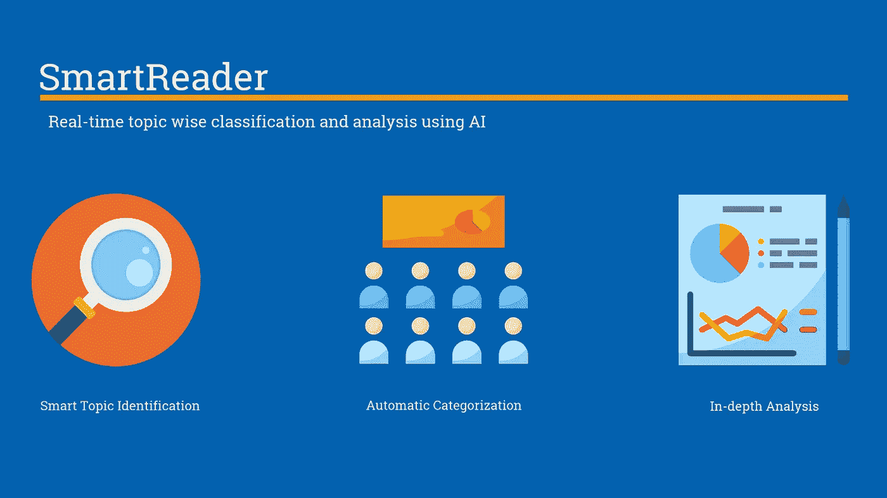
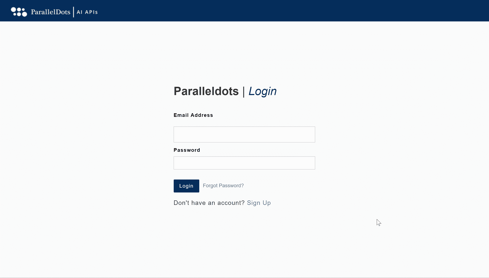

# 宣布推出智能阅读器——一个人工智能支持的反馈分析平台

> 原文：<https://medium.com/hackernoon/announcing-launch-of-smartreader-an-ai-powered-feedback-analysis-platform-4f6d64ca1340>

在过去的一年里，我们推出了多个基于人工智能的产品。我们的 API 和插件拥有超过 25，000 名注册用户的强大社区，我们每天都在发展。通过与我们的社区接触，我们发现了一个持续的需求，那就是我如何快速理解数千条客户反馈数据？

从那时到现在，我们一直在构思和试验一个 SaaS 工具，它可以自动完成分析客户反应的任务。我们需要一个能够在世界上最受欢迎的格式——EXCEL 中工作的解决方案！

我们于 2018 年 7 月开始构建该产品，经过多次迭代，我们很高兴地宣布推出我们的自动化调查分析工具— **SmartReader，**它可以快速分析大量开放式逐字评论，并找到可推动您业务发展的可行见解。

你可以从[这里](http://smartreader.paralleldots.com/)访问 SmartReader。

在本帖中，我们将展示如何使用 ParallelDots SmartReader 快速分析大量开放式逐字评论，并做出强有力的、有数据支持的决策。

# ParallelDots SmartReader 入门

首先，从[这里](https://user.apis.paralleldots.com/signing-up?utm_source=blog&utm_medium=smartreader_blog&utm_campaign=signup)注册一个免费的 ParallelDots 账户(如果你已经有了一个账户，请从[这里](https://smartreader.paralleldots.com/login)登录)。填写我们网站上的表格并验证您的电子邮件后，您可以[直接登录](https://smartreader.paralleldots.com/login)您的 SmartReader 仪表盘。请将帐户凭证存放在安全的位置，因为未经授权访问您的帐户将导致您的配额提前用完。如果您丢失了密码，或者您觉得其他人可能会访问您的密码，请立即更改您的密码。

# 使用 SmartReader 工具—分步指南

一旦您登录到您的仪表板，您需要按照以下步骤开始免费制作您的第一个**模型**！

1.  第一步是点击创建你的名字你的项目或'模型'。
2.  第二步是上传包含要分类的数据的 CSV 文件。
3.  接下来，您需要选择包含要分类的数据的列名。
4.  最后，我们的算法将根据您的数据进行训练，完成这一步可能需要大约 10-15 分钟。您可以关闭选项卡或继续其他任务。
5.  一旦一切都经过适当的训练，您将获得从数据中提取的主题列表。您可以单击这些主题中的任何一个，以获得定义这些主题的关键字建议(非常关键的一步，请查看推荐的主题及其相关关键字，并在必要时添加/删除它们)。
6.  现在就定义您的自定义类别和标签来构建您的文本数据。测试数据样本的结果以检查分类的质量，并修改标签，直到结果符合预期。底部会有一个输入框，您可以输入文本并检查分类任务的质量。记得尽可能多的提供子话题！
7.  一旦你对主题和关键词的组合感到满意，你就可以下载除了将你的文字分类之外，还有情绪、情感和关键词的结果。API 访问将很快发布。

**在一个单独下载的 excel 表格中，您将能够获得情绪、情感、关键词以及对每个类别的评论的二进制分数。**

您目前订购了免费服务，可以训练多达 5，000 行文本，下载多达 1，000 行。

如果您对结果感到满意，并希望进行全面的分析，请点击仪表板上的升级按钮升级您的帐户，并选择您选择的计划。下面列出了该计划的详细信息:

**高级** —您将能够在此创建多达 3 个模型，并且能够在每个模型中训练和下载多达 20，000 行的分析数据。

**Pro** —您将能够在此创建多达 6 个模型，并且能够在每个模型中训练和下载多达 50，000 行的分析数据。

**企业** —如果您需要训练和分析更多行，请[联系我们](https://paralleldots.com/contact-us)。

SmartReader 是一种强大且经济高效的方式，可以开始将尖端智能添加到您的客户反馈分析、调查分析等中..SmartReader 允许您从注册之日起每 30 天免费创建 1 个模型、训练 5，000 行并从您的 CSV 下载 1，000 行数据，而无需提供您的信用卡详细信息。我们希望这将让您了解产品中提供的不同功能，并在升级到我们的大规模使用付费计划之前了解使用案例。

如有任何疑问或反馈，请写信至 support@paralleldots.com[给我们。](mailto:support@paralleldots.com)

点击阅读最近推出的定价计划[。](https://blog.paralleldots.com/news/announcing-new-pricing-plans-for-paralleldots-apis-and-plugins/)

我们希望你喜欢这篇文章。请[注册](http://user.apis.paralleldots.com/signing-up?utm_source=blog&utm_medium=chat&utm_campaign=paralleldots_blog)免费的 ParallelDots 账户，开始你的 AI 之旅。你也可以在这里查看[的人工智能 API 的演示。](https://www.paralleldots.com/ai-apis)

点击可以阅读[原文。](https://blog.paralleldots.com/smartreader/announcing-launch-of-smartreader-an-ai-powered-feedback-analysis-platform/)