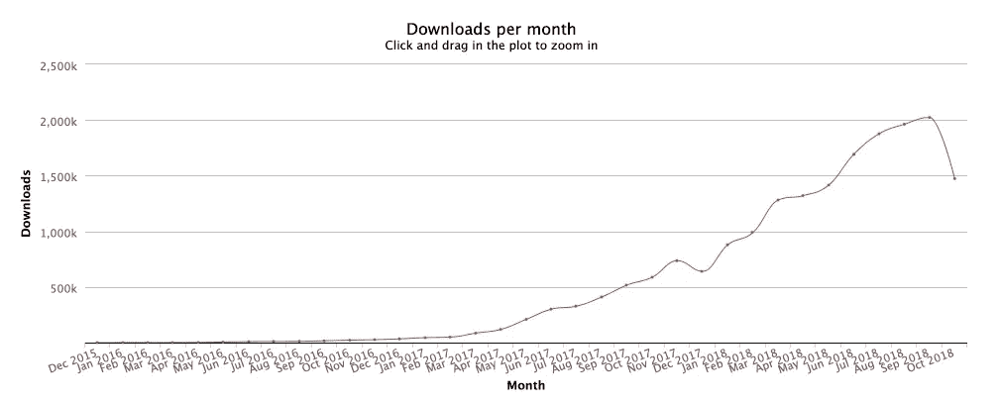

# 🎉宣布 lint-staged 支持部分暂存文件

> 原文：<https://medium.com/hackernoon/announcing-lint-staged-with-support-for-partially-staged-files-abc24a40d3ff>

三年前，我向世界介绍了 lint-staged。截至今天，在 81 发布之后，它已经出现在[超过 55000 个 GitHub 库](https://github.com/okonet/lint-staged/network/dependents)的依赖图中，并且在 NPM 已经超过了[500000 的周下载量！](https://www.npmjs.com/package/lint-staged)



当我在 2015 年发布 lint-staged 时，我从未想到它会成为如此受欢迎的工具。

## 一个我花了两年时间解决的问题

在 lint-staged 被引入到[react-boilerplate](https://github.com/react-boilerplate/react-boilerplate)——由[https://github.com/okonet/lint-staged/issues/62](https://medium.com/u/908fb8fea30c#62 from GitHub. <a class=)

我试着解决这个问题几次都没有成功。上一次最接近的尝试是大约一年前，在前往 2018 年的火车上，我举行了一次关于 lint-staged 的演示。

不幸的是，尽管我花了几乎几天时间破解它，我还是无法解决它。这项工作仍然有一些积极的成果:

1.  我在会议期间遇到了一些人，他们鼓励并帮助我继续尝试(感谢[Juho vepslinen](https://medium.com/u/a82419fa03ca?source=post_page-----abc24a40d3ff--------------------------------)、 [Michel Weststrate](https://medium.com/u/de4496bfa1e2?source=post_page-----abc24a40d3ff--------------------------------) 和 Nejc Zdovc)。
2.  我写了很多测试，所以做 TDD 和尝试不同的实现思想变得更容易了(我做了很多)。

## 🎉引入 lint 阶段 v8

今天，在两年多和 [138 次提交](https://github.com/okonet/lint-staged/pull/75/commits)之后，我非常兴奋地终于发布了 lint-staged 的第 8 版，它支持部分暂存文件！

它使用以下算法:

1.  在运行 linters 之前，检查是否有部分声明的文件(即提交索引和工作副本都有变化)
2.  隐藏并从工作副本中删除所有不在提交索引中的文件
3.  对这些文件执行命令(linters 和 formatters)
4.  将格式化程序更改添加到索引中(配置中的单独任务)
5.  如果所有 linters 都以零代码退出(即成功)，则恢复隐藏的工作副本状态。如果运行 linters 时出现错误，恢复隐藏的工作副本。
6.  比较新提交索引和工作副本*对工作副本应用尽可能多的格式更改*。如果有冲突块，丢弃格式化程序的更改。隐藏的用户修改应该总是优先于格式化程序。

这是它实际运行的样子:

[](https://asciinema.org/a/199934) [## 🚫💩lint-staged，支持部分暂存文件

### 这是部分暂存文件支持在中如何工作的演示🚫💩棉绒阶段。有关更多信息，请参见…

asciinema.org](https://asciinema.org/a/199934) 

最重要的是，y *你不需要改变你的配置来获得对部分暂存文件的支持！*该版本唯一的“突破性变化”是节点 8.6 的要求。

```
npm install --save-dev lint-staged@latest
```

我已经在我所有的项目中使用了一个多月，并且认为它很稳定。如果你碰巧遇到它的问题，请在 GitHub 上报告并帮助我解决。

# 外卖食品

## 不要放弃你的想法！

人们一直在说，我试图解决的问题是不可能解决的。我的某个部分一直否认它…我学到的一件事是，如果你相信它，它是值得尝试的。

## 开源是❤️

最终的解决方案是基于最初问题的[评论中分享的意见和想法，如果没有来自全球人民的巨大支持和鼓励，这是不可能的。我还要感谢帮助我维护这个项目的贡献者:](https://github.com/okonet/lint-staged/issues/62)[苏哈斯·卡兰思](https://github.com/sudo-suhas)和[卢夫蒂·维兰达](https://github.com/luftywiranda13)。

## 开源是💩

事实上，我花了两年多的时间才找到解决方案，这很可笑，但这又证明了这种工作的合理性。我花了无数的时间寻找最终的解决方案。我又花了几天时间来完成和清理代码，合并来自上游的更改，并撰写这篇博文。就在过去的两个月里，我花了 50 多个小时在上面。考虑到我是两个孩子的父亲，投入这么多时间对我来说变得越来越难以自圆其说。

**如果你认为 lint-staged 有用，请考虑** [**在开放集体**](https://opencollective.com/lint-staged) **资助该项目。**