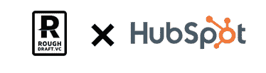

# 宣布风险投资初稿' HubSpot 夏季加速器'

> 原文：<https://medium.com/hackernoon/announcing-rough-draft-ventures-summer-accelerator-at-hubspot-3c359e741d74>

## 学生创办的创业公司向中小企业销售的夏季加速器

每个学年，在支持大学创业者的【Draft Ventures、 General Catalyst 以学生为中心的项目中，我们都会遇到数百名学生，他们正在创建颠覆现有行业的改变游戏规则的企业。今天，我们很高兴地宣布一项新计划，支持学生创办的专注于向[中小企业](https://hackernoon.com/tagged/smbs)销售的公司。

**HubSpot**的夏季加速器将提供办公空间和[创业](https://hackernoon.com/tagged/startup)资源，帮助 4-5 个专注于向中小企业销售的学生领导的团队在 2018 年 6 月至 8 月建立业务。创始人将每周与 RDV 和 HubSpot 团队会面，并与 RDV 和 HubSpot 的导师共度时光。

在夏季结束时，团队将有机会在最后的演示日以 2.5 万美元的支持价格推介 RDV，以 2.5 万美元的支持价格推介 HubSpot。

**作为计划的一部分，RDV 和 HubSpot 将提供:**

🏢HubSpot 位于马萨诸塞州剑桥的 4-5 个团队的办公空间

👩🏻‍🏫每周与 HubSpot 和 RDV 的导师和合作伙伴举行 2 小时的导师会议

🎁获得超过 30 家资源提供商提供的 [RDV 入门套件](/rough-draft-ventures/introducing-the-rdv-boston-student-founder-starter-kit-147a8618d4a8)和折扣(价值高达 10 万美元)

📈访问 [HubSpot for Startups](https://www.hubspot.com/startups) 套餐(教育、支持和 HubSpot 软件九折优惠)

**计划时间表和资格:**

📆该计划将于 2018 年 6 月至 8 月开展

💲在 9 月初，团队将有机会通过演示日以 25000 美元的价格推介 RDV，以 25000 美元的价格推介 HubSpot

🏘目标市场必须包括中小型企业

🙋团队的规模不限，但 HubSpot 将接纳每个团队最多四名员工

👩🏾‍🎓至少一名团队成员必须是 2018 年春季毕业或 2018 年秋季返校的学生(本科生或研究生)

**申请** [**这里**](https://roughdraft.typeform.com/to/UA4Mpw) **美国东部时间 4 月 13 日晚上 11:59。更多信息请访问:**[**https://bit.ly/2IKzLJu**](https://bit.ly/2IKzLJu)**或联系** [**娜塔莉·巴特利特**](mailto:natalie@roughdraft.vc)

如果你是一名学生，想让你的创业公司、公司或项目更上一层楼，给我们写封信吧&让我们一起探索我们能共同创造什么。想了解更多关于草稿公司的信息，请访问我们的网站或在推特上关注我们！