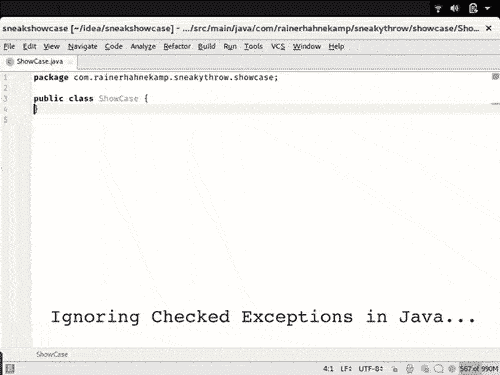

# 宣布 SneakyThrow:一个忽略检查异常的 Java 库

> 原文：<https://medium.com/hackernoon/announcing-sneakythrow-8b41b07f9201>

你是否厌倦了为 Java 的检查异常编写“catch-伪代码”？让我们不要去想那个烦人的额外单元测试。

救援马上就到。

我给你介绍一下 SneakyThrow。多亏了这个 [Java](https://hackernoon.com/tagged/java) 库，减少了捕捉检查异常所需的代码量。

它只使用“合法的东西”——没有像[字节码](https://hackernoon.com/tagged/bytecode)操作那样的魔法。我在看你的龙目岛计划😉

SneakyThrows 将异常包装到 RuntimeException 中。众所周知:我们不需要捕捉这些类型的异常。我们可以将它们作为未检查的异常。



SneakyThrow in Action

# 怎么才能拿到？

只需将库作为依赖项复制粘贴到您选择的`pom.xml`或类似的依赖项管理器中:

```
<dependency>
  <groupId>com.rainerhahnekamp</groupId
  <artifactId>sneakythrow</artifactId>
  <version>1.0.0</version>
</dependency>
```

# 怎么用？

如果没有 SneakyThrow，带有检查异常的代码如下所示:

```
URL url; 
try { 
  url = new URL("https://www.hahnekamp.com"); 
} catch (MalformedURLException mue) {
  throw new RuntimeException(mue);
}
```

多亏了 SneakyThrow，您的代码看起来像这样:

```
URL url = sneak(() -> new URL("https://www.hahnekamp.com"));
```

# 太好了！它也适用于 Stream 和 lambdas 吗？

没问题。没有 SneakyThrow 的代码再次出现:

```
private URL createURL(String url) throws MalformedURLException {
  return new URL(url);
}Stream
  .of("https://www.hahnekamp.com", "https://www.austria.info")
  .map(url -> {
    try { 
      return this.createURL(url); 
    } catch (MalformedURLException mue) {
      throw new RuntimeException(mue); 
    } 
  })
  .collect(Collectors.toList());
```

现在再一次用 SneakyThrow 编写更少的代码:

```
private URL createURL(String url) throws MalformedURLException {
  return new URL(url);
}Stream
  .of("https://www.hahnekamp.com", "https://www.austria.info")
  .map(sneaked(this::createURL))
  .collect(Collectors.toList());
```

请注意**潜行**和**潜行**的区别。

# 我在哪里可以获得更多信息？

文章[“忽略 Java 中的异常”](https://www.rainerhahnekamp.com/en/ignore-exceptions-in-java/)更详细地描述了 SneakyThrow 背后的基本原理和基本方法。

SneakyThrow 是开源的，可以在 [GitHub](https://github.com/rainerhahnekamp/sneakythrow) 上获得。

试试吧，让我听听进展如何。欢迎任何形式的反馈。

*原载于 2018 年 3 月 26 日*[*www.rainerhahnekamp.com*](https://www.rainerhahnekamp.com/en/announcing-sneakythrow/)*。*