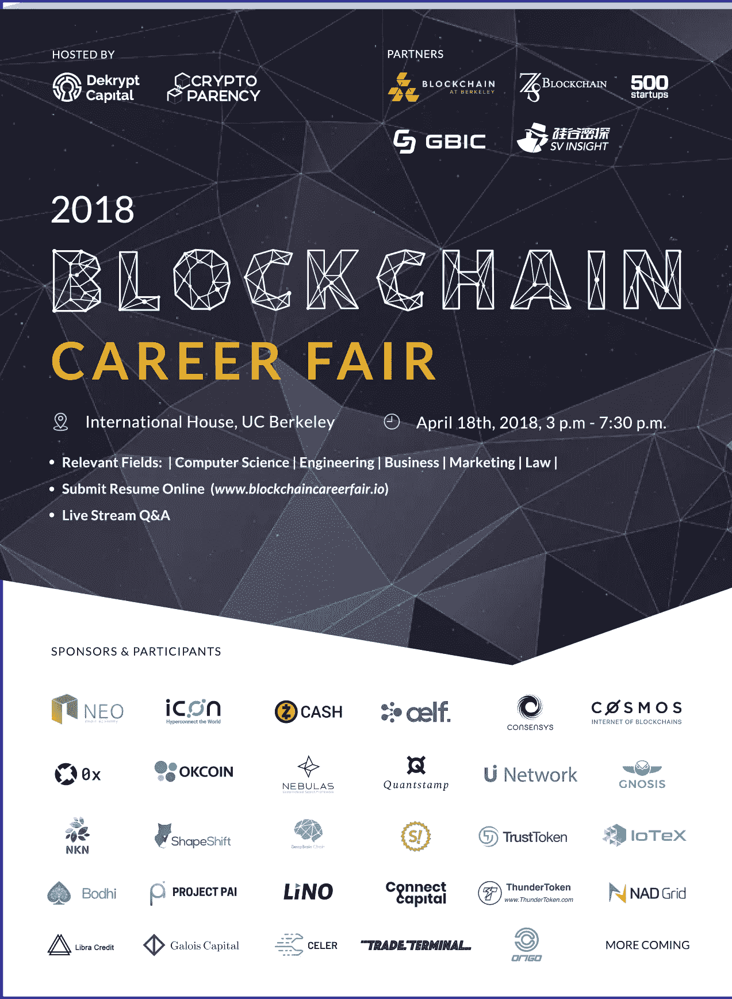

# 宣布:区块链招聘会

> 原文：<https://medium.com/hackernoon/announcing-the-blockchain-career-fair-ca39c6407d48>

## 区块链需要的是人才，不是钱。

12 月 13 日，当加密货币的总市值超过 5000 亿美元时，以太坊的创始人维塔利克·布特林(Vitalik Buterin)在推特上写道:

就主流对加密货币的兴趣而言，2017 年对[区块链](https://hackernoon.com/tagged/blockchain)行业来说是重要的一年，这导致大量资本流入几乎所有通过疯狂投机升值的代币。我们难以置信地目睹了对 ico 的贪得无厌的需求，其中一些 ico 变得如此受欢迎，以至于团队能够通过一个华而不实的网站和一份绝世的未经审查的白皮书筹集数千万美元，如果不是数亿美元的话。尽管许多投资者与大众同流合污，不管他们是否认为这种投机行为有利于加密货币，但其他一些人确实强烈承认，这种狂热是该行业的一个积极指标。因此，一个价值 5000 亿美元的产业不受约束地崛起了。

布特林机敏地问道:“我们应得的吗？”对此，我们 CryptoParency 表示，我们坚信分布式账本[技术](https://hackernoon.com/tagged/technology)的潜力；然而，我们同意布特林的观点，即该行业尚未产生或释放出价值数千亿美元的价值。我们的行业到底要展示多少？尽管主流媒体都报道了加密货币改善金融技术的能力，但当我们分析(比如)资本和信贷的普遍可及性时，由于基于区块链的创新，“有多少没有银行账户的人(实际上)被存入了银行”？

那么，区块链工业下一步将走向何方？向这个领域投入资金是第一步，但这本身并不能带来创新。我们认为答案很简单:增加在这个领域工作的人才。根据 TechCrunch 上的一篇[报道](https://techcrunch.com/2018/02/14/blockchain-engineers-are-in-demand/)，“现在每个区块链开发者有 14 个职位空缺。”

# 我们能做些什么呢？

我们很自豪地宣布 2018 年区块链职业博览会，我们公司将于 4 月 18 日与伯克利的区块链和加州大学伯克利分校的 Dekrypt Capital 一起举办。我们的使命是将我们网络中寻找技术开发人员、商业人才和其他人的优质项目与旧金山湾区和世界各地的学生和现有人才联系起来。

**敬请关注**[**www . blockchaincarerfair . io**](http://www.blockchaincareerfair.io)

# 常见问题

**我可以远程参与吗？**

本着区块链去中心化的精神，我们打算让我们的供应商和赞助公司能够向您直播他们的演示。加入我们的现场问答以及我们的公开简历投递。

简历掉落:[https://goo.gl/forms/JhMjc4FyaXv4m8Im2](https://goo.gl/forms/JhMjc4FyaXv4m8Im2)

**门票多少钱？**

该活动完全**免费**！但是，我们要求你放下你的简历！

门票:[https://www . eventbrite . com/e/区块链-职业博览会-加州大学伯克利分校-门票-44312568084？aff=efbeventtix](https://www.eventbrite.com/e/blockchain-career-fair-uc-berkeley-tickets-44312568084?aff=efbeventtix)

我的公司有兴趣参与。怎么才能联系上？

对任何感兴趣的公司，请随时与我们在 info@cryptoparency.com 联系。

如果您希望参加此次活动但未能成行，请继续关注 CryptoParency 计划举办的未来活动，以支持区块链开发者生态系统！在 [Twitter](https://twitter.com/CryptoParency) 和 [LinkedIn](https://www.linkedin.com/company/cryptoparency/) 关注我们。