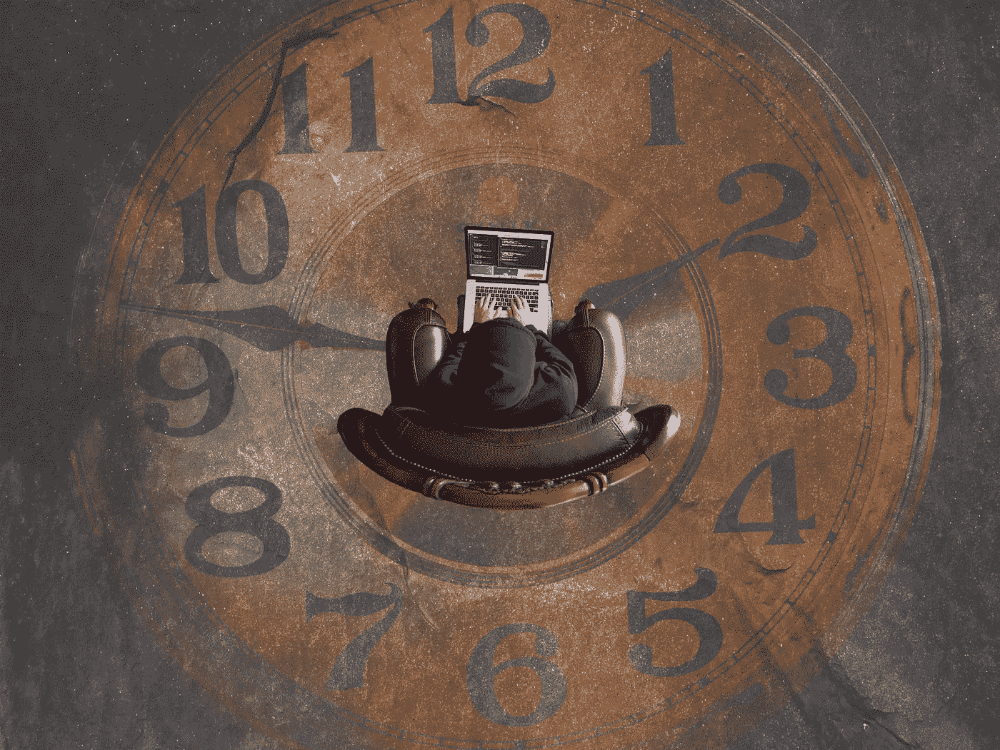

# 用 Therachat 宣布反向黑客马拉松——道德+技术

> 原文：<https://medium.com/hackernoon/announcing-the-reverse-hackathon-e6398984350d>

## 是时候重新思考技术了。

***门票有限，可在此处[购买](https://www.eventbrite.com/e/reverse-hackathon-at-ciis-humanities-tech-tickets-44007079359) ***

本周的科技新闻让许多人感到震惊。一名行人被[一辆自动驾驶的优步](http://money.cnn.com/2018/03/20/news/companies/self-driving-uber-death/index.html)撞成重伤。脸书卷入了一场规模惊人的 T4 数据泄露事件。上个月，Twitter 公开呼吁制定更有意义的健康指标，以此作为对社交媒体日益增长的问题的认可(马克·扎克伯格计划在 2018 年解决这一问题)。

“快速行动，打破常规”的古老格言不再那么吸引人了。有必要考虑技术如何影响用户的道德和心理影响。人道技术中心已经做了令人难以置信的工作开始了这场运动，但是我们还可以做更多。

**介绍，反向黑客马拉松。**

# 反向黑客马拉松

让我们团结起来，以一种更有意义、对社会负责的方式来重新设计技术工具。我们正在汇集真正跨学科对话的力量，包括学者、设计师、伦理学家、计算机科学家、心理学家、企业家、教育家等等。这次黑客马拉松的最终产品是一个 5 分钟的产品提案，以人性化的方式重新设计现有的技术。我们正在利用人文领域来“入侵”技术产品开发。

让我们停止让用户沉迷于我们的产品，停止在我们的平台上传播虚假信息。让我们停止制造产品而不考虑对用户心理的影响。让我们停止开发将人类视为仪表盘上的聚合数字的产品。让我们停止打碎东西。

我们的反向黑客马拉松由[加州综合研究所](https://www.ciis.edu/)和[黑客健康](http://hackmentalhealth.care)联合举办。HackMentalHealth 是世界上最大的心理健康黑客马拉松的组织者，并由戴夫·莫林、史蒂文·陈博士和[等许多知名人士](http://hackmentalhealth.care/advisors/)担任顾问。

# 示例问题空间

这里有一些我们可以在活动中看到的想法，让我们更清楚地了解我们在想什么

*   约会应用促进自我意识、外貌主义、不真实和回避。我们如何利用关系心理学来改变 Tinder、Bumble 和其他应用程序，从而避免这些负面的思维模式？
*   网飞和 YouTube 鼓励用户花几个小时在他们的网站上疯狂观看，并自动播放下一个视频。我们如何以对公司和消费者都有利的方式重组这些技术？
*   Instagram 推动了 pro-ana 和 thinspiration 等趋势，这些危险的负面运动促进了不健康的饮食习惯。我们如何利用伦理和心理学来重新设计这些无限的照片，以防止这些趋势的传播？

# 我们为什么要这么做

我们知道技术的使用正在塑造我们的情感生活、社会关系、欲望和期望以及决策。通过汇集学者、伦理学家、心理学家、教育家和其他社会科学和人文专家以及产品开发人员、设计人员和编码人员，弥合 teach 与社会和情感健康之间的差距。

然而，这次黑客马拉松的不同之处在于，我们将从常见的技术工具和应用程序开始，在黑客活动结束时，我们的参与者将通过注入新功能来改进应用程序和工具，帮助工具更好地服务于我们的集体精神和情感健康。

# 加入我们

我们在活动开始前就发布了这个帖子，因为我们需要你的支持。我们有两个评委席位，希望将赞助商和合作伙伴加入到我们不断增长的[过去和现在的赞助商名单中。](https://www.hackmentalhealth.care/partners/)

我们的票正在出售！点击此链接获取[。请👏如果你相信这个使命，请与他人分享。](http://hackmentalhealth.care/join)