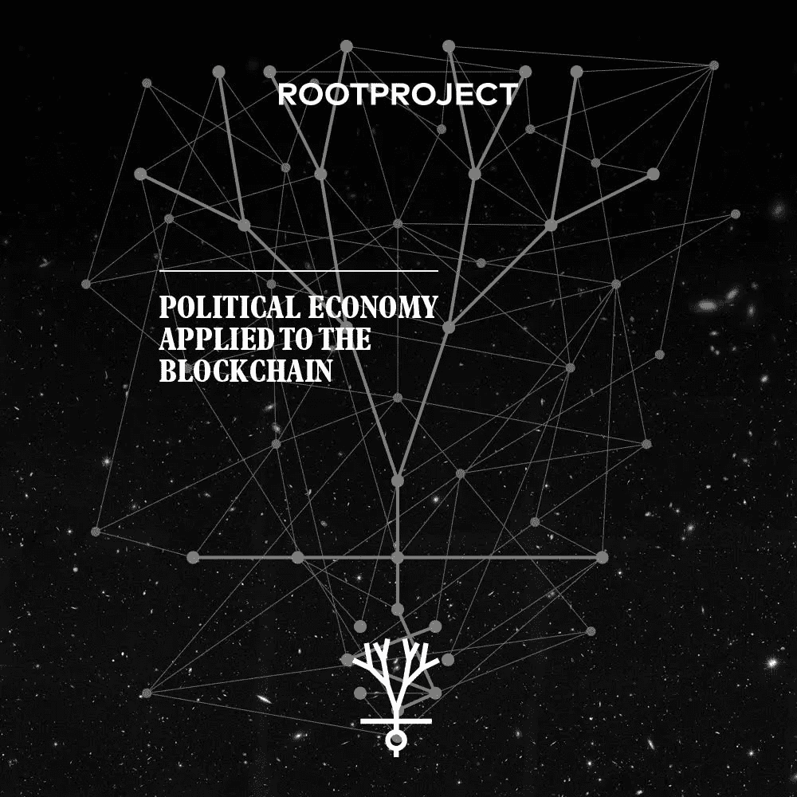

# 宣布更多的根项目顾问

> 原文：<https://medium.com/hackernoon/announcing-three-more-rootproject-advisers-176972caf53a>

作者 Nicholas Adams Judge 博士是一名政治经济学家，也是非营利组织[*root project*](http://rootproject.co)*的联合创始人。另一位联合创始人克里斯·普莱斯是 Y Combinator 的研究员。他们的 pre-ICO 实现了最初目标的 512%。*

正如我在[上周的公告](https://hackernoon.com/the-advisers-structuring-rootprojects-ico-27a1929f07a9)中所写的，代币购买者知道谁在构建 ICO 是很重要的。对外界而言，公司总是吹嘘人们是如何“上船”的，一切都是有机增长的，因为这个想法太棒了。现实情况是，90%的 ICO 都失败了，更少的 ICO 实现了正确的后价格行为。

后 ICO“流行”代币购买者梦想的通常不是来自运气:它来自一个知识渊博的团队数月的规划，执行艰难的选择——优化未来市值的选择，而不是立即可以获得多少钱。

在世界经济论坛期间宣布我们在达沃斯的 ICO 日期之前，开始发布我们几个月来一直保持沉默的信息是一件非常有趣的事情:不久前，我们与 [Strategies 360](https://www.strategies360.com) 一起讨论如何打破一个月 100 个 ICO 的噪音。我们决定保持沉默，在我们的预 ICO 成功后建立我们的组织，然后在新年后，开始每周多次发布对精明的代币购买者来说很重要的消息。

今天，我们很自豪地宣布两位伟大的顾问。像前三个一样，他们对 RootProject 很重要。他们是我的私人朋友，是全球加密投资者团体的思想领袖。要了解更多关于 RootProject 的信息，请加入我们以及我们[电报组](https://t.me/Rootproject)的成千上万的其他人。

克里斯托弗·海曼是区块链的工程师，也是加密天使基金 1kx 的合伙人——这个名字是根据他们在参与以太预售后享受的回报而命名的。

他的动机是建立一个去中心化的经济和一个新的互联网，在这个新的互联网中，企业等级制度退居公民利益和工程之后。

克里斯多佛为区块链的公司提供技术构建和 ICO 执行方面的建议。

亚历克斯·山下是 ICO 投资咨询公司 TLDR 的创始合伙人。

他为许多 ico 提供咨询。在进入加密行业之前，他是一名成功的企业家，从事金融工作，在高盛等公司工作。在此之前，他在耶鲁大学学习经济学。