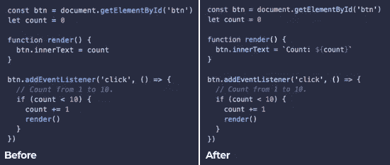
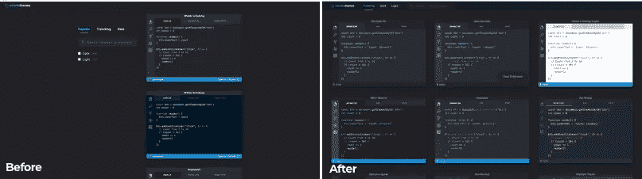
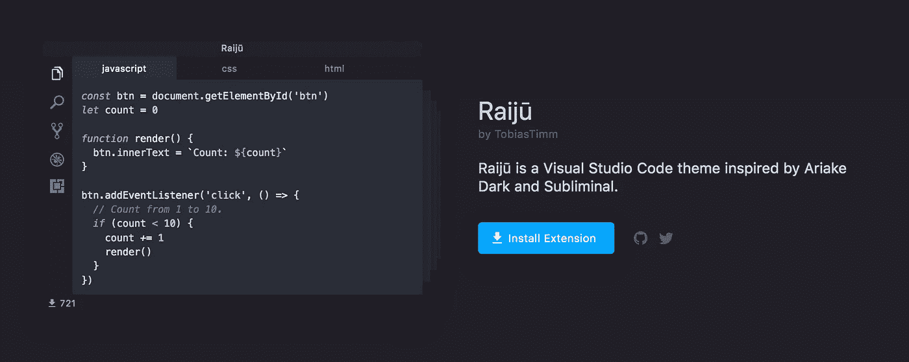

# 宣布 VSCodeThemes

> 原文：<https://medium.com/hackernoon/announcing-vscodethemes-4544f50c2b5b>

## 预览来自 VSCode 市场的主题。

大约 5 个月前，我发布了一个相对流行的关于 r/vscode 的附带项目，从那以后我一直致力于使它变得有用。

[VSCodeThemes](https://vscodethemes.com/) 开始是作为学习一些新的[技术](https://hackernoon.com/tagged/tech)和挑战自己的借口。我知道我想用 AWS Lambda / [SQS](https://aws.amazon.com/sqs/) 来建立一个 web scrapper，并尝试搜索即服务平台 [Algolia](https://www.algolia.com/) 。

我大概在同一时间浏览主题。

浏览[Visual Studio market place](https://marketplace.visualstudio.com/)寻找主题可能会很痛苦。该网站针对浏览扩展进行了优化，因此你需要依赖主题发布者向自述文件中添加截图。

搜索结果也不是很有用。一个扩展的名字、缩略图和安装数量并不能很好地反映主题的质量。[一个个浏览](https://hackernoon.com/tagged/browsing)结果，希望有截图，是一种缓慢又令人沮丧的体验。

我很高兴地宣布，在过去的几个月里，我已经对网站进行了一些大的更新，这将帮助你发现一些新的令人敬畏的主题。

请继续阅读，了解一些更值得关注的更新的详细信息，或者在 https://vscodethemes.com[观看它们的实际应用。](https://vscodethemes.com/)

# 准确的预览

第一个版本有一个重大缺陷——语法高亮显示非常不准确。对于一个网站来说，一个非常重要的功能就是展示主题预览。

我最初使用了[react-syntax-highlighter](https://github.com/conorhastings/react-syntax-highlighter)组件来显示代码预览，但是它使用了 [PrismJS](https://prismjs.com/) ,这是*而不是【VSCode 使用的语法突出显示。*

这意味着我必须将 VSCode 主题转换成 PrismJS 主题，结果导致了大量不准确的预览(此外还有一些非常糟糕的代码)。

在挖掘了 VSCode 源代码之后，我发现了负责输出给定主题、语言和模板的颜色标记的 [vscode-textmate](https://github.com/Microsoft/vscode-textmate) 包。

这个库依赖于本地模块，所以我不能简单地把它添加到前端。最新的更新是在保存结果到 Algolia 之前，预先渲染每个主题的语言预览。

Syntax highlighting before and after

查看[这个 PR](https://github.com/jschr/vscodethemes/pull/83) 了解更多关于这是如何工作的细节。

# “浪费的空间”

由于我在项目开始时主要关注后端，所以前端有点像是后来才想到的。它看起来很漂亮，在手机上运行良好，但整体体验需要一些爱。

一个抱怨是由于单列布局，桌面上的所有[【浪费空间】](https://github.com/jschr/vscodethemes/issues/82)。切换到响应式网格布局会带来更快、更愉快的浏览体验。

Search results before and after

# 扩展页面

作为一个经常性的 r/vscode 潜伏者，你会偶尔看到[“这是什么主题？”](https://www.reddit.com/r/vscode/comments/8u1rp1/does_anyone_know_what_is_the_name_of_this_theme/)帖子，请求[主题建议](https://www.reddit.com/r/vscode/comments/8mjkzo/light_theme_recommendations/)和新[主题公告](https://www.reddit.com/r/vscode/comments/8ektek/new_theme_iceberg/)。

很明显，一个独特的扩展页面将允许用户轻松地链接和共享 VSCodeThemes 上的任何主题——就像我个人最喜欢的 TobiasTimm 的 raij[之一。](https://vscodethemes.com/e/TobiasTimm.raiju)

Extension page with theme rotator

查看[这篇 PR](https://github.com/jschr/vscodethemes/pull/88) 了解更多关于前端重写的细节。

# 其他更新

除了一些很酷的新功能之外，该堆栈还有一些重大更新，例如:

*   将前端移植到 [NextJS](https://github.com/zeit/next.js/) 以改进 SEO。
*   增加了一个 [CloudFront](https://aws.amazon.com/cloudfront/) CDN 来提高页面速度和可扩展性。
*   设置[纱线工作空间](https://yarnpkg.com/lang/en/docs/workspaces/)用于后端和前端之间的共享包。

…还有一堆 [bug 修复](https://github.com/jschr/vscodethemes/issues?utf8=%E2%9C%93&q=is%3Aclosed+label%3Abug)。

# 下一步是什么？

我现在想到的几个可能的特征是:

*   [增加更多语言](https://github.com/jschr/vscodethemes/issues/59)
*   [最爱](https://github.com/jschr/vscodethemes/issues/101)
*   [图标主题](https://github.com/jschr/vscodethemes/issues/87)

如果您希望看到这些功能的构建或有其他建议，请随意在 Github 上发表[贡献。](https://github.com/jschr/vscodethemes)