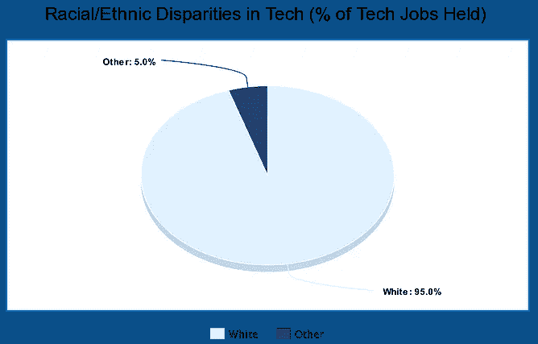
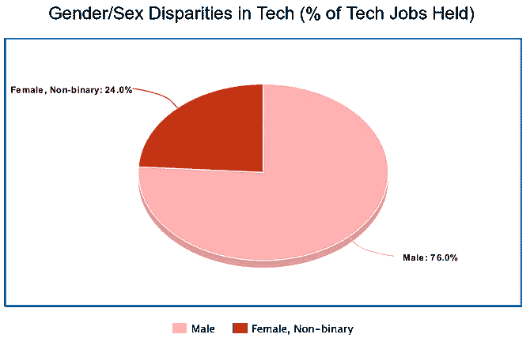
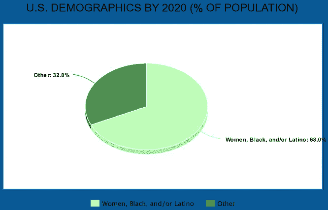

# 宣布 zero 55——一个象征性的基金，用于投资代表性不足的创始人

> 原文：<https://medium.com/hackernoon/announcing-zero55-a-security-tokenized-fund-for-investing-in-under-represented-founders-9ac5dbf65677>

几周前，我在旧金山的[全球区块链论坛](https://gbforum.co)上发表演讲，当时我有机会与几位演讲者和与会者一起喝酒。虽然总体来说这是一次令人愉快的活动——出色的演讲者、小组讨论、网络等等。——我们似乎都注意到了一件事，那就是在这次活动中，女性、黑人和拉丁裔创始人严重缺乏。

然而，这不仅仅是这个特定会议的问题。相反，这是一个全行业的问题。与总人口相比，女性、黑人和拉丁裔创始人在科技领域的代表性严重不足。根据 [Atlassian 2018 年多样性状况报告](https://www.atlassian.com/diversity/survey/2018)，目前，**男性占据了 76%的技术工作，95%的技术劳动力是白人。**

此外，美国的黑人和拉丁裔人口增长速度比以往任何时候都快。据皮尤研究中心称，到 2055 年，68%的美国人口将是女性、黑人和/或拉丁裔。

Sources: Atlassian 2018 State of Diversity Report, Pew Research Center

虽然我们作为一个国家在种族和性别平等方面取得了很大进步，但仍有许多工作要做。女性、黑人和拉丁裔创业者在筹集风险资金和参与整个科技行业时仍然面临着巨大的劣势。对于那些认为“仅仅”社会不公不值得解决的人来说，这不仅仅是一个社会问题。

2016 年，全球政策解决方案中心报告称，“*由于歧视性的融资做法和对主要由白人男性运营的公司的偏见，*美国正在失去超过 110 万个少数族裔拥有的企业，结果是，**放弃了超过 900 万个潜在就业岗位，****【3000 亿美元的集体国民收入，****【重点矿山】。**

**凭借女性、黑人和拉丁裔创业者的创业才能，获得数十亿未开发的市场机会，这其中蕴藏着*难以置信的潜在经济回报*。我们可以帮助*建立独角兽公司，否则它们可能从未存在过。***

**这就是为什么我们要创建一个令牌化基金，投资于技术领域代表性不足的创始人(即女性、黑人和拉丁裔创始人)，用一个安全令牌代表基金投资回报的比例份额。**

**为什么要将基金令牌化？令牌化可以提高投资的流动性和透明度，并让更多的投资者参与基金并从中受益。**

**ZERO55 将专注于将塑造未来 100 多年全球经济的技术，如区块链、人工智能和虚拟现实；以及代表万亿美元市场的社会影响领域，如医疗保健、教育和智能城市。**

****

**Technologies like artificial intelligence, blockchain, and virtual reality will shape the next 100+ years of the global economy**

**我知道，对于代表性不足的创始人来说，开始并成功建立创新型科技公司有多难。我本人是一名拉丁裔科技创始人，目前担任直接面向消费者的医疗保健会员[伊西保健](https://izzycare.org)的首席执行官/联合创始人，在顶级医疗保健出版物中发表过文章，如 [*【医疗城新闻】*](https://medcitynews.com/2018/08/izzy-care-holistic-approach/?rf=1)*[*医疗保健周刊*](https://healthcareweekly.com/virtual-healthcare-startup-izzy-care/)*和*贝克尔医院评论*，并在《今日医疗保健中的 [*区块链*](https://blockchainhealthcaretoday.com/index.php/journal/article/view/30) 中发表过研究。****

****这就是为什么我要成立这个基金——帮助女性、黑人和拉丁裔创业者建立他们的创业公司并将其规模扩大到十亿美元的企业——并号召其他人加入这一事业。****

****这个项目正处于最早期阶段，我们还有大量的工作要做——为基金联系更多潜在的有限合伙人/投资者，包括散户和机构投资者；建立管理团队；创建我们的安全令牌(很可能在 Polymath 上)并向 SEC 注册，等等。我们可以利用你的帮助。****

****想一起完成这个任务吗？[给我发消息](mailto:kcolon@protonmail.com)，[注册我们的邮件列表](http://zero55.vc)，让我们一起来帮助打造明天的独角兽。****

********

****Get it? Lego unicorn… Building unicorns of tomorrow? … I’ll see myself out.****