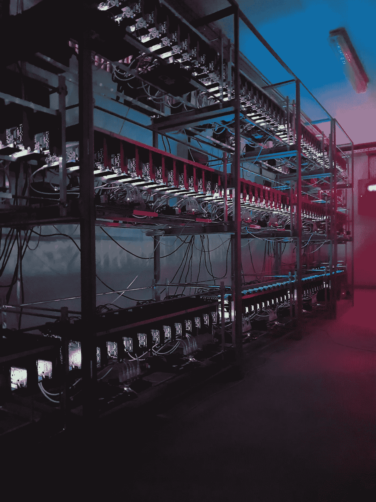

# 加密货币挖掘的另一个维度

> 原文：<https://medium.com/hackernoon/another-dimension-into-cryptocurrency-mining-a3865785858d>

## 如果你不喜欢云挖掘，你可能会喜欢这个

Picture from Nova Elysion

当比特币开始获得动力，人们开始接受采矿的概念时，许多人醒来后发现它在他们方便的地方建立了自己的小型采矿钻机。但是随着困难的增加，私人经营采矿设备变得无利可图。然后是云矿。云采矿基本上是从商业规模的采矿钻机购买合同。这些公司竭尽全力优化运营，以尽可能降低成本，实现最佳生产。他们向出售 hashpower 的普通人提供合同。购买该合同的人将根据他们获得的哈希值获得收益，并根据合同条款进行一些扣除(维护、能源、冷却等)。

然而，云挖掘并没有很多人想象的那么好。难度级别、价格波动和扣除让许多人望而却步。在某些情况下，由于愤怒，矿业公司在一些社交网络上被贴上了骗局的标签。但是对于那些仍然对采矿感兴趣的人来说，还有第三种选择。

> 概念很简单；你买一个实际的采矿硬件，你把硬件送到公司的农场托管。他们在他们的采矿农场接收和托管您的硬件，并定期将您硬件的 100%支出发送到您的钱包。

公司名称为 **Nova Elysion** ，总部位于塞尔维亚诺维萨德。创始人是菲利普·斯坦纳。该公司有 5 个分支机构: **Nova Elysion** (即网络和社区平台)**黑钻**(即采矿硬件制造商)**宙斯系统**(托管平台) **Elysion Store** (即买卖加密货币换取现金的实体店) **Elysion Academy** (将用于区块链领域的教育)。Zeus Systems 的农场可以容纳 10，000 个 GPU 和 2，000 个蚂蚁矿工。Elysion 商店于 2018 年 6 月在塞尔维亚诺维萨德开业。在那里，任何人都可以用现金买卖加密货币，每笔交易收取 5%的费用。但是，每人每天或每笔交易的限额为 2000€。商店中可用的加密货币包括比特币、ETH、莱特币、ripple、比特币现金、zcash、monero、EOS、tron、NEO、dash。

这家公司的采矿框架非常简单。它从**购买硬件**开始。他们更希望客户通过其子公司 Black Diamond 购买硬件。然而，如果客户选择从其他地方购买，他们会接受设备，只要它适合他们的农场。买下硬件后，**被送到宙斯系统安装并托管**。此外，这不是强制性的或自动的选择。客户可以选择将硬件送到他/她的家中。将硬件发送到 Zeus Systems 可以优化那里已经建立的农场。硬件安装后，**客户获得所购硬件开采的 100%**。支付给该公司的款项将不会从开采的硬币中提取，它将始终通过银行转账、比特币或以太网进行分离。如果采矿硬件是从黑钻石购买的，他们会给产品提供 3 年的保修。

新星 Elysion 有一个附属系统。Nova Elysion 的每个注册用户都会收到一个私人链接，可以用来邀请其他人。被邀请的顾客每购买一件商品，邀请的会员将获得 5%的佣金(VIP 会员为 7%)。VIP 身份可以每年花 120€购买，或者当会员的营业额达到 20，000 欧元€时获得。此外，每当超过一定的营业额水平，客户就会获得一次性奖金。佣金通过菲亚特的银行转账支付。

回到采矿，开采的硬币被分发到在公司平台的后台创建的钱包中。硬件的采购成本是一次性付款。该公司专注于挖掘 ETH、比特币和 Zcash。不过总共有 40 种加密货币可以选择，像 monero，siacoin，ethereum classic，invictus 等。也有能力选择一个选项，其中最有利可图的硬币将为客户开采。

**硬件完全属于客户**。每一笔购买都有 Nova Elysion 的正式发票。试用 3 个月后(根据与 Zeus Systems 的合同)，客户可以决定无限期地将硬件托管在 Zeus Systems 上，或者由客户将其交付到所需的地址。当客户发送交货地址时，会发送硬件。在硬件回购方面也有一个选项。为了节省时间、成本和收益，客户可以将采矿硬件出售给 Nova Elysion，然后自己拿钱。

向 Nova Elysion 支付的托管费和其他款项可以用菲亚特、比特币或以太网单独支付。这是为了避免客户在不准备出售他们开采的硬币时出售。附属公司的佣金将于每月 5 日支付(除非适逢周末或假日，这意味着下一个工作日)。佣金将以法定货币(欧元)支付至银行账户。托管费是固定的，而且采矿场有火险、水险和盗窃险。尽管如此，视频监控、安全人员、系统监控和针对黑客攻击的虚拟安全都非常重视安全性。到期时将对硬件进行维修和部件更换。此外，客户还可以获得专业咨询，了解如何选择设置采矿硬件以获得最佳收益。

> 最后，这不是投资建议，也不是理财建议。这只是信息。如果你对此感兴趣，自己做研究(DYOR ),并根据自己的研究做出决定。这只是给大家介绍一个加密货币挖矿的选项。查看[公司网站](http://www.novaelysion.com/)及其子公司[黑钻石](https://www.blackdiamond.systems/)和[宙斯系统](https://www.zeussystems.biz/)。

干杯！