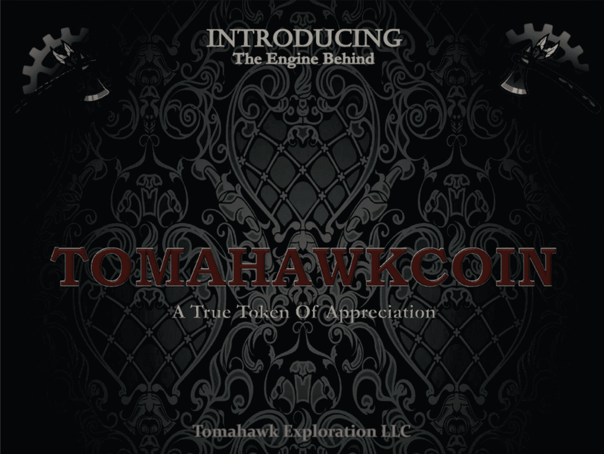

# 又一个 ICO 成功了。战斧只是个开始。

> 原文：<https://medium.com/hackernoon/another-ico-bites-the-dust-tomahawk-is-just-the-beginning-d8fd5cff3d75>

经过深思熟虑，美国证券交易委员会(SEC)于 2017 年夏季对试图通过 T2 证券交易所为战斧勘探公司(Tomahawk Exploration)筹集资金的大卫·t·劳兰斯下达了永久证券销售禁令。那么，这一点为何如此重要呢？实际情况表明，大卫是典型的急功近利型投资人，他给投资者提供了一枚可以转换成股票的比特币，让他们从石油钻探中受益。

然而，按照美国证券法，大卫没有在美国证券交易委员会(SEC)注册比特币，也没有使用豁免注册的规定，将比特币卖给投资者。他也没有披露公司的真实情况和自己的背景，这并不令人意外，因为他的背景上充斥着欺诈行为。因此，在出售之前没有适当地通知投资者。简而言之，他们上当了。

证交会的这项裁决非常重要，因为它只是 ico 执法冰山一角。SEC 的策略很简单:追踪那些明显欺诈的 ico，赢得和解，然后追踪所有没有明显欺诈，但未能正确注册(没有注册)或使用豁免的 ico。

大卫劳伦实施了一项奖励计划，在战斧 ICO 中出售代币，这是许多 ICO 使用的一种营销手段。赏金计划基本上是承诺，只要有人点击他们的社交网站推广代币产品并进行投资，就能获得代币佣金。

然而，这种类型的赏金是非法的。当然，举例来说，推荐买家在亚马逊买书是合法的，但销售证券则不行，因为赏金猎人必须是注册代表，并且与经纪人有关联，才能获得佣金。

此外，发起人(在本例中为 David Laurance)需要使用注册豁免，这可以是针对经认证的投资者的 D 506(c)法规、A+法规或众筹法规，以便向普通公众招揽和筹集资金。这些奖励计划的目标群体是普通公众，而非合格投资者。因此，监管机构 A+或监管机构众筹较为合适。

如果大卫不遵守证券法，宣扬明显的欺诈行为，他将被处以 3 万美元的罚款，而且终身不得参与公共证券交易。

大卫显然是一个聪明的营销人员。他的战斧产品的标语是“一个真正的感谢的象征。”此次发行的目标是筹集 500 万美元，显然，它并没有像大卫希望的那样实现。然而，该公司确实从 Waves 平台获得了绿色复选标记，这可以被视为投资者的一个积极信号，这可能表明此次发行不是一个骗局，这反过来将有助于筹资。

我坚信证交会的执法才刚刚开始。我预计美国证交会将发布更多公告，对今年不顾法规出售证券的 ico 进行清算。自由主义者关于任何人都可以不受任何限制地买卖任何人的证券的秘密乌托邦的想法已经胎死腹中。这些限制是有原因的，为投资者和企业提供了保护。感谢美国证券交易委员会的所有辛勤工作，并帮助维护我们的证券市场的高度信心。

如果你喜欢你所读的，请鼓掌并给我一个跟进的媒体。