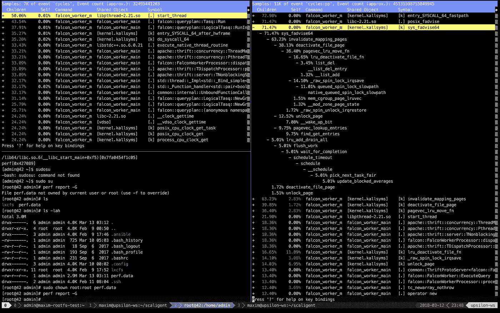
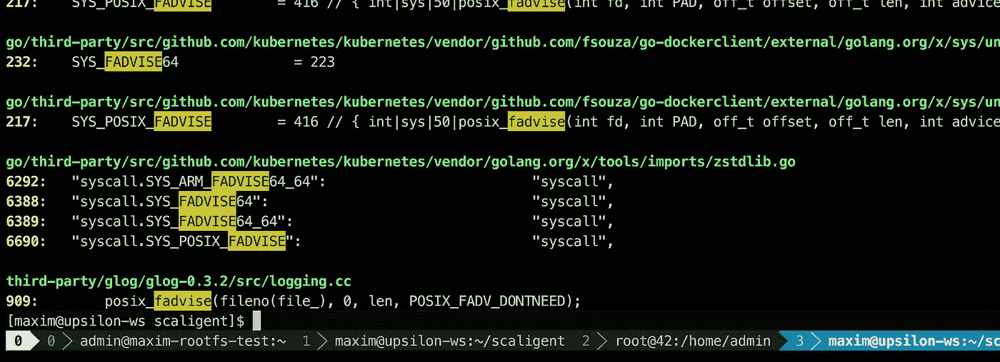
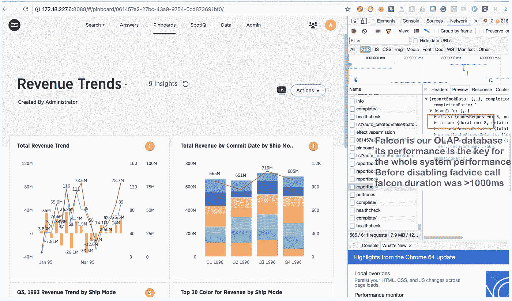

# 码头集装箱速度慢的另一个原因

> 原文：<https://medium.com/hackernoon/another-reason-why-your-docker-containers-may-be-slow-d37207dec27f>

在我上一篇[博客文章](https://hackernoon.com/kubernetes-for-dev-infrastructure-40b9175cb8c0)中，我谈到了 Kubernetes 以及 [ThoughtSpot](https://thoughtspot.com) 如何使用它来满足其开发基础设施的需求。今天，我想接着讲一个最近发生的很短但很有趣的调试故事。它重申了集装箱化**的事实！=** 虚拟化展示了即使所有的 cgroup 限制都设置为合理的值，容器化的进程如何竞争资源，并且主机上有足够的计算能力。


因此，我们使用我们内部的 Kubernetes 集群[来运行一系列 CI/CD 和开发相关的工作流](https://hackernoon.com/kubernetes-for-dev-infrastructure-40b9175cb8c0)，一切进展顺利，除了一件事:当发布我们产品的 Dockerized 副本时，我们看到的性能比我们预期的要差得多。我们的每个容器都有大量的 CPU 和内存限制，通过 Pod 配置设置了 5 个 CPU / 30 Gb RAM。在一个虚拟机上，这对于我们微小的(10 Kb)测试数据集上的所有查询来说已经足够了。在 Docker & Kubernetes 上，在事情变得太慢之前，我们只能在 72 CPU / 512 Gb RAM 的机器上发布一个产品的 3-4 个副本。过去在几毫秒内完成的查询现在需要一两秒钟，这导致了我们的 CI 管道中的各种故障。所以，我们开始调试。

当然，通常的怀疑是我们在 Docker 中打包产品时可能犯的配置错误。然而，与虚拟机或裸机安装相比，我们找不到任何可能导致速度变慢的东西。一切看起来都很正常。下一步，我们从一个 [Sysbench](https://github.com/akopytov/sysbench) 包中运行了各种测试。我们已经测试了 CPU、磁盘、RAM 性能，看起来与裸机没有任何不同。我们产品中的一些服务保存了所有活动的详细跟踪，稍后可以用于性能分析。通常，如果我们在一种资源(CPU、RAM、磁盘、网络)上处于饥饿状态，一些调用的时间会有明显的偏差，这就是我们如何确定速度慢的原因。然而，在这种情况下，没有任何问题。所有的计时比例都与健康配置中的相同，除了每一次呼叫都比裸机上的呼叫慢得多。没有任何东西给我们指出实际问题的方向，我们准备放弃，但后来我们发现了这个:【https://sysdig.com/blog/container-isolation-gone-wrong/[。](https://sysdig.com/blog/container-isolation-gone-wrong/)

在本文中，作者分析了一个类似的神秘案例，其中两个假定为轻量级的进程在同一台机器上的 Docker 中运行时互相残杀，尽管资源限制被设置为非常保守的值。我们的两个主要收获是:

1.  他的问题的根本原因最终是在 Linux 内核中。由于内核 dentry 缓存的设计，一个进程的行为使得`__d_lookup_loop`内核调用明显变慢，这直接影响了另一个进程的性能。
2.  作者使用了`perf`来追踪一个内核 bug——一个漂亮的调试工具，我们以前从未使用过(真可惜！).

> perf(有时称为 perf_events 或 perf tools，最初是用于 Linux 的性能计数器，PCL)是 Linux 中的一个性能分析工具，可从 Linux 内核版本 2.6.31 获得。名为 perf 的用户空间控制实用程序可以从命令行访问，它提供了许多子命令；它能够对整个系统(内核和用户代码)进行统计分析。
> 
> 它支持硬件性能计数器、跟踪点、软件性能计数器(例如 hrtimer)和动态探测器(例如 kprobes 或 uprobes)。2012 年，两位 IBM 工程师认为 perf(连同 OProfile)是 Linux 上最常用的两种性能计数器分析工具之一

所以，我们想:为什么在我们的案例中不能是类似的东西呢？我们在容器中运行数百个不同的进程，它们都共享同一个内核。肯定有瓶颈！双手握着`perf`的武器，我们继续调试，这让我们有了一些有趣的发现。

下面是 ThoughtSpot 在健康(快速)机器上(左侧)和容器内(右侧)运行的几十秒钟的性能记录。



我们可以立即注意到，右侧的前 5 个调用与内核相关，大部分时间花在内核空间，而在左侧，大部分时间是由我们自己在用户空间运行的进程花费的。更有趣的是，一直占用时间的呼叫是一个`posix_fadvise`。

> 程序可以使用 posix_fadvise()来宣布将来以特定模式访问
> 文件数据的意图，从而允许
> 内核执行适当的优化。

它可以在各种情况下使用，所以它不会直接暗示问题可能来自哪里。然而，在搜索了我们的代码库之后，我只找到了一个地方，它有可能被系统中的每个进程击中:



它在名为`glog`的第三方日志库中。我们在整个项目中都使用它，这一行在`LogFileObject::Write`中——可能是整个库中最关键的路径。每个“日志到文件”事件都会调用它，我们产品的多个实例可能会非常频繁地记录日志。快速浏览一下源代码，可以发现通过设置一个`--drop_log_memory=false`标志可以禁用`fadvise`部分:

```
if (FLAGS_drop_log_memory) {
 if (file_length_ >= logging::kPageSize) {
   // don’t evict the most recent page
   uint32 len = file_length_ & ~(logging::kPageSize — 1);
   posix_fadvise(fileno(file_), 0, len, POSIX_FADV_DONTNEED);
 }
}
```

我们立即尝试了一下，然后…答对了！



以前需要几秒钟的时间现在只需要 8 秒钟。)毫秒。稍微搜索了一下就把我们带到了[https://issues.apache.org/jira/browse/MESOS-920](https://issues.apache.org/jira/browse/MESOS-920)和[https://github.com/google/glog/pull/145](https://github.com/google/glog/pull/145)，这进一步证实了这确实是缓慢的根本原因。最有可能的是，它甚至在虚拟机或裸机上影响了我们，但是因为我们在每个机器/内核上只有每个进程的一个副本，所以它们调用`fadvise`的速度要慢几倍，因此不会增加大量开销。将日志进程的数量增加 3 到 4 倍，同时让它们共享同一个内核——这就是导致`fadvise`成为真正瓶颈的原因。

## 结论

虽然这绝对不是一个新发现，但大多数人仍然没有记住，在容器的情况下，“孤立”的进程不仅竞争 **CPU** 、 **RAM** 、**磁盘**和**网络**，还竞争各种**内核** **资源**。而且，由于内核极其复杂，低效率可能出现在最意想不到的地方(就像 Sysdig 的文章中的`__d_lookup_loop`)。这并不意味着容器比传统虚拟化更差或更好——就其目的而言，它是一个优秀的工具。我们应该始终意识到内核是共享资源，并准备好调试内核空间中的奇怪冲突。此外，这些碰撞是入侵者突破“*轻量级*”隔离并在容器之间创建各种隐蔽通道的绝佳机会。最后，`perf`是一个很棒的工具，它可以向您展示系统中正在发生的一切，并帮助您调试各种性能问题。如果你打算在 Docker 上运行高负载的应用程序，你绝对应该花时间学习`perf`。

## 链接

[开发基础设施的 Kubernetes](https://hackernoon.com/kubernetes-for-dev-infrastructure-40b9175cb8c0)

[我的工程之旅](https://hackernoon.com/my-engineering-journey-to-date-8250d69fd079)

[你懈怠的知识库](https://onebar.io)