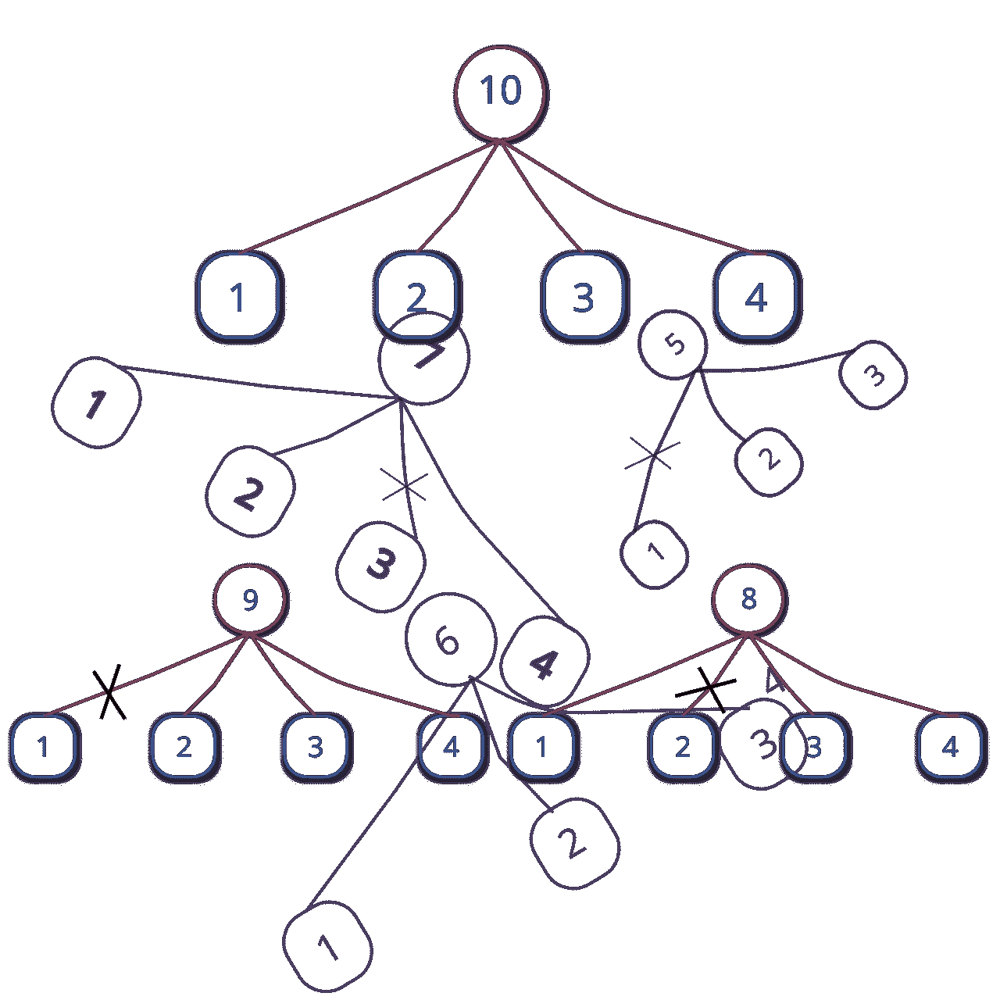
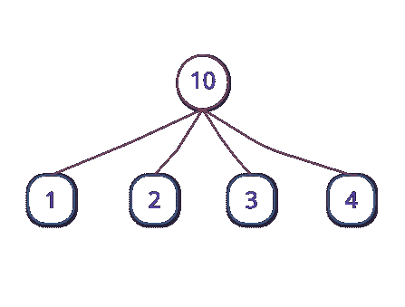
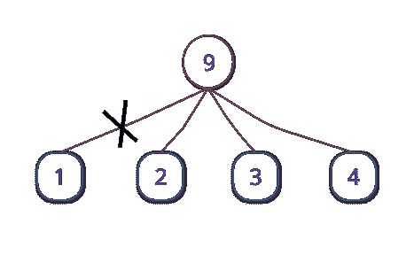
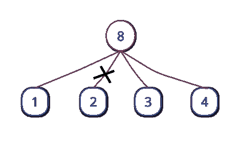
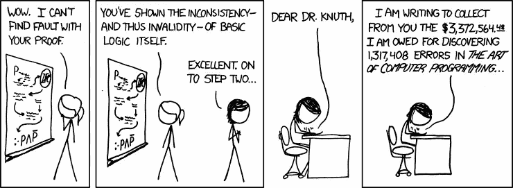

# 寻找最大分区的另一种方法

> 原文：<https://medium.com/hackernoon/another-way-to-find-max-partitions-36005590a2a5>



Numbers are always fun!

您正在组织一次黑客马拉松，并决定向获胜者提供免费云存储作为奖励。对于奖金基金，您有 1024 GB 的云空间。你可以给这些千兆字节，条件是在黑客马拉松中位置越高，空间越大。因为你想让尽可能多的参与者开心，你想找到最大数量的位置来颁发奖品。这意味着，如果您只有 8 GB 可用，您将总共有 3 个位置—冠军获得 5 GB，亚军获得 2 GB，第三名获得 1 GB(另一种变化是可能的— 4、3 和 1gb，但 8 GB 的位置数仍然是 3)。

那么如何解决这个问题呢？注意(如上例所示)，对于给定数量的位置，可能有多种分布(让我们称这个数字为 *p* )。事实上，这可以归结为用不同的较小数字的和来表示一个数字，这样就有尽可能多的这些数字。对于 8g，我们可以选择 *8 = 7 + 1* 或 *8 = 5 + 3* 的形式，但这并不是最佳形式，因为 8 可以表示为不仅仅是几个数字的总和——如 *8 = 5 + 2 + 1* 。一个可以为解决这个问题增加便利的数学概念是*分区——引用[维基百科](https://en.wikipedia.org/wiki/Partition_(number_theory))的*，一个正整数 *n* 的分区，也称为整数**分区，是将 *n* 写成正整数之和的一种方式。所以在我们的例子中，我们只想计算 512 的划分，它有尽可能多的数。为了方便讨论，我们称之为*最大分区*。**

在计算机科学中，这个问题属于某种类型的问题，其解决方案使用*贪婪算法—* 程序，在解决方案的每个阶段做出局部最优选择，希望找到全局最优。

解决我们例子的“贪婪”方法如下:从 1 开始作为第一个被加数不是很自然吗？剩下的就是将 7 表示为最大分区，并在其上加 1。但是现在将 7 表示为最大分区有一个约束——我们不能使用 1。所以我们使用 2，然后将 8 - (1+2) = 5 表示为最大分区。同样，我们不能用 1 和 2。我们也不能使用 3 或 4，因为那样我们会再次分别使用 2 和 1。因此，我们将 5 表示为它本身，这样就完成了——我们现在有了最大分区，即 *8 = 1 + 2 + 5* 。很容易看出，当我们最初想要弹出的数字(这里是 *3* )至少是剩余数字(这里是 *5* )的一半时，这个最终条件出现。我把那部分留给你去想。

因此，更正式地说，考虑我们最初有两个数字 *n= 8* 和 *l = 1* 。如果 *n ≤ 2l* ，我们简单地把 *n* 表示为它本身，否则我们跳出 *l* 然后解决把 *n - l* 表示为一个最大划分的子问题使得划分中的每个数都是*至少 l+1。*这个子问题的 *l* 的值比原问题的值大 1。所以对于我们的例子( *n* ， *l* )表示 8 为最大划分，我们先弹出 1，然后求解子问题( *n-l* ， *l+1* )，即( *7* ， *2* )。对于这个子问题，我们跳出 2 然后求解子问题(7 *-2* ， *2+1* )，也就是( *5* ， *3* )。现在，由于 *5 ≤ 2x3* ，我们只要弹出 *5* 就大功告成了。我们现在只是将弹出的数字相加得到 *8 = 1 + 2 + 5* 。

既然我们现在已经更正式地阐明了策略，就很容易想出一个工作程序来解决我们的问题。下面是 Python 3 中的一个简单实现:

```
def max_partition(n, l=1):
    partition = []
    while n > 2*l:
        partition.append(l)
        n = n - l
        l += 1
    partition.append(n)
    return partitionprint(max_partition(int(input())))
```

但是等等——我有另一种方法。也许更好。我注意到可以表示为第一个 *n 个*自然数之和的数字是特殊的。他们炫耀身份的时候不是已经*max-partition 形态*了吗？！比如 *6* 写成 *6 = 1 + 2 + 3* 的时候不是已经是 max-partition 形式了吗？ *10* 写成 *10 = 1 + 2 + 3 + 4* 的时候不是已经是 max-partition 形式了吗？为了这个对话，我们称这样的号码为“高级号码”。这种见解构成了我的算法的基础。

我们是这样进行的:如果我们必须找到其最大划分的数 *n* 已经是一个高级数，我们简单地用它的 *n = 1 + 2 + 3 + … + k* 形式来表示它。如果它不是一个高级数，我们仍然可以找到一个 *k* ，它足够大，足以使总和 *s =* *1 + 2 + 3 + … + k* 大于 *n* (足够大，我的意思是 *k* 可以使 *1+ 2 + 3 + … + k* 大于 *n* ，但不能对 *1 + 2 + 3 +做同样的事情由于 *k* 刚好大到 *s* 大于 *n* ， *s-n* 将小于 *k* 。所以 *s-n* 将会是 *1* 、 *2* 、 *3* 、…、 *k-1* 中的一个数字。如果我们从第一个 *k* 自然数的和中“抽出” *s-n* 会怎么样？这将给我们 *s-(s-n)* ，也就是 *n* ！*

*顺便说一下，上一段的最后一个字符不是阶乘的*🙂。让我们想象一下目前为止我们所学的观点。通常， [Ferrers 图](http://mathworld.wolfram.com/FerrersDiagram.html)用于可视化分区，但对于我们的目的，我发现我的自定义可视化更方便:在下面的树中，顶部节点是我们希望评估其最大分区的数字。树叶是最大划分表示中的数字，当然，这些数字相加得出顶部节点上的数字。对于一个高级号码来说，一切都很好:



对于不是高级的号码，我们剪切适当的分支，以便不添加通过该分支连接到顶部节点的叶子上的号码。考虑 9:



下面是 8 的树。请注意，我们只是在寻找数字*k。*对于 8 和 9，它是 4。由于前 4 个自然数的和是 10，我们首先画出 10 的树，然后用我们想要的数字替换顶部节点中的 10——这里是 8。然后我们切断连接顶部节点和数字 10–8 = 2 的分支。对于 9，这个数字是 10 - 9 = 1。



那么最大划分就是剩余叶子的总和。我希望你现在明白我的算法了。

一个有待发现的微妙之处是找出“刚好足够大的 T2”的方法。但这是一个非常简单的计算。前 *k 个*自然数之和为 *n = k * (k+1) / 2* 。对一个正的 *k* 解完这个方程，我们得到*k =(√( 1+8 * n)-1)/2*。因为如果 *n* 不是一个高级数，那么 *k* 将是一个小数，所以我们取它的上限。这使得 k 足够大。

我想现在我已经清楚地表达了这个算法。因此，我们可以对解决方案进行编程。这是 Python 3 中另一个简单的实现:

```
import mathdef optimal_summands(n):
    k = ((1 + 8*n)**0.5 - 1) / 2
    k = math.ceil(k)
    summands = list(range(1, k+1))
    the_sum = int(k * (k+1) / 2)
    if the_sum - n > 0:  # If n is not senior.
        del summands[the_sum-n-1]
    return summandsprint(optimum_summands(int(input())))
```

如果我们对这两种算法进行分析，我们会发现它们都运行在*线性时间内，*即 *O(n)* 。然而， *O(n)* 中隐藏的隐形常数，对于 *optimal_summands()* 来说，可能比 *max_partition()* 要少得多。

我用 Python 做了一些简单的检查，看看哪种方法更快，结果是后一种方法的执行速度是前一种方法的三倍。我使用 Python 的`timeit`模块对两种算法进行计时，下面是我在 Python 解释器上进行的一次检查的实例:

```
>>> from timeit import timeit
>>>
>>> timeit(setup='from different_summands import optimal_summands', stmt='optimal_summands(10000)', number=100000)
0.8999944160023006
>>>
>>> timeit(setup='from greedy_different_summands import max_partition', stmt='max_partition(10000)', number=100000)
3.161972836998757
>>>
```

我经常观察到，了解一些数学事实可以让一个人开发出更好的算法，或者至少更快更直观地开发出一个算法。数学洞察力通常可以极大地提高程序的运行时间。数学和计算机科学——尤其是算法研究，是很好的朋友！



Image source: xkcd

如果你知道其他一些让后一个程序运行更快的因素，请在评论中告诉我。最后，也许贪婪并不总是好的，但数学是好的。😀

顺便说一下，您可以将这 1024 拆分为:

*1024 = 1+2+3+4+5+6+7+8+9+10+12+13+14+15+16+17+18+19+20+21+22+23+24+25+26+27+28+29+30+31+32+33+34+35+36+37+38+39+40+41+42+43+43*

(注意到缺号了吗？提示:是前 45 个自然数的*之和- 1024。)*

当然，你的黑客马拉松必须有超过 45 名参与者！🙂

页（page 的缩写）s:我应该为此写一篇 ArXiv 论文吗？