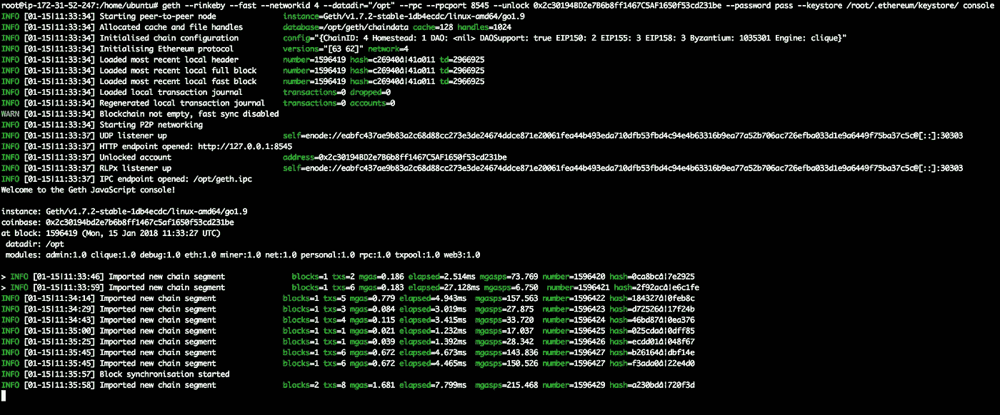
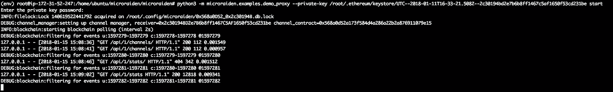
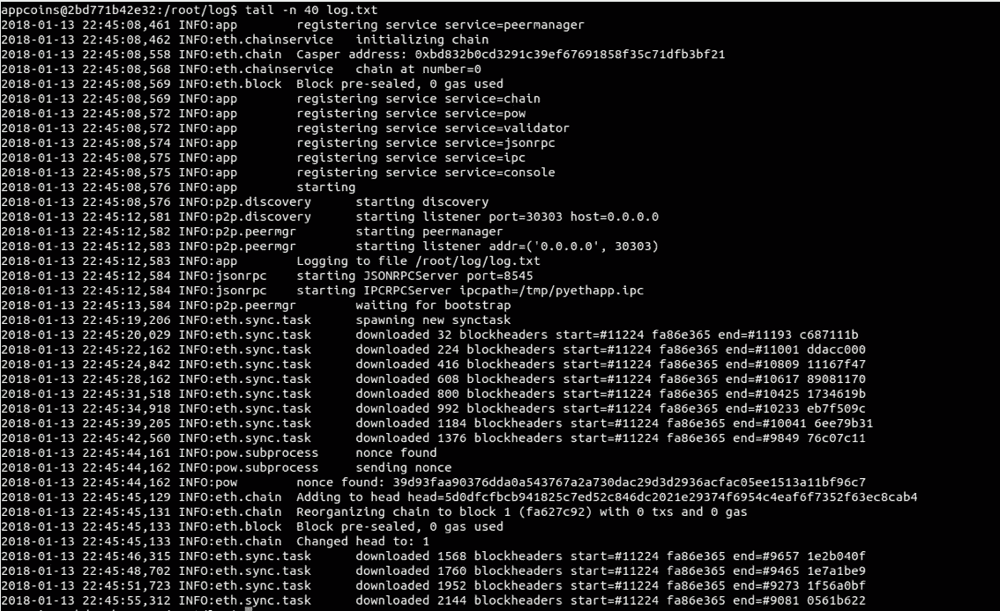
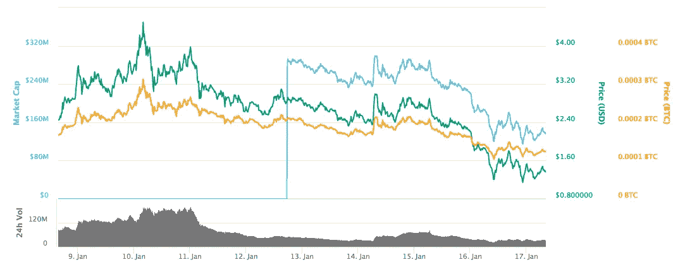
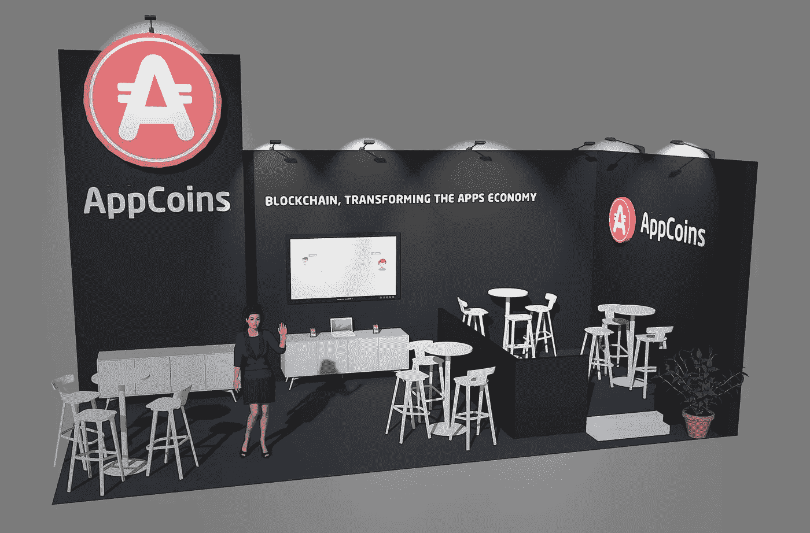
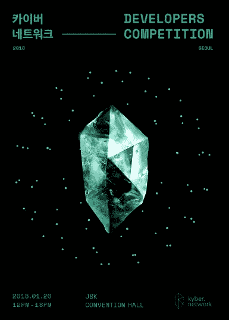

# ANU # 1——第一个 AppCoins 新闻更新

> 原文：<https://medium.com/hackernoon/anu-1-the-first-appcoins-news-update-2dde0f9b6f18>

这是第一次 **AppCoins 新闻更新**，简称 **ANU #1** 。这将是 AppCoins 团队每两周一次的定期更新。这意味着你可能会在 1 月 31 日期待下一次更新。每个 ANU 将由四个部分组成:T4 发展更新、APPC 市场报告、特色团队成员和即将到来的事件。

**快速链接** [Dev 更新](#ecee)
[APPC 市场报道](#d6f8)
[特色团队成员](#3352)
[即将举办的活动](#9638)

过去两周，我们一直在研究和进一步测试我们认为与 [**AppCoins 协议**](https://appcoins.io) 相关的工具和功能。我们一直在测试的工具是 [**Microraiden**](https://raiden.network/micro.html) 和 [**卡斯珀·FFG**](https://github.com/ethereum/wiki/wiki/Proof-of-Stake-FAQ)。

## 集成微 raiden

Microraiden 是 [Raiden 网络](https://raiden.network)的简化版本，可用于在预定的对等体之间执行**链外交易**(多对一方法)。虽然它不支持多跳转移和双向支付通道，但它的功能仍然可能与 AppCoins 协议相关。

我们开始测试 Microraiden 功能的方法有两种:

1.  用 Java 实现客户端
2.  测试服务器端功能

关于第一种方法，由于 AppCoins 协议将由应用程序商店集成并在移动应用程序中使用，因此 Java 实现使我们能够使用 Android 前端应用程序测试 Microraiden 离线交易。这是特别相关的，因为 [**Aptoide**](https://www.aptoide.com) 将在其 Android 应用程序中展示 AppCoins 协议。如果您想查看我们在网络峰会期间发布的概念验证，请点击此[链接](https://www.youtube.com/watch?v=UhBm4PerhpQ)。

至于第二种方法，深入理解 Microraiden 的核心功能是了解其技术真正潜力的关键，也是了解它是否真的可以用于 AppCoins 协议以及如何使用的关键。AppCoins 协议将需要定义**资源**(参考 [Microraiden 的 GitHub](https://github.com/raiden-network/microraiden/blob/master/docs/proxy-tutorial.md) )，这些资源将被兑换成 APPC 令牌，因为链外交易将被用于该协议的所有用例:应用内购买、移动广告和开发者/应用声誉。

我们已经同步了 Rinkeby 测试网络中的区块链，并为该测试网络运行了 Microraiden 示例。

Rinkeby testnet synced

Microraiden demo proxy example running

## 测试卡斯珀·FFG

Casper 项目尤其重要，因为它与[分片](https://github.com/ethereum/wiki/wiki/Sharding-FAQ)(更简单的解释可以在这里找到)直接相关，这将使以太坊能够扩展其 TPS，成为加密领域的一个更好的解决方案。卡斯帕·FFG 是目前正在开发的两个平行工作流[之一，目的是促进以太坊从](/@jonchoi/ethereum-casper-101-7a851a4f1eb0) [PoW](https://github.com/ethereum/wiki/wiki/Mining) 向 [PoS](/@VitalikButerin/a-proof-of-stake-design-philosophy-506585978d51) 区块链的过渡。

由于 AppCoins 协议是依靠 ERC20 令牌完成的，因此对以太坊协议的任何更改和更新都会对我们的协议所能实现的目标产生非常重要的影响。因此，了解 Casper FFG 的现状及其功能可以帮助我们为不久的将来可能出现的情况做好准备。

此外，AppCoins 团队还希望为以太坊网络做出贡献，在这种情况下，通过帮助测试卡斯珀 FFG 的当前实现，因为 AppCoins 希望成为社区中的一名积极参与者。

为此，我们决定在我们的基础设施中设置一个 Casper FFG 节点，使用 docker 映像在装有 Ubuntu 16.04 的 AWS 机器上运行，此处[提供](https://github.com/karlfloersch/docker-pyeth-dev)。在下面的屏幕截图中，可以看到节点正在运行。

Casper FFG node logs

卡斯珀 FFG 也可以运行在一个测试网，而不是连接到主网。我们可能会在为上述三个用例开发和测试 AppCoins 协议时尝试它。

Market Cap and 24h Volume (Jan 8–17 2018). Source: [CoinMarketCap](https://coinmarketcap.com/currencies/appcoins/).

AppCoins 是一个基于区块链的协议，但它也是一个目前在两家交易所交易的令牌:[币安](https://www.binance.com/trade.html?symbol=APPC_BTC)和[火币](https://www.huobi.pro/appc_btc/exchange/)。在最初的几周内，APPC 代币的交易量相当可观，于 2018 年 1 月 11 日(世界协调时 00:14:19)达到 201，140，000 美元的峰值。

由于 ICO(于[12 月](/@appcoins/appcoins-ico-hard-cap-has-been-reached-2b98dee388dd)结束)，最大供应量为 246，203，093 APPC。然而，其中只有 100，054，312 APPC 在流通。

这是因为这个钱包上的令牌目前出于多种目的而被锁定。其中包括团队(锁定 12 个月，顾问令牌已经分发)、Aptoide(锁定 6 个月)、AppCoins Foundation(锁定 12 个月)和 Bootstrap(锁定 6 个月)。

你可以在 [CoinMarketCap](https://coinmarketcap.com/currencies/appcoins/) (CMC)上看到当前的流通供应量、最大供应量和市值信息。我们一直在与 CMC 团队沟通，以便在新的交易宣布后，及时更新信息。

在我们的[电报频道](https://t.me/joinchat/G337zg6z0ACm6QTvUU9_Yw)中，或者通过私信，您可以使用以下 [@AppCoinBot](https://telegram.me/AppCoinBot) 命令:

**/price**
*从 Coinmarketcap API 返回当前的 APPC 美元价格。*

**/coinmarketcapAPPC**
*从 Coinmarketcap API 返回当前的 APPC 市值。*

**/交易所**
*返回 APPC 目前上市的交易所。*

## 世界移动通信大会上的展位

[世界移动通信大会(MWC)](https://www.mobileworldcongress.com/) 是 2 月 26 日**至 3 月 1 日期间在巴塞罗纳举行的最大的移动行业盛会。AppCoins 将设立一个展台，以此提高业内对该项目的认识。主要目标是确保与其他应用商店和原始设备制造商的合作关系。**

****

## **出席 Kyber Network —首尔开发者竞赛**

****

**此外，您还可以见到 Aptoide 的亚太区副总裁、[、 Tiago C. Alves 、T5，他们将于 1 月 20 日在首尔🇰🇷的 JBK 会议大厅举办的由](https://www.linkedin.com/in/tiagoalves/) [Kyber Network](https://kyber.network/) (如您所知，这是我们的合作伙伴之一)组织的活动上展示 AppCoins。如果你在城里，不要错过这个了解 APPC 更多的机会。更多信息请访问他们的[活动页面](http://www.pagebrick.com/kyber/competition/)(韩语网站)。**

****

****姓名:** [*迪奥戈·皮雷斯*](https://www.linkedin.com/in/diogopires/)
**角色:** *开发团队负责人*
**简历:** *机器人和在大规模后端系统中部署可扩展解决方案的专家。迪奥戈·皮雷斯喜欢解决现实生活中的问题。特别是涉及区块链技术、人工智能和大数据的难以解决的问题。他是 AppCoins 协议定义文档的合著者之一，目前正领导开发团队努力实现该协议。***

**

Telegram 24/7 Support** **

Official AppCoins Subreddit** **

AppCoins GitHub**