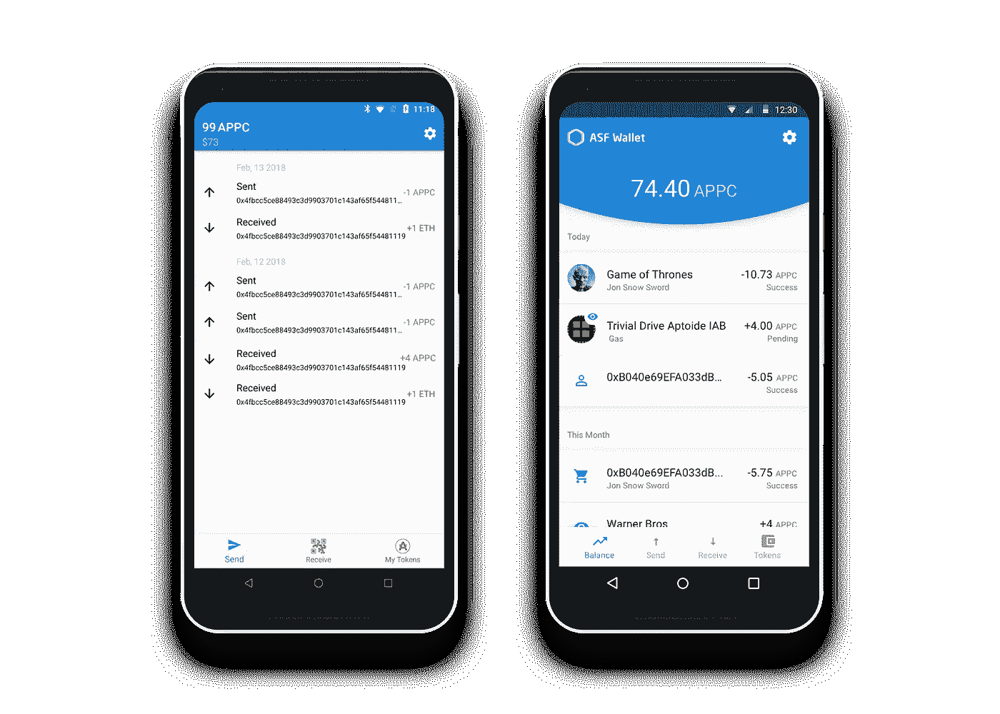
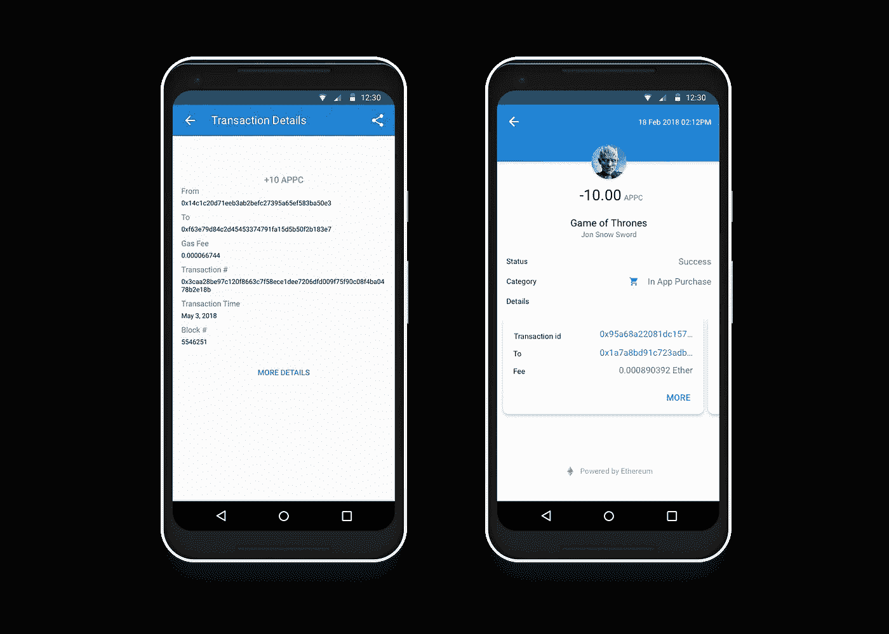
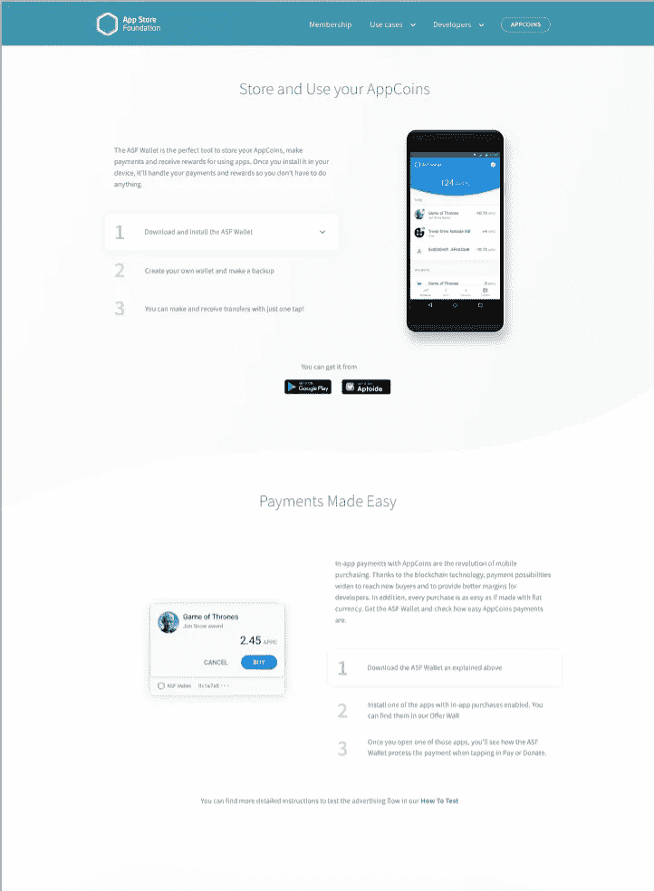
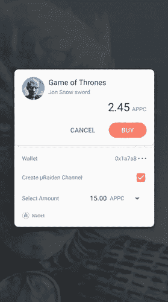
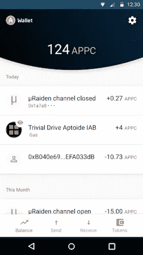
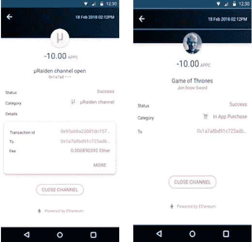
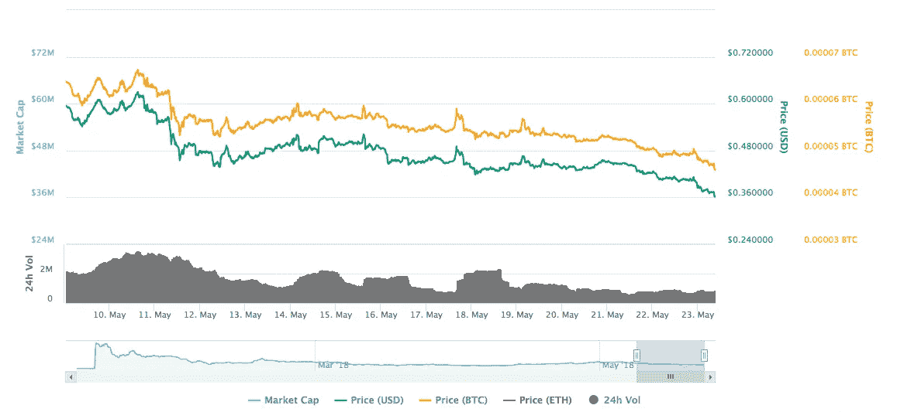
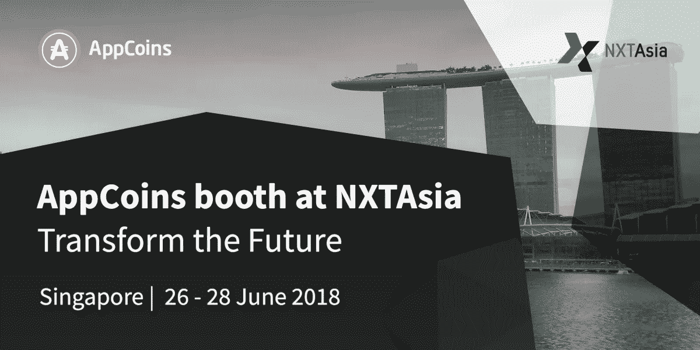

# ANU #10 — ASF 钱包、地址代理和可扩展性概念验证

> 原文：<https://medium.com/hackernoon/anu-10-asf-wallet-addressproxy-and-scalability-proof-of-concept-53f105f9085>

AppCoins 新闻更新，简称 **ANU** ，是 AppCoins 团队每两周一次的定期更新。像往常一样，我们将涵盖开发更新，市场报告，团队成员和即将举行的活动。**本周的焦点**是 **ASF Wallet、AddressProxy、“阅读更多”页面**和**可扩展性概念验证(SPoC)。你可能会在 6 月 6 日看到下一届 ANU。**

**快速链接** [Dev 更新](#4095)
[APPC 市场报道](#9106)
[特色团队成员](#a321)
[即将举办的活动](#163f)

在过去的几周里，我们一直在解决一些问题，改进 [**ASF Wallet**](https://play.google.com/store/apps/details?id=com.asfoundation.wallet) 的部分 UX，并为未来开发重要组件。

我们也一直在为 Gosling 之后的下一个主要版本做准备:Knuth 版本。这是一个非常重要的版本，因为它将处理**交易可伸缩性**的主题，包括**交易时间**以及**交易费用**。解决这两个问题对于主流采用 [**AppCoins 协议**](https://appstorefoundation.org) 作为**应用内购买(IAP)** 和**移动广告**的*事实上的*标准至关重要。

# ASF 钱包

在过去的两周内，我们继续**改进 ASF 钱包的 UX** ，涉及**交易列表屏幕**，以及**个人交易视图**。在 [**ANU #9**](/@appcoins/anu-9-iap-flow-advertising-and-smart-contract-development-d08749fb6526) 中，我们已经展示了钱包当时的状态以及我们想要达到的目标。

我们已经完成了大部分新布局和相应逻辑的实现，以便在不弄乱视图的情况下向**显示更多关于事务**的信息。用户还可以清楚地**区分不同的交易类型** : IAP、广告归属(通过提交各自的 PoA)以及 ETH 和 ERC20 令牌的正常发送/接收交易。

下面显示了 ASF Wallet 的第一版与其当前交易视图(列表和个人)开发状态之间的**差异**。

(Left) Current status of the Transactions screen; (Right) Transactions screen after redesign

(Left) Current status of the individual transaction screen; (Right) Individual transaction screen after redesign

我们还在我们创建的 Airdrop 流中引入了一个新组件，使用户能够试验该协议。空投包括给 APPC 和瑞士联邦理工学院，给一套限制概述了在[空投职位](/@appcoins/try-out-the-appcoins-flows-with-our-airdrop-7ce7f4b968f8)。现在用户需要**回答验证码挑战**才能获得 APPC 和 ETH。这有助于避免恶意用户将 Airdrop 资金用于个人用途。

# 地址代理

在 ANU #9 中，我们还提出了我们的观点，即我们应该如何继续开发项目的区块链组件(即智能合同)以及其他产品(钱包、SDK 和网页)。我们明白，我们需要**将智能合约开发** **与产品开发**分离开来，也就是说，智能合约的部署不应该自动要求更改所有甚至一个其他产品。

因此，我们开发了一个智能契约，作为其他人的地址的**地址代理。所有产品都连接到该智能合约，并获得它们想要调用的智能合约的地址，当我们部署该智能合约的新版本时，该地址会在 **AddressProxy** 中发生变化。读者可以在这里看到 [**的代码**](https://github.com/AppStoreFoundation/asf-contracts/blob/master/deploy/contracts/AddressProxy.sol) 。**

我们还在研究**存储合同**，该合同用于**将智能合同存储从智能合同开发**中分离出来。这意味着我们希望能够在部署给定智能合约的新版本时保持数据可用，而不是丢失所有数据或每次都必须迁移数据。正如我们在上一期《ANU》中所陈述的，人们可以把这个概念看作是一个**。**

# **“阅读更多”页面**

**AppCoins 协议**正在颠覆移动应用经济**，这个挑战伴随着一个**教育问题**。普通终端用户不熟悉加密货币或区块链技术，也不熟悉它们的应用。此外，即使普通终端用户习惯于交易和使用加密货币，我们也需要让他了解我们的流程和 AppCoins 协议的附加值。此外，我们正在构建几个与项目的区块链部分交互的产品，这些产品也需要解释。**

**因此，我们正在开发一个网页，作为每个人了解这个项目及其附加值的**入口。然后，该页面会将读者引导至其他网页，这些网页对特定主题有更详细的描述。****

**下图显示了“阅读更多”页面的外观。**

****

**Read More page layout**

# **可扩展性概念验证(SPoC)**

**正如在开发更新的介绍中所说，我们正在开发 Knuth 版本。它将聚焦于**可伸缩性问题**，这是许多基于以太坊网络或其他区块链构建的其他项目所共有的。**

**通过我们的 SPoC，我们将提供一个**工作原型**来展示**可扩展的应用内购买**。用户将能够使用 APPC 支付应用内商品，而无需等待交易完成太长时间，**也无需支付高昂的交易费用。我们将尝试使用 [**Microraiden**](https://raiden.network/micro.html) ，因为它是集成到 AppCoins 协议中的可伸缩性解决方案的一个很好的候选。****

**微雷登是 [**雷电网络**](https://raiden.network) 项目的一部分。与旨在互联节点之间拥有**双向支付通道的 Raiden**相反，Microraiden 由**单向支付通道组成，没有节点网络**。打开和关闭支付通道是链上交易，这意味着它们将需要费用。然而，Microraiden 的优势在于**在支付渠道内完成的所有交易都是无费用的链外交易**。因此，一个人可以在一段时间内与其他人开通一个通道并进行微交易，而不必担心交易延迟或费用，一旦互动不再有利或当接收者需要使用通道内收到的资金时，就关闭该通道。需要注意的是，接收者不能立即使用链外事务中发送的 APPC，只能在通道关闭时使用。**

**在 SPoC 中，用户将能够下载一个集成了我们 SDK 的特殊版本的应用程序。当试图购买应用内商品时，用户将被提示使用 Microraiden 和我们的钱包的特殊版本。以下是 SPoC 用户界面的模型。**

****

**IAP dialog with the ability to open a Microraiden payment channel**

****

**Transaction List screen of SPoC version of the wallet**

****

**(Left) **Open Payment Channel** transaction view in the SPoC version of the wallet; (Right) **In-App Purchase** transaction view in the SPoC version of the wallet**

**一如既往，我们邀请您关注我们正在开发的所有产品:**

*   **[**ASF SDK**](https://github.com/AppStoreFoundation/asf-sdk)**
*   **[**ASF 钱包**](https://github.com/AppStoreFoundation/asf-wallet-android)**
*   **[**ASF 智能合约**](https://github.com/AppStoreFoundation/asf-contracts)**

****

**目前市值接近 3567 万美元，在过去 24 小时内，这些交易所的交易量为 93.472 万美元:币安(81.37%)和火币(18.63%)。**

****

**AppCoins 的价值继续与比特币捆绑在一起。BTC 和 AppCoins 最近都经历了货币贬值。自上次 ANU 以来，AppCoins 的价格波动很大，5 月 10 日达到 0.630 美元的高点，5 月 22 日达到 0.382 美元的低点。你可以在 Coinmarketcap 查看更多关于 APPC 市场的信息。**

****

****姓名:** [古斯塔沃·席尔瓦](https://www.linkedin.com/in/gustavorssilva/)
**角色:** *区块链开发者*
**简历:**古斯塔沃·席尔瓦(Gustavo Silva)是一名区块链全栈开发者，拥有电子商务经验。作为 AppCoins 开发人员，他参与设计和开发支持该项目的应用程序。他的工作让 AppCoins 成为一个可靠且用户友好的项目。**

********

**AppCoins 将参加另一个令人难以置信的技术相关活动！**

**[**nxta sia**](https://www.nxtasiaexpo.com/),**数字企业解决方案和技术**中最大的活动之一将于 6 月举行，它将展示令人印象深刻的**初创公司和公司**，这些公司将**展示不同领域的创新**，包括人工智能、AR / VR、区块链、金融科技、数字支付、机器人等等！**

**你可以找到位于商业大道的 AppCoins 摊位。 如果您想了解我们项目的更多信息，只需**参观我们的展位，与亚洲副总裁 Tiago Alves 交谈。****

****NXTAsia** 将于 2018 年 6 月 26 日至 28 日在新加坡滨海湾金沙举行。**

****

**错过了我们以前的出版物吗？不要担心！你可以在这里阅读:**

**[使用我们的 Airdrop 试用 AppCoins 流！](/@appcoins/try-out-the-appcoins-flows-with-our-airdrop-7ce7f4b968f8)**

**[ANU #9 — IAP 流程、广告和智能合同开发](/@appcoins/anu-9-iap-flow-advertising-and-smart-contract-development-d08749fb6526)**

**[“小鹅”发布新广告和 IAP 流量](/@appcoins/gosling-release-with-new-advertising-and-iap-flows-6365f080b28e)**