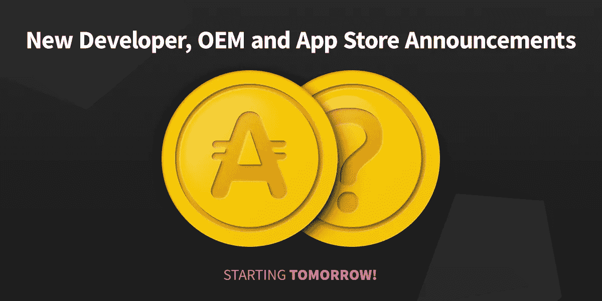

# ANU #11 —雷电集成、网页和即将发布的公告

> 原文：<https://medium.com/hackernoon/anu-11-%C2%B5raiden-integration-web-page-and-upcoming-announcements-c46945f1650a>

AppCoins 新闻更新，简称 **ANU** ，是 AppCoins 团队每两周一次的定期更新。像往常一样，我们将涵盖开发更新，市场报告，团队成员和即将举行的活动。**本周的焦点**是关于应用内购买(IAP)流程的**PoC**使用 [**Raiden**](https://raiden.network/micro.html) **，一个** [**新网页的披露者**](https://www.appstorefoundation.org/readmore) 对于 AppCoins 协议的不同用例的整合，AppCoins **特色成员**，以及**即将到来的新闻**。你可能会在 6 月 20 日看到下一个 ANU。

**快速链接** [Dev 更新](#4095)
[APPC 市场报道](#54d6)
[特色团队成员](#83e5)
[即将举办的活动](#dc0b)

本周的开发更新将基本上建立在 [**上一个 ANU**](https://hackernoon.com/anu-10-asf-wallet-addressproxy-and-scalability-proof-of-concept-53f105f9085) 的最后一点上，因为我们在**可扩展性概念验证(SPoC)** 上投入了大量精力，用于 **Knuth 版本**。

我们还将介绍**的开发，这是一个新的网页**，它将作为每个想了解更多关于 [**AppCoins 协议**](https://appcoins.io/pdf/appcoins_protocol_definition.pdf) 及其用例，以及产品( **Wallet 和 SDK** )的人的切入点。

# 可扩展性概念验证(SPoC)

正如我们在 ANU #10 中所说，我们正在努力使用 [**Raiden**](https://raiden.network/micro.html) 构建应用内购买(IAP)流程的 **PoC。Raiden 由单向支付通道技术组成，实现**即时交易，零手续费**。它将使 AppCoins 用户能够**使用加密货币和区块链的所有优势**执行无延迟交易**，而不必支付交易费用。****

雷电流模式如下:

*   一个以太坊账户与另一个以太坊账户开通支付通道。**支付通道为单向**，即**只有开通该通道的账户**(即发送方)**才能向对方地址**(即接收方)发送代币。
*   发送者用他选择的多个代币来补足支付通道。然后，发送者可以**执行免费交易，直到所选数量的令牌用完**。
*   当发送者想要执行交易时，他产生一个**余额证明**。这个证明被发送给接收者，确认其有效性。**如果余额证明有效**，则表示**交易成功**。然后，交易中涉及的**令牌被分配给接收者**。
*   只要拥有有效的余额证明，发送方和接收方都可以随时关闭开放的通道**。当一个通道关闭时，接收者获得分配给他的令牌，发送者取回他没有花费的令牌。**

应用于 AppCoins 协议的 IAP 流的上述模式将是:

*   用户正在使用集成了 AppCoins SDK 的应用程序。**一旦用户想要购买应用内物品**并点击它，**app coins 钱包被触发并显示支付对话框**。
*   支付对话框将显示是否有**开放的雷电支付通道**。如果已经有一个开放的频道，用户可以确认支付，这将通过使用频道中的 APPC 来完成。交易将是即时的、免费的。
*   如果还没有打开的频道，用户可以**打开一个**并**给它加满一定量的 APPC** 。然后，**支付已经使用支付通道完成。**
*   如果用户有开放的雷电支付通道，可以随时关闭 AppCoins 钱包中的**，将**未使用的 APPC 送回用户账户。****

下面是一些将包含在 AppCoins 钱包中的布局，它支持 SPoC。

IAP dialog of AppCoins Wallet with µRaiden integration

# “阅读更多”网页

我们开发了一个 [**新网页**](https://www.appstorefoundation.org/readmore) ，它整合了 AppCoins 协议的几个用例的开发状态，以及支持它们的产品。

开发者、用户、应用商店和任何感兴趣的人都可以看到如何使用 AppCoins 协议，钱包如何工作，如何测试和试验我们目前正在处理的两个用例:应用内购买(IAP)和移动广告。

从那里，**访问者被引导到特定于每个用例的其他网页**，并更深入地了解做了什么和如何做。请随意探索并给我们您的反馈。

一如既往，我们邀请您关注我们正在开发的所有产品:

*   [ASF SDK](https://github.com/AppStoreFoundation/asf-sdk)
*   [**ASF 钱包**](https://github.com/AppStoreFoundation/asf-wallet-android)
*   [**ASF 智能合约**](https://github.com/AppStoreFoundation/asf-contracts)

目前的市值接近 3159 万美元，在过去 24 小时内，这些交易所的交易量为 74.565 万美元:币安(72.57%)和火币(27.43%)。

AppCoins 继续主要与 BTC 挂钩，与其他加密货币一样，自上次 ANU 以来，其价值略有下降。过去两周，价格稳定在 0.34 美元附近，5 月 31 日达到 0.393 美元的高点，5 月 28 日达到 0.278 美元的低点。你可以在 [Coinmarketcap](https://coinmarketcap.com/currencies/appcoins/) 查看更多关于 APPC 市场的信息。

**姓名:** [若昂·雷蒙多](https://www.linkedin.com/in/joaoraimundo/)
**角色:** Android 开发人员
**简历:**若昂·雷蒙多作为一名 Android 开发人员工作了 7 年多，他热衷于开发能够提供面向设计和最佳用户体验的应用程序。他认为在开发应用程序时，性能必须是首要考虑的因素之一。目前，他正在开发 Appcoins 钱包和 SDK，以便用户和开发人员可以轻松地与 Appcoins 协议进行交互。

从明天开始，我们将**公布采用**App coins 协议的 10 家主要公司，包括战略**开发商、原始设备制造商和应用商店。**

在过去的几个月里， **AppCoins 团队**一直在为协议的战略合作伙伴的**收购而无休止地工作，以便**加快 AppCoins** 进入**生态系统**的速度。如前所述，焦点主要集中在**应用行业的三个关键参与者**上:开发者、应用商店和原始设备制造商。******

开发者是应用生态系统的关键角色之一。一旦他们采用该协议，将会对应用行业正在实施的**标准实践**进行几项改进**:**更好的转换率，更有效的应用货币化**，以及**增加收入在应用经济中流通的份额**，这些变化**将有利于开发者**。**

**根据当前的行业标准，收入分成的最大值为 77.5%，但一旦开发人员实施 **AppCoins 协议，他们将看到该值增加到 85%** 。除此之外，开发者将只需要实现**一个单一的 APK** ，它将与**几个应用商店**兼容，这些商店也采用了该协议。上面提到的所有优势，加上开发者正在使用**区块链技术**——这使得**过程更加高效和透明**，从而降低了**欺诈风险**——这一切对开发者都极为有利。**

**通过采用 AppCoins 协议，**原始设备制造商和应用商店都将获得利用其用户群的工具**。**所有希望通过应用内购买收入将其用户群**货币化的商店，以及所有分发集成 AppCoins 协议的预装应用商店的**设备制造商，都将被纳入**循环生态系统收入分成**。按照循环交易模式**，应用商店将获得 10%的收入份额，而应用商店内完成的所有交易的原始设备制造商将获得 5%的收入份额**并在智能合同中实施。此外，所有的**收入都是直接和即时从用户那里收到的**，因此减少了支付的中间人和中介。****

****

****如果你是开发者、应用商店或 OEM** 并且你想成为**采用该协议的先驱之一**，你可以点击 [**这里。完成表格后，AppCoins 团队的人员会与您联系，了解更多详情。**](https://docs.google.com/forms/d/e/1FAIpQLSdWLn5ahq3TgdlM7y1RESon_6HO05bsfxCsQ0f1Mp-evZsPUg/viewform)**

****

**Membership Form**

****

**错过了我们以前的出版物吗？不要担心！你可以在这里阅读:**

**[令牌分配和引导活动](/@appcoins/token-allocation-and-bootstrap-activities-4860884206ee)**

**[ANU #10 — ASF 钱包、地址代理和可扩展性概念验证](https://hackernoon.com/anu-10-asf-wallet-addressproxy-and-scalability-proof-of-concept-53f105f9085)**

**[使用我们的 Airdrop 体验 AppCoins 流！](/@appcoins/try-out-the-appcoins-flows-with-our-airdrop-7ce7f4b968f8)**