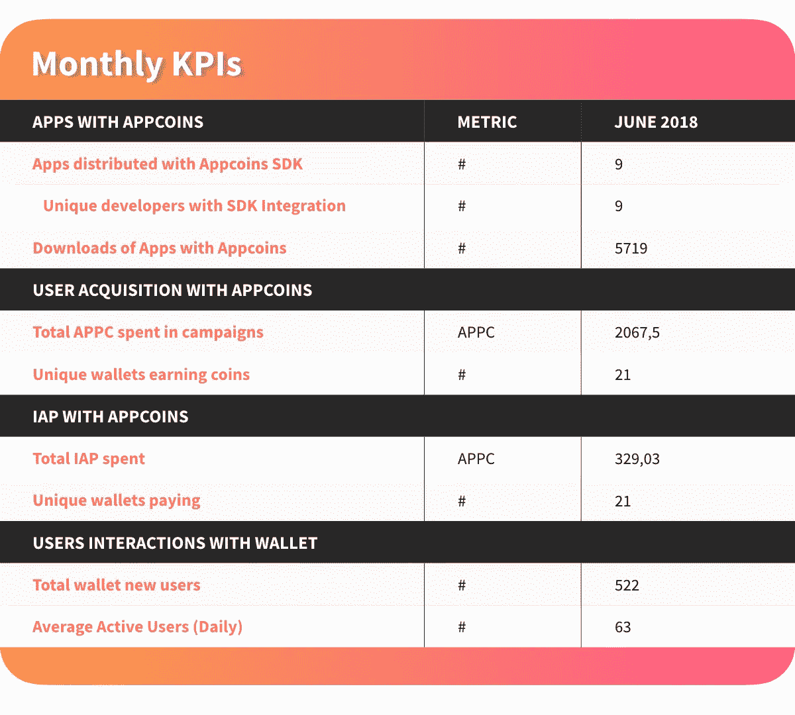

# ANU # 13——Unity 插件和 Gamescom

> 原文：<https://medium.com/hackernoon/anu-13-unity-plugin-and-gamescom-e3e9c470cbde>

AppCoins 新闻更新，简称 **ANU** ，是 AppCoins 团队每两周一次的定期更新。像往常一样，我们将涵盖开发更新，市场报告，团队成员和即将举行的活动。**本周的焦点**是 **Unity 插件**，它在 **Unity** **应用开发者**和**我们的 Android 原生 SDK** 之间建立了桥梁，这是一种新的表格格式，为 AppCoins 协议提供每月 KPI，也是世界上**最大的游戏赛事之一——games com**。

**快速链接** [Dev 更新](#4095)
[APPC 市场报道](#9106)
[特色团队成员](#6ae5)
[即将发生的事件](#163f)

两周前，我们发布了一个主要版本——Knuth 版本**——我们发布了一个概念验证，在那里我们使用 APPC 实现了**即时和无感觉的交易**，我们一直在努力为开发者推出一个 Unity 插件，以便更容易地集成 AppCoins 协议。**

****

**Unity 插件由 [**Unity**](https://unity3d.com) app 开发者和 [**我们的 Android 原生 SDK**](https://github.com/AppStoreFoundation/asf-sdk) 之间的桥梁组成，直接与协议交互。它的创建是为了**促进将 AppCoins 应用内计费和注意力证明广告整合到 Unity Android 游戏中**。Unity 是一款应用开发广泛的工具，在 Android 游戏行业的市场份额超过 50%。因此，为这些开发人员提供一种简单的方法来集成 AppCoins 协议并从中受益对我们来说非常重要。**

**我们一直在与开发人员和合作伙伴合作，以满足他们在功能和易于集成方面的需求。该插件使用从 Unity 到**的强大编辑器扩展机制，为开发人员提供流畅的集成体验，自动完成我们可以完成的每一步，**确保开发人员唯一要做的工作是改变应用程序的产品逻辑，以处理新的购买事件。**开发者只需使用我们的定制 Unity 窗口重新创建应用内产品，并在我们的定制构建 UI 中填写细节**。然后他们只需点击确认，插件就会做其他的事情。**没有外部工具，没有重复的步骤，没有 3 行终端命令，没有在复杂的设置上浪费时间**。开发人员填写空白，点击，等待，他们就完成了！**

**开发者可以在其 GitHub [**repo**](https://github.com/AppStoreFoundation/AppcoinsUnityPlugin) 中查看 Unity 插件代码和集成指南。**

**除此之外，我们还**发布了一个集成了我们的 Unity 插件**的 Unity 应用程序的例子，向开发者展示了将 APPC 集成到他们的应用程序中并从 AppCoins 协议中受益是多么容易。在征得开发者同意的情况下，我们开发了一款名为 RedRunner 的开源游戏，并对其进行了修改，使用 APPC 整合了应用内购买功能。它将很快在 Aptoide 中发布，因为现在你可以在 GitHub [repo](https://github.com/AppStoreFoundation/RedRunner) 中查看代码。**

**AppCoins 团队衷心感谢 [Super Crossbar Challenge](https://crossbarchallenge.pt.aptoide.com/?store_name=asf-store) 游戏的创作者 Pedro caba co 和 Lukmon，他们在这方面与我们密切合作，并在 AppCoins Unity 插件初始版本的开发中发挥了重要作用。**

**要了解更多信息，请访问我们的 Github 插件，如果您对插件的集成有任何问题，请通过 [Telegram](https://t.me/appcoinsofficial) 询问我们的支持团队。**

**一如既往，我们邀请您关注我们正在开发的所有产品:**

*   **[**ASF SDK**](https://github.com/AppStoreFoundation/asf-sdk)**
*   **[**ASF Unity 插件**](https://github.com/AppStoreFoundation/AppcoinsUnityPlugin)**
*   **[**ASF 钱包**](https://github.com/AppStoreFoundation/asf-wallet-android)**
*   **[**ASF 智能合约**](https://github.com/AppStoreFoundation/asf-contracts)**

**随着协议的开发和实施，我们还将在**每月与我们的社区分享**、**商业指标**，这些商业指标是为了衡量 AppCoins 项目的**表现而计算出来的。这些指标将显示使用 SDK 的应用数量、集成 SDK 的独立开发人员数量、与 ASF wallet 的交互数量，以及 AppCoins 集成、IAP 和广告流量的价值，在表格中作为用户获取提及。****

********

**在撰写本文时，目前的市值接近 2095 万美元，在过去 24 小时内，这些交易所的交易量超过 700 万美元:币安(87.77%)和火币(12.23%)。**

****

**过去两周，AppCoins 遭遇了货币贬值。自去年 ANU 以来，APPC 价值在 6 月 20 日见证了 0.225 美元的高点，在 6 月 24 日见证了 0.140 美元的低点。你可以在 Coinmarketcap 查看更多关于 APPC 市场的信息。**

****

****姓名:** [蒂亚戈·罗萨多](https://www.linkedin.com/in/tcrosado)
**角色:** *区块链开发者*
**简历:**蒂亚戈·罗萨多目前正在完成一篇关于区块链技术的硕士论文，作为一名区块链开发者，他正在进行 AppCoins 协议的研究。他负责以太坊智能合约的实现，并帮助制定协议的架构决策。**

********

**凭借强大的 B2C 和 B2B 部分，以及来自 40 多个不同国家的与会者，它与 E3 一样是世界上最大的游戏盛会！从企业倡导者到游戏爱好者，在 [Gamescom](http://www.gamescom.global/) 上，你将有机会见到对游戏世界有着同样热情的不同观众。**

**该活动展示了不同的区域，如**角色扮演村、娱乐区、家庭和朋友区、粉丝商店竞技场和商业区**，这些区域将作为品牌代表、**出版商和开发商会面和交流的场所。****

**对于任何与游戏有关的人来说，这绝对是 8 月份的好去处，从 8 月 21 日至 23 日，您可以在商务区找到 **AppCoins 团队。在 2.2 厅 A60/B69 号会议室与我们见面。****

**如果您是对 AppCoins 协议感兴趣的**开发者、应用商店、OEM 或实体，您可以通过我们的电子邮件:[**partnerships @ App coins . io**](http://partnerships@appcoins.io)安排会议****

****

**错过了我们以前的出版物吗？不要担心！你可以在这里阅读:**

**[早期用户计划现已开放！](/@appcoins/early-adopters-program-now-open-22ab39d353a7)**

**[今日开发者# 10—Digio twenty one communication s](/@appcoins/developer-of-the-day-10-digio-twentyone-communications-7c8ca1d0a2a6)**

**[今日 OEM # 2—宇宙数字宇宙](/@appcoins/oem-of-the-day-2-cosmic-digital-universe-85e4a0c75194)**