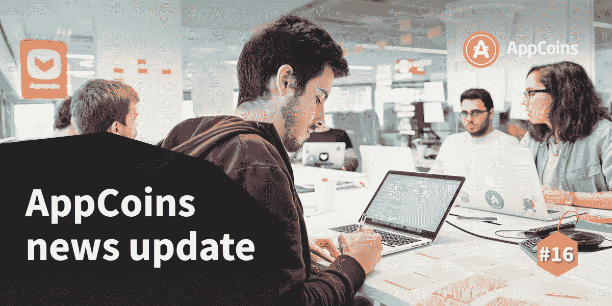
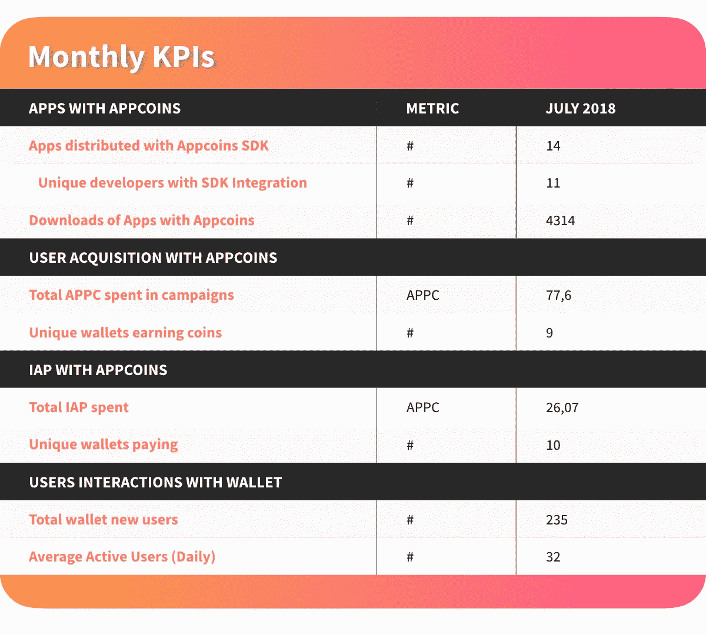
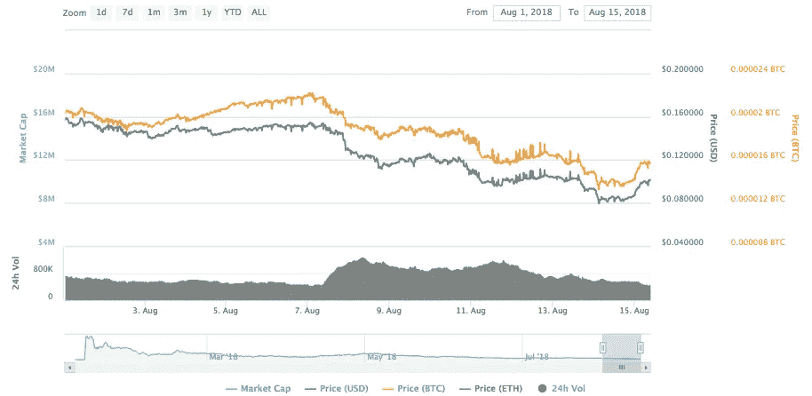
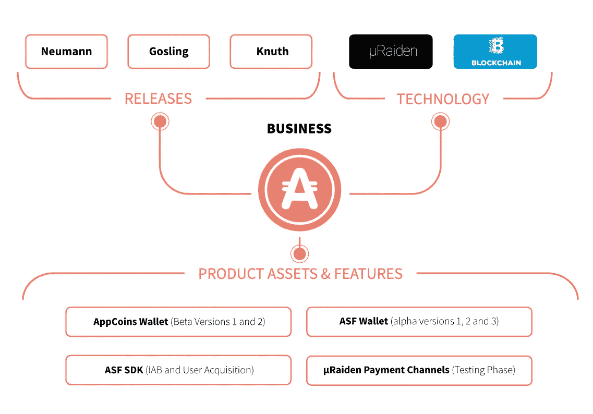

# ANU #16 — Ritchie 发布和产品开发概述

> 原文：<https://medium.com/hackernoon/anu-16-ritchie-release-and-product-development-overview-64b7f7b2d42a>

AppCoins 新闻更新，简称 **ANU** ，是 AppCoins 团队每两周一次的定期更新。像往常一样，我们将涵盖开发更新，市场报告，团队成员和即将举行的活动。本周的焦点是**里奇的发布**，以及**自 ICO 完成以来协议**的产品开发。你可能会在 8 月 29 日期待下一届 ANU。

**快速链接** [开发更新](#4095)
[APPC 市场报告](#9ac3)
[特色团队成员](#223a)
[产品开发回顾](#0077)

正如前两个肛门([**【14】**](/@appcoins/anu-14-updates-on-ritchie-release-and-chinajoy-1ab2b504a0b8)&[**【15】**](/@appcoins/anu-15-ritchie-release-developments-and-business-review-67c70bf6d452))所透露的，我们一直在推动为将于 9 月 2 日推出的**里奇发布做好一切准备。**

该小组一直在:

*   致力于为开发者准备好一个新的计费系统
*   为 Unity 应用开发者开发集成计费系统的 **Unity 插件**
*   支持**信用卡支付，并在区块链中对支付进行**公证，以进行事后验证(如果需要)
*   升级我们的智能合同以提高效率和成本

从我们的角度来看，开发人员和用户采用 AppCoins 协议有两个主要驱动因素。对于前者来说，拥有一个与他们最常用的非常相似的**工作计费系统——Google Play 计费系统——是关键，因为它使我们能够说，构建现有应用程序的新版本就像更改几个变量名称一样简单。对于后者来说，能够**使用现有的和已知的支付方式**对于打破摩擦至关重要，这种摩擦存在于必须创建以太坊钱包，用法定货币购买 ETH，并将 ETH 转换为 APPC。如果用户可以用信用卡支付应用程序内的商品，就像现在很多人已经做的那样，采纳摩擦几乎就消失了。**

> 通常，如果一项颠覆性技术的最终用户工作方式与现有的竞争技术相同，那么采用率就会大大提高。

作为 AppCoins 集成商，Aptoide 正在开发 BDS，这是一个区块链分发服务(BDS)门户，可以简化开发者、应用商店和原始设备制造商的生活。你已经可以在 这里访问它 [**。开发人员已经可以创建帐户，上传他们集成了计费系统的应用程序，创建和编辑应用程序内的项目细节，并访问大量的仪表板。**](https://blockchainds.com)

上周五，致力于 BDS 门户的团队刚刚发布了带有 AppCoins 钱包的 BDS 计费系统的**测试版。这意味着开发人员现在可以开始集成它，并在 AppCoins 协议的基础上构建他们的应用程序。Unity 插件将与 Ritchie 版本一起发布，后者将向 Unity 应用开发者开放 BDS 计费系统。**

此外，AppCoins 钱包中的信用卡支付目前正在开发中。这个想法是让用户用信用卡支付，并将支付的金额转换成 APPC，然后用它支付给开发者和应用商店。此外，由于信用卡支付是在链外完成的，即它们没有存储在区块链中，AppCoins 协议不会自动识别它们，AppCoins 团队正在开发我们所谓的**链外支付公证**。这意味着我们定期**聚合链外支付**，**从它们中构建 Merkle 树**，并且**向区块链发布其根哈希**，以及一些其他参数。我们将向给定钱包的交易输出公开一个经过身份验证的 API。开发人员可以使用该 API 来验证发送到区块链的 Merkle 树的根哈希确实是从他们有权处理的那些事务中计算出来的。如果他们也想保存从他们的应用程序中完成的交易，他们甚至可以比较我们的 API 的输出是否产生相同的结果。

根据上个月的性能表和协议性能的 KPI，在本次 ANU 上，我们收集了 7 月份的数据，包括使用 AppCoins 的流量、IAP 和用户获取、整合 AppCoins 下载的应用数量以及来自 SDK 的指标，如下表所示。

请继续关注未来几周的新闻。大事就要发生了！

一如既往，我们邀请您关注我们正在开发的所有产品:

*   [**ASF SDK**](https://github.com/AppStoreFoundation/asf-sdk)
*   [**ASF Unity 插件**](https://github.com/AppStoreFoundation/AppcoinsUnityPlugin)
*   [**ASF 钱包**](https://github.com/AppStoreFoundation/asf-wallet-android)
*   [**ASF 智能合约**](https://github.com/AppStoreFoundation/asf-contracts)

出版的艺术品:

*   **ASF 钱包(**[**Aptoide**](https://asf-wallet-app-store-foundation.en.aptoide.com/?store_name=asf-store&app_id=37702367)**&**[**Google Play**](https://play.google.com/store/apps/details?id=com.asfoundation.wallet)**)**
*   **AppCoins 钱包(**[**Aptoide**](https://appcoins-wallet.en.aptoide.com/?store-name=asf-store)**&**[**Google Play**](https://play.google.com/store/apps/details?id=com.appcoins.wallet)**)**
*   [**ASF SDK**](https://github.com/AppStoreFoundation/asf-sdk/blob/master/README.md)
*   [**ASF Unity 插件**](https://github.com/AppStoreFoundation/AppcoinsUnityPlugin/blob/master/AppCoins_Unity_Package.unitypackage)
*   [**BDS 计费系统集成指南**](https://github.com/Aptoide/appcoins-iab-sample)

在撰写本文时，目前的市值接近 1016 万美元，过去 24 小时的交易量为 46.794 万美元:BiteBTC (48.92%)、huo bi(25.81%)、币安(25.04%)和 hit BTC(0.23%)。

过去两周，AppCoins 遭遇了货币贬值，整个加密货币市场也是如此。这可能与 SEC 推迟 BTC ETF 的决定有关。自上次 ANU 以来，APPC 价值在 8 月 7 日见证了 0.154 美元的高点，在 8 月 14 日见证了 0.0799 美元的低点。你可以在 Coinmarketcap 查看更多关于 APPC 市场的信息。

**姓名:**法比奥 Vital
**角色:** *Unity 开发者*
**生物:**法比奥担任 AppCoins 的 Unity 开发者。他正在帮助团队开发和维护一个插件，该插件可以帮助 unity 游戏开发者将 Appcoins IAB 和 Appcoins POA 集成到他们的游戏中。

在本次 ANU 上，我们将重点关注协议的产品开发，并分析自 ICO 完成以来所做的工作。关于协议的**开发和它的实现**，该团队已经开发了几个版本，如下所示。

在今年的前几个月，该团队致力于定义涵盖**三个主要流程**的范围:店内广告、应用内代币购买和信誉建设，以及定义智能合同算法和结构化区块链数据。该团队还搜索和测试了被认为与 [AppCoins 协议](https://appcoins.io/)相关的工具和功能。被测试的工具有 [**微雷登**](https://raiden.network/micro.html) 和 [**卡斯珀·FFG**](https://github.com/ethereum/wiki/wiki/Proof-of-Stake-FAQ)。Microraiden 是[**Raiden Network**](https://raiden.network/)的简化版本，可用于在预定的对等体之间执行**离链交易**(多对一方法)，Casper 项目尤其重要，因为它与[分片](https://github.com/ethereum/wiki/wiki/Sharding-FAQ)直接相关，这将使以太坊能够扩展其 TPS，成为加密领域的更好解决方案。

3 月 21 日，我们发布了“ **Neumann Release** ”，这是指面向 AppCoins 开发者的库、命令行工具和 SDK 的开源参考实现。从那里，团队开始着手我们的下一个大版本:T2、小鹅、T4 和 T5。开发团队已经开发了 [**ASF Wallet Alpha 1、2 和 3**](/@appcoins/asf-wallet-alpha-1-and-next-major-releases-5bf6cfc82b0b)——后者被称为[“小鹅版本”](/@appcoins/gosling-release-with-new-advertising-and-iap-flows-6365f080b28e)。在此版本中，智能合约部署在主网络中，而在此之前，它仅在 Ropsten(测试)网络中可用。这**允许开发商使用具有真实货币价值的 APPC**进行货币化。该版本的另一个主要目标是提高交易速度，以便在购买应用内商品时提供最佳的应用内体验。

在交付 ASF Wallet 3 后，团队立即开始工作于 6 月 16 日推出的[**【Knuth Release】**](/@appcoins/knuth-release-integrating-new-payment-technology-f2e44d32c801)**。这里的主要焦点是改善可伸缩性问题，这是许多构建在以太坊网络或其他区块链之上的其他项目所共有的。在这次发布中，团队开发了一个**原型来展示可扩展的应用内购买。**这让用户能够支付应用内的商品，而不必等待太长时间才能完成交易，更重要的是，**不必支付高昂的交易费用。**为了解决这个问题，该团队试验了微借贷技术，因为在支付渠道内完成的交易是链外交易，因此更快且没有费用。因此，一款新的钱包诞生了，它具有这一新功能，即**支付通道，可实现更快、更低费用的交易**。**

**目前，该团队正在开发**“Ritchie Release”，**，其重点是推出 **IAP 和 Aptoide 应用商店**上的广告流，使这种新的支付方式可用于超过 **2 亿用户**。包括创建一个加快支付速度的信用卡功能。敬请关注 9 月 2 日的发布会！**

****

**错过了我们以前的出版物吗？不要担心！你可以在这里阅读:**

**[如何购买 AppCoins 的简单教程](/@appcoins/easy-tutorial-on-how-to-buy-appcoins-28fd41cacecf)**

**[ANU #15 —瑞奇发布发展和商业评论](/@appcoins/anu-15-ritchie-release-developments-and-business-review-67c70bf6d452)**

**[ANU # 14——关于瑞奇发布和 ChinaJoy 的更新](/@appcoins/anu-14-updates-on-ritchie-release-and-chinajoy-1ab2b504a0b8)**