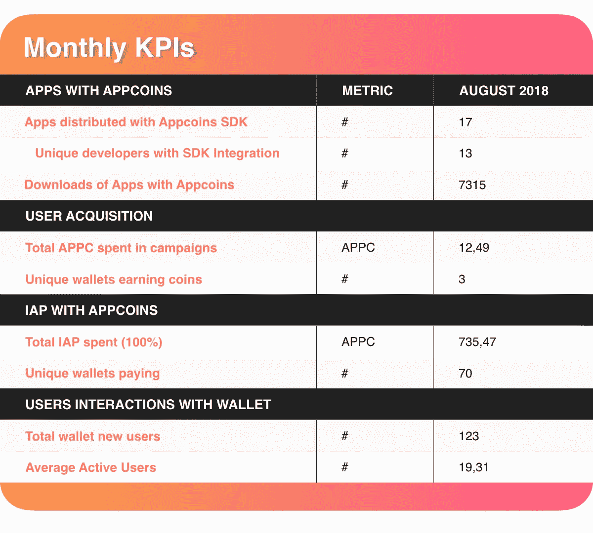

# ANU #18 —信用卡支付功能、BDS 计费和 2018 年亚洲展

> 原文：<https://medium.com/hackernoon/anu-18-credit-card-payment-feature-bds-billing-and-2018-demo-asia-73de99c3a778>

AppCoins 新闻更新，简称 **ANU** ，是 AppCoins 团队每两周一次的定期更新。像往常一样，我们将涵盖开发更新，市场报告，团队成员和即将举行的活动。本周的焦点是**信用卡支付功能，BDS 计费**，以及即将参加 **2018 DEMO ASIA Summit** 的 AppCoins。

**快速链接** [开发更新](#4095)
[APPC 市场报道](#9ac3)
[特色团队成员](#8364)
[即将举办的活动](#defe)

万能的 Dev 更新又来了！

9 月 2 日，我们发布了 [**里奇**](/@appcoins/ritchie-release-appcoins-rollout-on-aptoide-app-store-93f0610d592) ，这是迄今为止 [**AppCoins 项目**](https://appcoins.io) 最大的一次发布。这一版本包括由 [**区块链分发服务(BDS)**](https://blockchainds.com) 开发的计费系统，使开发者能够集成一个计费系统，为他们管理购买、库存和支付。对于已经集成了 Google Play 计费的开发者来说，向 BDS 计费的过渡变得尽可能平稳。

此外，Ritchie 还为用户提供了使用信用卡**支付应用内物品的可能性**。这是使用 [**AppCoins BDS 钱包**](https://play.google.com/store/apps/details?id=com.appcoins.wallet) **完成的。**这不仅是用户熟悉的模式，也打破了采用加密货币的最大摩擦点之一。对于直接使用 APPC 支付的用户来说，他们需要用法定货币购买 ETH 或 BTC(这个过程可能需要几天)，将 ETH 或 BTC 发送到币安或火币等交易所，用其兑换 APPC，最后，将 APPC 发送到他们在 AppCoins BDS 钱包中使用的钱包地址。由于可以使用信用卡支付，用户只需要安装 AppCoins BDS 钱包并输入他们的信用卡信息。**购买发生在几秒钟内，这比以太坊交易的当前延迟好几个数量级。**

最后，BDS 计费系统和信用卡支付都保持 AppCoins 协议的基本假设。

> 开发者应该能够验证用户和他们的应用之间的交互，而不需要信任任何第三方。

在过去的一周半时间里，我们一直在解决信用卡支付功能和 BDS 计费本身的小问题。所有这些问题都被归类为次要问题，因为它们不会让用户在进行应用内支付时失去 APPC 或法定货币。它们是阻止用户为应用内商品付费的关键因素。例如，如果用户试图使用信用卡支付应用内项目，并在完成之前取消了购买，则不可能再次购买应用内项目。

其中一些问题在昨天的次要版本中得到修复，该版本被推送到 [**Google Play**](https://play.google.com/store/apps/details?id=com.appcoins.wallet) 和 [**Aptoide**](https://appcoins-wallet.en.aptoide.com) 。

在接下来的几周内，我们将致力于使 AppCoins BDS 钱包与整合了 App Store Foundation (ASF) SDK 的应用程序兼容，并重塑用户获取流程。前者很重要，因为目前 AppCoins BDS 钱包与 BDS 计费系统紧密耦合，从某种意义上说，它只对集成了 BDS 计费的应用程序中的应用内项目有效。我们希望让 AppCoins BDS 钱包与 ASF 支付兼容，后者只依赖 APPC 支付，不需要任何第三方认证该应用。

关于用户获取流——这是用户可以因为关注应用而获得 APPC 奖励的流，假设应用的活动是由其开发者创建的——它目前对用户不起作用。这是因为用户需要 ETH 向区块链提交注意事项证明。我们将改造流程，使用户无需 ETH 就能获得奖励。关于这一点的更多细节将被包括在下一个 ANU 中。

根据上个月的性能表和协议性能的 KPI，在本次 ANU 上，我们收集了 8 月份的数据，包括使用 AppCoins 的流量、IAP 和用户获取、整合 AppCoins 下载的应用数量以及来自 SDK 的指标，如下表所示。

请继续关注未来几周的新闻。大事就要发生了！

一如既往，我们邀请您关注我们正在开发的所有产品:

*   [**ASF SDK**](https://github.com/AppStoreFoundation/asf-sdk)
*   [**ASF Unity 插件**](https://github.com/AppStoreFoundation/AppcoinsUnityPlugin)
*   [ASF 钱包 ](https://github.com/AppStoreFoundation/asf-wallet-android)
*   [**ASF 智能合约**](https://github.com/AppStoreFoundation/asf-contracts)

出版的艺术品:

*   **ASF 钱包(******&**[**Google Play**](https://play.google.com/store/apps/details?id=com.asfoundation.wallet)**)****
*   ****AppCoins 钱包(**[**Aptoide**](https://appcoins-wallet.en.aptoide.com/?store-name=asf-store)**&**[**Google Play**](https://play.google.com/store/apps/details?id=com.appcoins.wallet)**)****
*   **[**ASF SDK**](https://github.com/AppStoreFoundation/asf-sdk/blob/master/README.md)**
*   **[**ASF Unity 插件**](https://github.com/AppStoreFoundation/AppcoinsUnityPlugin/blob/master/AppCoins_Unity_Package.unitypackage)**
*   **[**BDS 计费系统集成指南**](https://github.com/Aptoide/appcoins-iab-sample)**

****

**在撰写本文时，目前的市值接近 625 万美元，在过去 24 小时内，这些交易所的交易量为 12.305 万美元:币安(84.50%)、火币(14.83%)和 HitBTC (0.68%)。**

****

**自上次 ANU 以来，APPC 价值在 8 月 29 日达到 0.116 美元的高点，在 9 月 12 日达到 0.062 美元的低点。你可以在 [Coinmarketcap](https://coinmarketcap.com/currencies/appcoins/) 查看更多关于 APPC 市场的信息。**

****

****姓名:** [Jorge Rosa](https://www.linkedin.com/in/jorgeborgesrosa/)
**角色:** *前端开发人员*
**简历:**Jorge 拥有 Web 开发和 UX/UI 设计师的背景，一直致力于 BDS 产品的开发，使开发人员和应用程序商店能够轻松利用 AppCoins，同时分发和货币化他们的应用程序。**

********

**AppCoins 团队将参加另一项重大活动: [**2018 DEMO ASIA Summit！**](http://www.cyzone.cn/2018demoasia/en.html)**

**这一世界知名活动的计划包括特别关注技术、投资和其他有趣领域的创新和发展。**

**赛事将围绕不同类别展开，包括金融技术、生物技术、物流和其他。**app coins 团队将参加商业计划竞赛。****

**AppCoins 项目旨在**为区块链产业**增加 **新的重大价值，并**让应用生态系统变得更好。观看我们的演示，了解我们项目的商业模式，并理解为什么它有如此不可思议的潜力去开拓新的领域并彻底改变行业。******

**2018 年演示亚洲峰会将于 9 月 18 日在新加坡金沙会展中心举行。**

****

**错过了我们以前的出版物吗？不要担心！你可以在这里阅读:**

**[Ritchie 发布——App coins 在 Aptoide 应用商店首次亮相！](/@appcoins/ritchie-release-appcoins-rollout-on-aptoide-app-store-93f0610d592)**

**[ANU # 17——里奇发布和 Gamescom](/@appcoins/anu-17-ritchie-release-and-gamescom-53d84932055b)**

**[将你的 APPC 从交易所转移到 AppCoins 钱包——教程](/@appcoins/transfer-your-appc-from-the-exchanges-to-the-appcoins-wallet-tutorial-c7ca4e6e954e)**