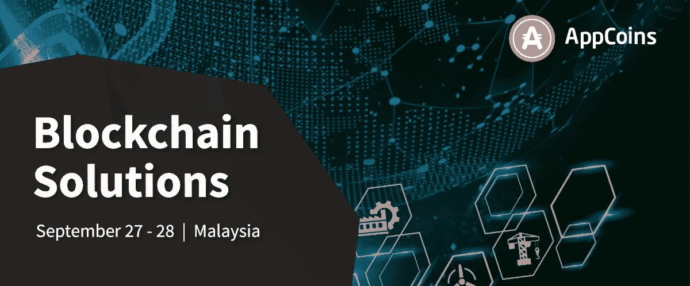

# ANU #19 — AppCoins BDS 钱包更新和 ASF 区块链峰会

> 原文：<https://medium.com/hackernoon/anu-19-appcoins-bds-wallet-updates-and-the-asf-blockchain-summit-41e3b0c34d55>

AppCoins 新闻更新，简称 **ANU** ，是 AppCoins 团队每两周一次的定期更新。像往常一样，我们将涵盖开发更新，市场报告，团队成员和即将举行的活动。本周的焦点是最近关于 AppCoins BDS 钱包的**进展、用户获取流程的**再造提案、**以及将于 11 月 5 日在里斯本举行的 **ASF 区块链峰会**。**

**快速链接** [Dev 更新](#4095)
[APPC 市场报道](#9ac3)
[特色团队成员](#b29d)
[ASF 区块链峰会](#1c5e)
[即将举办的活动](#a9d7)

两周过去了，又到了一个 Dev 更新的时候了！

过去的两个星期，我们一直在完成因里奇发布的**而推迟的任务。其中包括一些网站页面和重塑用户获取的最终提案，这是一个让用户能够通过使用应用程序获得回报的流程。它还包括一些必须完成的 AppCoins BDS 钱包的开发。**

**关于网站页面，我们已经完成了 [**App Store 基础**](https://appstorefoundation.org) (ASF)区块链峰会 [**网站**](https://summit.appstorefoundation.org) 。**

> **ASF 峰会的目的是“为全球应用开发者、应用商店、原始设备制造商和生态系统构建者提供服务，让他们相互联系、学习和分享知识。”**

**该网站可能仍然会经历一些关于演讲者和议程的变化，但它已经在那里让人们更多地了解峰会打算实现的目标。**

**关于网站页面，我们已经创建了一个 [**页面**](https://www.appstorefoundation.org/transparency) ，用户、开发者和爱好者可以在这里查看我们在 APPC 的购买情况，以说明通过信用卡使用法定货币进行的支付。这项功能是在 Ritchie 版本中发布的，同时，我们希望有一个页面来展示 APPC 购买的每一件物品。对于用信用卡完成的每笔支付，我们在交易所实时购买相应数量的 APPC。例如，给定一个集成了区块链分发服务(BDS)计费系统的应用程序，如果用户在该应用程序中购买了一个标记为花费 10 APPC 的商品，并使用信用卡支付，我们将从交易所购买这 10 个 APPC，并通过开发者(85%)、应用商店(10%)和 OEM (5%)分发它们，如 AppCoins 协议白皮书中所述。**

**考虑到我们在 AppCoins BDS 钱包上的开发，我们主要做了两件事。第一个是减少它的大小，因为应用程序几乎有 50 MB。我们觉得这对以太坊钱包来说太多了，因此去掉了该应用程序的一些依赖项。该应用程序现在已经有 14.5 MB，并且这个更新已经在 [**Google Play**](https://play.google.com/store/apps/details?id=com.appcoins.wallet) 和 [**Aptoide**](https://appcoins-wallet.en.aptoide.com) 中发布。**

**此外，我们一直致力于让 ASF IAP 流与 AppCoins BDS Wallet 一起运行。在 Ritchie 发布之后，来自 ASF 的 IAP 流停止与 AppCoins BDS 钱包一起工作，因为钱包变得与 BDS 计费系统过于耦合。由于来自 ASF 的 IAP 流不依赖于任何第三方和 API，除了以太坊区块链本身，该流仅与 ASF 钱包一起工作。我们想让 AppCoins BDS 钱包完全兼容 ASF，因此我们一直在努力实现这个目标。开发工作已经接近完成，将在接下来的几周内发布。**

**最后，我们完成了重塑用户获取流程的提案。这是 AppCoins 协议的两个主要流程之一，它使用户能够通过使用应用程序获得奖励。开发者能够为他们的应用程序创建用户获取活动，当用户实际使用应用程序的证据——我们称之为注意力证据(PoA)——提交给协议时，协议会奖励用户。截至目前，该流程有一个主要的摩擦点:用户需要拥有 ETH 来提交 PoA 并获得 APPC 奖励。这使得几乎每个用户都很难获得回报，这违背了流量的目的。**

**此外，我们一直在谈论创建循环经济的概念，用户将使用他们在应用内购买中获得的至少一部分奖励，从而创建一个更有活力和有趣的移动生态系统。**

**因此，我们提议对 AppCoins 协议进行扩展。它将建立在现有的用户获取流程之上，将消除这些摩擦点，并为用户和开发者增加更多价值。事实上，这将是我们在下一个大版本中发布的主要进展。请继续关注这方面的更多更新！**

**一如既往，我们邀请您关注我们正在开发的所有产品:**

*   **[**ASF SDK**](https://github.com/AppStoreFoundation/asf-sdk)**
*   **[ASF Unity 插件 ](https://github.com/AppStoreFoundation/AppcoinsUnityPlugin)**
*   **[**ASF 钱包**](https://github.com/AppStoreFoundation/asf-wallet-android)**
*   **[**ASF 智能合约**](https://github.com/AppStoreFoundation/asf-contracts)**

**出版的艺术品:**

*   ****ASF 钱包(**[**Aptoide**](https://asf-wallet-app-store-foundation.en.aptoide.com/?store_name=asf-store&app_id=37702367)**&**[**Google Play**](https://play.google.com/store/apps/details?id=com.asfoundation.wallet)**)****
*   ****AppCoins 钱包(**[**Aptoide**](https://appcoins-wallet.en.aptoide.com/?store-name=asf-store)**&**[**Google Play**](https://play.google.com/store/apps/details?id=com.appcoins.wallet)**)****
*   **[**ASF SDK**](https://github.com/AppStoreFoundation/asf-sdk/blob/master/README.md)**
*   **[**ASF Unity 插件**](https://github.com/AppStoreFoundation/asf-unity-plugin/blob/master/ASF_AppCoins_Unity_Package_2018.unitypackage)**
*   **[**BDS 计费系统集成指南**](https://github.com/Aptoide/appcoins-iab-sample)**

****

**在撰写本文时，目前的市值接近 993 万美元，在过去 24 小时内，这些交易所的交易量为 44.447 万美元:币安(89.02%)、火币(10.93%)和 HitBTC (0.04%)。**

****

**自上次 ANU 以来，APPC 价值在 9 月 23 日达到 0.123 美元的高点，在 9 月 12 日达到 0.062 美元的低点。你可以在 [Coinmarketcap](https://coinmarketcap.com/currencies/appcoins/) 查看更多关于 APPC 市场的信息。**

****

****姓名:**[Rafael Rodrigues](https://www.linkedin.com/in/rafael-rodrigues-b74172105/)
**角色:** *质量保证和客户支持*
**简历:** Rafael 早在 2015 年就开始为 Aptoide 工作，担任质量保证测试员。
后来，他被指派整合 Aptoide 电视团队，帮助推出 Aptoide 针对 Android 电视和机顶盒的应用商店解决方案。
目前，他是 BDS 团队的一员，他的职责包括确保团队开发的质量，尽可能提供最佳体验，并为 BDS 用户提供客户支持。**

********

**[AppCoins](https://appcoins.io/) 将赞助**年度最具影响力的区块链活动之一:**[**ASF 区块链峰会！**](https://summit.appstorefoundation.org/)**

**此次活动**将标志着**[**App Store Foundation**](https://www.appstorefoundation.org/)的正式启动，这是一个非营利性组织，将确保 AppCoins 生态系统的开放治理，支持其发展(在 Aptoide 执行初始实施之后)和技术的持续开放创新。**

**该活动将于**11 月 5 日在里斯本东方博物馆**举行，将包括一整天的**主题演讲、关于应用经济的小组讨论以及与开发者的平行技术专题会议。****

**这是一个难以置信的机会，**与我们这一代最有影响力的开发者、OEM 和生态系统建设者见面并向他们学习，包括** [**克里斯·琼斯**](https://blockchainseattle.io/) **和** [**约旦法国**](https://blocktelegraph.io/) **！****

**有关 ASF 区块链峰会的更多信息，以及**获取门票**，请访问:【https://summit.appstorefoundation.org/】T2**

**我们将在我们的社交媒体渠道和下一次 ANU 中分享关于 ASF 区块链峰会的新更新，敬请关注！**

********

**AppCoins 亚太区副总裁 Tiago Alves 将是 [**区块链解决方案亚洲的主要演讲人之一！**](https://www.blockchainsolutionsasia.com/)**

**区块链解决方案亚洲 2018 旨在为组织提供答案，以**了解** **区块链革命**的影响，以及其**技术进步对其商业模式和运营流程**的影响，以便他们适应这个新的世界技术主导的秩序。**

**不要错过 Tiago Alves 关于“**通过 ICOs 筹集投资资本:成功策略和避免的陷阱**”的演讲，以及他参加的论坛讨论——“**区块链:未来的融资机制？**”。**

**区块链解决方案亚洲 2018 将于 9 月 27 日至 28 日在马来西亚吉隆坡会议中心举行。**

****

**吉隆坡将于 9 月 27 日举办**全天活动，届时将有来自区块链行业的有影响力的演讲者。****

**这一次，Meet Up 将汇集来自 Qchain、LongHash 和来自 AppCoins、long hash 的专家。这次聚会是由马来西亚的加密货币社区 Meet Up 组织的，该社区自 2013 年以来一直在举办这些活动。**

**Tiago Alves 的演讲将重点关注 **AppCoins 解决方案**，并将使用 **Aptoide 应用商店作为案例研究**来展示**App coins 协议在应用经济中的集成如何帮助解决该行业目前仍然面临的一些主要低效问题。****

**除了演示之外，AppCoins 团队还将与观众一起开展一些活动，包括使用 AppCoins 技术测试应用内购买，以及赠送神秘礼物。**

**点击了解活动[的更多详情。](https://www.eventbrite.com/e/kl-blockchain-week-27th-sept-malaysia-monthly-blockchain-kl-meetup-tickets-49885630263)**

****

**错过了我们以前的出版物吗？不要担心！你可以在这里阅读:**

**[ANU #18 —信用卡支付功能、BDS 计费和 2018 年亚洲展](https://hackernoon.com/anu-18-credit-card-payment-feature-bds-billing-and-2018-demo-asia-73de99c3a778)**

**[Ritchie 发布——App coins 在 Aptoide 应用商店首次亮相！](/@appcoins/ritchie-release-appcoins-rollout-on-aptoide-app-store-93f0610d592)**

**[ANU # 17——里奇发布和 Gamescom](/@appcoins/anu-17-ritchie-release-and-gamescom-53d84932055b)**