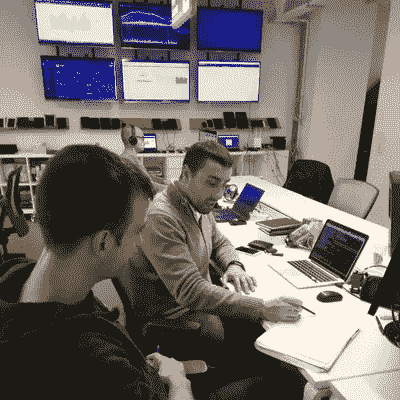
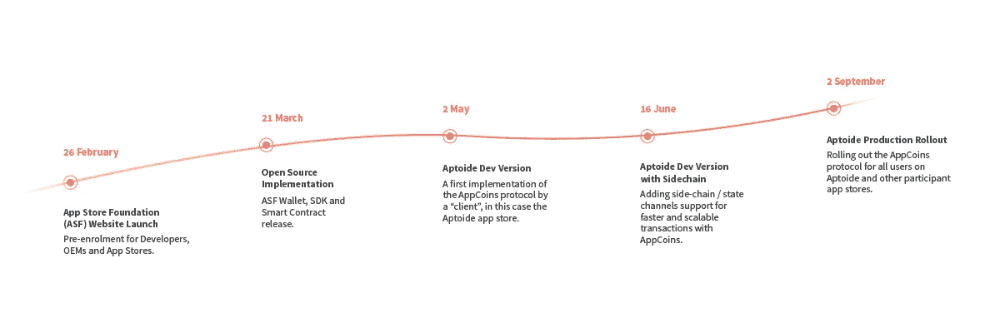
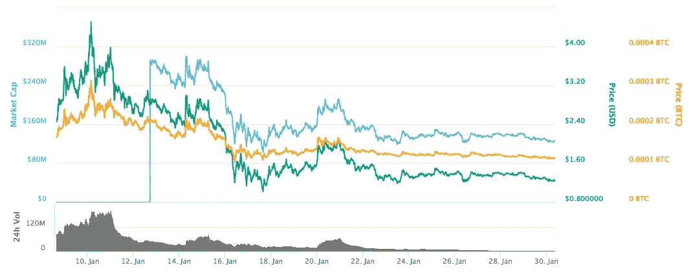

# ANU # 2——应用商店的基础和发展状况

> 原文：<https://medium.com/hackernoon/anu-2-app-store-foundation-and-dev-status-a3de6d144e5f>

AppCoins 新闻更新，或者简称为 **ANU** ，是 AppCoins 团队每两周一次的定期更新。这意味着你可能会在 2 月 14 日期待下一次更新。每个 ANU 将由四个部分组成:T4 发展更新、APPC 市场报告、特色团队成员和即将到来的事件。

**快速链接** [Dev 更新](#f279)
[APPC 市场报道](#e335)
[特色团队成员](#e19d)
[即将举办的活动](#6db3)

继 [**ANU #1**](https://hackernoon.com/anu-1-the-first-appcoins-news-update-2dde0f9b6f18) 之后，我们继续与 [**雷电**](https://raiden.network/micro.html) 合作，开始着手 AppCoins 路线图中定义的第一批可交付成果。

## 雷电

正如 ANU #1 中所解释的，我们用 Java 实现了 Raiden 客户端，以便在 Android 移动智能手机中使用，因为 [**AppCoins 协议**](https://appcoins.io) 将在移动设备中使用。我们完成了客户端实现，并使用客户端对雷电的功能进行了一些基本测试。我们仍然需要做一些更深入的测试，但第一批结果是有希望的。在我们的 [GitHub 回购](https://github.com/Aptoide/AppCoins-ethereumj)中可以看到。

我们已经通过 Raiden 取得了非常有趣的结果，并获得了我们需要的知识，以便提前做出可伸缩性决策。在这些第一批可交付成果之后，我们将继续与 Raiden 和其他工具合作，使 AppCoins 协议能够扩展到我们想要服务的数百万用户。

## 第一份路线图交付成果

第一批交付成果是:

*   **2 月 26 日—****App Store Foundation(ASF)网站**，这里有关于该基金会的更多信息，比如为什么需要它，以及谁可以加入我们破坏移动应用经济的努力。
*   **3 月 21 日—****ASF SDK**开发者可以将其集成到他们的应用中，以便使用 AppCoins 协议功能。SDK 将解决的第一个用例是允许用户使用 APPC 购买应用内商品。为此，开发人员将 SDK 集成到他们的应用程序中，将能够定义 SKU 和各自的定价，推出具有支付意图的 ASF 钱包，使用户能够为应用程序内的项目支付，检查交易状态以了解交易何时完成，当然，还包括开发人员的钱包地址。
*   **3 月 21 日—****ASF 钱包**，用户可以安装它来控制自己的 APPC 余额，向其他用户发送 APPC，从而为集成了 ASF SDK 的应用支付应用内项目。

关于 ASF 网站，我们的目标是在世界移动通信大会(MWC)前上线，届时 AppCoins 将向应用商店、开发者、用户和原始设备制造商展示该协议及其附加值。

至于 ASF SDK 和 wallet，我们打算在 3 月 21 日之前分别让开发者和用户使用。ASF 交付物将不包括用于扩展以太坊网络目前能够处理的交易数量的功能，因为这些版本将是简单的版本，使开发者和用户能够测试应用内计费(IAB)用例。此外，我们打算让 ASF 相关组件完全依赖以太坊网络功能，而不依赖第三方工具和基础设施，如 Raiden 或 ASF 后端服务器。

尽管如此，我们的目标是提供实现这些功能的工具。我们将进一步解释它们并详述它们的路线图。

AppCoins 将于今日在 [Lykke](https://www.lykke.com/exchange) 上市，成为继[币安](https://www.binance.com/trade.html?symbol=APPC_BTC)和[火币](https://www.huobi.pro/appc_btc/exchange/)之后的第三家交易所。目前市值接近 1.04 亿美元，在过去 24 小时内成交量接近 1000 万美元。

APPC 价值一直与比特币紧密相连。在过去的一个月里，BTC 股市暴跌，市值缩水一半。几个因素在起作用。大多数分析家认为这是每年都会观察到的[季节性行为](https://www.bloomberg.com/news/articles/2018-01-17/bitcoin-watchers-running-out-of-explanations-blame-slump-on-moon)。这通常被解释为中国市场为迎接中国新年而进行的套现。此外，韩国的监管问题以及首批比特币期货到期的不确定性可能也对比特币产生了影响。

通过查看 APPC 和 BTC 交易所的平均汇率，我们可以看到，它基本上是静态的，在 0.00013457 和 0.00011255 BTC 之间波动。这意味着在法定货币中观察到的价格振荡主要是由于 BTC 振荡。

**姓名:**[*Frederico santi ho*](https://www.linkedin.com/in/fredericosantinho/)
**角色:** *区块链开发者。*
**简历:** *Frederico 已经在 Aptoide 工作了 3 年多。他目前正在进行研发，为 AppCoins 试图解决的应用经济的主要问题寻找可能的以太坊解决方案。*

AppCoins 将赞助亚洲的[Android——2018 年 2 月 Meetup](https://www.meetup.com/Singapore-Android-Developers/events/246439861/?_cookie-check=Rdvqco7XY6NGFwiX), apto ide 的亚太区副总裁 [Tiago Alves](https://twitter.com/tcalves) 将做一个关于 AppCoins 的 20 分钟演讲，随后是问答环节

如果你还没看过的话，下面是之前韩国 Kyber Network 事件的[视频。这是你了解我们项目背后团队的一部分的机会。](https://www.youtube.com/watch?v=_0wSS6m0Isg&feature=youtu.be)

Telegram 24/7 Support

Official AppCoins Subreddit

AppCoins GitHub