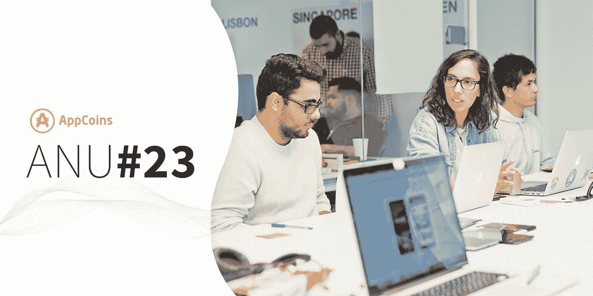
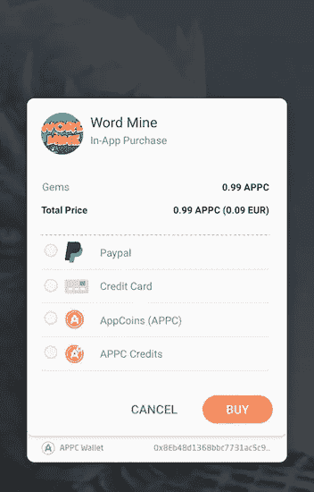
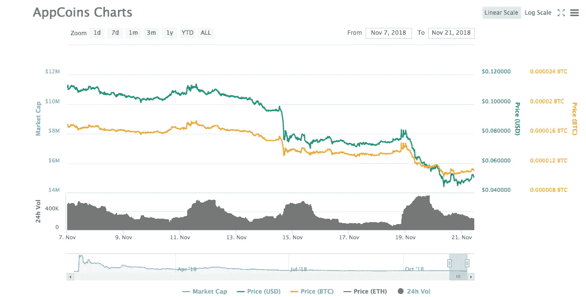

# ANU # 23——一步支付，联合印度 2018

> 原文：<https://medium.com/hackernoon/anu-23-one-step-payment-and-unite-india-2018-f6e33187e17>

AppCoins 新闻更新，简称 ANU，是 AppCoins 团队每两周一次的定期更新。像往常一样，我们将涵盖开发更新，市场报告，团队成员和即将举行的活动。本周的焦点是最近的协议开发，如**一步支付**，在 AppCoins BDS 钱包中集成 **PayPal，以及 AppCoins 团队出席 **Unite India 2018。****

**快速链接** [开发更新](#87a2)
[APPC 市场报道](#7205)
[特色团队成员](#ccfe)
[即将举办的活动](#aeaf)

每两周发布一次开发更新就像太阳每天早上升起一样确定无疑。又来了！

自从 [**Ada 发布**](/@appcoins/ada-release-proof-of-attention-appc-credits-and-donations-75be68774443) 以来，我们一直在努力解决遗留下来的小问题，并开发将在下一个版本中出现的下一个特性。我们对这一批新功能感到非常兴奋，我们相信您也会如此。

我们一直与几个合作伙伴密切合作，为我们提供反馈，并帮助我们找出扰乱移动经济所需的东西。从这个反馈循环中产生了我们所说的:**一步到位的支付**。这个过程包括将我们的计费系统包含在 Android 应用程序中的另一种方式。通常，应用商店会创建复杂的计费系统，包括 SKU(每个应用内产品的 ID)管理、购买验证器和处理器。在几个用例中，无论是收入最高的开发者还是较小的独立开发者，都不需要这些复杂的计费系统。他们只需要一个组件来包含支付提供商，使用户能够支付应用内的项目。这可能是因为他们不需要 SKU 管理，也可能是因为他们已经用自己的系统做了，分别针对较小的独立开发者和收入最高的开发者。

一步支付是一种受 Stripe 启发的方法，它使开发者能够**用相应的支付数据**构建一个非常简单的 URL，由 [**AppCoins BDS 钱包**](https://play.google.com/store/apps/details?id=com.appcoins.wallet) 捕获。然后，用户使用钱包已经提供的几种支付方式进行支付。开发人员甚至可以包含一个 URL，其中包含他们需要的参数，一旦付款得到处理，就会调用这个 URL。这可以用来在他们自己的系统中验证支付已经完成，然后按照他们认为合适的方式管理 SKU。

> 对于这些类型的开发者来说，一步支付是他们在应用程序中集成支付方式的最简单的选择。

既然我们在谈论支付方式，这是一个很好的机会告诉你，我们正在努力将 PayPal 集成到 AppCoins BDS 钱包中作为一种新的支付方式。钱包已经集成了信用卡支付和加密货币支付(在 APPC 和 APPC 信用)，由于 PayPal 是最受欢迎的在线支付方式之一，这是我们采取的合理步骤。

> 将 PayPal 等全球知名的服务整合到区块链的钱包中，是 AppCoins 项目的另一个重要里程碑。

也许你已经猜到了，但这个开发更新和下一个版本将主要围绕支付方式。截至目前，用户在使用 AppCoins BDS 钱包购买应用内商品时，无法选择他们想要使用的支付方式。钱包根据一系列条件选择最佳支付方式:

*   **如果用户对于给定的购买有足够的钱，APPC 会给**积分
*   **APPC** 如果用户的钱包里有足够的钱
*   **信用卡**如果用户没有 APPC 或 APPC 信用卡

在我们看来，由于这不是最佳行为，我们正在开发一种方法，让用户**选择他们希望**每次购买使用的支付方式。用户将会看到一个对话框，里面有几种支付方式，其中有些选项是灰色的。例如，如果用户没有足够的 APPC，使用 APPC 支付的选项将被禁用。这给了用户更高的自由度，我们认为这是对他们最好的一步。

Screen to choose preferred payment method

关于我们所有的文档，我们正在努力改进它，以及用户访问它的方式。我们认为将文档与 GitHub repository 分开并不是欢迎开发者加入 AppCoins 生态系统的最友好的方式。我们正在开发一个新的文档平台，我们将所有的东西都转移到我们认为最合适的结构中，以使开发者的旅程尽可能的顺畅。一旦迁移更深入，我们将为您提供更多详细信息。

最后，作为下一届 ANU 的预告片，我们也在努力将**游戏化纳入钱包**，为我们的用户提供更多(非常重要的)激励和有趣的内容。**我们相信你会喜欢在下一次开发更新中读到关于它的一切:**

一如既往，我们邀请您关注我们正在开发的所有产品:

*   [ASF SDK](https://github.com/AppStoreFoundation/asf-sdk)
*   [**ASF Unity 插件**](https://github.com/AppStoreFoundation/AppcoinsUnityPlugin)
*   [**ASF 钱包**](https://github.com/AppStoreFoundation/asf-wallet-android)
*   [**ASF 智能合约**](https://github.com/AppStoreFoundation/asf-contracts)
*   [**AppCoins BDS 钱包**](https://appcoins-wallet.en.aptoide.com/?store-name=asf-store)
*   [**BDS SDK**](https://github.com/Aptoide/bds-sdk)
*   [**BDS Unity 插件**](https://github.com/Aptoide/bds-unity-plugin)

出版的艺术品:

*   **ASF 钱包(**[**Aptoide**](https://asf-wallet-app-store-foundation.en.aptoide.com/?store_name=asf-store&app_id=37702367)**&**[**Google Play**](https://play.google.com/store/apps/details?id=com.asfoundation.wallet)**)**
*   **AppCoins BDS 钱包(**[**Aptoide**](https://appcoins-wallet.en.aptoide.com/?store-name=asf-store)**&**[**Google Play**](https://play.google.com/store/apps/details?id=com.appcoins.wallet)**)**
*   [**ASF SDK**](https://github.com/AppStoreFoundation/asf-sdk/blob/master/README.md)
*   [**ASF Unity 插件**](https://github.com/AppStoreFoundation/asf-unity-plugin/releases)
*   [BDS SDK](https://github.com/Aptoide/bds-sdk/blob/master/README.md)
*   [**BDS Unity 插件**](https://github.com/Aptoide/bds-unity-plugin/releases)
*   [**BDS 计费系统集成指南**](https://github.com/Aptoide/appcoins-iab-sample)

在撰写本文时，目前的市值接近 510 万美元，在过去 24 小时内，这些交易所的交易量为 25.682 万美元:币安(95.44%)、火币(4.25%)和 hit BTC(0.30%)。

自上次 ANU 以来，APPC 价值在 11 月 11 日见证了 0.113 美元的高点，在 11 月 20 日见证了 0.044 美元的低点。你可以在 [Coinmarketcap](https://coinmarketcap.com/currencies/appcoins/) 查看更多关于 APPC 市场的信息。

**姓名:**布鲁诺·瓦雷拉
**角色:** *Unity 开发者*
**简历:**布鲁诺之前曾在不同的项目中担任全栈 Java 开发者，以及 Unity 3D 开发者。最近，他加入了 AppCoins 团队，致力于 Unity 集成。

**Unite India 2018** 是在全球多个地方举行的 [Unite 2018](https://unite.unity.com/event-overview) 系列活动的一部分。第一届在洛杉矶、墨尔本和新加坡举行，下一届将在印度的海德拉巴举行。

India Unite 2018 活动位于海德拉巴 IT 和金融区中心的 HITEC 城附近，将涵盖关于[**Unity**](https://unity3d.com/)**——**数百万人使用的内容创作引擎，刚刚与 Aptoide**达成** [**分发合作关系。**](/@appcoins/aptoide-announces-partnership-with-unity-technologies-9c9003220959)

通过参加此次活动，您将有机会见到来自游戏、电影、汽车和 AEC 等不同行业的创作者，并了解有关 **2D、3D 和 VR/AR** 的最新发展。除此之外，还将有高级演示**研讨会、技术会议、即将推出的 Unity tech 预览**等等！

一定要找到 **AppCoins 展台，观看团队关于 AppCoins 协议的演示**。我们将很快在我们的社交媒体平台上提供更多细节，敬请关注！

👉除了 Unite India 2018，AppCoins 团队还将参加 [**印度游戏开发者大会 2018**](https://indiagdc.com/2018/)**——印度首屈一指的游戏开发者大会。如果你是一个寻找新机会的开发者，来找我们的团队吧！我们很乐意与您会面，并向您介绍我们的 [**开发人员激励计划。**](/@appcoins/developers-incentives-program-4-weeks-have-closed-with-500-000-appc-being-distributed-5e92f98d978)**

**那里见！**

****

**错过了我们以前的出版物吗？不要担心！你可以在这里阅读:**

**[ANU #22 —用户获取流程、BDS 钱包和 ASF 区块链峰会](/@appcoins/anu-22-user-acquisition-flow-bds-wallet-and-the-asf-blockchain-summit-70b774abace3)**

**[开发人员激励计划— 4 周已经结束，500，000 APPC 已经发放完毕！](/@appcoins/developers-incentives-program-4-weeks-have-closed-with-500-000-appc-being-distributed-5e92f98d978)**

**[Ada 发布—关注证明、APPC 积分和捐赠](/@appcoins/ada-release-proof-of-attention-appc-credits-and-donations-75be68774443)**