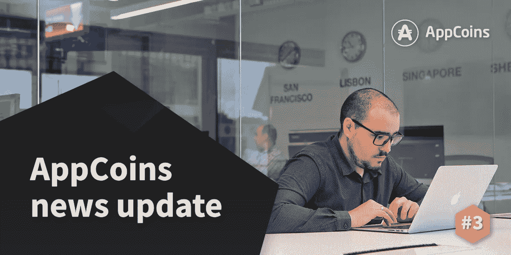
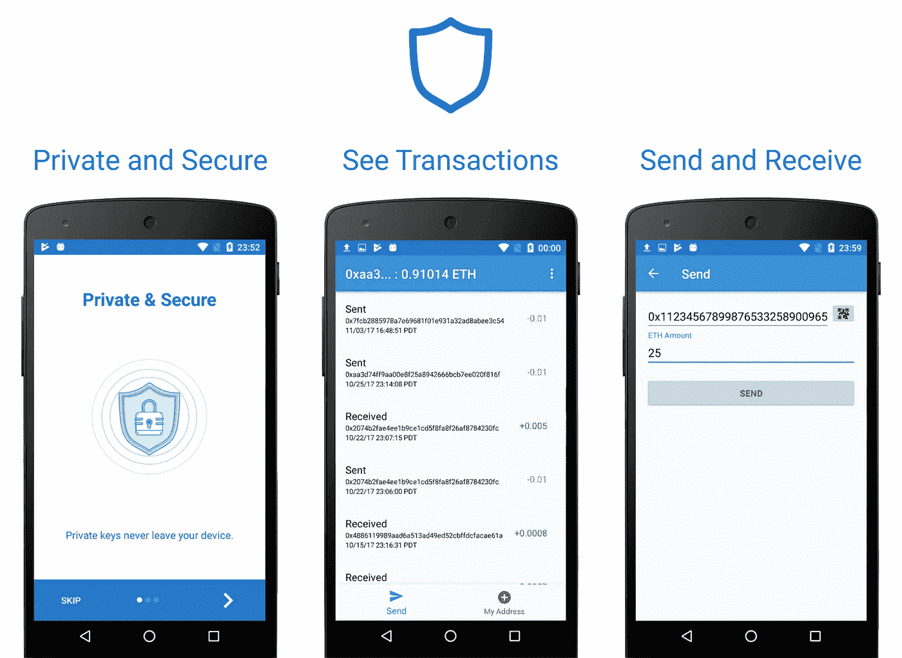
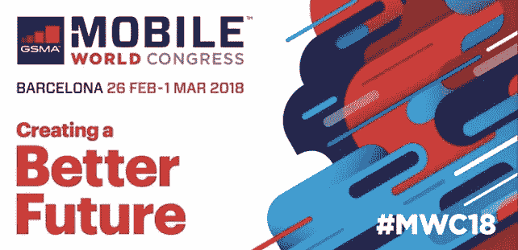
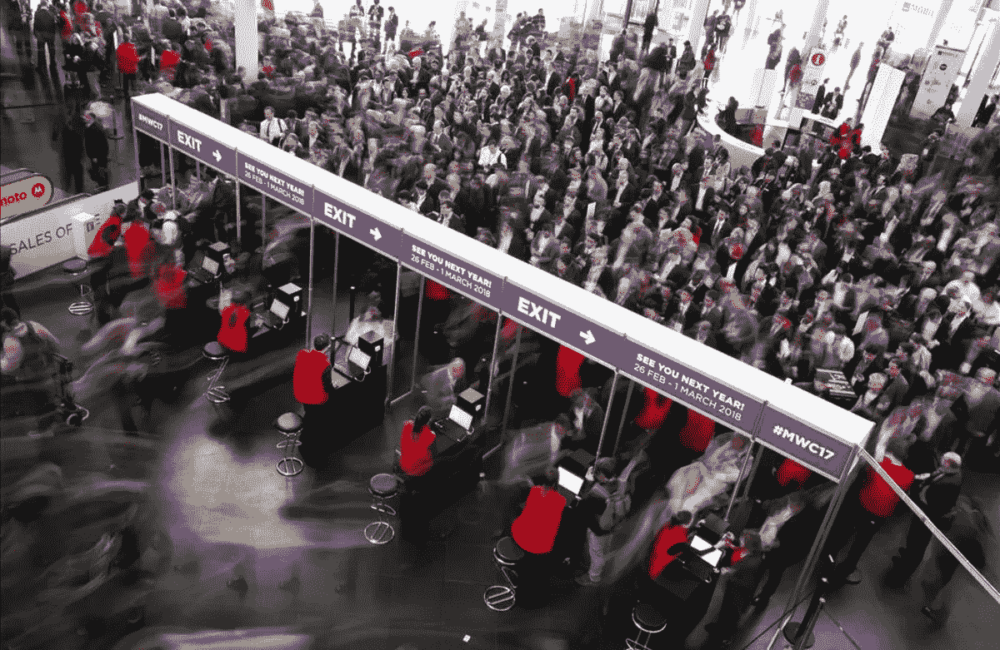
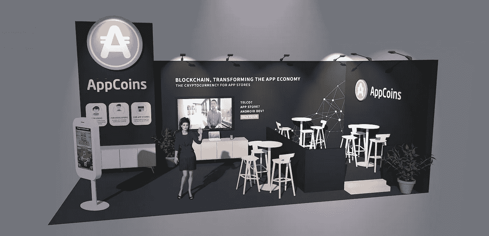

# ANU 排名第三——MWC 和应用商店基金会

> 原文：<https://medium.com/hackernoon/anu-3-mwc-and-app-store-foundation-e252f3578420>

AppCoins 新闻更新，简称 **ANU** ，是 AppCoins 团队每两周一次的定期更新。像往常一样，我们将涵盖开发更新，市场报告，团队成员和即将举行的活动。**本周的焦点**是关于 [**App Store 基础**](https://www.appstorefoundation.org/) **网站和钱包**的状态更新，以及即将到来的 [**世界移动通信大会**](https://www.mobileworldcongress.com/)**【MWC】事件**。你可能会在 2 月 28 日的 MWC 期待下一个 ANU。

**快速链接** [Dev 更新](#4095)
[APPC 市场报道](#9106)
[特色团队成员](#0da0)
[即将发生的事件](#163f)

在过去的两周里，我们一直在努力完成第一批交付品，它们将于 2 月 26 日和 3 月 21 日**交付。这些交付成果是在**应用商店基金会** (ASF)的背景下开发的，该基金会将于今年年底成立，以促进在移动应用经济中发挥作用的几个不同方之间的合作:**开发者、应用商店、原始设备制造商和最终用户。****

## ASF 网站

ASF 网站将于 2 月 26 日**上线**，与此同时[移动世界大会(MWC)](https://www.mobileworldcongress.com/) ，AppCoins 团队的部分成员将出席展示我们的技术，并与希望参与移动应用经济颠覆的潜在合作伙伴进行交流。

目前，我们正在完成网站布局和代码的第一个版本。我们还完成了将在网站上展示的内容的初稿。内容可能仍会稍有改动，以改进关于基金会和协议的沟通和价值主张。

## ASF 钱包

关于 AppCoins 钱包，它将于 3 月 21 日准备就绪，并将加载必要的功能，使用户能够在集成 AppCoins 协议的应用中购买应用内商品。我们将 ASF 钱包放在 [**信任钱包**](https://github.com/TrustWallet/trust-wallet-android-source) 中。我们将在另一篇文章中详述为什么我们决定将我们的钱包放在另一个开源项目中。

Trust Wallet screenshots which will serve as the basis of the ASF wallet

ASF 钱包将提供标准的钱包功能:

*   显示 **AppCoins** 、 **Ether** 和其他 **ERC20/ERC223** 、 **token** 余额。
*   进行交易并查看其状态。
*   进口/出口账户。

此外，它还将实现 [**EIP-681**](https://github.com/nagydani/EIPs/blob/master/EIPS/eip-681.md) 的功能(实际 PR 和讨论可参见 [**此处**](https://github.com/ethereum/EIPs/pull/681) )，以方便购买应用内物品。用户将选择要购买的物品，并在点击应用程序内相应的*购买*按钮后，应用程序将启动钱包，其中已预载了所有所需的交易数据。用户只需点击一个按钮来执行交易，钱包将重定向回应用程序以确认购买。

> 我们的目的是让购买应用内商品变得尽可能简单、快捷和安全。

在接下来的几周里，我们将提供一个使用钱包购买应用内商品的例子。在此期间，请随时关注 ASF 钱包的发展，它的 [**GitHub 页面**](https://github.com/Aptoide/asf-wallet-android) 。

## AppCoins 视频更新(AVUs)

上周，我们还启动了一项计划，旨在以类似访谈的形式回答开发团队成员的一些关键问题。下面可以看到 **AVU #1** 。

我们相信将这个项目与真实的面孔和人联系起来肯定会使社区更加紧密。我们还认为，随着我们的工作，它将增加 **AppCoins** 和**社区之间的**讨论**和**协作**。**

目前的市值接近 5900 万美元，过去 24 小时内三家交易所的成交量为 320 万美元:[币安](https://www.binance.com/trade.html?symbol=APPC_BTC)(73.91%)、[火币](https://www.huobi.pro/appc_btc/exchange/)(26.03%)和[莱克](https://www.lykke.com/cp/tokens-and-coins-traded)(0.06%)。

该值继续主要与 BTC 挂钩，在过去两周内，该值保持稳定，接近 0.60 美元。你可以在 [Coinmarketcap](https://coinmarketcap.com/currencies/appcoins/) 查看更多关于 APPC 市场的信息。

**姓名:** [*法比奥科斯塔*](https://www.linkedin.com/in/f%C3%A1bio-costa-75909365/)
**角色:** *实体工程师。*
**Bio:***fáBio 已经在 Aptoide 工作了两年多，目前正在 solidity 中开发 AppCoins 的智能合约，同时还在开发即将推出的 Android 钱包。*

[世界移动通信大会](https://www.mobileworldcongress.com/)是全球最大的移动行业盛会，由 GSMA 组织，于 2018 年 2 月 26 日至 3 月 1 日在世界移动通信之都巴塞罗那举行。每年都有超过 10 万名与会者和 2300 家参展商。

所有来自原始设备制造商、应用程序商店和移动应用程序开发商的大牌都将出席，所有重大交易都将在这里达成。我们的目标是让尽可能多的应用商店、原始设备制造商和开发者加入该协议。

> 我们认为这是 AppCoins 增长的关键。

AppCoins 将[有一个展台](https://www.mobileworldcongress.com/exhibitor/appcoins/)，在那里 AppCoins MVP 将作为**现场演示**进行演示，在那里您可以直接**见到 AppCoins 团队**。

MWC stand mockup

Telegram 24/7 Support

Official AppCoins Subreddit

AppCoins GitHub