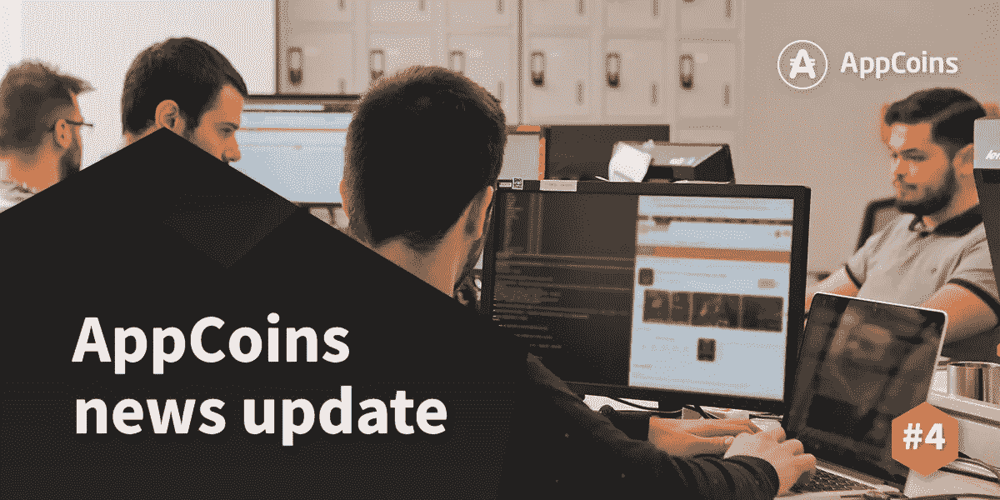
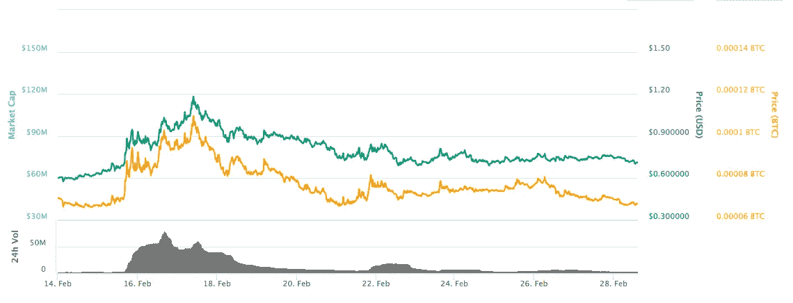
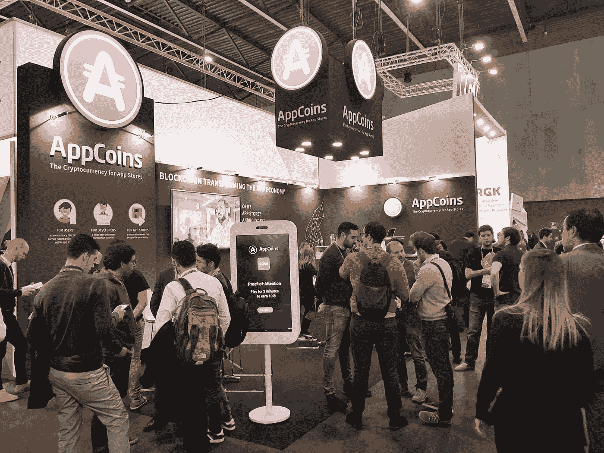
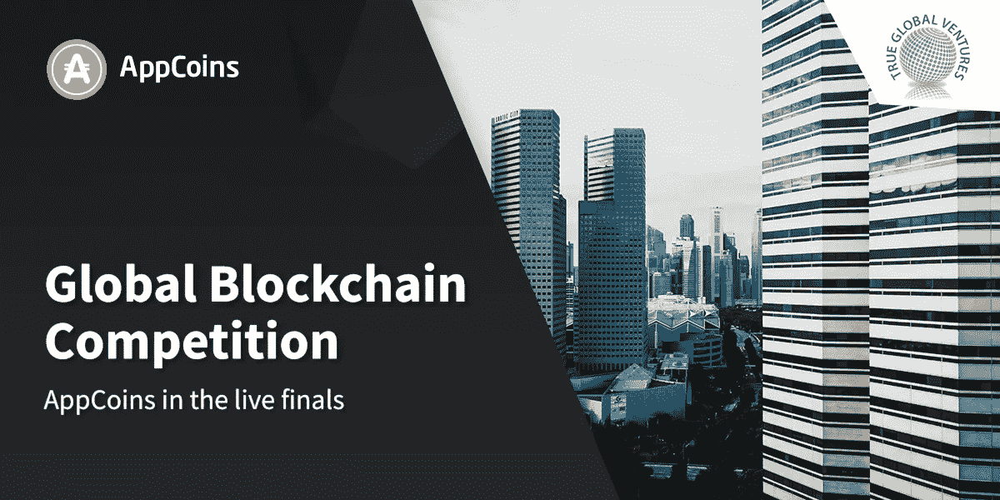

# ANU # 4——App Store 基金会和 MWC 覆盖率

> 原文：<https://medium.com/hackernoon/anu-4-app-store-foundation-and-mwc-coverage-7e277f15bdb0>

AppCoins 新闻更新，简称 **ANU** ，是 AppCoins 团队每两周一次的定期更新。像往常一样，我们将涵盖开发更新，市场报告，特色团队成员和即将举行的活动。**本周的焦点**是关于 [**App Store 基金会**](https://www.appstorefoundation.org/) **(ASF)网站和 ASF 钱包**的状态更新，关于 AppCoins 出席[**移动世界大会**](https://www.mobileworldcongress.com) 的报道，以及即将到来的 [**全球区块链大赛**](https://www.globalblockchaincompetition.com) 。你可能会在 3 月 14 日期待下一届 ANU。

**快速链接** [Dev 更新](#4095)
[APPC 市场报道](#9106)
[特色团队成员](#a816)
[世界移动通信大会](#fe21)
[即将举办的活动](#8978)

过去两周我们一直在**应用商店基金会** **网站**和**应用商店基金会**工作，正如我们在 [**ANU #3**](https://hackernoon.com/anu-3-mwc-and-app-store-foundation-e252f3578420) 中所描述的。

## ASF 网站

正如所宣布的那样，该网站将在 MWC 上及时上线，可以通过[这里](https://www.appstorefoundation.org)访问。该网站为潜在合作伙伴(开发者、应用商店和原始设备制造商)提供有用的信息，因为他们可以向我们咨询 [**早期采用者协议**](/@appcoins/appcoins-mobile-world-congress-and-early-adopters-agreement-ae0dac4cd589) **。**此外，机构群体也对该网站感兴趣，因为 ASF 将是负责 AppCoins 协议参考实施的实体，并促进感兴趣的合作伙伴之间的伙伴关系和协作。

## ASF 钱包

正如我们在 ANU #3 中所说，ASF 钱包的生产就绪版本将于 3 月 21 日准备就绪，并将包括在使用集成 AppCoins 协议的应用程序时支付应用内物品的可能性。

尽管如此，由于我们将在 [MWC](https://www.reddit.com/r/AppcoinsProtocol/comments/80co2a/appcoins_team_at_the_mwc_booth_if_you_are_around/) 展示该协议，我们决定推出一个 [**alpha 版本**](https://play.google.com/store/apps/details?id=com.asf.wallet) 用于在活动期间运行的演示。演示包括让我们展位的参观者玩一个仅 40 秒的快速游戏，并根据他们在游戏中的得分赚取一定数量的 APPC。为此，钱包支持:

*   创建/导入/导出帐户
*   添加 ERC20 令牌
*   发送和接收 ETH 和 ERC20 令牌
*   检查余额
*   隐私和安全:账户的私钥永远不会离开用户的设备

## 后续步骤

接下来两周的后续步骤包括设计和功能开发:

1.  修改钱包的 UX /用户界面，以保证最佳的用户体验，并确保不熟悉以太坊(或其他)钱包的用户仍然可以轻松使用它
2.  在钱包中集成应用内购买流程，使用户在使用集成 AppCoins 协议的其他应用时能够购买应用内商品
3.  开发一个由游戏组成的概念验证，该游戏集成了使用 APPC 的应用内购买，以展示 AppCoins 协议这一用例的协议附加值
4.  开发一个 SDK，使开发人员能够使用 AppCoins 协议的应用内计费流程，这将包括在开发人员应用程序中的简单而快速的集成

别忘了关注 ASF 钱包的 [GitHub 页面](https://github.com/Aptoide/asf-wallet-android)！

目前的市值接近 7100 万美元，在过去 24 小时内，这些交易所的交易量为 382 万美元:币安(78.69%)和火币(21.31%)。

在过去的两周里，该值的波动性在 0.70 美元和 1.00 美元之间增加。这与之前的 ANU 市场报告相比有所改善，当时的价值稳定在 0.60 美元。你可以在 [Coinmarketcap](https://coinmarketcap.com/currencies/appcoins/) 查看更多关于 APPC 市场的信息。

**姓名:** [*佩德罗·伊沃*](https://www.linkedin.com/in/pedromivo/)
**角色:** *产品设计师*
**简历:** *拥有平面设计背景的佩德罗在 Aptoide 做产品设计师已经快一年了。他的目标是与 AppCoins 团队一起优化用户体验。*

巴塞罗那世界移动通信大会已于 2 月 26 日开始，AppCoins 受到了移动社区的广泛关注。除了与会者对新项目的热情，这次活动也是正式启动 App Store 基金会网站和早期采用者协议的机会，您可以在我们最新的[媒体帖子](/@appcoins/appcoins-mobile-world-congress-and-early-adopters-agreement-ae0dac4cd589)中找到详细信息。

在此次活动中，主要焦点将是向移动社区展示 AppCoins 的主要优势。在我们的展位上，除了品牌商品，如包、小册子和硬币钱包，还有一个游戏演示，供希望直接体验注意力模型的人使用，这将在我们的协议中实现，如开发人员更新中所述。你可以在这里看到演示。

## AppCoins 视频更新#2 (AVU)

在本周的 AVU AppCoins 视频更新中，Carolina Març alo 向我们展示了 app coins 协议的商业视角。Carolina Març alo 是 AppCoins 合作伙伴的负责人。凭借在各种机构中担任多种领导角色的经验，Carolina 获得了定义业务战略和最佳业务管理实践的知识，以帮助她参与的每个项目创造价值和业务成功。她在领先的 B2B 合作伙伴关系方面的深厚知识和丰富的数字产品管理经验有助于她在 AppCoins 协议中寻找和达成关键合作伙伴关系。

如果您是开发者、OEM 或应用商店，并且对与 AppCoins 建立合作关系感兴趣，请联系 partnerships@appcoins.io

我们很高兴地宣布，AppCoins 已被选为 [**全球区块链大赛**](https://www.globalblockchaincompetition.com) 的决赛选手！该活动由全球风险投资公司(Global Ventures)赞助，这是一家由世界领先的技术企业家转变为天使投资人的国际早期投资工具，已决定在 2018 年专门投资区块链公司。

尽管竞争激烈(每个类别只有 2-5 份申请被选中)，AppCoins 仍被邀请参加 2018 年 3 月 12 日在新加坡举行的现场决赛，获胜者将由区块链投资者评委团选出。

请访问[全球区块链竞赛](https://www.globalblockchaincompetition.com)或[全球风险投资](https://www.globalblockchaincompetition.com/about-tgv.html)了解更多信息。

Telegram 24/7 Support

Official AppCoins Subreddit

AppCoins GitHub