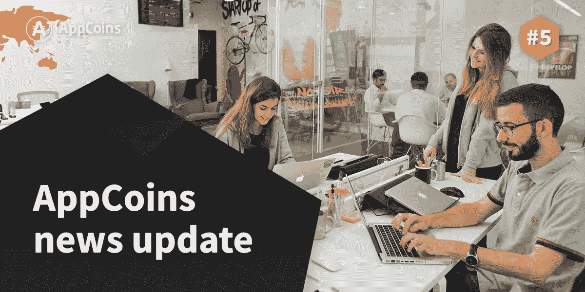
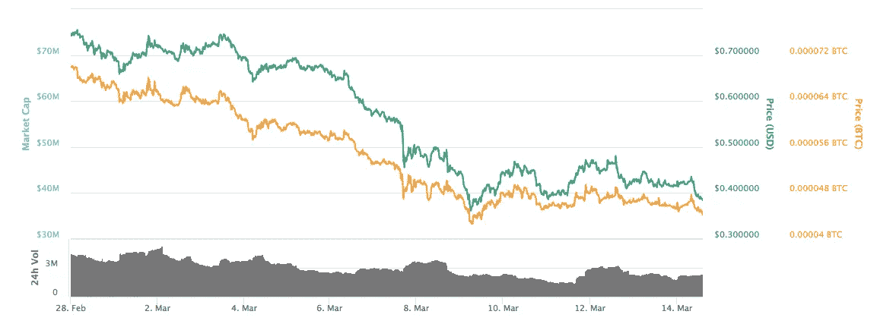
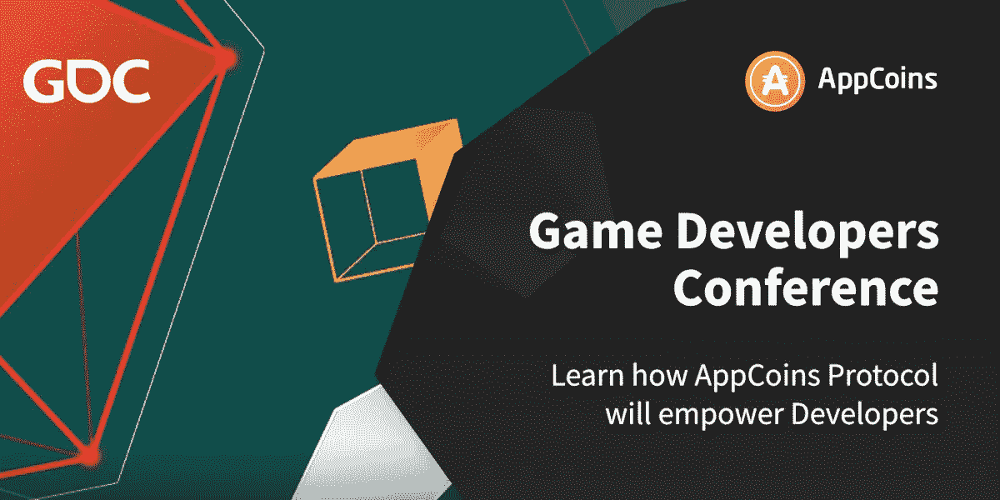

# ANU 第 5 名——应用商店基础 SDK、钱包和 GDC

> 原文：<https://medium.com/hackernoon/anu-5-app-store-foundation-sdk-wallet-and-gdc-4f8c6d60a607>



AppCoins 新闻更新，简称 **ANU** ，是 AppCoins 团队每两周一次的定期更新。像往常一样，我们将涵盖开发更新，市场报告，团队成员和即将举行的活动。**本周的重点**是 **ASF SDK** 实现**应用内计费、ASF 钱包、AppCoins IAB 智能合约**和 AppCoins 出席**[**GDC**](http://www.gdconf.com/)**和[**托克 EN2049**](https://www.token2049.com) 事件。你可能会在 3 月 28 日期待下一届 ANU。****

******快速链接** [Dev 更新](#4095)
[APPC 市场报道](#9106)
[特色团队成员](#a604)
[即将举办的活动](#163f)****

********

****在过去的几周里，我们一直在努力开发我们定于 3 月 21 日**交付的产品:******

*   ******ASF SDK** 为 [**AppCoins 协议**](https://appcoins.io) 实现**应用内计费(IAB)** 过程****
*   ******集成 IAB 流程的 ASF 钱包******
*   ******AppCoins IAB 智能合约**当购买应用内商品时，执行收入分割并在区块链中存储数据****
*   ****集成了 ASF SDK 的应用程序，用于展示 AppCoins IAB 流程****

# ****ASF SDK (alpha 版本)****

****我们一直在开发一个 SDK，作为[**App Store Foundation(ASF)**](https://www.appstorefoundation.org)**工作的一部分。SDK 将于 3 月 21 日作为 alpha 版本发布，实现 AppCoins 协议的 IAB 流程。******

******通过将 SDK 集成到他们的 Android 应用程序中，开发者将能够**允许用户使用 APPC 令牌**支付应用程序内的项目。集成后，开发人员可以指定应用程序中的 SKU，以及他们的 ETH 地址，该地址应该接收用户购买商品的付款。我们计划，对于已经熟悉 Google Play IAB 流程的开发人员来说，SDK 的集成应该不超过 10 分钟。******

****SDK 是以一种与 AppCoins 兼容的钱包无缝集成的方式构建的。该钱包能够**处理 SDK 发出的支付意向**,**执行交易**,**将各自的结果反馈给 SDK** 。第一个 AppCoins 兼容钱包将由 ASF 交付。****

# ****ASF 钱包****

****我们已经在 ASF 钱包中工作了几个星期，我们已经在[**Google Play**](https://play.google.com/store/apps/details?id=com.asf.wallet)**和 [**Aptoide**](https://asf-wallet.en.aptoide.com) 中发布了 alpha 版本，正好赶上我们正在做的 MWC 演示。如果读者希望了解最新的发展(可能不稳定)，可以在 [**这里**](https://github.com/Aptoide/asf-wallet-android/tree/dev) 找到。******

****从那以后，我们一直在实现适应 AppCoins IAB 流程所需的功能。为此，钱包需要能够**识别 ASF SDK 发起的支付意图**，**处理它**和**执行交易**，并且**将交易结果**发送回 SDK。****

****关于支付意图的识别，SDK 和钱包都在实现 [**EIP681**](https://github.com/ethereum/EIPs/blob/master/EIPS/eip-681.md) ，它创建了一个标准来表示交易并允许跨应用程序通信。由 SDK 创建的代表使用 APPC 令牌的交易的 URI 的示例如下:****

```
**ethereum:0xab949343E6C369C6B17C7ae302c1dEbD4B7B61c3@3/transfer?uint256=1000000000000000000&address=0x4fbcc5ce88493c3d9903701c143af65f54481119&data=0x636f6d2e63656e61732e70726f64756374**
```

****钱包识别其意图并对其进行解析，知道 URI 正在对由调用在测试网络 3(即 Ropsten 网络)中的地址 0x ab 949343 e6c 369 c 6 b 17 c 7 AE 302 C1 debd 4 b 7 b 61 c 3(APPC 测试令牌契约)中的智能契约中实现的方法 transfer 组成的交易进行编码，该交易具有 3 个参数:要转移的金额(已经在 wei 中)、要将它们发送到的地址以及要传递的数据。****

****有了这些信息，钱包然后调用 APPC 代币智能合约的 *approve* 方法，声明 AppCoins IAB 智能合约(下面详述)可以代表用户花费一定数量的 APPC 代币。APPC 代币的数量被设置为用户想要购买的应用内商品的价格。之所以打这个电话，是因为**支付的收入分成和实际交易是由 IAB 智能合约**而不是钱包完成的。有人可能会说，钱包可以计算收入分成，然后自己执行交易，但我们打算在区块链中实现这一逻辑，如果需要的话，所有数据都存储在**以备后验**。****

****在*批准*调用完成后，钱包接着调用 IAB 智能合约的*购买*方法。支付完成后，钱包向 SDK 发送关于交易结果的反馈。****

# ****AppCoins IAB 智能合约****

****这种智能合同实现了收入分割，即 85%的购买收入归开发者所有，10%归安装应用的应用商店所有，5%归在其设备中预装应用商店的原始设备制造商所有。它还以事件的形式在区块链中存储关于购买的信息。读者可以在这里 看到智能合约 [**。**](https://github.com/Aptoide/AppCoins-contracts/blob/master/deploy/contracts/AppCoinsIAB.sol)****

****它有一个主要方法来验证合同是否可以代表用户花费所需数量的 APPC 代币，如果可以，则通过调用 APPC 代币智能合同的 *transferFrom* 向开发者、应用商店和 OEM 执行具有相应数量的 APPC 代币的交易。****

****它还**发送一个事件**，以便存储与在区块链购买相关的所有相关数据，供开发者或任何对此感兴趣的人进行**后验确认**。****

# ****集成 ASF SDK 的应用程序****

****为了展示 AppCoins IAB 过程，我们决定将 SDK 集成到 [**琐碎驱动**](https://github.com/googlesamples/android-play-billing/tree/master/TrivialDrive) 中，这是一款用于演示 Google Play IAB 的开源游戏。它将允许我们展示 AppCoins IAB 流程的简单性，以及展示在应用程序中集成 SDK 是多么容易，以及它如何与 ASF wallet 交互。****

****集成了 SDK 的平凡驱动版本也将在我们的 repo 中发布，作为希望集成 SDK 的开发人员的示例。**还会有关于整合所需步骤的文档**。****

# ****后续步骤****

****在 3 月 21 日**发布上述人工制品后，我们将重点关注 AppCoins 协议的**广告用例。在这个用例中，开发者可以创建广告活动，根据用户对与活动相关的应用程序的关注度来奖励用户。********

****广告用例也将由几个人工制品组成，如升级的 ASF SDK 和 Wallet，以及实现区块链中所需的必要协议逻辑的智能合约。****

****在我们的几个 Github repos 中随意关注我们的工作: [**ethereumj**](https://github.com/Aptoide/AppCoins-ethereumj) 、 [**契约**](https://github.com/Aptoide/AppCoins-contracts) 和 [**钱包**](https://github.com/Aptoide/asf-wallet-android) 。****

********

****目前的市值接近 3839 万美元，过去 24 小时内这些交易所的成交量为 238 万美元:[币安](https://www.binance.com/trade.html?symbol=APPC_BTC) (42.80%)和[火币](https://www.huobi.pro/appc_btc/exchange/) (57.20 %)。****

********

****APPC 价值继续与比特币联系在一起。由于几个因素，BTC 最近经历了货币贬值。其中一个原因是关于大众交易所明显违规的谣言。
另一个原因是监管机构，如[美国证券交易委员会(SEC)](https://www.sec.gov/news/public-statement/enforcement-tm-statement-potentially-unlawful-online-platforms-trading) 和日本金融服务厅(FSA)最近采取了新的[执法行动](https://www.internetsociety.org/blog/2018/03/u-s-sec-targets-unregulated-cryptocurrency-exchanges/)，以增加对所有作为交易所运营的平台的监管措施。虽然最近的公告可能导致 BTC 价值下降，并因此导致其他虚拟令牌(包括 APPC)下降，但从长远来看，对交易所的适当监管将为所有客户带来更好的安全措施。你可以在 [Coinmarketcap](https://coinmarketcap.com/currencies/appcoins/) 查看更多关于 APPC 市场的信息。****

********

******姓名:**[Carolina Mara lo](https://www.linkedin.com/in/carolina-mar%C3%A7alo-4333a41/)
**角色:** *合作伙伴关系负责人*
**简历:** *领导 Aptoide 应用商店中的 B2B 合作伙伴关系在过去的 4 年多时间里，Carolina Mara lo 是 AppCoins 白皮书的共同作者之一，目前正在与合作伙伴一起采用 AppCoins 协议，并领导与 crypto-exchange 的所有关系。*****

****************

****AppCoins 将参加世界上最大的专业游戏行业活动:T21 游戏开发者大会。****

****曾经在一个小客厅里开始的聚会现在已经发展成为为期一周的会议，包括数百场关于游戏开发和虚拟现实主题的讲座、教程和圆桌讨论。该活动预计将有超过 26，000 名行业专家和爱好者参加。****

****请务必在 3 月 22 日(星期四)查看 AppCoins 会议室(NDA 6 号房间—310 号(南大厅 3 层))，并与 AppCoins 团队交谈，了解采用 AppCoins 协议的几个好处，包括:增加收入份额，降低欺诈流量的风险，以及在所有支持 AppCoins 的应用商店内工作的单一 APK 集成。****

****我们还将于 3 月 21 日(星期三)下午 3:30—4:30(太平洋时间)在西厅 2011 室举行一场演讲。****

****更多信息请访问:[http://www.gdconf.com/](http://www.gdconf.com/)****

********

****2018 年 3 月 20 日至 21 日，所有加密爱好者的最大聚会之一——EN2049 大会将在香港举行。这个活动是讨论不断增长的加密生态系统的主要平台。****

****在活动期间，来自世界各地的人们能够展示他们的加密项目，并分享关于生态系统的知识和见解。除此之外，还将讨论象征性的全球发展及其对行业的影响。****

****如果您参加此次活动，请不要错过与亚太区副总裁 [Tiago Alves](https://www.linkedin.com/in/tiagoalves/) 交谈的机会，以了解更多关于我们项目的信息。****

****乐然更多通过访问 https://www.token2049.com****

****[](https://t.me/appcoinsofficial)

Telegram 24/7 Support**** ****[](https://www.reddit.com/r/AppcoinsProtocol/)

Official AppCoins Subreddit**** ****[](https://github.com/Aptoide/AppCoins-ethereumj)

AppCoins GitHub****