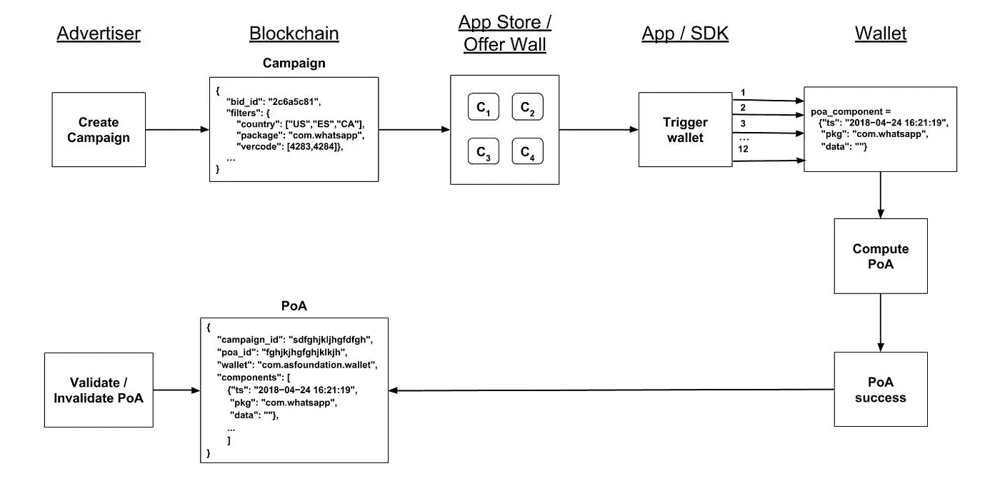

# ANU #6 — ASF Wallet Alpha 2、GDC 保险和企业以太坊联盟

> 原文：<https://medium.com/hackernoon/anu-6-asf-wallet-alpha-2-gdc-coverage-and-ethereum-enterprise-alliance-7263c61fcf93>


AppCoins 新闻更新，简称 **ANU** ，是 AppCoins 团队每两周一次的定期更新。像往常一样，我们将报道最新的开发更新，关于[**App Store Foundation**](https://www.appstorefoundation.org/asf-wallet)**网站和 [**发布的**](/@appcoins/alpha-2-version-of-the-asf-wallet-is-here-78cf1da5eb13) Alpha 2 版本两者的 [**ASF 钱包**](https://play.google.com/store/apps/details?id=com.asfoundation.wallet) 和 [**ASF SDK**](https://github.com/Aptoide/ASFIABSample) **，**特色团队成员，详细报道 [**游戏开发者大会**你可能会在 4 月 11 日期待下一个 ANU。](http://www.gdconf.com)**

****快速链接** [Dev 更新](#4095)
[APPC 市场报道](#9106)
[特色团队成员](#a175)
[游戏开发者大会](#1888)
[战略联盟](#7e36)**

****

**3 月 21 日，我们 [**发布了**](/@appcoins/alpha-2-version-of-the-asf-wallet-is-here-78cf1da5eb13) 的 Alpha 2 版本，既有 [**ASF 钱包**](https://play.google.com/store/apps/details?id=com.asfoundation.wallet) **，**已经在 [**Google Play**](https://play.google.com/store/apps/details?id=com.asfoundation.wallet) 和 [**Aptoide**](https://asf-wallet-app-store-foundation.en.aptoide.com/) **，**和 [**ASF SDK**](https://github.com/Aptoide/ASFIABSample) **。**随着必要的 [**智能合约**](https://github.com/Aptoide/AppCoins-contracts/blob/master/deploy/contracts/AppCoinsIAB.sol) 实现应用内购买的收入分成，这一版本允许用户和开发者第一次看到使用 APPC 的应用内购买是如何可能和简单的。**

**正如在 [**ANU #5**](https://hackernoon.com/anu-5-app-store-foundation-sdk-wallet-and-gdc-4f8c6d60a607) 中所说，在接下来的 4 周里，我们将致力于 ASF Wallet 和 ASF SDK 的 Alpha 3 版本，以及协议本身。Alpha 3 将包括第一个版本的广告用例 [**AppCoins 协议**](https://appcoins.io) ，允许开发者创建活动并奖励使用他们应用的用户。**

# **阿尔法 3**

****

**AppCoins protocol — Advertising flow**

**AppCoins 协议的广告流假设由广告商(开发者)创建活动，并由应用商店收集活动活动，以显示给匹配活动过滤器的用户。我们将为这两个过程提供工具。为了便于演示，在发布 Alpha 3 时，我们将提供一个包含一些活动的报价墙来展示实现的功能。**

## **活动创建**

**我们将在 ASF 网站[](https://appstorefoundation.org)****中提供一个接口，可以使用来创建活动。广告商(开发者)将能够引入必要的数据产生有效的活动，例如活动过滤器(包名称、包版本代码、本地化)。******

****一旦开发者引入了所有必要的数据，该活动将被发送到一个**智能契约，该契约将存储这些数据**并由**触发一个事件**。****

## ****报价墙****

****我们将开发一个优惠墙，举例说明如何从区块链获得积极的活动，并向用户展示。这应该由集成了 AppCoins 协议的应用商店来完成，因为他们是分发应用的一方。****

## ****ASF SDK****

****SDK 将包含逻辑，负责在应用首次启动时触发钱包对**注意力证明(PoA)** 的计算。由于该协议规定，要进行归属，用户必须对应用程序给予至少 **2 分钟的关注**，SDK 将以必要的数据触发 ASF 钱包(或任何其他 AppCoins 兼容的钱包)12 次，间隔 10 秒。****

## ****ASF 钱包****

****钱包负责获取 SDK 发送的 12 个 PoA 组件，并在获取所有组件后计算完整的 PoA。每个组件由以下字段组成:****

```
**poa_component = {"ts": 1521907200,
                 "package_name": "com.whatsapp",
                 "nonce": "9oi81n6nhzx5"}**
```

****活动方案的形式如下:****

```
**{
    "campaign_id": "dfgbhnjkm", # defined when creating the campaign
    "poa_id": "uygfcvjhg", # hash of all the fields
    "wallet": "com.asfoundation.wallet",
    "package_name": "com.whatsapp",
    "components": [{"ts": 1521907200, "nonce": "9oi81n6nhzx5"}, 
                   {"ts": 1521907210, "nonce": "9oi81n6nhzx5"},
                   {"ts": 1521907220, "nonce": "9oi81n6nhzx5"},
                   {"ts": 1521907230, "nonce": "9oi81n6nhzx5"},
                   {"ts": 1521907240, "nonce": "9oi81n6nhzx5"},
                   {"ts": 1521907250, "nonce": "9oi81n6nhzx5"},
                   {"ts": 1521907260, "nonce": "9oi81n6nhzx5"},
                   {"ts": 1521907270, "nonce": "9oi81n6nhzx5"},
                   {"ts": 1521907280, "nonce": "9oi81n6nhzx5"},
                   {"ts": 1521907290, "nonce": "9oi81n6nhzx5"},
                   {"ts": 1521907300, "nonce": "9oi81n6nhzx5"},
                   {"ts": 1521907310, "nonce": "9oi81n6nhzx5"}]
}**
```

****一旦 PoA 被计算出来，钱包就将它发送给智能合约，以便以事件**的形式将它**存储在区块链**中。开发者随后可以对其进行验证/无效，并在用户(85%)、应用商店(10%)和 OEM (5%)之间进行自动收入分成。******

**钱包的**交易界面**也将**修改**以使每笔交易的**类型更加清晰。目前，我们有**发送**和**接收令牌**的事务，我们也已经有了由**调用智能契约方法**组成的事务。此外，在接下来的 4 周结束时，我们还将进行包括**向区块链**提交 poa 的交易。因此，用户能够立即识别每个事务的上下文非常重要。****

# **ASF 网站**

**我们还将在 ASF 网站上发布信息，介绍如何**成为 ASF** 的成员，并加入工作组，帮助我们实现**颠覆 app 经济和动态**的目标。一旦有了信息，我们会让你知道，我们鼓励你参加这场革命。**

**通过查看我们的 Github repos，您可以随时关注我们关于 [**钱包**](https://github.com/Aptoide/asf-wallet-android) 、 [**SDK**](https://github.com/Aptoide/AppCoins-ethereumj) 和 [**智能合约**](https://github.com/Aptoide/AppCoins-contracts) 的工作。**

****

**目前的市值接近 4072 万美元，过去 24 小时内三家交易所的交易量为 330 万美元:币安(49.33%)和火币(50.67%)。**

****

**在过去的两周内，该值基本保持稳定，接近 0.40 美元。自 ANU 排名第五以来，AppCoins 的双周变化约为 5%。这种增长与我们的最新成就一致，包括最近发布的 ASF Wallet 和 SDK (Alpha 2)，以及 GDC 中的 AppCoins 演示。你可以在 [Coinmarketcap](https://coinmarketcap.com/currencies/appcoins/) 查看更多关于 APPC 市场的信息。**

****

****姓名:** [蒂亚戈·阿尔维斯](https://www.linkedin.com/in/tiagoalves/)
**职位:** *亚太区副总裁*
**简历:**蒂亚戈于 2015 年成为 Aptoide 的第一任副总裁，此前他领导了 apto ide 的 A 轮融资，并在新加坡开设了第一个国际办事处，目前他在新加坡工作。最近，他在 AppCoins 的 ICO 期间发挥了关键作用，领导投资者关系部的工作，并确保一切就绪，以实现成功销售。**

********

**参加 [**游戏开发者大会**](http://www.gdconf.com/) 对 AppCoins 来说是一个重要的机会，不仅可以向开发者生态系统推广基于区块链的新解决方案，还可以利用从相关利益方获得的知识来开发 AppCoins 解决方案。在这次活动中，AppCoins 团队有机会与来自不同方面的利益相关者会面:出版、平台和区块链。**

*   ****在发行端**，我们遇到了育碧、6 Waves、Nordius、Razerzone、大鱼、Zynga、Spil Games。**
*   ****在平台方面**，我们会见了全球第三方平台，包括三星。**
*   ****在区块链方面**，我们会见了来自北海巨妖、CoinMode、Bankex 的联系人。**

****

**在 [**演讲环节**](https://www.slideshare.net/RenTang1/appcoins-gdc-2018-presentation) 上，团队展示了 AppCoins 作为目前应用经济低效率的解决方案。除了提到其应用广告、应用内购买和应用批准的主要支柱，该团队还解释了总部位于区块链的解决方案**如何旨在统一第三方应用商店**的分散市场，并准备在 2021 年增长到 36B。AppCoins 作为一款面向平台和应用商店的产品，将使第三方应用商店能够从全球开发者和出版商那里获取内容，包括最大的市场之一中国的数百个分散的平台。**

****

**总的来说，参加此次活动对 AppCoins 团队来说是一次非常积极的经历，因为它提供了会见行业内相关利益方的机会，了解他们的需求，验证我们的价值主张，并阐明对 AppCoins 解决方案的改进。我们刚刚开始在移动应用市场利用区块链技术，这些经验将有助于 AppCoins 成为一个**有用和有价值的 B2B 和 B2C 产品。****

> **收到的反馈非常有希望，许多开发者对我们“一个 APK，多个应用商店”的愿景感兴趣，以统一分散的市场。**

**你可以在这里找到任堂在 GDC [的演讲视频短片，点击](https://youtu.be/_MQXwaBpg1Y)[这里](https://www.slideshare.net/RenTang1/appcoins-gdc-2018-presentation)可以看到演讲的完整版本。**

********

**支持并能够与世界上最大的公司之一合作，对于建立 AppCoins 协议的定义及其项目合法性非常重要。AppCoins 协议，即将成为 App Store 基金会，自豪地宣布它最近成为了**企业以太坊联盟** (EEA)的成员。EEA 拥有超过 120 个成员，其目标是在以太坊和智能合约的帮助下，帮助企业进入区块链技术时代。EEA 成员的**名单包括微软、ING、JP 摩根、英特尔**和许多更有影响力的公司，它们都是以更高效、更适合企业的方式定义企业级、软件集成能力、要求苛刻的应用的一部分。**

**加入企业以太坊联盟将允许 AppCoins 团队分享观点并**参与工作组**以寻找解决 AppCoins 协议试图应对的主要挑战的解决方案:**

*   ****广告** —那里有致力于研究、开发和贡献基于 mainnet 以太坊的解决方案的团体，以应对广告业面临的问题，包括广告欺诈和供应链完整性。**
*   ****应用内购买流程** —我们将有机会与现有会员建立合作关系，为金融资产构建更好的实践和模板，以确保与多种操作系统的兼容性。**

**[](https://t.me/appcoinsofficial)

Telegram 24/7 Support** **[](https://www.reddit.com/r/AppcoinsProtocol/)

Official AppCoins Subreddit** **[](https://github.com/Aptoide/AppCoins-ethereumj)

AppCoins GitHub**