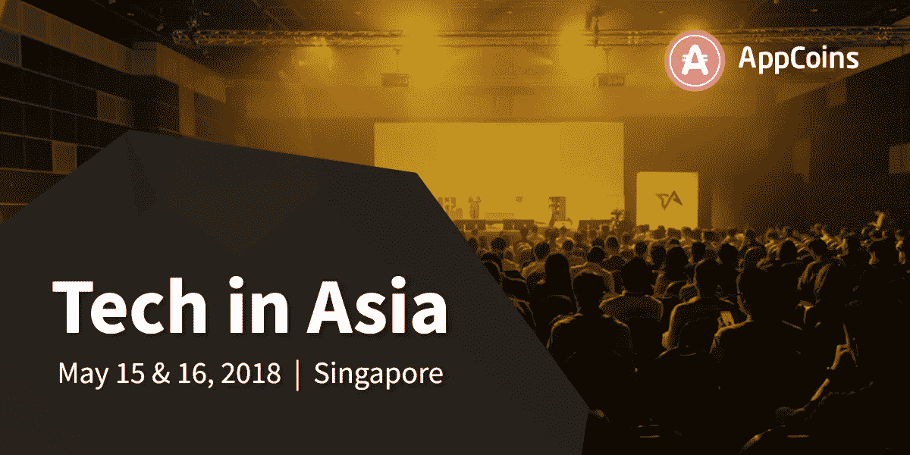

# ANU #7 — ASF SDK、ASF Wallet Alpha 3 和工作组

> 原文：<https://medium.com/hackernoon/anu-7-asf-sdk-asf-wallet-alpha-3-and-working-groups-43e6329633c7>

AppCoins 新闻更新，简称 **ANU** ，是 AppCoins 团队每两周一次的定期更新。像往常一样，我们将涵盖开发更新，市场报告，团队成员和即将举行的活动。**本周的焦点**是 **AppCoins 协议**(智能合约) **ASF 钱包**， **ASF SDK** ，以及 **ASF 网站，亚洲科技大会和工作组**。你可能会在 4 月 25 日期待下一个 ANU。

**快速链接** [Dev 更新](#4095)
[APPC 市场报道](#9106)
[特色团队成员](#432d)
[即将发生的事件](#163f)
[工作组](#4c04)

又一个两周，又一个开发更新！在 [**上一期 ANU**](https://hackernoon.com/anu-6-asf-wallet-alpha-2-gdc-coverage-and-ethereum-enterprise-alliance-7263c61fcf93) 中，我们已经详细介绍了 [**AppCoins 协议**](https://appcoins.io) 的下一个主要版本——Alpha 3——的后续步骤以及与之交互的工具。如前所述，Alpha 3 将存在于第一个版本的**广告用例**中，开发者(广告商)可以**创建活动**来推广他们的应用，用户可以**因关注和使用他们的应用而获得 APPC** 。

在过去的两周里，我们一直在各方面努力:AppCoins 协议(智能合约)、ASF 钱包、ASF SDK 和 ASF 网站。Alpha 3 将包括为广告用例交付所有这些组件。

# AppCoins 协议

当我们谈论 AppCoins 项目的协议部分时，我们谈论的是依赖以太坊区块链的逻辑和功能，即我们需要开发的智能合约。

对于广告用例，智能合同逻辑允许开发人员创建和停止活动，以及检查哪些活动当前正在进行，以及用户可以从哪些活动中获得 APPC。它还可以注册和验证由 ASF Wallet 和 ASF SDK 计算的每个注意力证明(PoA)。该证明表明用户已经给予了他的关注并且已经使用了与当前打开的活动相关联的应用。

到目前为止，我们已经创建了功能来**创建活动**和**检查哪些活动是活动的**。请随意检查我们的 [**智能合约回购**](https://github.com/AppStoreFoundation/asf-contracts/blob/dev/deploy/contracts/Advertisement.sol) 的**开发**分支中的代码。

# ASF SDK

SDK 从开发人员那里移除了检查应用是否正在运行的逻辑**和触发 ASF 钱包的逻辑**以便一旦所需的 12 个组件被注册，它**注册 PoA 组件**并且**计算完整的 PoA。请参考 [**最后 ANU**](https://hackernoon.com/anu-6-asf-wallet-alpha-2-gdc-coverage-and-ethereum-enterprise-alliance-7263c61fcf93) 的 ASF Wallet 部分，查看 PoA 组件和完整 PoA 的格式。******

到目前为止，我们已经开发了具有上述功能的 SDK 的第一个版本。我们将润色一些边缘案例，为出版做准备。如果你想查看进展如何，请到我们 [**SDK 回购**](https://github.com/AppStoreFoundation/asf-sdk/tree/dev) 的 **dev** 分支。

# ASF 钱包

对于广告用例，钱包负责**注册 PoA 组件**，并负责**在注册必要的 **12 组件**后计算完整的 PoA** 。

注册一个 **PoA 组件**需要**计算一个 *nonce*** 来帮助减轻点击欺骗的风险。*随机数*使用与用于比特币挖掘的**相同的机制进行计算，但难度根据所使用的智能手机进行调整，即计算出的哈希中所需前导零的数量根据智能手机进行设置。**

请访问 [**钱包回购**](https://github.com/AppStoreFoundation/asf-wallet-android/tree/dev) 的**开发**分支，查看开发状态。

# ASF 网站

关于网站，我们一直在进行信息重组。这使参观者能够**更好地了解基金会的使命**和协议发展的状态**。**

此外，我们也一直在包括更多关于**成为** [**基金会**](https://appstorefoundation.org) 成员的信息。这将开放与我们合作的工作组，并向我们提供反馈，帮助我们以**向用户、开发者和应用商店**交付最大价值的方式开发协议。

我们也一直在做网页**,使开发者和用户能够就广告用例与协议 T11 进行互动。这些页面使开发者能够**创建活动**——一个创建活动页面——并允许用户**检查哪些活动是打开的**——一个报价墙页面。后者将是应用程序商店的责任，他们应该向用户展示活动。我们正在开发的页面作为技术的展示窗口，与 SDK 和钱包一起，它使开发者和用户能够看到广告用例的整个流程。**

我们将发布文档和示例，介绍如何使用元掩码创建活动，以及如何在浏览器中查看它们。

目前的市值接近 3439 万美元，在过去 24 小时内，这些交易所的交易量为 311 万美元:币安(44.52%)和火币(55.48%)。

AppCoins 继续与比特币绑定。在过去的两周里，AppCoins 的价值经历了更大的波动，最高为 0.437 美元，最低为 0.288 美元。波动性增加的主要原因可以用当前中美之间的贸易战来解释，这对加密货币以及所有市场都产生了影响；美国的纳税截止日期是 4 月 17 日。你可以在 Coinmarketcap 查看更多关于 APPC 市场的信息。

**姓名:** [任堂](https://www.linkedin.com/in/rentang/)
**角色:** *产品 VP*
**履历:**之前在 Goodgames，EA，Disney 孵化手游和 app。任堂是 AppCoins 的产品副总裁，一直致力于团队发展和产品愿景。

首届 [**TIA —亚洲技术会议**](https://www.techinasia.com/events/singapore) 于 2012 年举行，此后发展成为亚洲最大的技术会议之一**。它的使命是**在线下环境中连接创业生态系统**，以帮助世界各地的企业**发现最新趋势和见解**，并且**与行业领导者**和技术社区**中充满激情的个人**建立联系。**

我们很自豪地宣布，AppCoins 亚太区副总裁 **Tiago Alves** 将成为令人印象深刻的演讲者阵容的一部分，在这里**行业专家**、**区块链公司的首席执行官**和**风险投资家**将分享他们对这项技术的**想法和经验。**

Tiago 的演讲名为“**下一步是什么:ICO** 后的生活”，将发生在活动的第二天，它将在**区块链舞台**上举行。顾名思义，它将涵盖在 ICO 之后企业如何准备他们的战略和未来步骤的见解。蒂亚戈的演讲将以 AppCoins 的成功经验为基础。

[**TIA——亚洲科技**](https://www.techinasia.com/events/singapore/) ，将于 5 月 15 日& 16 日在新加坡 **Suntec 会展中心举行。**

[App Store 基金会](https://www.appstorefoundation.org)目前正在为协议讨论创建**工作组**。将会有三个不同的组:**应用内购买**、**应用广告**和**开发者声誉**，这样 ASF 成员可以进行更专注于协议不同部分的讨论。工作组的目的是为**应用生态系统参与者**提供一个机会，让**分享见解**，同时**帮助 AppCoins 团队**了解如何改进其解决方案，以便更好地解决应用经济效率低下的问题。

**WG1 — App 广告**

*应用广告工作组*旨在**设计新的程序来提高 AppCoins 的应用广告流量。**这些程序的**目标是优化消费者获取，同时面对应用行业问题** **如广告欺诈和应用广告流程中的高额中介**。该工作组对所有 ASF 成员开放，特别关注应用商店和开发者。

**WG2 —应用内购买**

*应用内购买工作组*的使命是**促进与应用内购买相关的 AppCoins 流的创新。**该工作组专注于通过缩小或消除进入壁垒来提高应用程序用户对应用程序经济的可访问性，其目标是利用区块链技术为全球消费者提供无缝方式来活跃在这一经济中。ASF 成员，如应用商店和开发者，以及支付行业玩家、邻近的区块链项目和相关领域的研究人员，都欢迎做出贡献。

**WG3 —开发者信誉**

**透明的应用审批流程、开发者的声誉和网络安全**是*开发者声誉工作组*的主要议题。该工作组旨在**设计和提出新的程序，从效率和性能以及应用程序消费者的安全性方面优化应用程序商店的网络安全流程。所有 ASF 成员都可以为这个工作组做出贡献，特别是应用程序商店、网络安全公司、相关的区块链项目和该领域的研究人员。**

Telegram 24/7 Support

Official AppCoins Subreddit

AppCoins GitHub