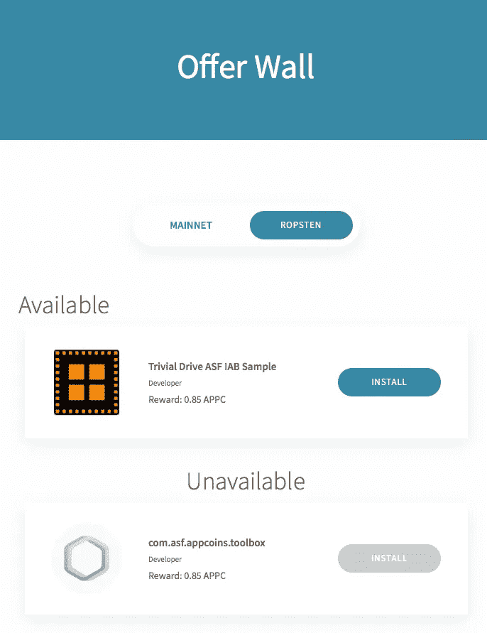

# ANU #8 — AppCoins 协议、ASF SDK、钱包和会员资格

> 原文：<https://medium.com/hackernoon/anu-8-appcoins-protocol-asf-sdk-wallet-and-membership-5c2c9154dca3>

AppCoins 新闻更新，简称 **ANU** ，是 AppCoins 团队每两周一次的定期更新。像往常一样，我们将涵盖开发更新，市场报告，团队成员和其他新闻。**本周的焦点**是 **AppCoins 协议**(智能合约) **ASF 钱包****ASF SDK****广告活动的创建**以及 **ASF 会员资格。你可能会在 5 月 9 日看到下一届 ANU。**

**快速链接** [开发更新](#4095)
[创建活动](#7ef3)
[APPC 报道](#9106)
[精选会员](#51e0)
[ASF 会员](#cfbf)

过去的两个星期一直在为 5 月 2 日**的 **Alpha 3 发布**做准备。这个主要版本将包括 [**AppCoins 协议**](https://appstorefoundation.org) 的最大流程之一:**广告用例**。正如我们在之前的文章中所解释的，这一功能使用户能够**通过将应用**用于相关的广告活动来获得 APPC。**

**AppCoins 项目的所有主要组件都参与了此次发布:区块链**(通过智能合约)**、SDK 、钱包**和网站**。******

# ****AppCoins 协议****

****Alpha 3 的区块链部分由一个**智能合同**组成，该合同能够在区块链**创建和存储广告活动**，以及知道哪些是**当前活跃的活动**、**提交和验证关注证明(PoAs)** 、以及**奖励用户关注活动中的应用**。****

****在 [**最后一个 ANU**](https://hackernoon.com/anu-7-asf-sdk-asf-wallet-alpha-3-and-working-groups-43e6329633c7) 发布的时候，智能合约能够执行前两个动作。在这两周内，我们已经能够实现剩余的功能。用户可以**提交 PoA**，通过检查 PoA 是否包含**正确计算的随机数**来验证 PoA，并通过事件在区块链中注册(请检查 [**ANU #7**](https://hackernoon.com/anu-7-asf-sdk-asf-wallet-alpha-3-and-working-groups-43e6329633c7) 进行澄清)。验证 PoA，以检查是否**计算了用户至少两分钟**的注意力。在验证了 PoA 的正确性之后，智能合同可以**验证用户是否已经转换了给定的活动**。最后，如果 PoA 被验证，并且如果用户还没有转换活动，智能合同**分割属性**并且**将其每个部分转移**给用户(85%)、应用商店(10%)和 OEM (5%)。****

****我们还在主网发布了 IAB 和广告(目前的状态)。这意味着 **SDK** 和**钱包**已经能够**利用主网**整合流量，用户和开发者已经能够**分别利用真实的 APPC** 赚钱和货币化。这是 AppCoins 项目的一个重要里程碑！****

****您可以使用 [**Etherscan.io**](https://etherscan.io) 查看主网 [**智能合约【GitHub repo】**](https://github.com/AppStoreFoundation/asf-contracts)的最新动态，查看 [**IAB**](https://etherscan.io/address/0xb015d9bbabc472bbfc990ed6a0c961a90a482c57#code) 和 [**广告**](https://etherscan.io/address/0xEb907A50921E052CbeE233811BEAf0839d2A98FD#code) 的已部署合约。****

# ****ASF SDK****

****SDK 负责**为 PoA 组件**的计算触发钱包，并且能够**为所有 AppCoins 项目流与多个网络**(测试和主网络)合作:IAB 和广告。****

****时至今日，SDK 已经能够做到这一点。它可以在主网络和备用网络中工作，这取决于开发人员完成的集成。如果开发者想将他们的应用程序货币化，他们可以集成 SDK 来使用主网络。另一方面，如果应用程序应该用于测试，开发者可以在调试模式下集成 SDK，并使用 Ropsten 网络，其中 ETH 和 APPC 没有真正的货币价值。****

****您可以在 [**SDK GitHub repo**](https://github.com/AppStoreFoundation/asf-sdk) 中查看项目当前状态和 [**集成文档**](https://github.com/AppStoreFoundation/asf-sdk/blob/master/README.md) 。****

# ****ASF 钱包****

****钱包负责**计算 PoA** 和**处理来自 IAB 的交易和由 SDK 触发的广告流**。****

****就像 SDK 一样，钱包已经可以与主网络和 Ropsten 网络中的两种流一起工作。我们已经在 [**Google Play**](https://play.google.com/store/apps/details?id=com.asfoundation.wallet) 和 [**Aptoide**](https://asf-wallet-app-store-foundation.en.aptoide.com) 中部署了它的当前版本。****

****Alpha 3 版本的下一步包括重新设计交易界面，以及改进应用导航。它将使用户更好地理解通过钱包完成的交易，因为用户不仅可以进行正常的“发送令牌”交易，还可以进行应用内购买和从应用中赚取硬币的交易。下面是一个新的交易屏幕和底部导航栏的模型。****

********

******Transactions screen** redesign mock****

****随时关注我们的工作，并通过 [**钱包的 GitHub repo**](https://github.com/AppStoreFoundation/asf-wallet-android) 给我们反馈。****

********

****在这两个星期里，我们一直在做两个页面，分别为用户创建广告活动和显示活动活动。****

****创建活动的流程从 [**创建活动**](https://appstorefoundation.org/campaign) 页面开始，开发人员可以在这里指定活动的详细信息，并将其提交给我们的智能合同。****

****开发人员需要指定:****

*   ****包名****
*   ****活动的开始和结束日期****
*   ****用户每次转换活动时支付的 APPC 属性值****
*   ****开发商希望在 APPC 的活动中花费的预算****
*   ****活动对其有效的应用程序的版本代码****
*   ****活动应该出现的国家****

********

******Create Campaign** page****

****创建活动后，开发者和用户可以进入 [**要约墙**](https://appstorefoundation.org/offer-wall) 页面，查看活动中的活动。用户可以直接从优惠墙上下载应用。****

****它分为**可用**和**不可用**两种活动，后者意味着 APK 在 Aptoide 中尚不可用。一旦可用，该活动将改变其在优惠墙中的状态。****

****用户还可以在主网络和 Ropsten 网络中查看可用的活动。****

********

******Offer Wall** page****

********

****目前的市值接近 5600 万美元，在过去 24 小时内，这些交易所的交易量为 676 万美元:币安(61.88%)、火币(38.09%)和莱克(0.03%)。****

********

****AppCoins 继续与比特币绑定。在过去的两周内，AppCoins value 的价格有所上涨，在 4 月 24 日达到了 0.645 美元的高点。自从 [ANU#7](https://hackernoon.com/anu-7-asf-sdk-asf-wallet-alpha-3-and-working-groups-43e6329633c7) 以来，Appcoins 的价值已经见证了大约 86%的飙升。你可以在 [Coinmarketcap 查看更多关于 APPC 市场的信息。](https://coinmarketcap.com/currencies/appcoins/)****

********

******姓名:**[Christopher ferre IRA](https://www.linkedin.com/in/christopher-ferreira-b02b7769/)
**角色:**质量保证经理
**简历:** Christopher 已经在 Aptoide 工作了大约两年，目前正在开发 AppCoins 协议中使用的智能合约内的测试以及交付产品的可用性测试。他的目标是在交付给最终用户之前确保高质量的产品。****

****************

****为确保 AppCoins 协议的**独立性和可持续性，将创建一个**基金会**作为非营利组织:[**App Store 基金会(ASF)**](https://www.appstorefoundation.org/) **。**ASF 的**任务**是**确保 AppCoins 生态系统**的开放治理，以**支持其发展**(在 Aptoide 执行初始实现之后)和技术的持续**创新**。******

****作为 ASF** 的成员，市场参与者将与行业领导者合作，为应用行业寻求**基于以太坊的技术最佳实践**、**开放标准**和**开源参考**架构。ASF 成员基础将代表来自世界各个地区的各种各样的区块链商业部门，以促进全球 AppCoins 的采用。这将允许**直接利益相关方**、**应用商店**、**开发者**和**关键战略实体**扩大生态系统用户群。**

**我们邀请您前往 [ASF 网站](http://www.appstorefoundation.org)，点击**加入会员**申请**早期采用者会员计划**，这样您就可以开始成为生态系统的一部分。所有注册会员均可访问**所有公共 WGs** : **App 广告、应用内购买、开发者信誉**，如[往期 ANU](https://hackernoon.com/anu-7-asf-sdk-asf-wallet-alpha-3-and-working-groups-43e6329633c7) 所述。成员也将**列入工作组邮件列表**。**

****

**Application Form**

**11 月，ASF 正式启动时，所有早期成员和创始成员都将有机会在启动活动上见面。**

**

Telegram 24/7 Support** **

Official AppCoins Subreddit** **

AppCoins GitHub**