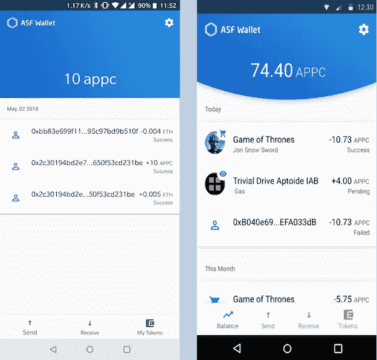

# ANU #9 — IAP 流程、广告和智能合同开发

> 原文：<https://medium.com/hackernoon/anu-9-iap-flow-advertising-and-smart-contract-development-d08749fb6526>

AppCoins 新闻更新，简称 **ANU** ，是 AppCoins 团队每两周一次的定期更新。像往常一样，我们将涵盖开发更新，市场报告，团队成员和即将举行的活动。**本周重点**在 **IAP 流量、广告、ASF 钱包、ASF SDK** 和**智能合约开发。你可能会在 5 月 23 日看到下一个 ANU。**

**快速链接** [Dev 更新](#4095)
[APPC 市场报道](#9106)
[特色团队成员](#48a4)
[即将举办的活动](#163f)

在 Gosling 发布了**——我们称之为 Alpha 3——之后，我们回到另一个关于当前开发状态的新闻更新。我们将介绍我们现在正在做的事情以及接下来几周将要做的事情。**

**该 ANU 将涵盖对协议重要的 **IAP** 和**广告流**的更改、 **ASF Wallet** 和 **ASF SDK 的开发、**和**智能合约开发的改进**。**

# **AppCoins 协议**

**虽然它们仍处于 alpha 阶段，但我们正在对已经发布的两个流做一些小的改进:应用内购买(IAP)和广告。**

## **IAP 流**

**这个流程使开发者能够**接受 APPC 作为应用内物品的付款**。它由开发者的应用程序、集成到该应用程序中的 ASF SDK 以及 ASF 钱包(或未来任何符合 AppCoins 的钱包)之间的交互组成。**

**关于流程的区块链部分，它由两个交易组成:**

*   **一个*批准对 AppCoins 令牌契约的*调用，该契约**使 IAP 智能契约能够从用户处花费 APPC****
*   **对 IAP 契约的一个 *buy* 调用使得**执行购买一个项目**的动作，这执行了从用户到开发者、应用商店和 OEM 的转移**

**为了使购买应用内物品的用户的流程无缝，**在开始支付流程**之前，钱包应该检查 ETH (支付交易费用)**和 APPC** (支付物品本身)是否有足够的资金来执行这两个交易**。我们将在 Google Play 和 Aptoide 中发布 ASF 钱包的更新，并进行修复。****

## **广告**

**广告流使用户能够**通过使用和关注在积极活动中实施的应用**来赚取 APPC。这些活动是由 app 开发者创建的，可以在 [**创建活动**](https://www.appstorefoundation.org/campaign) 页面中完成，然后在 [**要约墙**](https://www.appstorefoundation.org/offer-wall) 中看到。**

**至于 IAP 流，广告流也是由开发者的应用程序、集成到该应用程序中的 ASF SDK 和 ASF 钱包(或未来任何符合 AppCoins 的钱包)之间的交互组成的。在这种情况下，**SDK 负责检查应用程序是否正在使用，并负责触发 ASF 钱包来计算注意力证明(PoA)组件**，这些组件最终将形成完整的 PoA，并发送到区块链。我们将在新版 SDK 中发布一个修复，与区块链中广告智能合约的 PoA 提交相关。**在开始 PoA 计算过程之前，SDK 应检查是否为 PoA 提交准备好了钱包**。钱包应该有一个已经配置了 **的**账户，账户中有提交 PoA** 所需的 ETH 金额。否则，在 PoA 的计算花费 2 分钟后，**钱包将简单地声明没有足够的 ETH 来将 PoA 提交给区块链，**，这转化为糟糕的用户体验。****

**此外，**钱包应给出关于 PoA 计算进度的反馈**,而不仅仅是说明正在计算。这也是一个改进，我们将在 ASF 钱包的新版本中发布。**

# **ASF 钱包**

**正如我们在 [Gosling release](/@appcoins/gosling-release-with-new-advertising-and-iap-flows-6365f080b28e) 帖子中所说，我们开始**重新设计 ASF 钱包，以改善用户体验**和与 AppCoins 协议交互的**简易性。我们从**交易屏幕**和**个人交易视图**开始重新设计，我们的目标是让与 AppCoins 协议流相关的交易更容易理解。****

**以下是交易屏幕和单个交易视图的当前状态，以及我们完成重新设计后想要实现的目标。**

****

**(Left) Current status of the Transactions screen; (Right) Transactions screen after redesign**

****

**(Left) Current status of the individual transaction screen; (Right) Individual transaction screen after redesign**

# **ASF SDK**

**对于 AppCoins 协议中的每个流，所有交易都由开发者(IAP)或用户(广告)、应用商店和 OEM 之间的划分组成。**ASF SDK 负责向 ASF Wallet 发送关于 app store 和 OEM wallets 的数据，以使划分成为可能**。**

**对于每一笔交易，SDK 都需要知道 app store 和 OEM 的钱包账户，它们应该收到各自的 APPC 金额。该协议定义了三种可能的归属机制:**

*   **在安装给定应用程序的过程中，**app store 通知操作系统(OS)它已经安装了该应用程序**，ASF Wallet 能够从 OS 获取该数据并将其映射到 app store 的 Wallet 地址。**
*   **在给定应用程序的安装过程中，**应用程序商店广播它已经安装了该应用程序，并且 SDK 捕获该广播**。该广播应包括应用商店和预加载该应用商店的 OEM(如果适用)以及标识符，这足以让钱包将它们映射到各自的钱包地址。**
*   **如果没有关于哪个应用商店和 OEM 应该接收给定交易的各自份额的数据，这些份额将进入钱包中配置的默认钱包地址。**

**我们将开始开发这些机制，允许应用商店和原始设备制造商使用 AppCoins 协议开始货币化。**

# **智能合同开发**

**智能合约开发仍处于早期阶段，有几个平台旨在领先。截至目前，以太坊仍然是最成熟的平台，开发者可以在这里构建自己的应用。以太坊中智能合约开发的一个重要方面是**当智能合约部署到网络时，它是不可更改的**。如果有一个 bug 或者合同中应该包含更多的特性，**必须进行新的部署，**以及应该使用的**地址也会发生变化**。**

**关于 AppCoins 协议，我们正在开发几个产品(ASF SDK，ASF Wallet，网页),可以与我们的智能合约交互。由于我们处于协议开发的早期阶段，每天或每周都需要做一些变化。如上所述，每次我们部署新版本的智能合约，**所有与之交互的产品都需要更新**以指向新地址。这可能会变得**难以管理**，并且由于缺乏沟通，这**增加了开发过程中出现兼容性错误**的可能性。当谈到 ASF SDK 时，仅仅因为新的智能合约部署就要求开发人员不断更新他们正在使用的 SDK 版本变得非常困难。**

**因此，我们决定需要将智能合约的部署从其他产品开发中分离出来。我们将在部署的智能合约和使用它们的产品之间创建一个新的层作为代理。此外，我们还将实施一个解决方案，以避免在部署新版本的智能合约时丢失其中的所有数据。你可以把它想象成一个 [**永恒储存**](https://github.com/ethereum/EIPs/issues/930) 的版本。**

**一如既往，我们邀请您关注我们正在开发的所有产品:**

*   **[**ASF SDK**](https://github.com/AppStoreFoundation/asf-sdk)**
*   **[**ASF 钱包**](https://github.com/AppStoreFoundation/asf-wallet-android)**
*   **[**ASF 智能合约**](https://github.com/AppStoreFoundation/asf-contracts)**

****

**目前的市值接近 5482 万美元，过去 24 小时内三家交易所的交易量为 207 万美元:币安(73.06%)、火币(26.93%)和莱克(0.01%)**

****

**AppCoins 继续与比特币绑定。自上次 ANU 以来，AppCoins 的价值已经上涨了约 17%。这种增长与我们的最新成就一致，包括最近推出的[“小鹅”版本](/@appcoins/gosling-release-with-new-advertising-and-iap-flows-6365f080b28e)。你可以在 T21 看到更多关于 APPC 市场的信息。**

****

****姓名:**[joo Casal](https://www.linkedin.com/in/joaocasal/)
**角色:** *研发负责人&*
**简历:**joo Casal 在过去几年中一直在设计和领导移动计算领域的研发项目。他与人合著了 AppCoins 白皮书，现在正在为协议的开放创新规划 ASF 工作组的程序。**

********

**[区块链应用与经济论坛 2018](http://www.blockchainasiaforum.com/#) **汇集了来自世界各地的有影响力的演讲人，向对该主题有特殊兴趣的商业领袖和思想家介绍区块链解决方案**。除了作为**听取区块链各行各业和专家案例研究经验的最佳场所，**它还**允许 ico 推销他们的想法并赢得投资者。****

**我们很荣幸地宣布**亚太区副总裁 Tiago Alves 将成为此次活动的发言人之一！**他的演讲将于第二天(2018 年 5 月 29 日)14:00 进行**，他的小组讨论将涵盖以下主题:****

**区块链能取代 IPO 吗？
ico 和区块链是企业融资的可信、可持续、可行的方式吗？它会取代 IPO 吗？**

**区块链应用和经济学-2018 年论坛**将于 2018 年 5 月 28 日至 30 日在马尼拉麦金利大道 8 号 SMX 会议中心 Aura 举行。****

**如果你已经决定区块链可以帮助你的业务，区块链亚洲论坛绝对是合适的会面地点！**

****

**错过了我们以前的出版物吗？不要担心！你可以在这里阅读:**

**[“小鹅”发布新广告和 IAP 流](/@appcoins/gosling-release-with-new-advertising-and-iap-flows-6365f080b28e)**

**[ANU #8 — AppCoins 协议、ASF SDK、钱包和会员资格](/@appcoins/anu-8-appcoins-protocol-asf-sdk-wallet-and-membership-5c2c9154dca3)**

**[ANU #7 — ASF SDK、ASF Wallet Alpha 3 和工作组](https://hackernoon.com/anu-7-asf-sdk-asf-wallet-alpha-3-and-working-groups-43e6329633c7)**