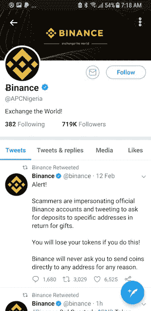
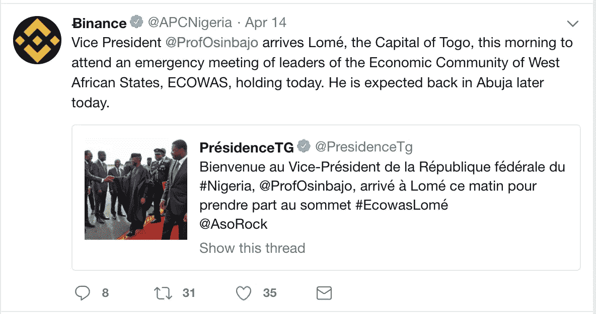

# APC 尼日利亚验证的 Twitter 帐户正在用加密货币诈骗人们

> 原文：<https://medium.com/hackernoon/apc-nigerias-verified-twitter-account-is-scamming-people-with-cryptocurrency-2a7cdb804c0a>

对于尼日利亚人和世界各地的加密货币爱好者来说，过去的 24 小时充满了困惑。4 月 14 日，经过验证的 [@APCNigeria](https://twitter.com/apcnigeria) twitter 账号被不明黑客盗取。

不久之后，该黑客发布了以下推文，这些推文已被删除:

*“我从官方所有者那里花了 2k 美元买了这个账户。”*

*“为了给你比特币，我们的政府创建了一个网站。我们热爱我们的人民，尽情享受吧！”*

“我们将提高工资，为此我们要庆祝一下，并给每个人比特币。”

这一点很明显，攻击者是一个加密货币骗子。攻击者计划利用该账户的声誉来骗取人们的加密货币。经过验证的 twitter 徽章和 719k 强 twitter 关注足以欺骗甚至精明的个人。

在获得控制权后不久，黑客将 twitter 账户上的名字改为“Justin Sun”，这是一种名为 TRON 的顶级加密货币的创始人。值得注意的一件可怕的事情是**即使在改名之后，验证过的 Twitter 徽章仍然在账户**上保持活跃。我们认为这是企图欺骗对创币感兴趣的人。后来，黑客将账户上的名字改为“伊莱克特硬币(ECA)”，可能是为了欺骗那些对 ECA 硬币感兴趣的人。

几个小时后，twitter 账户上的名字变成了币安，这是世界上最受欢迎的加密货币交易所之一。黑客在这个角色下非常活跃，回复了包括以太坊创始人 Vitalik Buterin 在内的推文，声称可以向那些访问钓鱼网站以窃取您资金的人提供免费以太坊。他们甚至转发了币安官方账号发的微博，警告像他们这样的冒名顶替者！

和以前一样，经过验证的 twitter 徽章仍然保留着新旧推文

在撰写本文时，攻击者已经将名称更改为“John McAfee ”,并正在发送钓鱼网站的链接，这些网站声称提供免费的比特币，但会诱骗您透露您的私钥，以便他们能够窃取比特币。

Twitter 一直充斥着加密货币诈骗，通常是以账户冒充影响者的形式，并发送带有钓鱼攻击链接的推文。这个问题如此严重，以至于布特林不得不经常警告他的追随者:

像这样的骗局正是我们建立 Tokens Express 的原因，这是一个社交加密货币管理平台，旨在通过易于使用的交易、投资组合跟踪和多资产钱包工具来减少欺诈和增加采用率。我们的白皮书概述了其他几个[流行的骗局](https://docs.google.com/document/d/1ynKBPCkzn76LI8jH3eGkPTJtQV7-PzaFVy0tquGAHCE/edit?pli=1#heading=h.malfp8xhbkj4)和针对该问题的[解决方案](https://docs.google.com/document/d/1ynKBPCkzn76LI8jH3eGkPTJtQV7-PzaFVy0tquGAHCE/edit?pli=1#heading=h.p8u9tp1vtp2z)，即更好的[验证流程](https://docs.google.com/document/d/1ynKBPCkzn76LI8jH3eGkPTJtQV7-PzaFVy0tquGAHCE/edit?pli=1#heading=h.ewfmnhrda40m)和[安全通信平台](https://docs.google.com/document/d/1ynKBPCkzn76LI8jH3eGkPTJtQV7-PzaFVy0tquGAHCE/edit?pli=1#heading=h.dm9dasx9mnpv)。

Tokens Express Portfolio

今日下载阿尔法[https://play.google.com/store/apps/details?id=express.tokens.tokens](https://play.google.com/store/apps/details?id=express.tokens.tokens)

如需更多更新和赢取免费代币的机会，请查看下表:

美国东部时间上午 10:23 更新:自这篇文章发布以来，我们的 twitter 账户 [@tokens_express](https://twitter.com/tokens_express) 被黑客 [@APCNigeria](https://twitter.com/apcnigeria) twitter 账户屏蔽

美国东部时间下午 2:25 更新:我们的 twitter 账号 [@tokens_express](https://twitter.com/tokens_express) 因为未知原因被暂停。与此同时，被黑的@APCNigeria twitter 账户正在用一个经过验证的 twitter 徽章积极地诈骗 twitter 用户。

