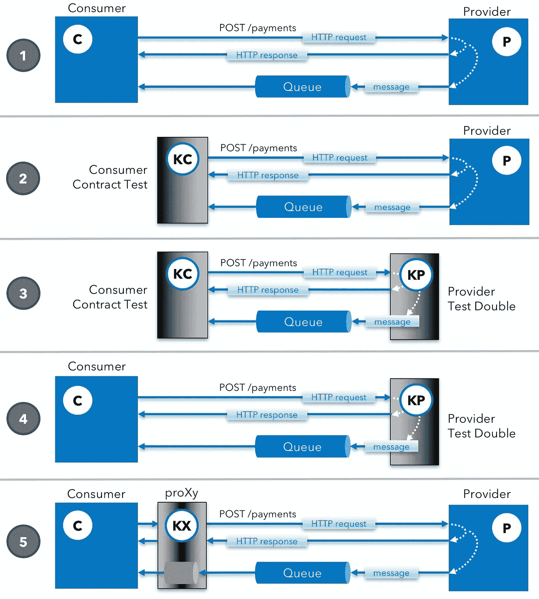

# API 消费者合同测试和空手道双打测试

> 原文：<https://medium.com/hackernoon/api-consumer-contract-tests-and-test-doubles-with-karate-72c30ea25c18>

[空手道](https://github.com/intuit/karate)最近在 GitHub 上超过了 [500 颗星](https://github.com/intuit/karate/stargazers)，并且在[广受欢迎](https://github.com/intuit/karate/wiki/Community-News)，甚至开始在[的招聘广告中出现](https://twitter.com/KarateDSL/status/935197434191347712)作为一项想要的技能。考虑到这个项目只有十个月，还不错！

# 测试双打

正在开发中(并且即将发布)的一个特性是能够加速测试加倍来“模拟”一个可能仍在开发中的 web 服务 API 依赖——或者测试环境可能不可用或不稳定。对于许多团队来说，这是一个 [*重大的*痛点](/@copyconstruct/testing-microservices-the-sane-way-9bb31d158c16)——“脆弱的集成测试”对于许多处理微服务的平台团队来说，是痛苦的传奇来源。

空手道的创新[“误用”小黄瓜](https://hackernoon.com/yes-karate-is-not-true-bdd-698bf4a9be39)在实践中表现得非常好，实际上即使在服务器端“[反转](https://hackernoon.com/tagged/inverting)”也非常适合。这里有一个例子展示了为一个 [REST](https://hackernoon.com/tagged/rest) 服务编写一个*有状态的*双测试是多么简单。万事俱备，比如空手道对 JSON 和 XML 的原生支持，以及[嵌入式 JavaScript 引擎](https://www.infoq.com/articles/nashorn)的威力。

the actual source for this example: [demo-mock.feature](https://github.com/intuit/karate/blob/master/karate-demo/src/test/java/mock/proxy/demo-mock.feature)

你可以在[项目文档](https://github.com/intuit/karate/tree/develop/karate-netty#capabilities)中找到一个全面的功能列表。随着自述文件的发展，一个使用 [Spring Boot](https://projects.spring.io/spring-boot/) 的演示端到端示例已经创建，作为社区的早期预览，总结如下。

# 消费者-提供者示例

我们使用一个 Java“消费者”的简化示例，它对支付服务(提供者)进行 HTTP 调用，其中已经实现了`GET`、`POST`、`PUT`和`DELETE`。‘提供者’为`[Payment.java](https://github.com/intuit/karate/blob/develop/karate-demo/src/test/java/mock/contract/Payment.java)`‘POJO’实现 CRUD，`POST`(或 create)导致一条消息(`[Shipment.java](https://github.com/intuit/karate/blob/develop/karate-demo/src/test/java/mock/contract/Shipment.java)`作为 JSON)被放在一个队列中，消费者正在监听这条消息。

[ActiveMQ](http://activemq.apache.org/) 被用于将异步流混合到这个例子中，在一些[简单的](https://github.com/intuit/karate/blob/develop/karate-demo/src/test/java/mock/contract/QueueUtils.java) [实用程序](https://github.com/intuit/karate/blob/develop/karate-demo/src/test/java/mock/contract/QueueConsumer.java)的帮助下，我们能够将异步消息混合到空手道测试*以及双倍测试*中。

# 服务器端空手道

“栅栏另一边”的空手道(*处理* HTTP 请求，而不是*发出*)被证明非常有效，而且简单。

*   对表达 JSON 和 XML 的“本地”支持
*   操纵甚至转换有效载荷
*   验证有效负载，如果需要，使用比 JSON 模式更简单的替代方案
*   空手道是关于进行 HTTP 调用的 T21，如果需要的话，给你调用“下游”服务的灵活性
*   如果需要，内存中的 JSON 和 JsonPath 解决“状态”和过滤问题
*   如果需要的话，混合定制的 JavaScript(甚至 Java 代码)——用于复杂的逻辑
*   在启动时轻松“播种”数据或切换环境/配置

你想想，以上都是*足够*实现*任何*微服务。空手道的 DSL 语法正是集中在这些方面，从而开启了有趣的可能性。

可能很难相信你可以用空手道在几分钟内建立一个“可用”的微服务——但是一定要试试，让我知道你的想法！