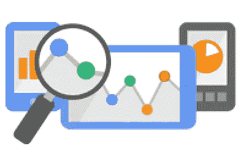
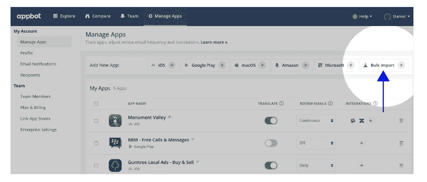
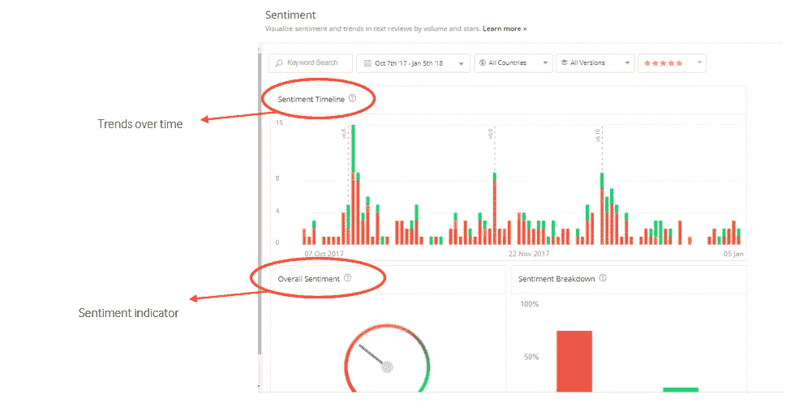
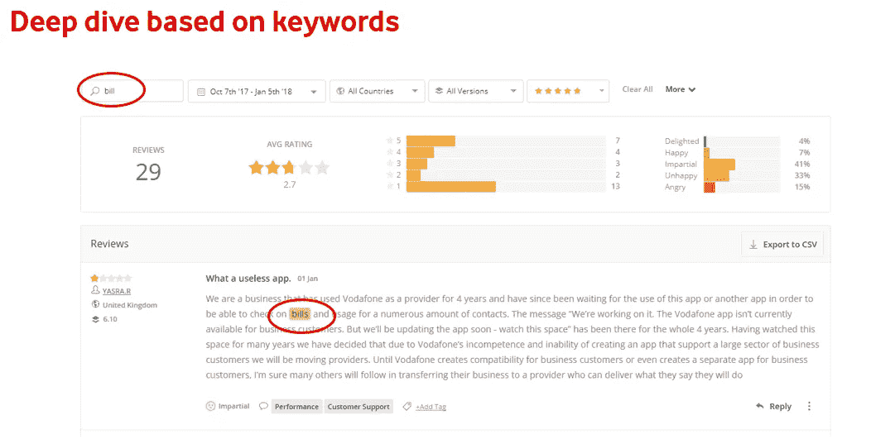
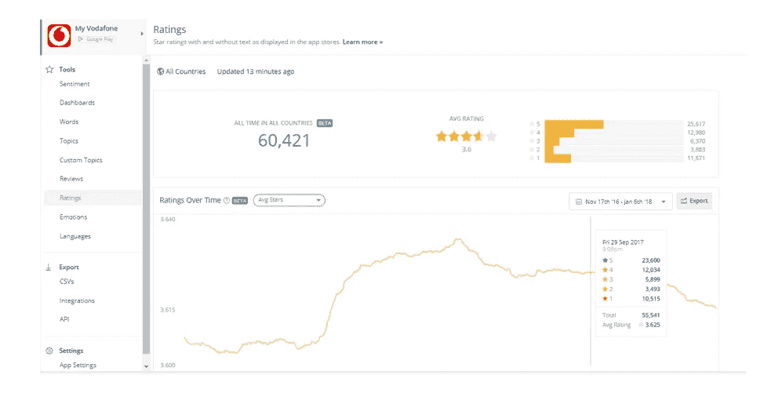

# AppBot:让应用分析变得简单！

> 原文：<https://medium.com/hackernoon/appbot-making-app-analytics-easy-ab8ebc6f1cf9>

应用分析不仅有利于组织，也有利于最终使用它的最终用户！事实上，众所周知，让你的应用成功的首要原则是:

> **#让您的客户满意**

谷歌会向你抛出大量的应用指标，这些指标对于了解客户对应用的体验至关重要，比如应用粘性、首次访问、回头客、应用渗透率等等！

然而，说实话，我们不知何故倾向于忽略用户直接发送给我们的最容易获得的关键信息，这不仅使我们与他们建立个人联系，而且有助于更快地解决他们的问题！猜猜那会是什么？！

> 是啊！的确如此——顾客自己的声音！用户一字不差地离开了谷歌 Play 商店或 iTunes

坐下来仔细阅读用户留下的每一条评论是一项非常艰巨的任务。当你被期望在时间紧迫的情况下进行分析时，作为一名分析师肯定会变得更加困难！这就是技术帮助我们的地方。

当然，有几种方法可以对用户进行逐字分类，以了解他们的痛点和问题。然而，每个人都可以选择自己喜欢的工具，并在其中探索。

> **这是我选择 AppBot 的地方**

最初，AppBot 只是一个聚集评论的工具， ***AppBot 现在能够提取有意义的见解，这些见解可以在很大程度上建议对 App*** 进行必要的改进。

超过 35%的顶级制图[应用](https://hackernoon.com/tagged/apps)，如 ***Pinterest、PayPal、TrueCaller、Twitter 等。*** 使用 AppBot。

> 那么，如何在 AppBot 上探索自己的应用呢？

10 天的试用账户是开始探索[工具](https://hackernoon.com/tagged/tool)的最佳方式。

你要做的就是:

(I)登录账户后，导航至 ***管理应用*** 页面，应看到**批量导入**按钮，点击即可。

(ii)输入您想要添加的所有 iTunes、Google Play 和 Amazon 应用程序的 URL，然后按**导入应用程序。**导入过程现在开始，添加完应用后，您将收到一封电子邮件！

维奥拉。现在你可以开始探索 AppBot 和它的无数功能。作为一名数字分析师，AppBot 给我留下深刻印象的一点是，人们可以轻而易举地获得洞察力。

# AppBot 特性:(部分，不是全部)

a) **情绪**在这里，您可以大致了解应用的表现，包括应用的情绪得分，该得分分析应用评论的文本内容、星级和趋势。您还可以一目了然地看到您的总体情绪，包括正面、中性和负面情绪的细分，评论数量和星级的时间表，以及显示您的评论来自何处的国家和版本图表。

b) **单词**向您展示了您的应用评论中最常用的单词，一个经常出现在您的应用评论中的关键单词列表，以及单词云，该单词云提供了比上面表格更大的深度，允许您通过单击来分析包含特定单词的评论的情感。

c) **评论**是您想要查看应用评论列表、管理 Google Play 评论回复或查看最近汇总统计数据的地方。

d) **评级**是唯一一个向你展示仅包含星级评级的应用数据的地方。

e) **比较主题**是你可以一次测量几个应用在多个主题上的表现。

f) **情绪**在图表上绘制出客户对你的应用程序的反应模式，帮助你快速识别可能需要紧急关注的异常值

g) **情绪图**显示了不同国家/地区的评论分布，并根据对该应用的整体感觉进行了着色，绿色代表积极，黄色代表中性，红色代表消极。

h) **报告**您可以在这里找到一些方便的报告，如您的应用在每个国家的平均评分或按日期的评论量，只需点击一个按钮即可运行。

最重要的是，你可以选择各种各样的应用程序，并进行比较。

作为一个开始练习，也许试用版并检查 AppBot 如何帮助你的应用程序分析是一个很好的开始。有了如此简洁准确的细节，只需点击几下鼠标，就能生成与应用相关的见解！

快乐探索:)