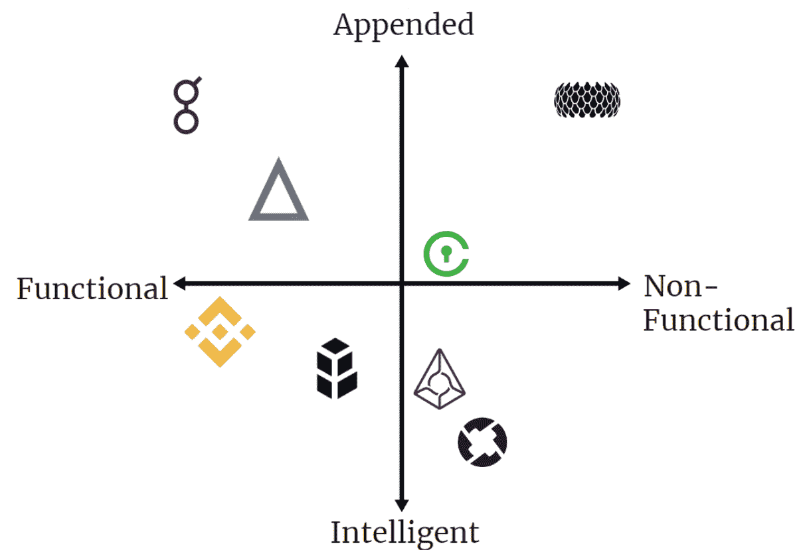
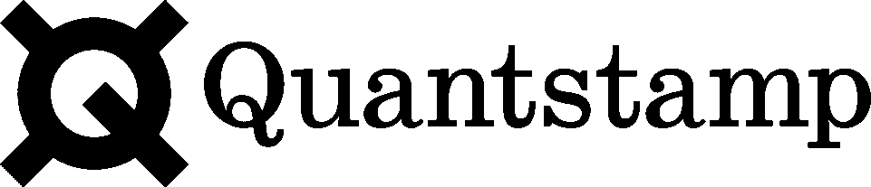
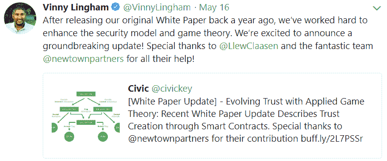

# 附加的还是智能的，功能性的还是非功能性的——继续思考效用令牌的评估

> 原文：<https://medium.com/hackernoon/appended-or-intelligent-functional-or-non-functional-continued-thoughts-on-utility-token-dd8e52d698cc>

> *“试过了。曾经失败过。没关系。再试一次。再次失败。失败得更好。”~塞缪尔·贝克特*

请务必阅读[的第一篇文章](https://hackernoon.com/progress-vs-process-thoughts-on-appended-utility-token-valuations-and-their-future-1e4d0b2eadcd)，解释附加资产的“进度”与“过程”问题，以及以证券形式转换的未来选择。这篇文章将涵盖公用事业资产分类的范围，以及项目可以做些什么来降低速度和适当地令牌化——即使在一个 [ICO](https://hackernoon.com/tagged/ico) 之后时间已经过去了。

退一步说，附加的令牌可以通过“过程”或使用进入死亡螺旋，如前一篇文章中所定义的，除非采取行动使它们成为系统的一部分，或者引入激励和博弈论的色彩来减缓它们的速度(如后所述)。

支付令牌是糟糕设计的很好例子，因为母链资产可以处理整个服务，减去转换所需的摩擦和麻烦。然而，在我看来，所有的资产都存在于一个动态的范围内，设计涵盖一个轴，功能涵盖另一个轴。

When Doom?

## 资产分类:附加或智能、功能或非功能

正如在之前的博客中提到的，资产存在于附加的和智能的范围之间。纯附加资产是指那些在平台上纯粹作为 MoE(交易媒介)的资产，或者作为一种优惠券的资产，在这种优惠券中，你支付的代币比任何正常估值都要少。因此，企业可以在没有这些资产的情况下存在，并随时完全替换它们—使它们变得无用。

令牌并不需要为平台的成功而存在，不，你为了支付应用程序而创造的特殊令牌并没有让你的平台变得更好，它只是引入了更多的摩擦。

另一方面是智能资产，或者那些没有遭遇*流程、*问题的资产，因为它们是功能性的关键，并且提供了获取实际价值的机制。从智能资产获取价值的例子来自于各种形式的赌注机制、节点锁定和治理(无论是令牌管理的注册中心、纯协议治理等)。这些令牌存在是有原因的，不能简单地用父链资产替换，也不能简单地从整个服务中删除而不完全损失质量。

然而，还有另一个与附加/智能轴垂直的令牌值范围，即系统中的令牌是*功能性的还是非功能性的*。随着 ico 继续筹集不切实际的资金，它们的资产并不总是能从发行中发挥作用。许多具有优秀设计的项目甚至还没有部署使用他们的资产，这使得它们既智能又不实用。由于未在纯粹的投机之外使用资产所产生的看不见的网络效应，对资产进行估价变得更加困难。

Utility Spectrum

例如，Augur 和 0x——尽管它们的设计很聪明，但由于目前没有功能，它们没有被使用，而 Bancor 和币安 Coin 都被积极使用。在功能性但附加的一面是假人，因为它是纯粹使用假人网络的支付令牌，而 Salt 是一种资产，它授予 Salt lending 平台不同等级的会员资格。在图表的完全附加和非功能性一端，我们有 Sirin Labs token 这样的资产，它是一种非功能性优惠券，而 Civic 正在慢慢走向智能和功能性(见后面一节)。

也可能有双令牌模型，其中一个资产纯粹用于获取价值，而另一个资产持续旋转，这通常以治理或赌注资产的形式出现，与由原始资产治理的 stablecoin 或 MoE 配对。例如在 [MakerDAO](https://makerdao.com/) 的案例中，Maker 是用来支配戴的抵押率并收取费用的，而戴是一种稳定的币。Spankchain 的 [Spank token](https://spankchain.com/token/) 是为了产生战利品，这是一种按比例铸造的支付令牌。随着时间的推移，看到更多的令牌设计实验来找出一种可持续地捕捉价值和扩展功能极限的方法也就不足为奇了。

## 天生如此

最近，一个丑陋的新闻案例在受欢迎的新闻媒体 Coindesk 上浮出水面，一篇文章[解释了 Quantstamp 的社区如何对该公司一直采用以太币和美元而不是 QSP(他们的母语)作为审计服务感到不满。多么令人震惊的情况——为什么 Quantstamp 的服务没有获得比预期更多的 QSP？](https://www.coindesk.com/quantstamp-fire-buyers-say-faith-shaken-65-million-token/?utm_content=buffera99f7&utm_medium=social&utm_source=twitter.com&utm_campaign=buffer)

Will Audit Contracts for Tokens

> “一些客户不能购买 QSP 来支付我们，这意味着我们错过了提供帮助和坚持我们推动生态系统采用智能合同的使命的机会”

一个恰当的例子是——不仅象征性的价格在未来会因为剧烈旋转(高经济速度——稍后解释)而遭受损失，而且一开始在 QSP 支付就使用这项服务会有摩擦。这并不是说 Quantstamp 不是一个伟大的项目——他们的团队中有很多聪明人，他们所做的事情对生态系统很重要。然而，它们是糟糕的令牌设计的一个很好的例子:它达到了帮助启动项目的目的，但对于 Quantstamp 的未来并不是必需的。

为项目说句公道话， ***有时候追加的*** 并不傻，只是一种早期的贴牌融资方式。这些团队和项目可能会交付一个不朽的服务，但却没有想到我们今天看待标志设计的方式。另一个很好的例子是假人:**伟大的事业，糟糕的令牌设计**。在他们的情况下，支付服务费用会容易得多。追加不代表*队*怂，只是令牌功能怂的方式。

***—建模笔记—***

为了快速理解经济速度和“旋转”的含义，我们必须首先回顾交换方程，它被定义为 MV=PT。该等式通常用于确定经济的健康状况和有效通货膨胀率——速率越稳定，经济就越健康。在这个等式中，M =货币供应量，V =流通速度——或消费速度，P =商品的平均价格，T =交易总额。

Placeholder Capital 的 Chris Burniske 在 9 月份修改了交易方程式，以更好地代表加密经济。在他的模型中，MV = PQ，M =资产基数，V =其速度，P =资产网络资源的价格，Q =被供应资源的数量。资产网络的 GDP 实际上变成了“PQ”当周转率太低，交易量崩溃时，资产价格也会崩溃。当周转率过高，并且在转换回菲亚特或母资产(MoE)的过程中易手过于频繁时，资产就无法获得任何价值。

**经济速度最大的盟友是智能代币设计**:你如何停止旋转 ***才*** 足以让代币有效捕捉价值？把唱机的转速设得太高或太低，你会得到什么？一片混乱的声音。

Or a Scratched-Up Record

Burneske 提出的另一种评估资产的方法是通过他的加密 J 曲线的想法。这是一个关注“CUV”或*当前效用值*，以及“德乌夫”或*贴现预期效用值*的模型(纯粹的推测)。曲线是如何通过以下一系列事件运行的:

*   投机价值高，但实用价值低的初始阶段。这可以从资产的第一次价格飙升中看出来。
*   第二阶段，资产的效用价值得以实现，但投机从最初的高度下降。这在初始峰值之后形成了沟槽。
*   这是一个持续的时期，在此期间，两者的效用价值不断实现，而投机又开始达到顶峰，表现为价格持续上涨。

**J 曲线在光谱上最大的盟友倾向于*功能性****——或者更确切地说，效用价值与投机价值一起完全实现的曲线顶端。然而，曲线在未来可能会扭曲，因为 CUV 在处理 ico 时会继续被推到前线，这样产品就可以证明他们出售的资产实际上是有用的。*

**具有效用的效用令牌——谁会想到呢？**

*以原始光谱来说，没有资产是固定的。我们处在一个不断发展的环境中，在这个环境中，资产可以附加新的特性，以实现更慢的速度和更大的机会来获取更多的价值。*

## *停止旋转*

*资产最近从附加模型转换为智能模型的一个很好的例子是[思域](https://www.civic.com)。Civic 最初的代币设计是一种支付代币:验证者和个人可以通过加入网络参与者获得代币，代币将用于支付服务费用。然而，随着足够的时间和在该系统中的采用，价值最终将被压低，因为思域的令牌 [*旋转得越来越快*](https://youtu.be/ZlC1zQAu86M?t=47m55s) 。然而，在了解了他们的模型的缺点之后，他们的团队应用了一点博弈论的色彩来创建一个比原始设计更好的价值捕捉模型。*

**

*Good Thinking, Vinny.*

*考虑到一点博弈论，Civic 重新设计了他们的令牌，在他们网络的参与者之间创建了一个“[强制目标对齐](https://www.civic.com/blog/evolving-trust-with-applied-game-theory-recent-white-paper-update-describes-trust-creation-through-smart-contracts/)”。在这种情况下，验证者和请求者有一个赌注机制，当交易发生在 Civic 的市场上时，该机制会因他们在平台上的不正确行为而惩罚他们。这反过来允许思域扩展到支付令牌之外，可以说是“停止旋转”,因为为了验证和奖励，供应的逐渐数量开始被锁定。*

*然而，它可能不一定是一个令牌所需的完全重新设计，因为 Civic 与他们的项目和新白皮书一起部署。随着时间的推移，一些资产可以提供更小的*额外*功能元素，继续获取价值，这也激励用户推测下一个功能发布。项目永远不会和它们的令牌一起被锁在一个盒子里——它们只需要在允许它们的令牌获取价值的方式上有所创新。在我个人看来，币安是一个很好的例子，一家公司总是站在自己的立场上思考，并随着时间的推移不断增加独特的维度，这是一种不断发展的资产。*

*币安最近建立了一个离散的积累和持有机制，他们的标志是宣布[他们最新的社区投票](https://support.binance.com/hc/en-us/articles/360004772311-Community-Coin-of-the-Month-Round-7)。币安增加了一个治理层，其标志是投票机制，通过该机制，新资产被添加到交易所，但最近的投票增加了一个扭曲:基于选民持有的 BNB 数量的快照和乘数。乘数由代币余额决定，超过 500 时最高可达 500。现在，与仅仅以 0.1 BNB 的价格将他们的资产添加到币安的简单伪造投票相反，公司被激励采取额外的飞跃，并配备 500+ BNB(锁定价值 7000+美元)的账户和用户，以获得最大数量的投票。*

*这一点，再加上他们不断焚烧代币，以及他们宣布自己的[区块链](https://hackernoon.com/tagged/blockchain)将与 BNB 一起处理，使得币安硬币成为一种不断发展的资产的绝佳例子。*

## *我能使用令牌，你也能*

*没有具体的方法来评估这种奇怪的新资产类别，因为它挑战了我们放置传统资产的模型。我们可以采用现有的框架，并接近更新的模型，但曲线球将继续被抛出。我不是专业的经济学家，也不是专家，但我觉得我们应该为这些小投机工具赋予价值。*

*没有人有完美的模型——这些资产中的大部分实际上也没有按计划运行。但是我们真的了解吗？*

*****

**再次特别感谢* [*马特*](https://www.linkedin.com/in/matthew-garza-pharmd-5bb02a61/) *，* [*雅各布*](https://twitter.com/chaingenius) *，* [*凯文*](https://chainintelligence.io/) *，* [*特拉维斯*](https://twitter.com/travis_kling) *为本贴提供反馈。他们也可以利用。**

*本文中的任何内容都不应被视为法律或投资建议。*