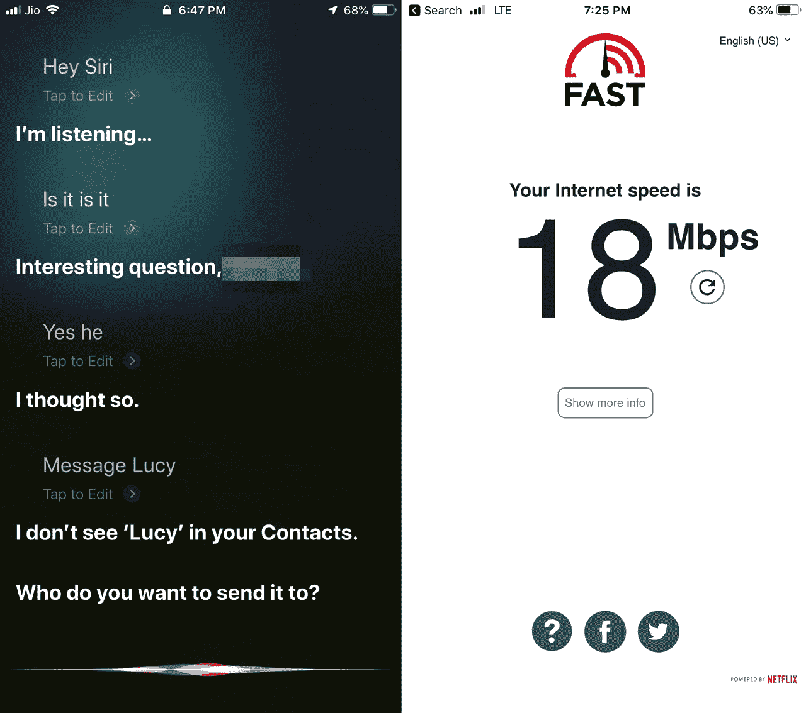
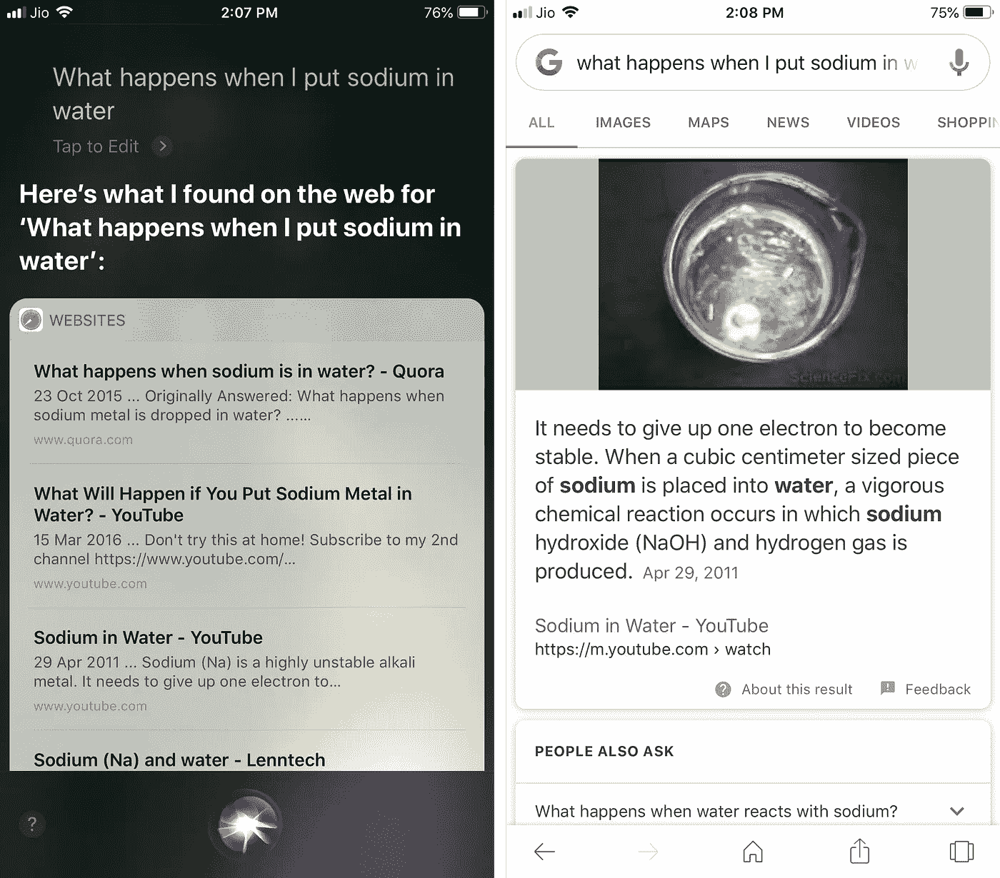
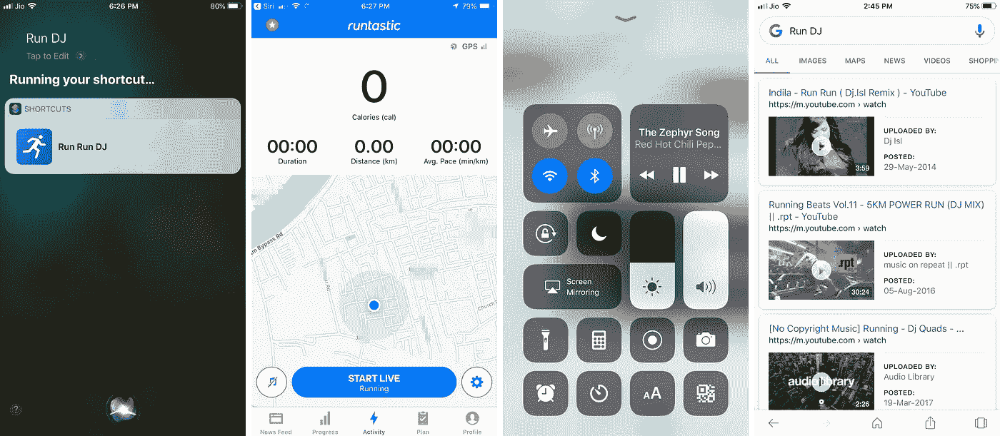
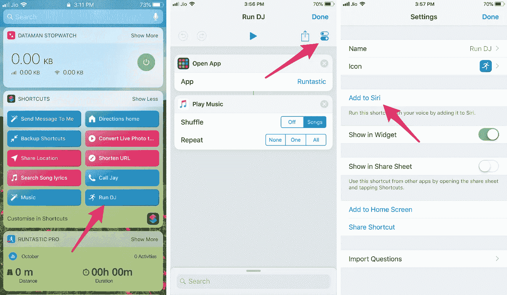
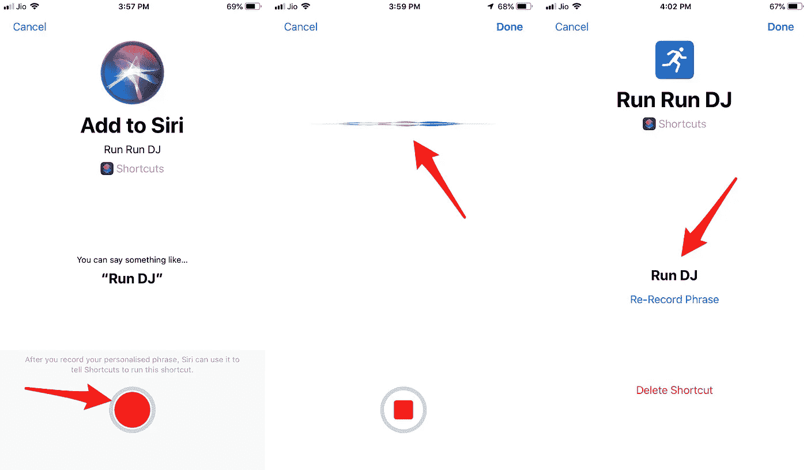
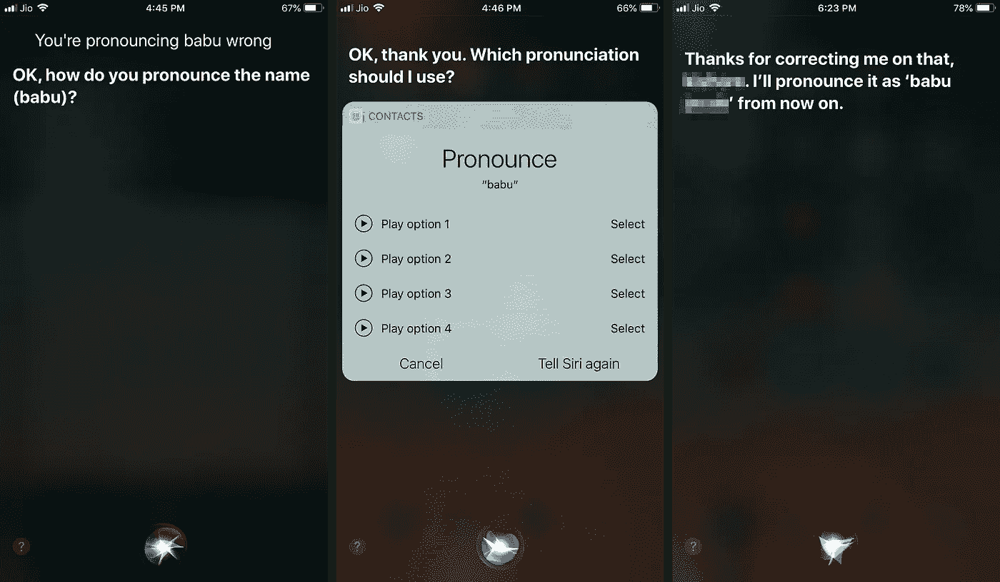
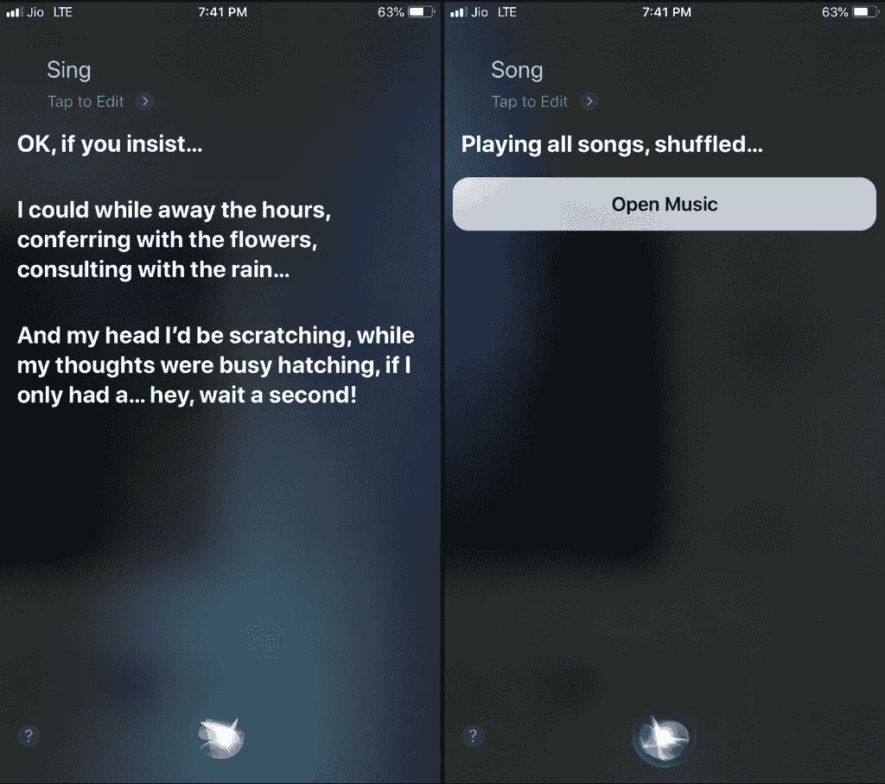

# 苹果找到让 Siri 更智能的捷径

> 原文：<https://medium.com/hackernoon/apple-finds-a-shortcut-to-make-siri-smarter-c5019a9deb5d>

## 苹果公司如何巧妙地说服我训练 Siri 的故事

Photo by [Wyatt Ryan](https://unsplash.com/photos/fkLr2QOQitk?utm_source=unsplash&utm_medium=referral&utm_content=creditCopyText) on [Unsplash](https://unsplash.com/search/photos/dog-training?utm_source=unsplash&utm_medium=referral&utm_content=creditCopyText)

Siri 和我的关系很糟糕，沟通不畅是我们问题的根源。我的印度口音和快速说话的异国混合经常导致 Siri 笨手笨脚地听不清我在说什么。与智能扬声器上的高级麦克风不同，手机的麦克风只能在正常情况下拾取我的声音。如果我的声音由于响度、环境噪音或压力等因素而略有变化，Siri 真的很难识别我说的话。

这是一个恶性循环，Siri 有时会成为我的压力来源。事实上，我已经观察到(在测试录音中)当 Siri 出错时，我自己的声音会变得歇斯底里。

## 声音的变幻莫测

拿我的音乐应用来说吧。我在手机上播放音乐的简化版 Siri 短语就是“音乐”。然而，几天前，当我在车流中匆忙开车时，Siri 听不清我在说什么。Siri 越挣扎，我的声音就越紧张。有时她甚至没有注意到我说过话，这让我感到恐慌，并快速连续说了两次“音乐”这个词。我后来检查了该地区的网络，但它很好，所以不是它(见下文)。

当我不得不在一个信号前停下来，并使用触摸屏让音乐继续时，我的理智得救了。不过，我还是设法抓拍到了我和 Siri 来回切换的一部分画面。正如你所看到的，“音乐”这个词变成了“嘿，Siri”，“是吗，是吗”，“是的，他”和“露西”最终，Siri 完全失去了剧情，想知道我在给谁发信息。

## 落后于领先者

与 Siri 的困境形成对比的是谷歌，后者进入语音识别领域要晚得多。在理解我说的话方面，谷歌现在比 Siri 好得多。事实上，我经常在手机上使用谷歌 Gboard 键盘应用的“麦克风”功能来听写完整的长信息。考虑到 Siri 运行在相同的硬件上，谷歌无疑在软件上有优势，以及通过访问大量用户数据的不公平优势，这使得更容易了解和预测用户在谈论什么。

至于亚马逊，现有的手机没有一款能与 Echo 的成功引发的新一波智能扬声器的硬件相媲美。它们的多个麦克风在识别声音、拾取单词以及忽略音调变化和环境噪声方面要好得多。我的老回声点(第二代)可以捕捉我在房间里说的话，识别复杂的歌曲名称，等等。考虑到亚马逊在谷歌之后很久才进入这个领域，这对苹果来说肯定是非常令人沮丧的。亚马逊似乎正在推出新的 Alexa 车载扬声器，看起来像是另一个赢家。

## 让山来到 Siri

苹果对这个问题的解决方案有点像‘如果 Siri 不能理解语言，那么语言必须简化自己，这样 Siri 才能理解。“或者换句话说，如果 Siri 发现很难听懂对它说的话，那么对 Siri 说的话的难度就必须降低。理论上如果苹果能给 Siri 这样的优势，她应该能跟上谷歌和 Alexa。

但是你如何简化语言呢？或者更确切地说，苹果有可能让用户降低与 Siri 的交互吗？

## 声音感觉

让我们做一个简单的实验。我问 Siri 和谷歌同样的问题，“把钠放进水里会发生什么？”他们都得到了正确的答案(同一个)，但我认为这是有区别的。

我的假设是 Siri 正在正确地识别我句子中的声音/单词，并为我指出在相同序列中包含相同单词的视频和文章。谷歌也这么做，但我认为它更进一步。它实际上听单词和句子，识别它们，找出上下文，并给我一个有意义的口头答复。换句话说，Siri 和谷歌都能听到声音/单词，但只有一个能理解这些声音。

我很可能犯了把事情过于简单化的错误，但我认为这两个答案大致说明了谷歌相对于 Siri 的优势。如果我是对的，这是巨大的优势。

## 消除等式中的意义

现在让我们做另一个实验。我会对 Siri 和谷歌说“运行 DJ”。现在‘Run DJ’已经没有任何意义了。只是两个随机的词，没有意义的凑在一起。总之就是几个音而已。谷歌发现了这一点，并给了我一些关于 Run 和 DJ 的视频(见右下方的截屏)。

但 Siri 似乎理解了这个无意义的术语。它知道“跑步”意味着我想去跑步，“DJ”意味着我想边跑边听音乐。所以，当 Siri 听到我说‘Run DJ’时，她会打开我的跑步应用，然后打开我的音乐应用，为我播放音乐(下面是三个屏幕截图，从最左边开始)。

如果我们不是更了解，我们会说 Siri 是一个天才。

## 当 Siri 接受训练时

想象一只被训练成听到主人说“撒尿”这个词就撒尿的狗。这只狗不明白“撒尿”这个词的意思。但是它已经被训练得明白，当它听到那个命令时，它会撒尿。这只狗对声音有反应，而不是对一句话。现在，如果一个阿拉伯人说“撒尿”，很可能狗不会撒尿。为什么？因为阿拉伯语中没有字母“p”。阿拉伯人用“b”代替“p”，当他们表示“撒尿”时，就说“bee”所以如果那只狗真的需要撒尿，他会有点困惑。我能看到他在想，“蜜蜂是什么？你是说尿尿吗？我应该翘起我的腿吗？还是没有？哇哦，人类，哇哦。“(这让我想起了我的阿拉伯驾驶教练，他曾经让我‘在这里叫’。”说真的。)

好吧，这个类比可能有点离谱。但当 Siri 听到“运行 DJ”时，它做了类似的事情。这是“运行 DJ”短语背后的真实故事。

我使用苹果新的 iOS 12 应用程序 Shortcuts 创建了一个快捷方式，只需在我的快捷方式小工具中点击一个按钮，即可启动我的跑步应用程序和我的音乐应用程序(我如何学会创建快捷方式是另一个[故事](/@babulous/teaching-my-old-iphone-new-tricks-5743893c377))。在创建快捷方式时，我注意到有一个用 Siri 短语运行快捷方式的选项。

所以我录下了这句话，它把“快捷方式”变成了“Siri 快捷方式”。

请注意，我们在这里谈论的是“声音”，而不是“文字”我做的是训练 Siri 在听到“运行 DJ”的声音时运行两个特定的应用程序。Siri 并不知道“Run DJ”是什么意思，也不在乎这个。

换句话说，大山已经来到了 Siri。

## 变革阻力

训练 Siri 识别你的声音的选项一直都存在。但对苹果来说不幸的是，似乎没有人有时间或耐心来训练 Siri。或者他们不知道怎么做。例如，Siri 多年来一直念错我妻子的名字。这听起来太糟糕了，以至于我认为 Siri 永远不会做对，甚至从未试图训练她。

只有在写这篇文章的时候，我才意识到训练 Siri 其实没什么大不了的。于是我终于坐下来，训练 Siri 正确念我老婆的名字。如果一个精通技术的家伙花了这么长时间来训练 Siri，外行人从来没有时间来训练它是不是很奇怪？对他们来说，Siri 更出名的是她搞笑的失误，而不是一个严肃的语音助手。

语音助手难以在印度流行还有其他原因。就像我说的，他们对印第安人名字的发音是如此的糟糕，以至于大多数印第安人都被吓跑了。其次，印度是一个温暖而拥挤的国家。这意味着你的窗户总是开着的，你的邻居可以听到你说的话:人们最终更喜欢无声的触摸屏而不是声音。第三，不能学会印度口音导致我不断重复同样的话，一遍又一遍。除了让我得出语音命令不适合我的结论之外，这还会立即扼杀我的热情。我认为许多 iPhone 用户都有类似的经历，这可能是 Siri 没有流行起来的另一个原因。此外，谷歌和 Alexa 更先进的语音功能并不能真正帮助 Siri。

## 敲声音的门

然而，在我得到亚马逊 Echo Spot 并发现它有多好之后，我意识到语音助手是可行的。尽管如此，我刚刚开始将语音助手与 Echo 一起融入我的生活，现在还有 Siri 快捷方式，以及即将推出的语音激活电视。可能只是我比较喜欢用触摸屏吧。或者我可能正遭受着严重的抗拒改变的情况。但在内心深处，我知道我在屏幕上花了太多时间，通过使用语音助手让我的眼睛和手指休息一下会很好。从这个意义上说，苹果推出快捷方式的时机正好抓住了我。

所以，就像印度其他慢慢购买声控设备的人一样，我想我现在也慢慢变得对声音更加开放了。

## 我是如何喜欢上 Siri 的

与语音不同，人人都爱小工具。此外，它比语音命令更容易设置，压力也更小。因此，当苹果宣布推出“快捷方式”时，我和其他许多人一样激动不已。我喜欢轻点一个小工具就能运行我的跑步应用和音乐应用。但后来我发现有一个选项可以让 Siri 帮我做。这最终成为我的“Run DJ”Siri 短语。与 Siri 通常的摸索不同，她似乎每次都能抓住“Run DJ”。

Siri 似乎终于变得“聪明”了。时隔多年，我对语音识别的厌恶已经开始退去。我用 Siri 快捷方式尝试了几个其他的 Siri 短语组合，它们也运行得很完美。我第一次愿意尝试定期使用 Siri。

是的，苹果可能聪明地说服了我去训练 Siri。她仍然没有谷歌或 Alexa 聪明。但所有这些培训都有助于把 iOS 变成 Siri 的公平竞争环境。事实上，Siri 甚至可能在 iOS 平台上有一点优势，因为她内置于其中。

## 训练 Siri

“Run DJ”快捷方式的成功增强了我训练 Siri 的信心。我准备好做更多的实验了。正如我提到的，Siri 对印度名字的采用对我可怜的耳朵来说是纯粹的折磨。取一个像巴布这样的印第安名字。发音为 baa-boo，这在印度是一个常见的名字，但在西方几乎不为人知。所以 Siri 永远不会做对。她会遵循西方的语音系统，像狒狒一样发音。哪个自尊的巴布愿意被叫做狒狒？真的 Siri！

不管怎样，我调用了 Siri，告诉她“babu”的发音错了。这时，她问我 babu 的正确发音。然后她仔细听，并提供了五种可选的发音方法。如果 Siri 没有答对，我会告诉她再试一次，直到她尽可能接近为止。一旦我选择了一个选项，Siri 就会感谢我纠正她的错误。希望她永远不再把巴布称为狒狒。

## 那么是什么让 Siri 成功了呢

Siri 对“babu”这个名字的发音现在已经接近印度人的发音了。我印象深刻。也许我应该对 Siri 无法理解“音乐”这个词做点什么。是因为音乐这个词和很多其他的词/音很像吗？“唱”或“歌”怎么样？我用 Siri 试了一下。

Siri 开始为“歌”唱歌，但“唱”是正确的。她启动了音乐应用程序。我猜苹果已经将“歌曲”设置为音乐应用的关键 Siri 短语。这就解释了她是怎么拿起它的。但我也做了另一个有趣的观察。

## Siri 配合独特的声音效果更好

与“音乐”这个词不同，“歌曲”这个词更难被误解。听起来像宋立科的词少了。还是应该试试 Run DJ 这样的组合？这种声音组合非常独特，很难与其他声音混合在一起。这可能就是为什么 Siri 几乎总是接我的“Run DJ”。

仔细想想，你甚至不需要使用实际的词语。你可以尝试一种独特的声音。越有特色越好。嗯……让我试试把我的音乐快捷方式的声音改成很难弄错的，比如说“喵”我进入音乐快捷方式的设置，点击 Siri 短语，然后点击重新录制短语，说“喵”。然后我用 Siri 测试了一下。

它似乎工作，有一个小故障。Siri 有时会漏掉 Siri 短语中的第一个音节。在我按住 home 键之后说话之前，我应该给 Siri 多一秒钟的时间吗？也许她需要额外的时间来振作起来。将不得不测试它几天，看看它是如何工作的。

有一件事是肯定的。我对使用 Siri 的保留意见几乎消失了。我开始[享受快捷方式](/@babulous/teaching-my-old-iphone-new-tricks-5743893c377) 和 Siri 的乐趣，并最终接受她在我的生活中扮演一个角色。如果她不喜欢聪明的对话呢？我的生命中总会有一个位置给愿意听我喵喵叫的人。

最后，我不知道快捷方式是否正在改变 iPhone 用户对 Siri 的看法，就像我一样。但如果是的话，我有两个字送给苹果。

打得好。