# 当苹果搭载谷歌时，它的表现会更好

> 原文：<https://medium.com/hackernoon/apple-just-works-better-when-it-piggybacks-on-google-c7c93ac979af>

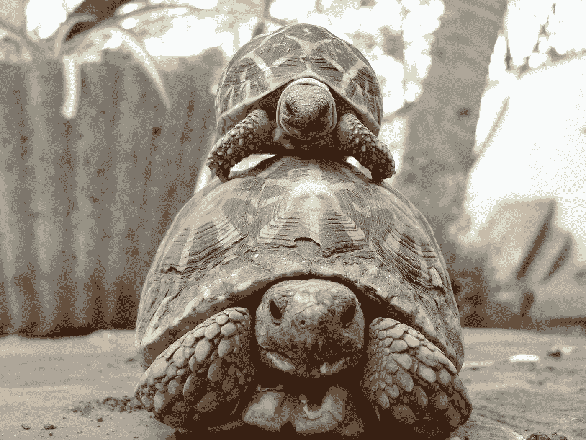

When Apple piggybacks on Google, it ‘just works’ better (Image from [Flickr](https://www.flickr.com/photos/jackol/133765382))

前几天，我的 iMac 死机了。因为是 2011 款，所以我有所准备。嗯，算是吧。

我一直定期通过 Time Machine 备份我的东西，但几年前为了延长我的 Time Machine 的寿命，我停止了 24/7 的备份。这是一款古老的 2008 款。此外，自 2008 年以来发生了很多变化，因为我的大多数文件都保存在网上，我不再需要定期备份。然而，当我在 Mac 上运行“恢复工具”时，我意识到我忘记了时间。我的时间机器通知我，我的最后一次备份是在四个月前。当我的鼠标悬停在“恢复”按钮上时，我仔细考虑了一下。据我估计，那段时间我在 Mac 电脑上添加的唯一有价值的新文件是一些照片和歌曲。所以我让时间机器继续“恢复”

恢复完成后，Mac 看起来很好。但我不能说照片、iTunes、联系人等应用程序也是如此。除了过去四个月丢失的文件，Photos 还将许多早期视频转换成了缩略图。当我点击这些文件时，它们无法播放，因为原始文件不见了。iTunes 也随机让我的一些歌曲收藏消失了。

## 百慕大三角

老实说，我并不感到惊讶，因为这不是苹果应用程序第一次对我玩这种把戏，而且不仅仅是我。这是另一个受害者[在苹果 iTunes 支持论坛上唱着](https://discussions.apple.com/thread/7994492?language=en)同样的曲子。这里有一个关于从照片应用中消失照片的[帖子](https://discussions.apple.com/thread/7699535)。对于一些通过调整一些设置恢复照片的人来说，后者似乎有一个美好的结局。我相信专业用户将能够重新定位丢失的照片，但我的心与那些永远失去宝贵记忆的普通人在一起。

这种事情不应该发生，但不幸的是，苹果却发生了。在几次试图找出原因的失败尝试后，我放弃了，并得出结论，在苹果地有一种百慕大三角，歌曲和照片以及其他东西神秘地消失了。但与百慕大三角不同，如果你在苹果生态系统中，你就无法避免使用照片和 iTunes 等应用。

有两种解决方案。首先是彻底脱离苹果生态系统。第二是找到一个备用系统，可以说，我不希望在那里出现意外。

## 当苹果刚刚运转时

有一段时间，我尝试了“迁移”解决方案，转而使用安卓系统。但是没有成功。我不知道这是不是因为我已经在苹果平台上呆了很长时间了，所以对苹果更放心。或者是因为有时候我的安卓系统让我失望，而苹果实际上“还行”。我举个例子说明一下。

我曾经不得不做一个屏幕录制，作为如何在 Android 上使用某个应用程序的演示，并发送到一个 WhatsApp 群。在制作完演示之后，我通过 WhatsApp 将它从我的 Android 手机发送到我的 iPhone 上，以测试它是否有效。不是的。无论 WhatsApp 对这段一分钟长的视频使用了何种压缩方式，都导致了音频和视频不同步。现在，我可以排除故障，并尝试找出错误的原因。但是有时候你只想把事情做好，而不是花时间去搞清楚为什么行不通。所以我凭直觉认为，如果我用 iPhone 发送，视频可能会有用。因此，我把视频从我的 Android 蓝牙到我的 iPhone，然后 Whatsapped 又播放了一遍。这一次，视频效果非常好。

不知道为什么会出现问题。这可能是 Android 上的 WhatsApp 使用不同于 iOS 上的 WhatsApp 的方法压缩视频的问题。或者这可能是我的 Android 手机的硬件问题，一部 4GB 内存和 64GB 存储的 Redmi Note 4(这是非常好的规格)。也有可能是安卓本身的问题。

我所知道的是苹果刚刚成功了。从这个意义上说，苹果非常适合那些宁愿花时间“做事情”而不是“修理东西”的人。我想这就是为什么苹果会一直拥有忠实用户的强大基础。

然而，我的问题是，当苹果的“只是工作”不再是真的。

## 当苹果不工作的时候

由于迁移到 Android 的路线对我不起作用，我不得不检查可靠的在线备份路线。只有一个实体符合要求。谷歌。在使用谷歌应用程序十年之后，我可以保证的一件事是，百慕大三角是不存在的。谷歌几乎是可靠的代名词。

谷歌最大的缺点是失去隐私。更不用说那些锲而不舍的广告试图向我推销过多的脱发药物，完全忘记了我有一头浓密的头发这一事实。因为这个原因，我认识的很多人绝对拒绝与谷歌有任何关系。然而，在权衡利弊之后，我认为与谷歌分享我的数据以换取免费使用他们的服务是值得的。这大概是因为我没什么好隐瞒的。这意味着在与谷歌分享我的数据时，我会得到更多，失去更少。举例来说，谷歌的机器人曾经帮助我避免错过航班，它警告我航班应该在早上 5 点起飞，而我的印象是它将在下午 5 点起飞。谷歌能够做到这一点，因为我让他们阅读我的邮件，并登录到谷歌的通知。但就像我说的，与谷歌共享数据并不适合所有人。

## 照片

事实上，谷歌几年前就已经解决了我的照片备份问题，当时它在“谷歌照片”应用程序中提供了我所有照片的无限在线备份。诚然，它不是全分辨率的，但对我来说已经足够好了。事实上，它甚至可以将“实时”照片备份成小视频。问题是印度的 ISP 过去对互联网带宽和下载限制(wifi)有严格的限制，速度非常慢。但是最近情况有所改善。我的连接已经从两年前可怜的 30GB/月@4Mbps，变成了现在可以接受的 300GB @60Mbps。成本也下降到₹1250 每月 20 美元。

敲定这笔交易的是谷歌提供“图片”搜索。比如我可以搜索“大象”，而“谷歌照片”会直观地识别出我照片集中的所有大象。我发现这足够吸引人，值得把它放在自己的帖子里。事实上，如今如果我需要快速找到一张照片，我在 iPhone 上的应用程序不是苹果的“照片”，而是“谷歌照片”是的，它只是工作。

在谷歌中设置自动照片备份很容易。你首先安装“谷歌照片”应用程序，并授予该应用程序访问你的“照片”应用程序的权限。一旦应用程序启动并运行，点击应用程序左上角的三条水平线图标。这将显示设置齿轮图标。点击它，然后点击“备份和同步”，打开下一个屏幕中的开关。就是这样。

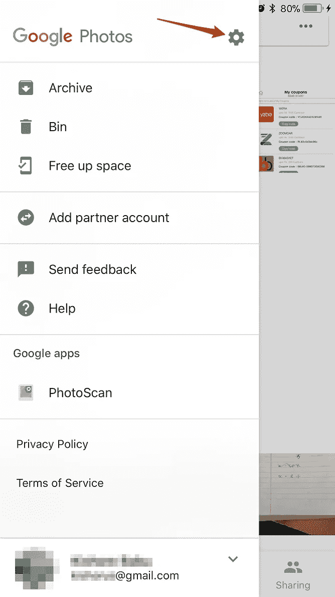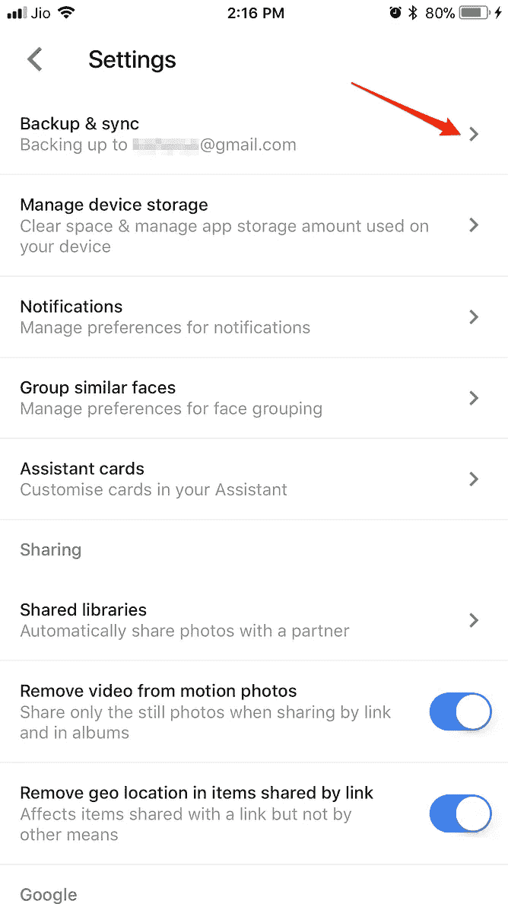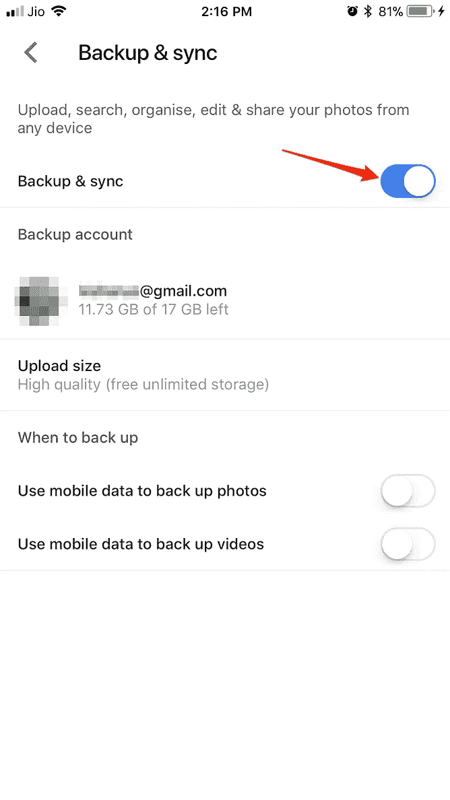

Backing up all my photos on Google Photos

## 音乐

我在谷歌上的音乐备份体验有点奇怪。Apple Music 和 Google Play Music 已经在印度推出，提供免费试用，谷歌也提供我所有音乐的免费备份(可能是为了与 Apple Match 竞争)。我试用了这两种服务，还在 Mac 上用 Chrome 浏览器备份了我在谷歌上的所有音乐(见下文)。随着更多的免费音乐流媒体服务在印度出现，我停止了苹果音乐订阅，转而使用谷歌 Play 音乐的免费服务。毫不奇怪，它是由广告支持的，这并不是一个真正的交易破坏者，因为可以选择跳过类似于 YouTube 的较长的视频广告。

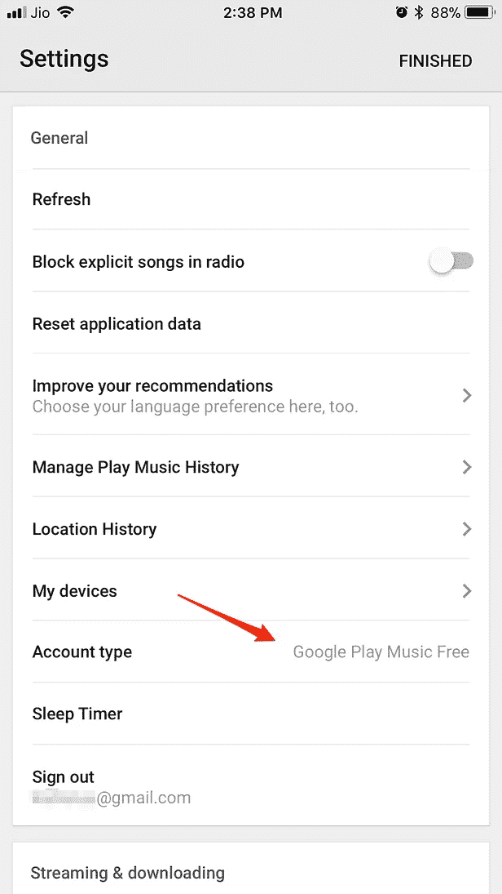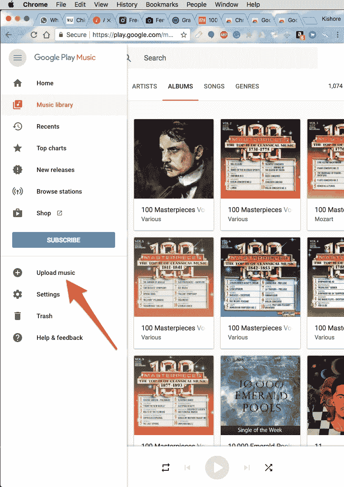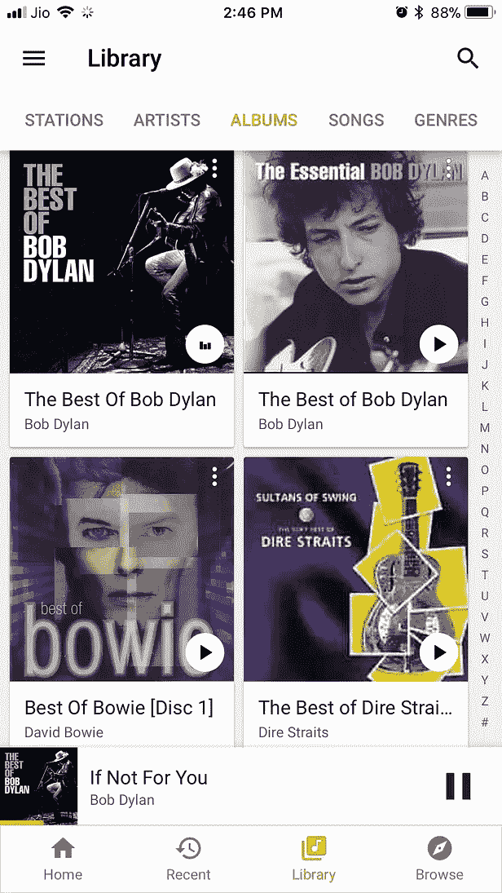

Uploading my music to Google Play Music via Chrome

一段时间后，我最喜欢的诺贝尔奖获得者从我的 iTunes 上消失了。毫无疑问，这让人抓狂，但我现在已经从古怪的 iTunes 中预料到了这一点。出于习惯，我检查了我的 Google Play 音乐库，并惊讶地发现我上传的所有音乐收藏，包括失踪的迪伦专辑，仍然可以在网上找到。我偶尔会从谷歌购买音乐，所以我猜他们会把我视为付费用户，作为回报，让我免费保存我的音乐。无论如何，当我开始下载我丢失的音乐时，鲍勃开始唱，“如果没有你，我的天会塌下来。”这正好抓住了我当时对谷歌的感觉。

## 联系人

苹果神秘消失的把戏也发生在我的联系人应用程序中的人身上。我的水管工曾经消失得无影无踪，这种消失的行为让我抓狂到要发一整篇关于它的帖子。再一次，是谷歌拯救了我，因为我已经备份了我的联系人。

苹果实际上让你在 iPhone 上备份与谷歌的联系人变得很容易。基本上，你可以将手机上的联系人与 Gmail 联系人列表同步。这样，如果你的 iPhone 丢失了某个联系人，你可以随时从“谷歌通讯录”中找回它。设置起来也很简单。首先，将您的 Gmail 帐户添加到您手机的邮件应用程序中。然后前往“设置”并启用通讯录同步。正如你在下面看到的，我的个人 gmail 帐户被设置为将联系人同步到我的 iPhone 上。

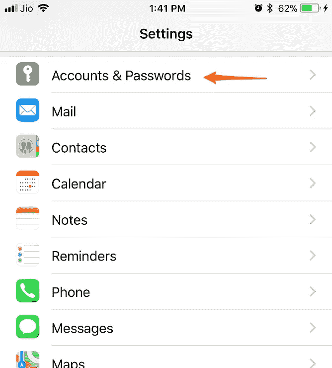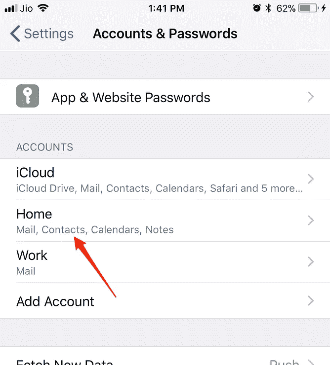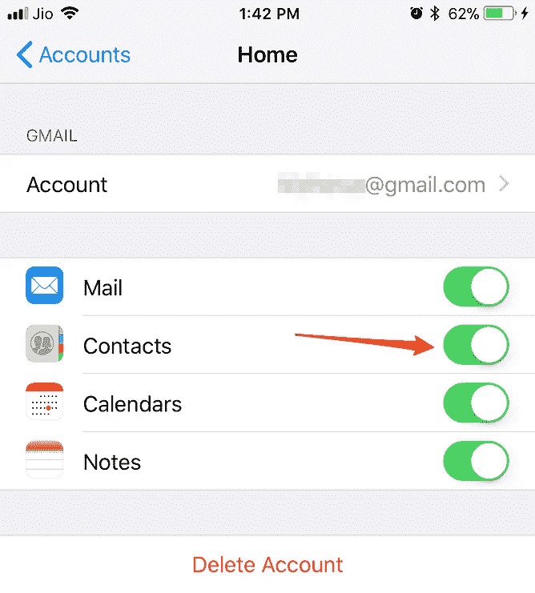

Backing up my contacts on Google

这个系统的另一个好处是，你可以把你的工作联系人放在手机之外，以防止你的电话簿变得过于杂乱。如果你看上面的中间图像，你可以看到我的工作电子邮件帐户没有同步联系人。我将工作联系人直接保存在我的工作电子邮件电话簿中，并把他们留在那里。如果我需要在手机上有一个工作联系人，我就暂时把他放在我的电话簿里。这确实让他出现在我的个人 Gmail 联系人中。但是一旦我完成了这项工作，我就把联系人从我的手机中删除，它就会自动从我的个人 Gmail 中消失。如果我需要他的电话号码，我总能从我的工作邮箱中找到他的详细信息。

有一个更好的方法来防止你的电话簿变得杂乱。将所有工作联系人分组到一个名为“工作”的群组中，然后在“联系人”应用程序中隐藏该群组。任何时候你想查看你的工作联系人，只需点击你的联系人应用程序左上方的群组链接，然后重新打开勾号。除了一个小问题，这是一个非常方便的方法。您可以在“通讯录”应用程序中查看群组，但不能在其中创建群组。你必须进入你的浏览器，登录到你的 iCloud，并在那里创建群。那对我来说有点太多了。为什么不在 app 里？苹果可能有它的原因，但他们没有说。

然而，我对苹果的问题不仅仅局限于备份。

## 图像编辑

苹果的照片在编辑图像方面提供了很多选项。但是谷歌的 Snapseed 完全处于另一个层次。我用一个特点来解释一下。很多时候，当你拍摄一个人时，你会拍出一个好心情，但看不到脸部的细节。现在在照片中，你可以使整个图像变亮并看到细节。但是这样做会使图片的其余部分褪色，你会失去情绪。使用 Snapseed，您可以轻松地使某个特定区域变亮，比如说面部，而不会使图像的其他部分变亮，也不会使图片褪色。

Saving the Mood: My original image VS whole picture brightened (Photos); and just the face brightened (Snapseed)

查看上面照片和 Snapseed 修复图像的不同之处。我想做的是看到佛陀的微笑，以便与在他头上缠绕着险恶的爬虫的神秘丛林形成对比。有了照片，你现在可以看到调整图像后佛陀脸上的微笑，但不再有更多的神秘，因为黑暗，令人毛骨悚然的丛林效果消失了。另一方面，Snapseed 让我只提亮佛陀的脸，而不会失去其余镜头的情绪。当然，对于使用 Photoshop 之类编辑软件的人来说，这没什么大不了的。(事实上，据我所知，在照片中也有可能做到这一点。)但是对于像我这样对 Photoshop 感到困惑的外行人来说，这是一个图片保护程序。如果你想知道我是怎么做到的，这里有一段我 iPhone 上的屏幕录像。

Using Snapseed to selectively brighten a small part of an image

基本上，你在 Snapseed 中打开图像，点击工具，然后点击第二行中的“选择性”，然后点击佛陀的脸，你会看到一个“B”出现在他的脸上。现在用两个手指分开轻敲屏幕，会出现一个圆圈。慢慢将两个手指捏在一起，直到圆圈只盖住佛脸(提亮效果只出现在圆圈内部)。然后触摸图像外部和上方的屏幕，慢慢向右滑动，直到亮度计数显示为 100。要确认，点击左上方的窗口状图标，这给了我一个前后的样子。最后，点击右下角的勾号，然后点击“导出”,将修改后的图像发送回我的照片应用程序。

## 图像扫描

谷歌应用程序的另一个亮点是 [PhotoScan](https://itunes.apple.com/us/app/photoscan-by-google-photos/id1165525994?mt=8) ,在 iOS 上最接近的功能是 iOS Notes 应用程序中的扫描功能。但与此不同的是，它非常适合扫描旧的纸质相册并上传到 Google 相册。照片通常是反光的，很难用手机摄像头扫描。PhotoScan 巧妙地从图像的四个角落拍摄了四张照片，然后将这四张照片组合起来，给出了一个没有任何反射的完美扫描，从而解决了这个问题。实际上，你是在数字化你真正的相册，而不必经历使用真正的扫描仪扫描每张图片的繁琐过程。

## 地图

苹果地图在印度就是不行。它实际上是残废的，不能给任何地点指明方向，而是说，“这些地点之间没有方向。”我认为谷歌地图已经领先苹果太多，苹果已经不再试图追赶了。事实上，谷歌对印度了如指掌，甚至提供离线地图。这对于一个移动网络在很多地方都不存在，移动数据有限的国家来说非常理想。

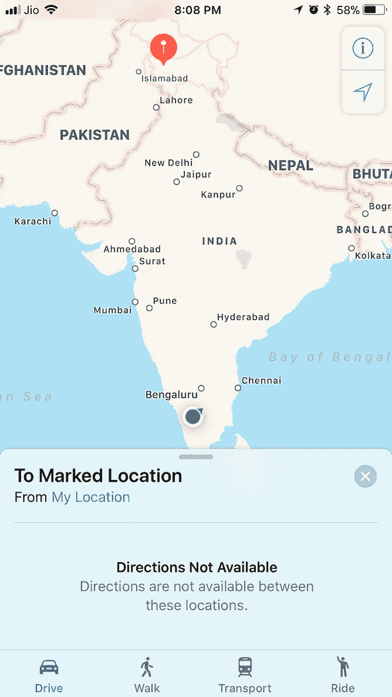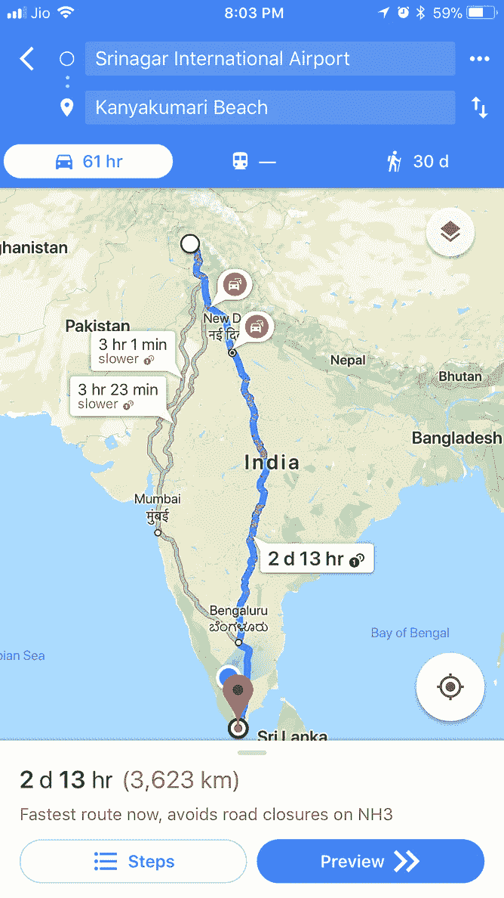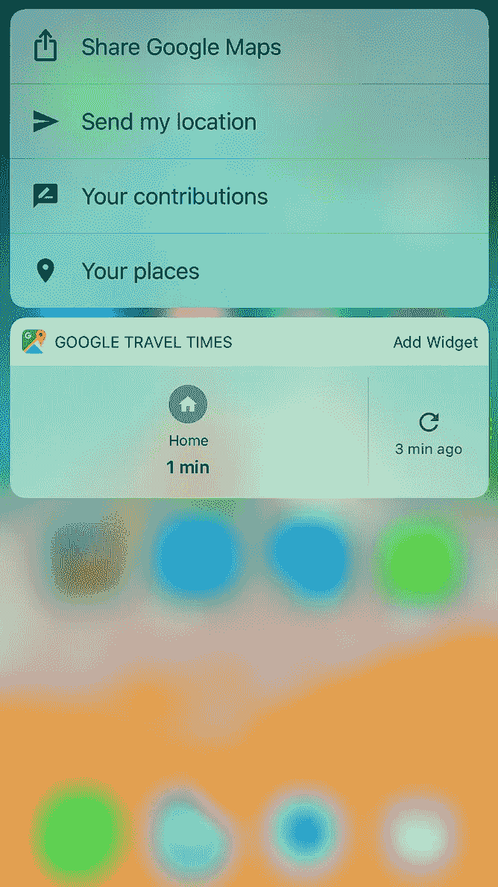

Apple Maps doesn’t work in India, while Google Maps does

至于谷歌地图上的一键实时位置分享，我觉得本来就是苹果地图的一个功能。由于苹果地图在印度处于半瘫痪状态，谷歌感激地将这一独特的 iPhone 3D Touch 功能用于谷歌地图。只需用力按下谷歌地图图标，就会弹出“发送我的位置”选项。当你开车时，它是完美的，只有一会儿告诉别人你在哪里。

## 油管（国外视频网站）

如果我想分享在 iPhone 上拍摄的大型视频，苹果建议我们使用照片的“共享相册”功能。不幸的是，这使用了 iCloud，其免费版本仅提供 5GB 的空间。这 5GB 必须为所有照片、文档和我所有的 iDevice 备份共享，这意味着它通常只有很少的可用空间。苹果希望我在 iCloud 上购买额外的空间。但当谷歌在世界上最受欢迎的视频平台 YouTube 上免费向我提供无限空间时，这种情况不会发生。

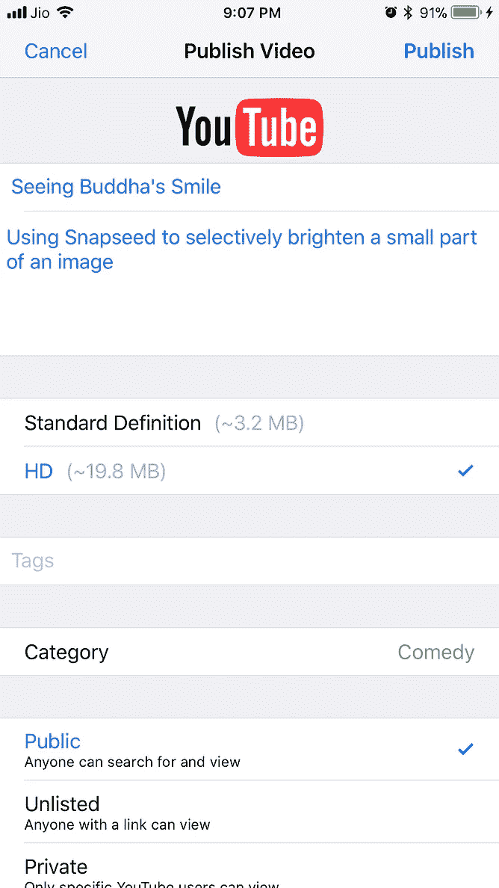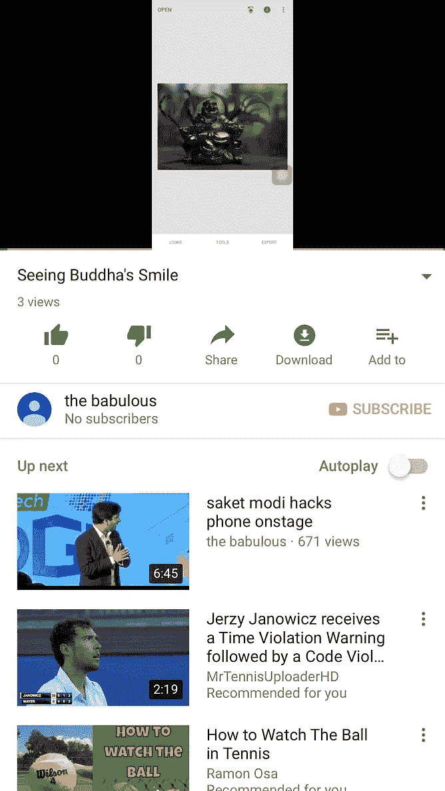

Sharing videos using YouTube

这也是我默认把 iPhone 上拍的视频上传到 YouTube 的原因。这几乎和 iCloud 一样简单。基本上，你可以去保存你的视频的照片，选择它，点击底部的分享按钮，然后从分享选项中选择 YouTube。你甚至可以通过选择“隐私”来确保视频的隐私，这意味着只有那些与你共享链接的人才能查看视频。

## 邮件

苹果确实给了我一个免费的 iCloud 邮箱，但是还不及 Gmail 的一半。所以，和地球上几乎所有人一样，我也依赖 Gmail 账户。对于日常使用，我通过股票邮件应用程序操作我的 Gmail，因为它设置简单。但是 Mail 的功能有限，尤其是搜索。如果邮件应用程序找不到什么，我通常会启动谷歌的 Gmail 应用程序，它很容易找到我要找的东西。

我知道还有许多其他好的电子邮件应用程序。但有时有太多的电子邮件应用程序可供选择比我遇到的任何电子邮件问题都更有压力。所以我坚持把邮件和 Gmail 应用程序结合在一起。

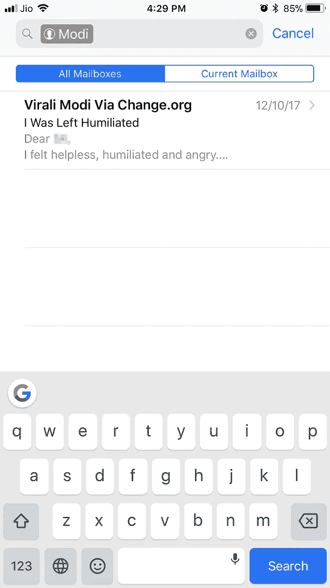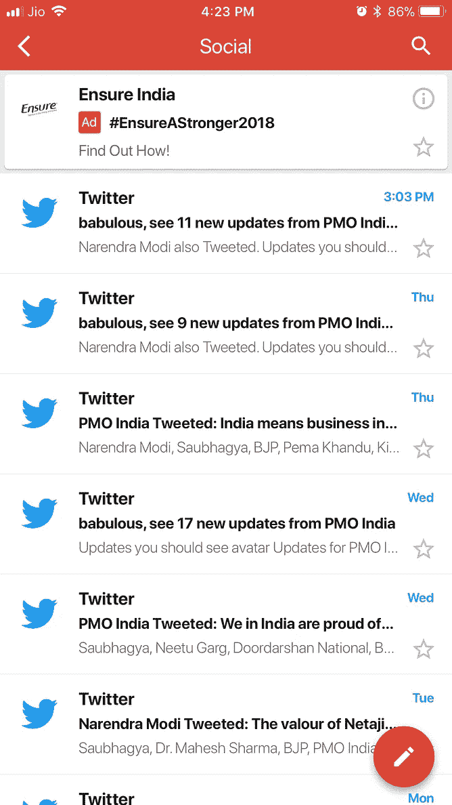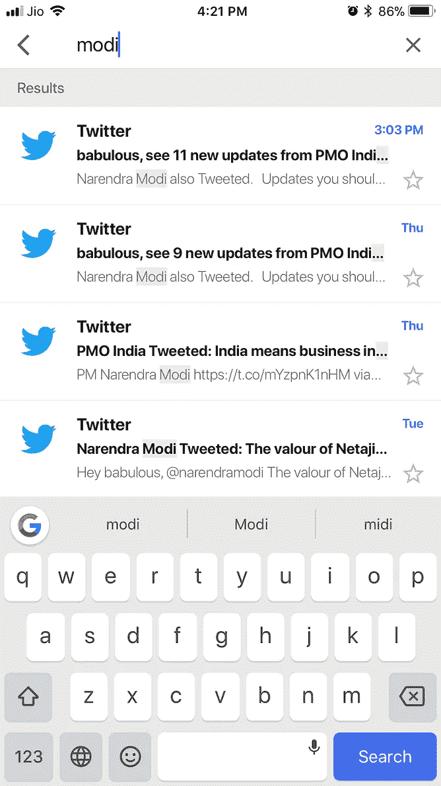

Apple’s Mail app search feature falls short when compared to the Gmail app

## Google Drive 和文档

与之前的应用不同，我将这些应用与苹果的应用结合使用。iCloud 非常适合备份我的手机，并且可以与 Pages 和 Numbers 等在线文档无缝协作。但我也使用谷歌文档，因为它更容易跨平台分享。正如我前面提到的，iCloud 上的空间也是一个问题。Google Drive 是一个方便得多的在线保险箱，因为它允许我共享大文件，而不必担心空间不足。当然，还有其他用于大文件传输的定制应用程序，如 Dropbox 和 WeTransfer。但是这经常导致“现在我到底把那个文件放在哪里了？”我宁愿避免的情况。

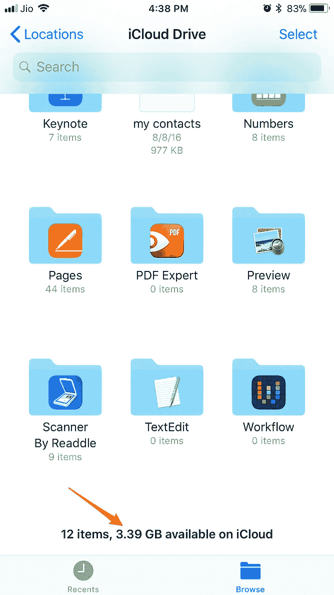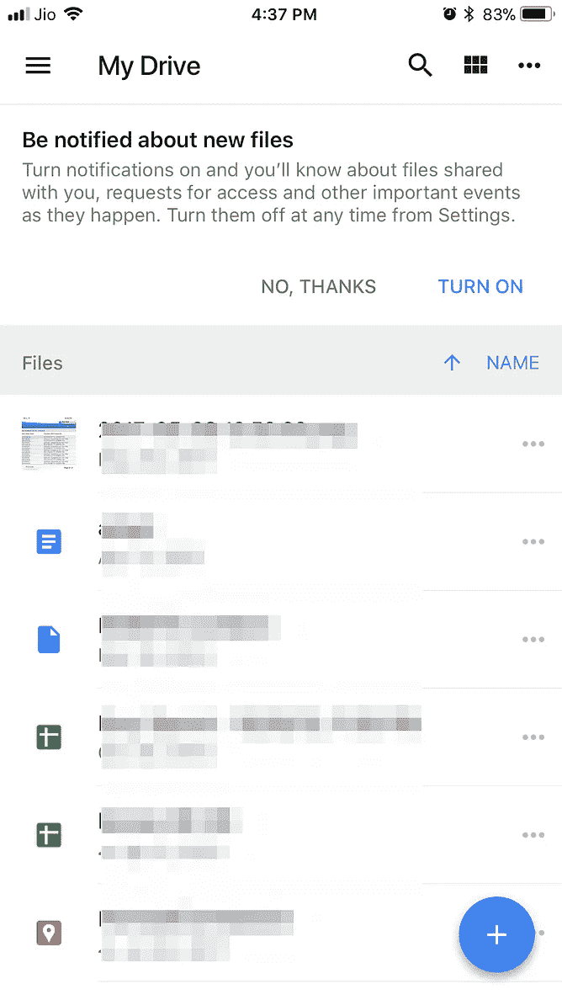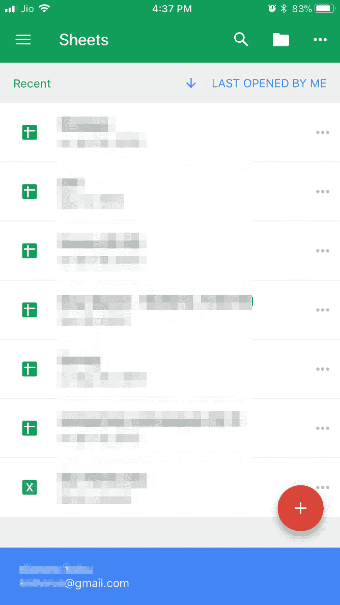

iCloud works seamlessly with Apple but limited space makes Google Drive a dependable standby

## 新闻

当苹果应用程序有所欠缺时，谷歌并不总是最佳选择。新闻是苹果和谷歌都没有真正从其他新闻应用中脱颖而出的一个例子。Flipboard 等其他应用程序更受欢迎，至少在印度是这样。

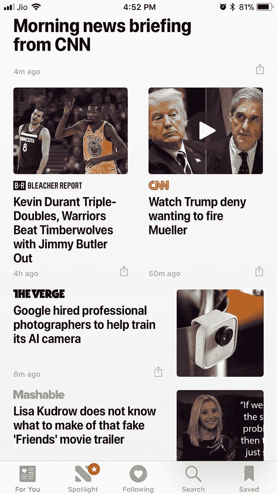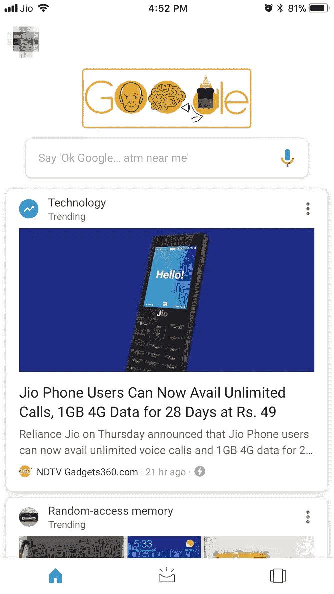

Apple News vs Google Feed vs Flipkart — there’s no clear winner

谷歌还以更多的方式与苹果紧密结合，改善了我的整个 iPhone 体验。就像我每次在 iPhone 上打字一样，我都是通过 [Gboard](https://itunes.apple.com/in/app/gboard/id1091700242?mt=8) 来完成的，这是谷歌令人惊讶的精确滑动键盘(它也是一个迷你谷歌，一个 GIF 制作工具等等)。为了把一些东西翻译成其他语言，我使用[谷歌翻译](https://itunes.apple.com/in/app/google-translate/id414706506?mt=8)。为了知道如何发音，我在 Safari 浏览器中输入 define: xyz。为了在电视上播放手机里的视频，我使用了[谷歌主页](https://itunes.apple.com/us/app/google-home/id680819774?mt=8)应用程序(你需要谷歌的 Chromecast 设备)。要转账，我去 [Tez](https://itunes.apple.com/in/app/tez-a-payments-app-by-google/id1193357041?mt=8) 。要知道航班是否准时，我只需在谷歌上输入航班号…

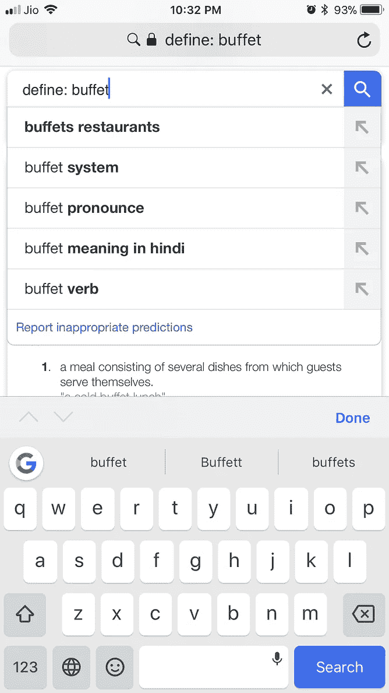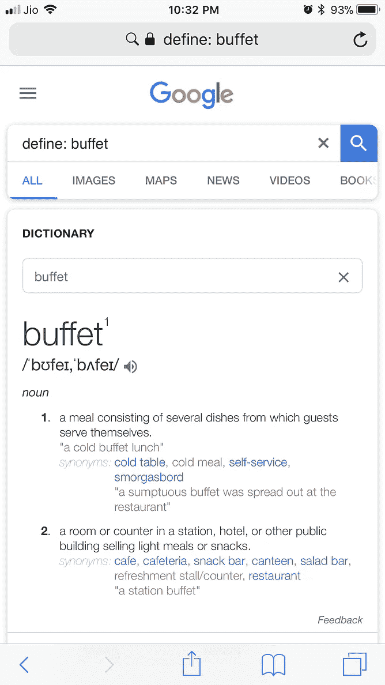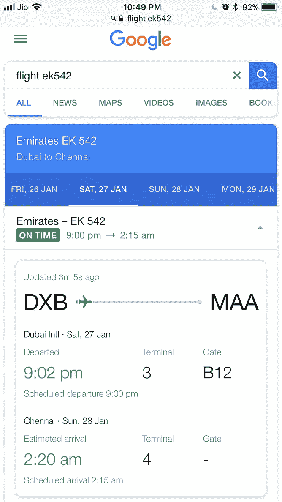

最后一个问题。我为什么不干脆买 Pixel 2XL，谷歌对 iPhone 的挑战者？也许我应该。或者也许我只是单纯的贪婪，想要苹果和谷歌这两个世界中最好的。这可以解释为什么我属于“混种比纯种更健康”的思想流派。

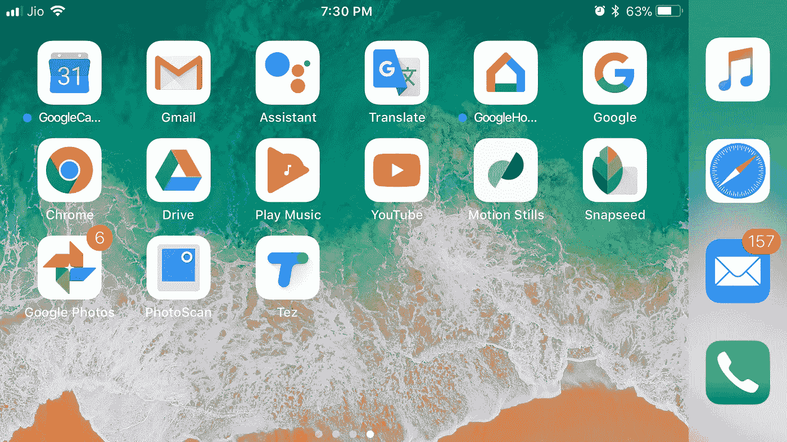

iPhoogle - arguably the world’s best phone

简而言之，我爱我的 iPhone，但我更喜欢它在谷歌上运行的时候。